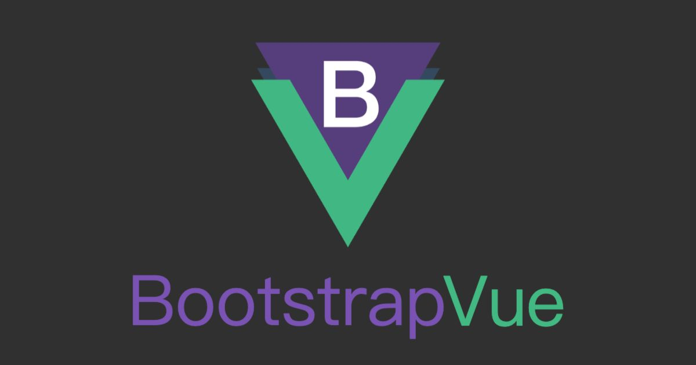
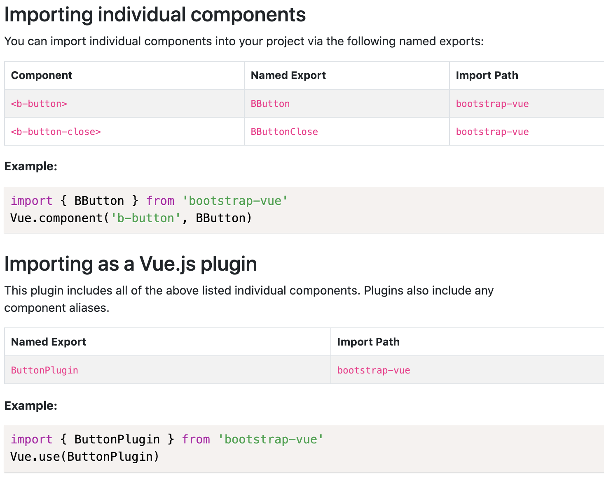

本篇介紹在 Vue CLI 環境中，要如何全部引入或部分引入 BootstrapVue 的 Vue plugin、元件、directive 和元件的樣式。

<!-- more -->

# 前言

BootstrapVue 是 Bootstrap 框架與 Vue.js 整合的套件，其中包含多種 Bootstrap 元件、網格系統 ... 等東西。

若要部分引入 BootstrapVue 元件，就不建議使用 [vue-cli-plugin-bootstrap-vue (Bootstrap-Vue Vue CLI 3 plugin)](https://github.com/GregYankovoy/vue-cli-plugin-bootstrap-vue)，因為還需自己另外設定，乾脆自己手動建置環境。

# 安裝套件

```shell
$ npm i bootstrap-vue bootstrap
```

或

```shell
$ yarn add bootstrap-vue bootstrap
```

# 全部引入

## 註冊全部元件和 directive

在 app 進入點註冊 BootstrapVue：

```javascript
import Vue from 'vue';
import { BootstrapVue, IconsPlugin } from 'bootstrap-vue';

// 安裝 BootstrapVue
Vue.use(BootstrapVue);
// 安裝 BootstrapVue icon components plugin (可選)
Vue.use(IconsPlugin);
```

## 引入全部元件的樣式

import Bootstrap 和 BootstrapVue 的 `css` 檔：

```javascript
import 'bootstrap/dist/css/bootstrap.css';
import 'bootstrap-vue/dist/bootstrap-vue.css';
```

或在自訂的 SCSS 檔內 (例如：`custom.scss` ) import Bootstrap 和 BootstrapVue 的 `scss` 檔：

```scss
// ====================================
// # Bootstrap

@import 'node_modules/bootstrap/scss/bootstrap';

// ====================================
// # BootstrapVue

@import 'node_modules/bootstrap-vue/src/index.scss';
```

然後在 app 進入點引入：

```javascript
import './custom.scss';
```

將所有 SCSS `@import` 至單個 SCSS 檔中，然後將該檔案 import 至專案中。預設單個 SCSS 檔 import 至專案，不會在檔案之間共享變數值和函數 (因可避免變數和函數的命名衝突)。

Webpack 和 Parcel 支援在 `scss` 模組前加上 `~` 來引入 `scss` 檔案：

```scss
@import '~bootstrap';
@import '~bootstrap-vue';
```

:::info
可用 `~` 引入是因為 sass-loader 使用 Sass 的自訂 importer 功能將所有 query 傳給 Webpack resloving engine，所以才能從 `node_modules` import Sass 模組。只需在前面加上 `~` 來告訴 Webpack 這不是 relative import。

資料來源：[sass-loader - Resolving import at-rules | webpack](https://webpack.js.org/loaders/sass-loader/#resolving-import-at-rules)
:::

## 完整範例：引入全部元件

引入全部樣式：

```scss
// src/assets/scss/vendors/bootstrap-vue.scss
@import '~bootstrap';
@import '~bootstrap-vue';
```

引入全部元件：

```javascript
// src/plugins/bootstrap-vue.js
import Vue from 'vue';
import { BootstrapVue, IconsPlugin } from 'bootstrap-vue';

import '@/assets/scss/vendors/bootstrap-vue.scss';

// 安裝 BootstrapVue
Vue.use(BootstrapVue);
// 安裝 BootstrapVue icon components plugin (可選)
Vue.use(IconsPlugin);
```

在 app 進入點：

```javascript
// src/main.js
import Vue from 'vue';
import router from './router/IndexRouter';
import store from './store';

import './plugins/bootstrap-vue.js';

import './assets/scss/main.scss';

import App from './App.vue';

Vue.config.productionTip = false;

new Vue({
  router,
  store,
  render: h => h(App)
}).$mount('#app');
```

若有自訂的 Sass 檔，記得要 import 在 BootstrapVue 之後，這樣自訂的 Sass 變數、樣式等東西才會覆蓋 BootstrapVue 和 Bootstrap 的 Sass

# 部分引入

當你用 Vue CLI 來建置環境，就會使用到 module bundler，常見的就是 Webpack。你可以選擇引入所需的特定 component groups (plugins)、component 和/或 directives，利用 module bundler 提供的 tree shaking 功能來減少 bundle 的大小。

## 註冊部分元件 directive

### 作為 Vue plugin import

可從 `bootstrap-vue` 將 component groups 和 directives 作為 Vue plugin import。

import Vue plugin 的範例：

```javascript
// 引入所有佈局元件，包括 <b-container>, <b-row>, <b-col>
import { LayoutPlugin } from 'bootstrap-vue';
Vue.use(LayoutPlugin);

// 引入 <b-modal> 元件和 v-b-modal directive
import { ModalPlugin } from 'bootstrap-vue';
Vue.use(ModalPlugin);

// 引入 <b-card> 元件和其所有 <b-card-*> 子元件
import { CardPlugin } from 'bootstrap-vue';
Vue.use(CardPlugin);

// 引入 v-b-scrollspy directive
import { VBScrollspyPlugin } from 'bootstrap-vue';
Vue.use(VBScrollspyPlugin);
```

作為 plugin import 時，大部分都會 import 所有子元件和相關 directive。例如：import `<b-nav>` 時，還包含所有 `<nav-*>` 子元件和所有 dropdown 子元件。

plugin 中包含了元件和 shorthand aliases (簡寫別名，如果有的話)，詳情請參閱各元件和 directive 的文件 (通常在各元件文件的最底部有告訴你如何 import 獨立元件和 Vue plugin)：



若要 import 多個元件和/或 directive，請將所有 import 都含在單一 `import` 陳述句內，以達到最佳的 tree shaking。

### 引入單一元件

以上是直接引入 Vue plugin 的做法，會一次 import 多個元件或 directive，而接著要介紹只 import 單一元件的做法。

以 BootstrapVue 的 [Button](https://bootstrap-vue.org/docs/components/button#importing-individual-components) 元件為例，就有 `<b-button>` 和 `<b-button-close>` 這兩個元件，所以 `ButtonPlugin` 包含了這兩個元件，原始碼如下：

```javascript
// bootstrap-vue/src/components/button/index.js
import { BButton } from './button'
import { BButtonClose } from './button-close'
import { pluginFactory } from '../../utils/plugins'

const ButtonPlugin = /*#__PURE__*/ pluginFactory({
  components: {
    BButton,
    BBtn: BButton,
    BButtonClose,
    BBtnClose: BButtonClose
  }
})

export { ButtonPlugin, BButton, BButtonClose }
```

另外也可以看到 shorthand aliases： 

- `BBtn` 和 `BButton` 是同一個元件
- `BBtnClose` 和 `BButtonClose` 是同一個元件

所以若要引入單一元件只要這樣引入即可：

```javascript
// 引入 <b-button> 元件
import { BButton } from 'bootstrap-vue';
Vue.component('b-button', BButton);
```

## 範例：引入部分元件

- 有些元件比較單純，所以可以只 import 單一元件
    - 例如：只需要 [Button](https://bootstrap-vue.org/docs/components/button#importing-individual-components) 元件中的 `<b-button>` 元件
- 而有些元件則比較複雜，有很多子元件或相依的 Vue plugin。若手動自己 import 會很麻煩，所以需要直接透過 Vue plugin 來 import
    - 例如：[Navbar](https://bootstrap-vue.org/docs/components/navbar#importing-as-a-plugin) 元件有很多子元件，且相依於 `NavPlugin`、`DropdownPlugin` 和 `CollapsePlugin`

從 [Navbar](https://bootstrap-vue.org/docs/components/navbar#importing-as-a-plugin) 元件的原始碼可以看到這些很多子元件和相依的 Vue plugin：

```javascript
// bootstrap-vue/src/components/navbar/index.js
import { BNavbar } from './navbar'
import { BNavbarNav } from './navbar-nav'
import { BNavbarBrand } from './navbar-brand'
import { BNavbarToggle } from './navbar-toggle'
import { NavPlugin } from '../nav'
import { CollapsePlugin } from '../collapse'
import { DropdownPlugin } from '../dropdown'
import { pluginFactory } from '../../utils/plugins'

const NavbarPlugin = /*#__PURE__*/ pluginFactory({
  components: {
    BNavbar,
    BNavbarNav,
    BNavbarBrand,
    BNavbarToggle,
    BNavToggle: BNavbarToggle
  },
  plugins: {
    NavPlugin,
    CollapsePlugin,
    DropdownPlugin
  }
})

export { NavbarPlugin, BNavbar, BNavbarNav, BNavbarBrand, BNavbarToggle }
```

所以若要使用 Button 元件和 Navbar 元件就會這樣 import：

```javascript
// src/plugins/bootstrap-vue.js
import Vue from 'vue';

import '@/assets/scss/bootstrap.scss';

// 引入 <b-button> 元件
import { BButton } from 'bootstrap-vue';
Vue.component('b-button', BButton);

// 引入 Navbar 元件：<b-navbar>，
// 和 Navbar 的子元件，包括：<b-navbar-nav>, <b-navbar-brand>, <b-navbar-toggle>，
// 以及其相依的 Vue plugin，包括：NavPlugin, CollapsePlugin, DropdownPlugin
// - NavPlugin 包括：<b-nav>, <b-nav-item>, <b-nav-text>,
//                  <b-nav-form>, <b-nav-item-dropdown>
// - CollapsePlugin 包括：<b-collapse>
// - DropdownPlugin 包括：<b-dropdown>, <b-dropdown-item>,
//                       <b-dropdown-item-button>, <b-dropdown-divider>,
//                       <b-dropdown-form>, <b-dropdown-text>,
//                       <b-dropdown-group>, <b-dropdown-header>
import { NavbarPlugin } from 'bootstrap-vue';
Vue.use(NavbarPlugin);
```

## 引入部分元件的樣式

- 要部分引入 BootstrapVue 的樣式，請參閱 [bootstrap/scss/bootstrap.scss](https://github.com/twbs/bootstrap/blob/main/scss/bootstrap.scss)
- 要部分引入 Bootstrap 的樣式，請參閱 [bootstrap-vue/src/components/index.scss](https://github.com/bootstrap-vue/bootstrap-vue/blob/dev/src/components/index.scss)

建議手動引入相依元件的樣式！

但是，有些元件若有仔細看原始碼，就會發現不需要引入所有的相依元件，以 Navbar 元件為例，原本可能要這樣引入：

```scss
@import '~bootstrap-vue/src/components/navbar';
@import '~bootstrap-vue/src/components/nav';
@import '~bootstrap-vue/src/components/dropdown';
```

但若詳細看這些相依元件的樣式原始碼，就會找到重複的引入。

Navbar 元件的樣式：

```scss
// bootstrap-vue/src/components/navbar/index.scss
@import "navbar";

// bootstrap-vue/src/components/navbar/_navbar.scss
@import "../dropdown/index";
```

Nav 元件的樣式：

```scss
// bootstrap-vue/src/components/nav/index.scss
@import "nav-item-dropdown";

// bootstrap-vue/src/components/navbar/_nav-item-dropdown.scss
@import "../dropdown/index";
```

Dropdown 元件的樣式：

```scss
// bootstrap-vue/src/components/dropdown/index.scss
@import "dropdown";
@import "dropdown-form";
@import "dropdown-text";
```

可以從上面這些元件看得出來，其實 Navbar 和 Nav 元件都引用了 Dropdown 元件的樣式，所以只需要引入 Navbar 元件的樣式即可。

## 範例：引入部分元件的樣式

- Bootstrap
    - 前面是 Bootstrap 基本要引入的：
        - `functions`、`variables`、`mixins`
        - `root`：在 root 元素 (即 `html` 元素) 上的設定，只設定 CSS 變數而已
        - `reboot` (可選)：Bootstrap 的 reset CSS
    - Bootstrap 網格 (可選)：`grid`
    - Bootstrap 元件的樣式
    - Bootstrap 的 `utilities` (可選)
- BootstrapVue 元件的樣式

```scss
// src/assets/scss/vendors/bootstrap-vue.scss

// ====================================
// # Bootstrap

@import '~bootstrap/scss/functions';
@import '~bootstrap/scss/variables';
@import '~bootstrap/scss/mixins';
@import '~bootstrap/scss/root';
@import '~bootstrap/scss/reboot';

// Bootstrap 網格
@import '~bootstrap/scss/grid';

// Bootstrap 元件
@import '~bootstrap/scss/transitions';
@import '~bootstrap/scss/dropdown';
@import '~bootstrap/scss/nav';
@import '~bootstrap/scss/navbar';

@import '~bootstrap/scss/utilities';

// ====================================
// # BootstrapVue

@import '~bootstrap-vue/src/components/navbar';
```

資料來源：[Getting Started | BootstrapVue](https://bootstrap-vue.org/docs)