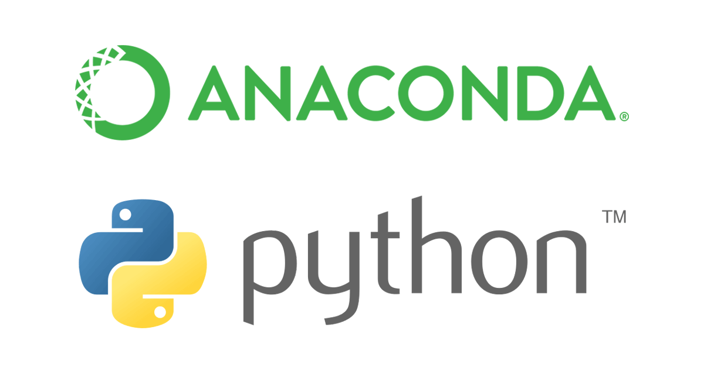

學習如何利用 Conda 來建立不同需求所需的 Python 開發環境，並如何管理相依套件。

<!-- more -->

## Anaconda


Anaconda 是最受歡迎的 Python 資料科學 (Data Science) 平台，它特點就是本來就包含了各種數據分析、科學計算的相關套件 (例如：NumPy、SciPy、Matplotlib、SymPy、Pandas ... 等)，而 Anaconda 的套件管理工具就是 conda。

## Conda


Conda 是一個開源的套件與環境管理的系統，可以在 Windows、macOS 和 Linux 上使用。可利用 Conda 來安裝、執行、更新套件以及其相依的套件，並且還可用來建立不同的開發環境 (例如：不同環境有不同的 Python 版本)。

<!-- more -->

## 安裝 Anaconda
至 [Anaconda](https://www.anaconda.com/download/) 官網下載並安裝，建議選擇 Python 3.x 的版本。

## 建立虛擬環境
從指定套件列表中建立新的 conda 環境：

- `-n`，`--name`：設定環境名稱

```shell
$ conda create -n <environment> <package>

# 安裝整套 Anaconda
$ conda create -n <environment> anaconda

# 指定 Python 版本
$ conda create -n <environment> python=3.6
```

- `-e`，`--envs`：列出已建立的環境

```shell
# 顯示虛擬環境列表，並顯示正在使用的虛擬環境
$ conda info -e
# conda environments:
#
base                  *  D:\Users\Titan\Anaconda3
hello                    D:\Users\Titan\Anaconda3\envs\hello
```

使用或 `activate` 至指定環境：

```shell
# Windows
$ activate <environment>

# Linux and macOS
$ source activate <environment>
```

```shell
# 顯示虛擬環境列表，並顯示正在使用的虛擬環境
$ conda info -e
# conda environments:
#
base                     D:\Users\Titan\Anaconda3
hello                 *  D:\Users\Titan\Anaconda3\envs\hello
```

> `*` 代表目前正在使用的虛擬環境

## 離開虛擬環境
如果要將現在環境改回預設值 `base` (離開目前環境) 可使用下面指令：

```shell
# Windows
$ deactivate

# Linux and macOS
$ source deactivate
```

## 利用 conda 安裝套件
```shell
$ conda install <package>

# 安裝多個套件
$ conda install <package-1> <package-2>
```

## 查看資訊
查看 conda 目前版本

```shell
$ conda -V
conda 4.5.11
```

查看目前環境已安裝的套件

```shell
$ conda list
# packages in environment at D:\Users\Titan\Anaconda3:
#
# Name                    Version                   Build  Channel
...
jupyter                   1.0.0                    py35_3
jupyter_client            5.2.3                    py35_0
jupyter_console           4.1.1                    py35_0
jupyter_core              4.4.0            py35h629ba7f_0
jupyterlab                0.32.1                    <pip>
jupyterlab-launcher       0.10.5                    <pip>
...
```

查看 conda 是否有某套件：

```shell
$ conda search <package>

$ conda search pandas
Loading channels: done
# Name                  Version           Build  Channel
pandas                    0.9.0      np16py27_0  pkgs/free
pandas                    0.9.1      np16py27_0  pkgs/free
...
```

如果 conda 沒有該套件，可以使用 pip 來安裝套件：

```shell
# 安裝套件
$ pip install <package>

# 更新套件
$ pip install --upgrade <package>
```

## 刪除套件
```shell
# 刪除環境內的套件
$ conda remove -n <environment> <package>

# 刪除目前環境內的套件
$ conda remove <package>

# 刪除多個套件
$ conda remove <package-1> <package-2>
```

## 更新套件
```shell
# 更新 conda
$ conda update conda

# 更新 Anaconda
$ conda update anaconda

# 更新 Python
$ conda update python

# 更新特定套件
$ conda update <package>
```

## 刪除虛擬環境
```shell
$ conda env remove -n <environment>
```

### 更新 Python
#### 更新全域環境
```shell
$ conda update python
$ conda update anaconda
```

如果要更新 Python 的特定版本：

```shell
$ conda install python==$pythonversion$
```

#### 建立新環境 (最佳方案)
```shell
$ conda create --name py36 python=3.6
```

#### 取得 Python 的最新版本
```shell
$ conda create --name py365 python=3.6.5 --channel conda-forge
```

:::warning
注意：Conda 會更新該版本列表中的最高版本，因此 Python 2.7 更新到 2.x 中的最高版本，而 3.x 系列依此類推。
:::

## 參考連結
- [Managing packages | Conda documentation](https://conda.io/docs/user-guide/tasks/manage-pkgs.html)
- [macos - How do I upgrade to Python 3.6 with conda? - Stack Overflow](https://stackoverflow.com/questions/41535881/how-do-i-upgrade-to-python-3-6-with-conda)