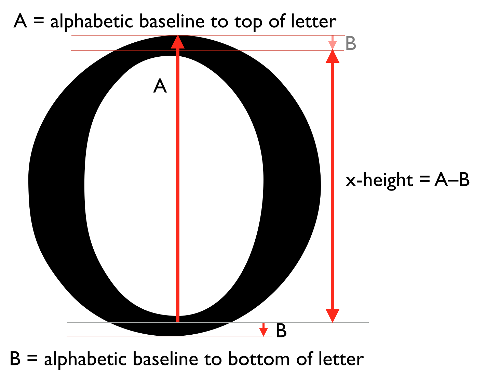
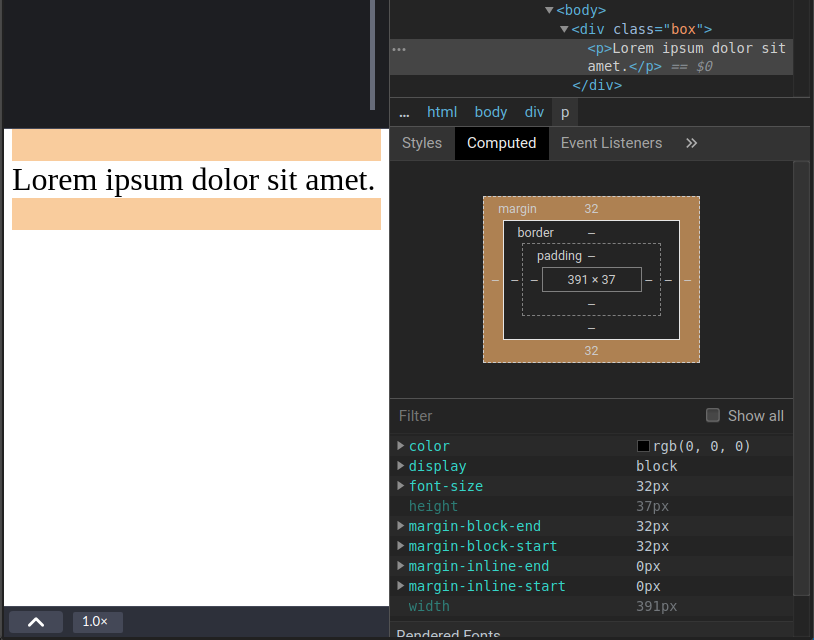
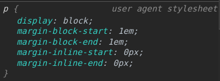
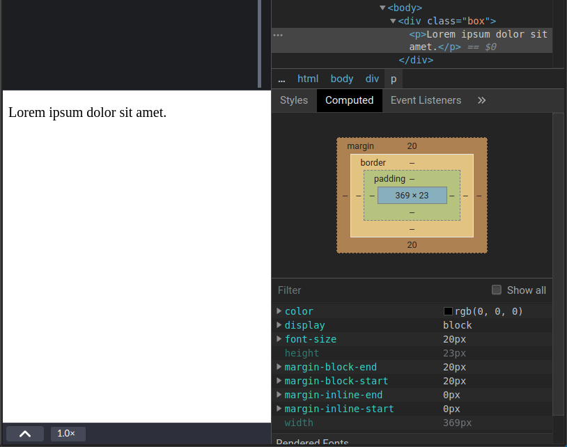
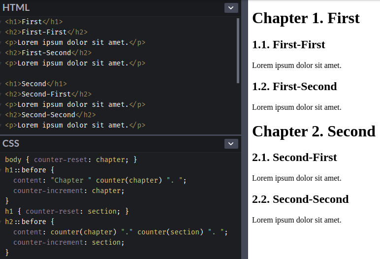
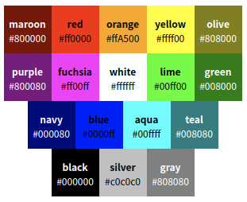
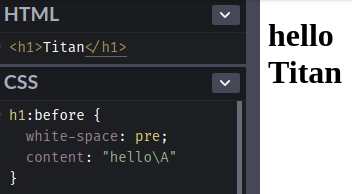

在介紹各種 CSS 屬性之前，先來介紹屬性值，CSS 的屬性值分為：整數和實數、Lengths (長度)、百分比、URLs 和 URIs、Counters (計數器)、顏色、字串。

<!-- more -->

## 前言

> 「重新認識 CSS」這個系列名稱的由來就如其名，我想要重新認識它。雖然以前就有學過 CSS，但這次想從 CSS Spec 中學到最原始的定義和內容，更加了解 CSS 的原理，讓我在切版的時候可以更加確定自己在做什麼，我踩到的雷只是因為我不夠了解它才會炸開。
> 
> 在這 30 天的內容中，會將 Spec 內看到的資料整理成這個系列，也希望正在學 CSS 的各位可以更加了解它。另外我也會同時將文章發至我的 Blog，如果想直接看文內的程式碼 Demo 畫面，可以到我的 Blog 來看 😃。
>
> 本文同步發表於 iT 邦幫忙：[重新認識 CSS - CSS 屬性值](https://ithelp.ithome.com.tw/articles/10219238)
> 
> 「重新認識 CSS」系列文章發文於：
> - [iT 邦幫忙](https://ithelp.ithome.com.tw/users/20117586/ironman/2617)
> - [Titangene Blog](https://titangene.github.io/tags/it-%E9%90%B5%E4%BA%BA%E8%B3%BD/)


屬性值分為：
- 整數和實數
- Lengths (長度)
- 百分比
- URLs & URIs
- Counters (計數器)
- 顏色
- 字串

## 整數和實數

- 整數 (包括正整數、0 和負整數)，例如：`16`、`-10`。
- [實數](https://zh.wikipedia.org/wiki/%E5%AE%9E%E6%95%B0) (包括整數、小數...等)，例如：`7.5`。

## Lengths (長度)

格式為實數 + 單位，例如：`16px`、`-10px`、`7.5em`。

有些屬性可以使用負長度值，但這樣可能會使 formatting model 複雜化，並且可能會有某些實作上的限制。如果不支援負長度值，則應換成可支援的最接近值。

如果在不支援負長度值的屬性使用，就會忽略該宣告。如果不支援長度值，UA 必須將它近似為[實際值 (actual value)](https://www.w3.org/TR/CSS22/cascade.html#actual-value)。

長度單位有兩種：
- 相對單位
- 絕對單位

### 相對單位

相對單位有：
- `em`：等於使用該元素的 [`font-size`](https://www.w3.org/TR/CSS22/fonts.html#propdef-font-size) 屬性的[計算值](https://www.w3.org/TR/CSS22/cascade.html#computed-value)
- `ex`：由元素的第一個可用字體定義，關於字體的 "x-height"

:::info
#### x-height

- 通常等於小寫字母 "x" 的高度
- 即使不包含 "x" 的字體也定義了 `ex`

字體的 x-height 可以通過不同的方式找到：
- 某些字體本身就有包含 x-height 的資訊 (可靠指標，reliable metrics)
- 如果沒有可靠的字體指標，UA 可以根據小寫字形的 height 來確定 x-height
  - 例如：以小寫字母 "o" 的字形 (glyph) 在 baseline 以下延伸的距離，並從其 bounding box (邊界框) 的頂端減去該值
- 如果還是無法確定 x-height，就會將 x-height 設為 `0.5em`



圖片來源：[CSS Inline Layout Module Level 3](https://www.w3.org/TR/css-inline-3/#baseline-synthesis-fonts)

:::

只要在 `font-size` 屬性值中使用 `em` 和 `ex` 單位，各別就會引用父元素的 `em` 或 `ex` 單位。

例如：原本 `p` 元素的預設字體大小為 16px，如果這時設定以下樣式：

```html
<div class="box">
  <p>Lorem ipsum dolor sit amet.</p>
</div>
```

```css
p { font-size: 2em; }
```

`p` 元素的計算值就會是 `2 x 16px`，所以計算值的結果為 32px，並且上下的 margin 也會變成各 32px，因為瀏覽器預設 margin 為 1em：





如果在 `p` 元素的容器上設定，CSS 樣式變成這樣：

```css
.box { font-size: 10px; }
p { font-size: 2em; }
```

那 `p` 元素的字體大小就不會是剛剛的 32px，而是變成 20px。這是因為 `em` 這個單位會拿容器的大小來算出計算值，也就是 `2 x 10px`，所以計算值的結果為 20px，並且上下的 margin 也會變成各 20px：



將 `em` 單位用在 `line-height` 是常見的用法。例如：設定以下樣式，就代表將 `h1` 元素的 line height 設定成比 `h1` 元素的字體大 20%：

```css
h1 { line-height: 1.2em; }
```

另外，當使用 `em` 和 `ex` 單位時，子元素是繼承父元素的[計算值](https://www.w3.org/TR/CSS22/cascade.html#computed-value)，不是繼承父元素指定的相對值。

例如：`h1` 元素是 `body` 元素的子元素，`h1` 元素的 [`text-indent`](https://www.w3.org/TR/CSS22/text.html#propdef-text-indent) 屬性的計算值會是 36px，而不是 45px：

```html
<body>
  <h1>Lorem ipsum dolor sit amet.</h1>
</body>
```

```css
body {
  font-size: 12px;
  text-indent: 3em;  /* i.e., 36px */
}
h1 { font-size: 15px; }
```

(O)：因為在 `body` 元素的 `text-indent` 屬性的計算值是 36px，而子元素 `p` 只會繼承父元素 `body` 的計算值 36px。
(X)：而不是因為 `p` 元素的字體大小為 15px，所以 `p` 元素的 `text-indent` 屬性的計算值是 45px。

### 絕對單位

絕對單位有：
- `in`：inches (英寸)，1in 等於 2.54cm
- `cm`：公分
- `mm`：毫米
- `pt`：points (點)，CSS 使用的 points 等於 1/72nd of 1in
- `pc`：picas (派卡)，1pc 等於 12pt
- `px`：pixel units (像素單位)，1px 等於 0.75pt

各種絕對單位之間的關係：`1in` = `2.54cm` = `25.4mm` = `72pt` = `6pc`。

當解析度為 `72dpi` 時，`1px = 1pt`。

## 百分比

每個 CSS 屬性都會定義是否可以使用百分比值，如果可以使用會引用哪裡的值來作為依據。百分比值可以是：
- 相同元素的另一個屬性的值
- ancestor 元素的屬性的值
- formatting context 的值 (例如：[containing block](https://www.w3.org/TR/CSS22/visuren.html#containing-block) 的寬度，containing block 的部份之後會說明)

下面是「相同元素的另一個屬性的值」的範例：

```css
p {
  font-size: 10px;
  line-height: 120%;  /* 120% of 'font-size' */
}
```

將 `p` 元素的字體大小設為 10px，如果又再 `p` 元素上設定 `line-height: 120%`，那 `p` 元素的 `line-height` 的計算值結果會是 12px (因為 `10px x 120%` )。

下面是「ancestor 元素的屬性的值」的範例：

```html
<p><span>Lorem</span> ipsum dolor sit amet.</p>
```

```css
p { font-size: 20px; }
span { line-height: 120%; }
```

將 `p` 元素的字體大小設為 20px，`span` 元素的 `line-height` 屬性會繼承父元素 `p` 的 `font-size` 值 20px，所以 `span` 元素的 `line-height` 屬性的計算值結果就會是 24px (因為 `20px x 120%` )。

## URLs & URIs

有些 CSS 的屬性值可以使用 URI，語法範例如下：

```css
body { background: url("http://www.ex.com/image.png"); }
```

> URI (Uniform Resource Identifiers) 包括 URL、URN 等，詳情請參閱 [RFC3986](https://www.ietf.org/rfc/rfc3986) 標準。

`url()` 內的雙引號 ( `"` ) 也可以改為單引號 ( `'` )。

另外，在前單引號或前單引號之前，以及後雙引號或後雙引號之後都可以加上可選的[空白字元 (white space)](https://www.w3.org/TR/CSS22/syndata.html#whitespace)，可依照各自偏好來決定 coding style，例如：

```css
body { background: url( "http://www.ex.com/image.png" ); }
body { background: url( 'http://www.ex.com/image.png' ); }
```

### 沒有引號

下面是沒有引號的範例：

```css
li { list-style: url(http://www.ex.com/titan.png) disc; }
```

如果在沒有加引號的 URI 中使用某些字元，例如：括號 ( `(`、`)` )、空白字元 ( ` ` )、單引號 ( `'` ) 和雙引號 ( `"` )，就必須在該字元之前加上反斜線跳脫 (escaped with a backslash)，例如：

```css
li { list-style: url(http://www.ex.com/titan\(test\).png) disc; }
```

也可以將上述字元按照 [RFC3986](https://www.ietf.org/rfc/rfc3986) 中的描述，轉換成 URI 換碼字元，例如：`(` 等於 `%28`，而 `)` 等於 `%29`。剛剛上面的範例就會變成：

```css
li { list-style: url(http://www.ex.com/titan%28test%29.png) disc; }
```

### 相對 URI

另外也可以使用相對 URI。例如下面的 CSS 檔案放在：

```
http://www.ex.org/style/basic.css
```

CSS 檔內如下：

```css
body { background: url("titan.png"); }
```

那這個 `"titan.png"` 的完整 URI 就會是：

```
http://www.ex.org/style/titan.png
```

也就代表相對 URI 會使用 base URI 來解析成完整的 URI。不過要注意的是，對 CSS style sheet 來說，base URI 是 style sheet 的 base URI (在上面範例中是 `http://www.ex.org/style/` )，而不是 source document (原始文件，也就是 HTML 文件) 的 base URI。

> 在 [RFC3986](https://www.ietf.org/rfc/rfc3986) 的第五節定義了此過程的規範演算法。

### 不可用在 URI 中使用註解

下面範例看似註解了 `x` 這個字元，但其實此 URI 還是 `/*x*/pic.png`，而不是 `pic.png`：

```css
body { background: url(/*x*/pic.png); }
```

:::info
註：在 CSS 中的註解語法是：

```css
/* 我是註解 */
```

:::

## Counters (計數器)

直接看範例：

```html
<h1>First</h1>
<h2>First-First</h2>
<p>Lorem ipsum dolor sit amet.</p>
<h2>First-Second</h2>
<p>Lorem ipsum dolor sit amet.</p>

<h1>Second</h1>
<h2>Second-First</h2>
<p>Lorem ipsum dolor sit amet.</p>
<h2>Second-Second</h2>
<p>Lorem ipsum dolor sit amet.</p>
```

```css
body { counter-reset: chapter; }
h1::before {
  content: "Chapter " counter(chapter) ". ";
  counter-increment: chapter;
}
h1 { counter-reset: section; }
h2::before {
  content: counter(chapter) "." counter(section) ". ";
  counter-increment: section;
}
```

Demo：[Codepen 連結](https://codepen.io/titangene/pen/poobELL)

讓 `h1` 和 `h2` 元素的文字之前會自動為章節編號：



<iframe height="559" style="width: 100%;" scrolling="no" title="automatic counters and numbering" src="https://codepen.io/titangene/embed/poobELL?height=559&theme-id=dark&default-tab=css,result" frameborder="no" allowtransparency="true" allowfullscreen="true">
  See the Pen <a href='https://codepen.io/titangene/pen/poobELL'>automatic counters and numbering</a> by Titangene
  (<a href='https://codepen.io/titangene'>@titangene</a>) on <a href='https://codepen.io'>CodePen</a>.
</iframe>

> 詳情可參考：
> - [CSS 2.2 - 4.3.5. Counters](https://www.w3.org/TR/CSS22/syndata.html#counter)
> - [CSS 2.2 - 12.4. Automatic counters and numbering](https://www.w3.org/TR/CSS22/generate.html#counters)

## 顏色

`<color>` 可用關鍵字或數字 RGB 規範的數值。

### 基本顏色關鍵字

在 CSS 2.2 中定義了 13 種顏色關鍵字：`aqua`、`black`、`blue`、`fuchsia`、`gray`、`green`、`lime`、`maroon`、`navy`、`olive`、`orange`、`purple`、`red`、`silver`、`teal`、`white` 和 `yellow`。

下面是這 17 種顏色各別對應的色碼：



使用範例：

```css
body {color: black; background: white; }
h1 { color: maroon; }
h2 { color: olive; }
```

### Numerical color values

#### RGB color values

RGB 分別代表紅色、綠色和藍色。下面是 RGB 顏色值的格式：
- 十六進位表示法
  - 有兩種格式：
    - 三個字元：`#rgb`，例如：`#f00`
    - 六個字元：`#rrggbb`，例如：`#ff0000`
  - `#ffbb00` 可簡寫為 `#fb0`，兩者代表相同的顏色
  - 三位 RGB 表示法 ( `#rgb` ) 是通過複製數字，而不是通過加零轉換為六位形式 ( `#rrggbb` )
- `rgb(r,g,b)`：
  - `r`、`g` 和 `b` 用逗號 ( `,` ) 分隔，三個數值可以都是整數值或百分比值
  - 整數值的 `255` 等於百分比值的 `100%`
  - 十六進位表示法中的 `F` 或 `FF`：
    - `rgb(255, 255, 255)` = `rgb(100%, 100%, 100%)` = `#FFF`
  - 例如：
    - `rgb(255, 0, 0)`
    - `rgb(100%, 0%, 0%)`

使用範例：

```css
em { color: #f00; }              /* #rgb */
em { color: #ff0000; }           /* #rrggbb */
em { color: rgb(255, 0, 0); }
em { color: rgb(100%, 0%, 0%); }
```

#### RGBA color values

而 RGBA 顏色值的格式只是在 RGB 顏色值的格式最後再加上一個 "alpha" 值。

"alpha" 值：
- 可指定顏色的透明度
- 值的範圍為 `0.0` 至 `1.0`
  - `0.0`：完全透明
  - `1.0`：不透明

:::info
註：使用十六進位表示法 (也就是 `#rgb` 或 `#rrggbb` ) 無法指定顏色的透明度。
:::

當 "alpha" 值為 `1.0` 時，代表不透明，因此下面四個都為相同顏色：

```css
em { color: rgb(255, 0, 0); }        /* 紅色 */
em { color: rgba(255, 0, 0, 1); }    /* 紅色 */
em { color: rgb(100%, 0%, 0%); }     /* 紅色 */
em { color: rgba(100%, 0%, 0%, 1); } /* 紅色 */
```

使用範例：

```css
em { color: rgba(255, 0, 0, 0.5); }      
em { color: rgb(100%, 0%, 0%, 0.5); }
```

#### HSL color values

HSL 是 hue-saturation-lightness 的縮寫，分別代表色相、飽和度和亮度。

有 RGB 就夠用了，為何還需要有 HSL？這是因為 HSL 使用起來會更加直覺，用色相、飽和度和亮度可以更直觀的指定顏色，RGB 還需要思考光的三原色：紅色、綠色、藍色，要分別設定多少才會變成指定顏色。

使用範例：

```css
* { color: hsl(0, 100%, 50%) }   /* red */
* { color: hsl(120, 100%, 50%) } /* lime */
* { color: hsl(120, 100%, 25%) } /* dark green */
* { color: hsl(120, 100%, 75%) } /* light green */
* { color: hsl(120, 75%, 75%) }  /* pastel green */
```

#### HSLA color values

而 HSLA 顏色值的格式只是在 HSL 顏色值的格式最後再加上一個 "alpha" 值。

"alpha" 值：
- 可指定顏色的透明度
- 值的範圍為 `0.0` 至 `1.0`
  - `0.0`：完全透明
  - `1.0`：不透明

當 "alpha" 值為 `1.0` 時，代表不透明，因此下面兩個都為相同顏色：

```css
em { color: hsl(120, 100%, 50%); }      /* 純綠色  */
em { color: hsla(120, 100%, 50%, 1); }  /* 純綠色  */
```

使用範例：

```css
em { color: hsla(30, 100%, 50%, 0.1); }  /* 半透明的純藍色  */
em { color: hsla(240, 100%, 50%, 0.5); }  /* 很透明的純橘色  */
```

#### `transparent` color keyword

- 顧名思義就是透明色
- [`background-color`](https://www.w3.org/TR/css-backgrounds-3/#the-background-color) 屬性的 initial value 就是 `transparent`

使用範例：

```css
em { background-color: transparent; }
```

### `currentColor` color keyword

CSS1 和 CSS2 將 [`border-color`](https://www.w3.org/TR/CSS1/#border-color) 屬性的 initial value 定義為 [`color`](https://www.w3.org/TR/css-color-3/#color0) 屬性的值，但未定義相應的關鍵字。SVG 意識到了這種遺漏，因此 [SVG 1.0](https://www.w3.org/TR/SVG10/color.html#ColorProperty) 為 `fill`、`stroke`、`stop-color`、`flood-color` 和 `lighting-color` 屬性引入了 `currentColor` 值。

在 CSS3 時，擴充了顏色值，新增 `currentColor` 這個關鍵字，以允許其與接受顏色值的所有屬性一起使用，這樣就簡化了 CSS3 中的這些屬性的定義。

`currentColor` 關鍵字：
- `color` 屬性的值
- `currentColor` 關鍵字的 used value 是 `color` 屬性的 computed value
- 如果在 `color` 屬性本身上設定了 `currentColor` 關鍵字，則將其視為 `color: inherit`

例如：`border-color` 屬性使用了 `currentColor` 關鍵字，此關鍵字的 used value 就是 `color` 屬性的 computed value，所以就等同於是將 `border-color` 設為 `blue` (也就是 `color` 屬性的顏色)。

```html
<div class="box"></div>
```

```css
.box {
  width: 100px;
  height: 100px;
  background-color: lightblue;
  border-width: 10px;
  border-style: solid;
  border-color: currentColor;
  color: blue;
}
```

> 如果想更多顏色值的相關內容，詳情可參考：
> - [CSS 2.2 - 4.3.6. Colors](https://www.w3.org/TR/CSS22/syndata.html#color-units)
> - [CSS Color Module Level 3](https://www.w3.org/TR/css-color-3/)。

## 字串

字串可用雙引號 ( `"` ) pair 或單引號 ( `'` ) pair 包起來。

使用範例：

```css
p::before { content: 'hello '; }
p::after { content: "!"; }
```

### 字串中的引號字元要使用跳脫字元

雙引號 pair 裡面不能直接使用雙引號，同理，單引號也是如此，除非在引號 pair 之前加上跳脫字元。
- 雙引號：使用 `\"` 或 `\22`
- 單引號：使用 `\'` 或 `\27`

使用範例：

```css
/* 雙引號 */
.test1::before { content: "this is a \"string\""; }
.test2::before { content: 'this is a \22string\22'; }

/* 單引號 */
.test3::before { content: 'this is a \'string\''; }
.test4::before { content: 'this is a \27string\27'; }
```

如果不想另外加上跳脫字元，可以在改在雙引號字串中使用單引號，或是在單引號字串中使用雙引號，例如：

```css
.test5::before { content: "this is a 'string'"; }
.test6::before { content: 'this is a "string"'; }
```

### 換行字元 (newline)

字串不能直接包含換行字元 (newline)。要在字串中包含換行字元，請使用跳脫字元來表示 ISO-10646 ( `U+000A` ) 中的換行字元，例如：`\A` 或 `\00000a` 這些字元都代表 CSS 中的換行字元。

使用範例：

```html
<h1>Titan</h1>
```

```css
h1:before {
  white-space: pre;
  content: "hello\A"
}
```

Demo：[Codepen 連結](https://codepen.io/titangene/pen/BaazWQz)

如範例，`hello` 字串之後會換行就是因為使用了 `\A` 這個換行字元：



### 將字串分成多行

如果要將字串分成多行，換行字元本身必須使用反斜線 ( `\` ) 來進行跳脫 (escaped)。

使用範例：

```css
a[title="a not s\
o very long title"] { ... }
```

等同於：

```css
a[title="a not so very long title"] { ... }
```

資料來源：
- [CSS 2.2 - 4. Syntax and basic data types](https://www.w3.org/TR/CSS22/syndata.html)
- [實數 - Wikipedia](https://zh.wikipedia.org/wiki/%E5%AE%9E%E6%95%B0)
- [CSS Inline Layout Module Level 3](https://www.w3.org/TR/css-inline-3/)
- [CSS Values and Units Module Level 3](https://www.w3.org/TR/css-values-3/)
- [CSS Values and Units Module Level 4](https://www.w3.org/TR/css-values-4/)
- [CSS Color Module Level 3](https://www.w3.org/TR/css-color-3/)
- [CSS Backgrounds and Borders Module Level 3](https://www.w3.org/TR/css-backgrounds-3/)
- [鉄人28號FX　鉄人6號「字級羊」font-size - 鉄人28號FX系列 - iT 邦幫忙](https://ithelp.ithome.com.tw/articles/10218632)