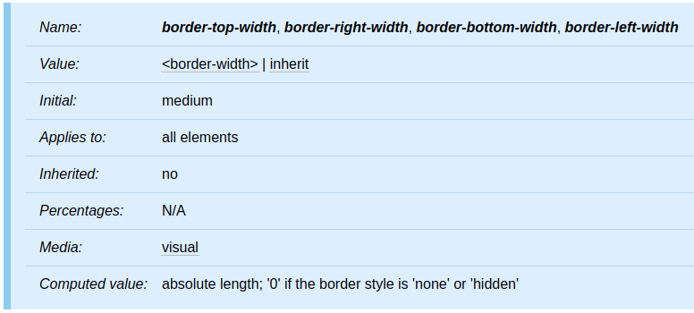
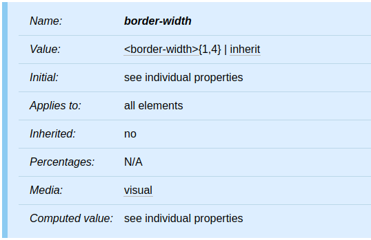
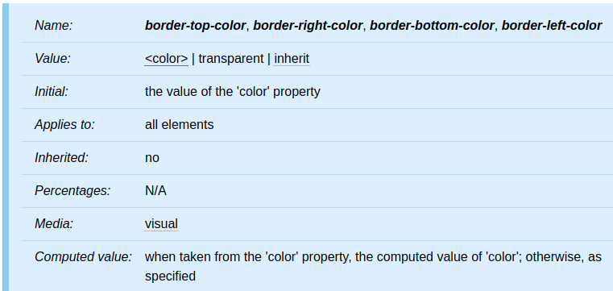
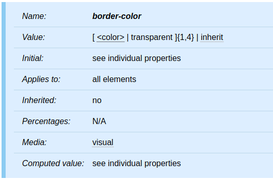
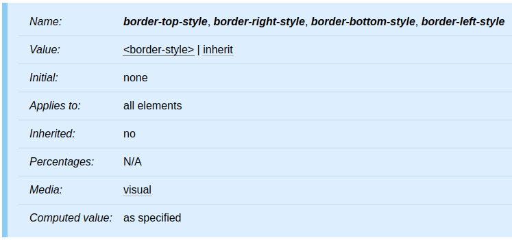
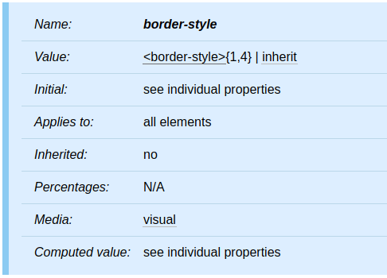
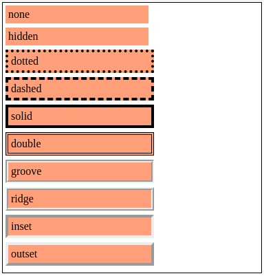

本篇將介紹 CSS 的 Box model 中的 border。

<!-- more -->

## 前言

> 「重新認識 CSS」這個系列名稱的由來就如其名，我想要重新認識它。雖然以前就有學過 CSS，但這次想從 CSS Spec 中學到最原始的定義和內容，更加了解 CSS 的原理，讓我在切版的時候可以更加確定自己在做什麼，我踩到的雷只是因為我不夠了解它才會炸開。
> 
> 在這 30 天的內容中，會將 Spec 內看到的資料整理成這個系列，也希望正在學 CSS 的各位可以更加了解它。另外我也會同時將文章發至我的 Blog，如果想直接看文內的程式碼 Demo 畫面，可以到我的 Blog 來看 😃。
> 
> 本文同步發表於 iT 邦幫忙：[重新認識 CSS - Box model：border](https://ithelp.ithome.com.tw/articles/10223019)
> 
> 「重新認識 CSS」系列文章發文於：
> - [iT 邦幫忙](https://ithelp.ithome.com.tw/users/20117586/ironman/2617)
> - [Titangene Blog](https://titangene.github.io/tags/it-%E9%90%B5%E4%BA%BA%E8%B3%BD/)

## Border width

border width 屬性指定 border area 的寬度。



`border-top-width`、`border-right-width`、`border-bottom-width`、`border-left-width` 屬性：
- initial value：`medium`
- computed value：absolute length；如果 border 樣式為 `none` 或 `hidden`，則為 `0`

`border-width` 是下列屬性的簡寫屬性：
- `border-top-width`
- `border-right-width`
- `border-bottom-width`
- `border-left-width`



此屬性引用的 `<border-width>` value type 可在以下幾個當中選一個使用：
- `thin`
- `medium`
- `thick`
- `<length>`：指定明確的屬性值，border width 不能使用負數

前三個值的解譯 (interpretation) 方式取決於 UA。但是，必須滿足以下關係：`thin` <= `medium` <= `thick`。

例如：

```css
h1 { border-width: thin; }               /* thin thin thin thin */
h1 { border-width: thin thick; }         /* thin thick thin thick */
h1 { border-width: thin thick medium; }  /* thin thick medium thick */
h1 { border-width: thin thick medium thin; }  /* thin thick medium thin */
```

## Border color

border color 屬性指定 box 的 border 的顏色。



`border-top-color`、`border-right-color`、`border-bottom-color`、`border-left-color` 屬性：
- initial value：`color` 屬性值
- computed value：`color` 屬性的 [computed value](https://www.w3.org/TR/CSS22/cascade.html#computed-value)，否則使用指定的顏色

`border-color` 是下列屬性的簡寫屬性：
- `border-top-color`
- `border-right-color`
- `border-bottom-color`
- `border-left-color`



`border-color` 屬性設定四個 border 的顏色。value 具有以下含義：
- `<color>`：指定顏色值
- `transparent`：透明的 border (就算有設定 border 寬度也會是透明的)

如果未使用 `border` 屬性指定元素的 border 顏色，則 UA 必須使用元素的 `color` 屬性的值作為 border 顏色的 [computed value](https://www.w3.org/TR/CSS22/cascade.html#computed-value)。

例如：實線 (solid) 的 border：

```css
p { 
  color: black; 
  background: white; 
  border: solid;
}
```

## Border style

border 樣式屬性指定 box 的 border 的 line 樣式。



`border-top-style`、`border-right-style`、`border-bottom-style`、`border-left-style` 屬性：
- initial value：`none`，也就是除非有設定 border 樣式，否則不會顯示任何 border
- computed value：[specified value](https://www.w3.org/TR/CSS22/cascade.html#specified-value)

`border-style` 是下列屬性的簡寫屬性：
- `border-top-style`
- `border-right-style`
- `border-bottom-style`
- `border-left-style`



此屬性引用的 `<border-width>` value type 可在以下幾個當中選一個使用：`none`、`hidden`、`dotted`、`dashed`、`solid`、`double`、`groove`、`ridge`、`inset`、`outset`。

樣式如下圖：

Demo：[Codepen 連結](https://codepen.io/titangene/pen/poobYwJ)



<iframe height="496" style="width: 100%;" scrolling="no" title="border style" src="https://codepen.io/titangene/embed/poobYwJ?height=496&theme-id=dark&default-tab=css,result" frameborder="no" allowtransparency="true" allowfullscreen="true">
  See the Pen <a href='https://codepen.io/titangene/pen/poobYwJ'>border style</a> by Titangene
  (<a href='https://codepen.io/titangene'>@titangene</a>) on <a href='https://codepen.io'>CodePen</a>.
</iframe>

## 四個方位的 border 設定

就如之前所說，`border-width`、`border-color`、`border-style` 和 `border` 屬性都可以設定 1 至 4 個值，分別代表：

```
屬性: 上下左右;
屬性: 上下 左右;
屬性: 上 左右 下;
屬性: 上 右 下 左;
```

例如：
- 水平 border 為 `solid`
- 垂直 border 為 `dotted`

```css
h1 { border-style: solid dotted; }
```

> 詳情可參考我之前寫的「[重新認識 CSS - Box model (前傳)](https://titangene.github.io/article/css-box-model.html)」，內有使用 1 至 4 個值的實際範例，因此在此不再追述。

資料來源：
- [CSS 2.2 - 8. Box model](https://www.w3.org/TR/CSS22/box.html#margin-properties)
- [CSS Backgrounds and Borders Module Level 3 - 4. Borders](https://www.w3.org/TR/css-backgrounds-3/#borders)