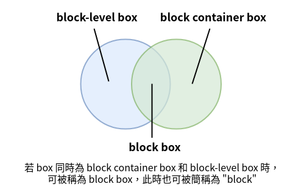
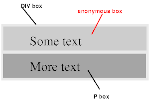

在 visual formatting model 中，document tree 中的每個元素都會根據 box model 生成 0 個或多個 box，box 分為兩種不同的 type：block 和 inline。本篇將介紹 block box。

<!-- more -->

使用 `display` 屬性可以決定 box 的 type，不同的 box type 會影響 UA 在 visual formatting model 中要如何去佈局，本篇來介紹 block 部份，之後則會介紹 [inline 部份](https://titangene.github.io/article/css-box-generation-inline-box.html)。

> 如果想瞭解 inline 部份，可參閱在此系列中的另一篇「[重新認識 CSS - Visual formatting model：Box generation (inline)](https://titangene.github.io/article/css-box-generation-inline-box.html)」。

## 前言

> 「重新認識 CSS」這個系列名稱的由來就如其名，我想要重新認識它。雖然以前就有學過 CSS，但這次想從 CSS Spec 中學到最原始的定義和內容，更加了解 CSS 的原理，讓我在切版的時候可以更加確定自己在做什麼，我踩到的雷只是因為我不夠了解它才會炸開。
> 
> 在這 30 天的內容中，會將 Spec 內看到的資料整理成這個系列，也希望正在學 CSS 的各位可以更加了解它。另外我也會同時將文章發至我的 Blog，如果想直接看文內的程式碼 Demo 畫面，可以到我的 Blog 來看 😃。
> 
> 本文同步發表於 iT 邦幫忙：[重新認識 CSS - Visual formatting model：Box generation (block box)](https://ithelp.ithome.com.tw/articles/10224653)
> 
> 「重新認識 CSS」系列文章發文於：
> - [iT 邦幫忙](https://ithelp.ithome.com.tw/users/20117586/ironman/2617)
> - [Titangene Blog](https://titangene.github.io/tags/it-%E9%90%B5%E4%BA%BA%E8%B3%BD/)

## Block-level 元素 & block boxes

block-level 元素：
- source document 中以視覺化的方式格式化為 block 的元素 (例如：`p` 元素)
- 產生 block-level principal box 的元素
- 當元素的 `display` 屬性值為 `block`、`list-item` 或 `table` 時，該元素就會成為 block-level 元素

block-level box：
- 參與 BFC 的 box

block container 元素：
- 當該元素的 principal box 是 block container box 時，則該元素為 block container 元素

block container box：
- block container 要麼只包含參與 IFC 的 inline-level box，要麼只包含參與 BFC 的 block-level box (可能會產生 anonymous block box 以確保此約束，後面會介紹)
- 只包含 inline-level content 的 block container 會建立新的 IFC，然後該元素還會產生一個 [root inline box](https://www.w3.org/TR/css-inline-3/#root-inline-box)，該 root inline box 會 wrap 那些 inline content
- 當 non-replaced 元素的 `display` 屬性值為 `block`、`list-item` 或 `inline-block` 時，該元素會產生 block container box

> 註：[root inline box](https://www.w3.org/TR/css-inline-3/#root-inline-box) 的概念是在 [CSS Display Module Level 3](https://www.w3.org/TR/css-display/#block-container) 中提出的，此概念取代了在 [CSS 2](https://www.w3.org/TR/CSS22/visuren.html#anonymous) 中提到的 anonymous inline box。

不是所有的 block container box 都是 block-level box，例如以下這些都是 block container box，而不是 block-level box：
- non-replaced inline block
- non-replaced table cell

相反的，不是所有的 block-level box 都是 block container box，例如以下這些都是 block-level box，而不是 block container box：
- block-level replaced 元素 ( `display: block` )
- flex container ( `display: flex` )
- table box
- replaced 元素的 principal box

> Block-level boxes that are also block containers are called block boxes.
> 
> The three terms "block-level box," "block container box," and "block box" are sometimes abbreviated as "block" where unambiguous.

也就是說，若 box 同時為 block container box 和 block-level box 時，可被稱為 block box，此時也可被簡稱為 "block"。

如下圖：



### Anonymous block boxes

直接看範例，假設 `div` 元素和 `p` 元素都是 `display：block`，`div` 元素內有 inline 內容和 block 內容：

```html
<div>
  Some text
  <p>More text</p>
</div>
```



上圖說明匿名 block box 如何在匿名內容的周圍出現。

`div` 元素產生 block container box，裡面有一個 block-level box (也就是範例中的 `p` 元素所產生的)，那就會強制在 block container box 裡面只會有 block-level box。

所以在 `div` 的 box 內有兩個包含 text 的矩形 box：
1. 第一個是 anonymous block box，內容為 "Some text"
2. 第二個是 `p` 元素的 box，內容為 "More text"

> 本文的內容主要是依據 CSS 2.2 中的定義來說明，如有錯誤之處，歡迎告知，感謝 😃。

資料來源：
- [CSS 2.2 - 9.2. Controlling box generation](https://www.w3.org/TR/CSS22/visuren.html#box-gen)
- [CSS Display Module Level 3](https://www.w3.org/TR/css-display-3/)