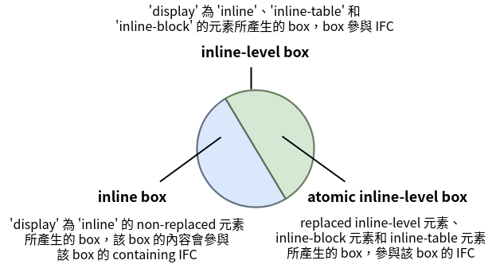

在 visual formatting model 中，document tree 中的每個元素都會根據 box model 生成 0 個或多個 box，box 分為兩種不同的 type：block 和 inline。本篇將介紹 inline box。

<!-- more -->

使用 `display` 屬性可以決定 box 的 type，不同的 box type 會影響 UA 在 visual formatting model 中要如何去佈局，之前介紹了 [block 部份](https://titangene.github.io/article/css-box-generation-block-box.html)，本篇會來介紹 inline 部份。

> 如果想瞭解 block 部份，可參閱在此系列中的另一篇「[重新認識 CSS - Visual formatting model：Box generation (block)](https://titangene.github.io/article/css-box-generation-block-box.html)」。

## 前言

> 「重新認識 CSS」這個系列名稱的由來就如其名，我想要重新認識它。雖然以前就有學過 CSS，但這次想從 CSS Spec 中學到最原始的定義和內容，更加了解 CSS 的原理，讓我在切版的時候可以更加確定自己在做什麼，我踩到的雷只是因為我不夠了解它才會炸開。
> 
> 在這 30 天的內容中，會將 Spec 內看到的資料整理成這個系列，也希望正在學 CSS 的各位可以更加了解它。另外我也會同時將文章發至我的 Blog，如果想直接看文內的程式碼 Demo 畫面，可以到我的 Blog 來看 😃。
> 
> 本文同步發表於 iT 邦幫忙：[重新認識 CSS - Visual formatting model：Box generation (inline box)](https://ithelp.ithome.com.tw/articles/10225035)
> 
> 「重新認識 CSS」系列文章發文於：
> - [iT 邦幫忙](https://ithelp.ithome.com.tw/users/20117586/ironman/2617)
> - [Titangene Blog](https://titangene.github.io/tags/it-%E9%90%B5%E4%BA%BA%E8%B3%BD/)

## Inline-level elements and inline boxes

inline-level 元素：
- source document 中不構成新內容的 block 的元素 (例如：段落內的 `em` 元素)
- 內容以 line 分佈 (例如：段落內的強調 (emphasized) text 片段、inline 圖片等)
- 產生 inline-level box 的元素
- 當元素的 `display` 屬性值為 `inline`、`inline-table` 或 `inline-block` 時，則該元素就會成為 inline-level 元素

inline-level box：
- 參與 IFC 的 box

inline box：
- 既是 inline-level box，且該 box 的內容會參與該 box 的 containing IFC 的 box
- `display` 屬性值為 `inline` 的 non-replaced 元素會產生 inline box

atomic inline-level box：不是 inline box 的 inline-level box，作為 single opaque (不透明) box 參與該 box 的 IFC，例如：
- replaced inline-level 元素
- `inline-block` 元素 (元素會產生 principal inline-level block container，inline-block 的內部會被格式化為 block box，元素本身會被格式化為 atomic inline-level box)
- `inline-table` 元素 (參與 IFC 的 rectangular block)

如下圖：



### Anonymous inline boxes

任何直接包含在 block container 元素內 (不在 inline 元素內) 的 text 都必須被視為 anonymous inline 元素。

例如：

```html
<p>Some <em>emphasized</em> text</p>
```

`p` 元素產生 block box，其中包含幾個 inline box：
- "emphasized" 文字的 box 是由 inline 元素 (也就是 `em` 元素) 產生的 inline box
- 其他 box ("Some" 和 "text") 都是由 block-level 元素 (也就是 `p` 元素) 產生的 inline box
  - 而此 box 被稱為 anonymous inline box，因為它們都沒有關聯 (associated) 的 inline-level 元素

此類的 anonymous inline box 從其 block parent box 繼承可繼承的屬性。非繼承屬性具有其 initial value。在此範例中，anonymous inline box 的 `color` 會繼承至 `p` 元素，但是 `background` 會是透明的。

> 本文的內容主要是依據 CSS 2.2 中的定義來說明，如有錯誤之處，歡迎告知，感謝 😃。

資料來源：
- [CSS 2.2 - 9.2. Controlling box generation](https://www.w3.org/TR/CSS22/visuren.html#box-gen)
- [CSS Display Module Level 3](https://www.w3.org/TR/css-display-3/)
- [視覺格式化模型-Box generation(中) - iT 邦幫忙](https://ithelp.ithome.com.tw/articles/10222516)
- [Visual Formatting Model - inline - iT 邦幫忙](https://ithelp.ithome.com.tw/articles/10222018)