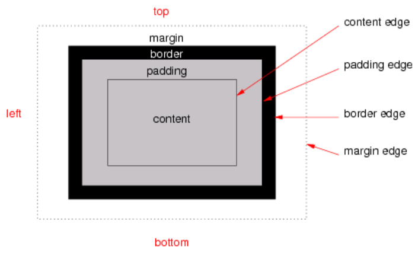
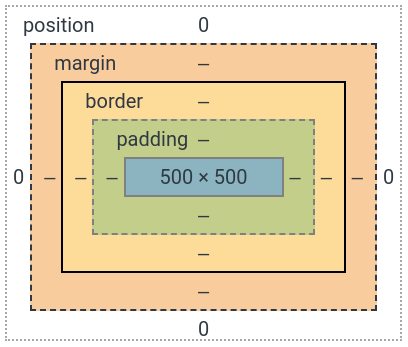

在佈局 document 時，UA 的渲染引擎會根據 CSS box model 將每個元素表示為一個矩形框 (rectangular box)。CSS 會確定這些 box 的大小、位置和屬性 (顏色、背景、border 大小...等)。本篇將介紹 CSS 的 Box model。

<!-- more -->

## 前言

> 「重新認識 CSS」這個系列名稱的由來就如其名，我想要重新認識它。雖然以前就有學過 CSS，但這次想從 CSS Spec 中學到最原始的定義和內容，更加了解 CSS 的原理，讓我在切版的時候可以更加確定自己在做什麼，我踩到的雷只是因為我不夠了解它才會炸開。
> 
> 在這 30 天的內容中，會將 Spec 內看到的資料整理成這個系列，也希望正在學 CSS 的各位可以更加了解它。另外我也會同時將文章發至我的 Blog，如果想直接看文內的程式碼 Demo 畫面，可以到我的 Blog 來看 😃。
> 
> 本文同步發表於 iT 邦幫忙：[重新認識 CSS - Box model](https://ithelp.ithome.com.tw/articles/10222331)
> 
> 「重新認識 CSS」系列文章發文於：
> - [iT 邦幫忙](https://ithelp.ithome.com.tw/users/20117586/ironman/2617)
> - [Titangene Blog](https://titangene.github.io/tags/it-%E9%90%B5%E4%BA%BA%E8%B3%BD/)

每個 box 都是由下面這四個區域 (area) 所組成：
- content area (例如：文字、圖片 ... 等)
- padding area
- border area
- margin area

這些區域 (area) 都是由各邊緣 (edge) 所定義：
- content edge
  - 環繞著由 box 的 [width](https://www.w3.org/TR/CSS22/visudet.html#Computing_widths_and_margins) 和 [height] 指定的矩形 (rectangle)
  - 通常取決於元素的 [render 內容](https://www.w3.org/TR/CSS22/conform.html#rendered-content)
- padding edge
  - padding edge 環繞著 box padding
  - 如果 `padding` 為 0 時，那 padding edge 也是 content edge
- border edge
  - border edge 環繞著 box border
  - 如果 `border` 為 0 時，那 border edge 也是 content edge
- margin edge
  - margin edge 環繞著 box margin
  - 如果 `margin` 為 0 時，那 margin edge 也是 content edge

如下圖：



用 Chrome DevTools (開發者工具) 也可以看到 box model：



上圖中的各種顏色由外而內分別為：
- 白色：position (與 box model 無關，之後會介紹此部份)
- 橘色：margin
- 黃色：border
- 綠色：padding
- 藍色：content

圖片來源：[CSS Box Model Module Level 3](https://www.w3.org/TR/css-box-3/#box-model)

margin、border 和 padding 可分為 top、right、bottom 和 left 四個部份，可用各自的 CSS 屬性來設定，語法都很類似。

如果要各別指定上下左右，下面以 padding 的語法為例：

```css
padding-top: 10px;
padding-right: 20px;
padding-bottom: 30px;
padding-left: 40px;
```

如果要同時設定多個部份，可以使用簡寫屬性來設定，語法如下：

```css
屬性: 上下左右;
屬性: 上下 左右;
屬性: 上 左右 下;
屬性: 上 右 下 左;
```

下面以 `padding` 這個簡寫屬性為例，只在此簡寫屬性指定 1 個屬性值時，代表同時指定 `padding` 的上下左右部份，例如：

```css
padding: 10px;
```

等同於：

```css
padding-top: 10px;
padding-right: 10px;
padding-bottom: 10px;
padding-left: 10px;
```

如果在簡寫屬性指定 2 個屬性值時，代表分別指定 `padding` 的上下、左右部份，例如：

```css
padding: 10px 20px;
```

等同於：

```css
padding-top: 10px;
padding-right: 20px;
padding-bottom: 10px;
padding-left: 20px;
```

如果在簡寫屬性指定 3 個屬性值時，代表分別指定 `padding` 的上、左右和下部份，例如：

```css
padding: 10px 20px 30px;
```

等同於：

```css
padding-top: 10px;
padding-right: 20px;
padding-bottom: 30px;
padding-left: 20px;
```

如果在簡寫屬性指定 4 個屬性值時，代表分別指定 `padding` 的上、右、下、左部份 (以順時針的方向會比較好記憶)，例如：

```css
padding: 10px 20px 30px 40px;
```

等同於：

```css
padding-top: 10px;
padding-right: 20px;
padding-bottom: 30px;
padding-left: 40px;
```

## content

- content area (例如：文字、圖片 ... 等)
- content area 的大小：content width 和 content height，取決於幾個因素：
  - 生成該 box 的元素是否設定了 `width` 或 `height` 屬性
  - 該 box 是否包含 text 或其它 box
  - 該 box 是不是表格
  - ... 等
- 通常有 `background-color` 或 `background-image`

資料來源：
- [CSS 2.2 - 8. Box model](https://www.w3.org/TR/CSS22/box.html)
- [CSS Box Model Module Level 3](https://www.w3.org/TR/css-box-3/#box-model)
- [前端新手村 垂直排列 與 Box Model](https://dwatow.github.io/2017/12-17-iron-man-2018/iron-man-2018-day7/)