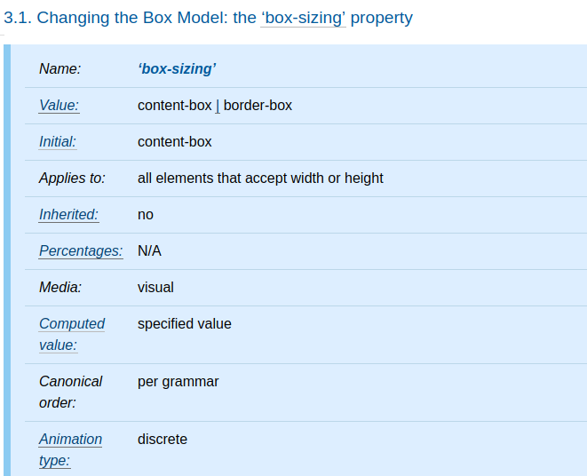
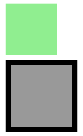
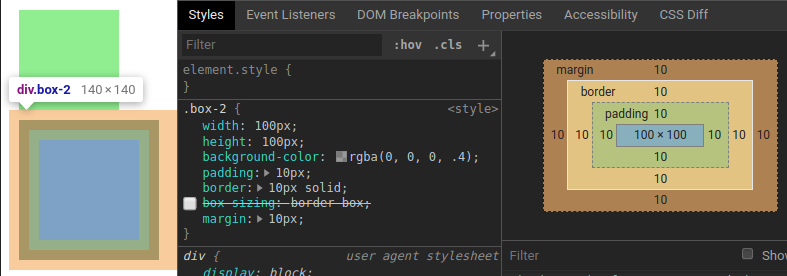
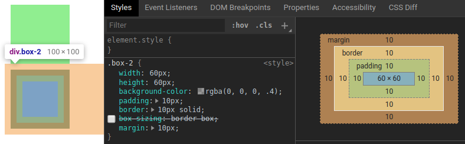
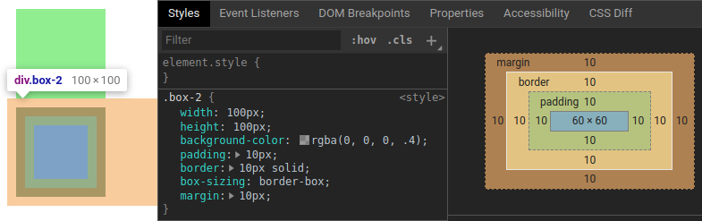
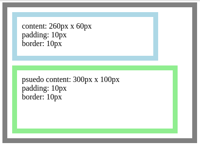
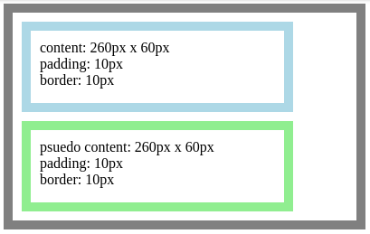

本篇將介紹 `box-sizing` 屬性是如何設定計算元素的總寬度和總高度。

<!-- more -->

## 前言

> 「重新認識 CSS」這個系列名稱的由來就如其名，我想要重新認識它。雖然以前就有學過 CSS，但這次想從 CSS Spec 中學到最原始的定義和內容，更加了解 CSS 的原理，讓我在切版的時候可以更加確定自己在做什麼，我踩到的雷只是因為我不夠了解它才會炸開。
> 
> 本文同步發表於 iT 邦幫忙：[重新認識 CSS - box-sizing](https://ithelp.ithome.com.tw/articles/10223434)
> 
> 在這 30 天的內容中，會將 Spec 內看到的資料整理成這個系列，也希望正在學 CSS 的各位可以更加了解它。另外我也會同時將文章發至我的 Blog，如果想直接看文內的程式碼 Demo 畫面，可以到我的 Blog 來看 😃。
> 
> 「重新認識 CSS」系列文章發文於：
> - [iT 邦幫忙](https://ithelp.ithome.com.tw/users/20117586/ironman/2617)
> - [Titangene Blog](https://titangene.github.io/tags/it-%E9%90%B5%E4%BA%BA%E8%B3%BD/)

下圖是 `box-sizing` 屬性的定義：



可以看到 `box-sizing` 屬性能用在任何元素，而且初始值為 `content-box`。

在 CSS box model 中，對元素指定寬度和高度會應用於 content box，如果又在該元素設定 border 或 padding 時，在視覺上會很像是增加元素的大小。也就是說當你想要讓該元素為某寬度或高度時，需要自行手動減去 border 或 padding 所佔用的空間，才能讓元素符合原本預期的寬高。

例如：

```html
<div class="box-1"></div>
<div class="box-2"></div>
```

```css
.box-1 {
  width: 100px;
  height: 100px;
  background-color: lightgreen;
  margin: 10px;
}
.box-2 {
  width: 100px;
  height: 100px;
  background-color: rgba(0, 0, 0, .4);
  padding: 10px;
  border: 10px solid;
  margin: 10px;
}
```

如下圖，`.box-1` 元素和 `.box-2` 元素的 `width` 和 `height` 都一樣 (都是 100px)：



但是可以看出這兩個元素的大小明顯不同，這是因為 `.box-2` 元素比 `.box-1` 元素多了 padding 和 border：



各元素在視覺上所佔用的空間：
- `.box-1` 元素：
  - 寬：`width` (100px)
  - 高：`height` (100px)
- `.box-2` 元素：
  - 寬佔用：`border-left-width` (10px) + `padding-left` (10px) + `width` (100px) + `padding-right` (10px) + `border-right-width` (10px) = 140px
  - 高佔用：`border-top-height` (10px) + `padding-top` (10px) + `height` (100px) + `padding-bottom` (10px) + `border-bottom-height` (10px) = 140px

如果要 `.box-2` 元素要保留 border 和 padding，又要只佔用寬度和高度各 100px 就只能手動減去 border 或 padding，以上面範例就會改成這樣：

```css
.box-2 {
  width: 60px;
  height: 60px;
  background-color: rgba(0, 0, 0, .4);
  padding: 10px;
  border: 10px solid;
  margin: 10px;
}
```



雖然在視覺上，`.box-1` 元素和 `.box-2` 元素所佔用的空間變成一樣了，但是要自行計算 `width` 和 `height` 會很麻煩。這時就可以改用 `box-sizing: border-box`，它就會幫你自動計算扣除  border 或 padding 所剩餘的空間，應用在 content width 和 content height。

```css
.box-2 {
  width: 100px;
  height: 100px;
  background-color: rgba(0, 0, 0, .4);
  padding: 10px;
  border: 10px solid;
  box-sizing: border-box;
  margin: 10px;
}
```

如下圖，不用修改 `width` 和 `height` 就可以達到預期的效果：



`content-box`：
- `box-sizing` 屬性的初始值
- 指定的寬度和高度 (以及對應的最小/最大屬性) 分別應用於元素 content box 的寬度和高度

## 各種 `box-sizing` reset 方法

### 舊的 `box-sizing` reset 方法

使用 universal selector 選擇所有元素，並將所有元素都設為 `box-sizing: border-box`。這個方法雖然可以對所有元素做設定，但沒有對 pseudo-element 設定 `box-sizing`：

```css
* {
  box-sizing: border-box;
}
```

例如：

```html
<div class="container">
  <div class="child"></div>
</div>
```

```css
* {
  box-sizing: border-box;
}
.container {
  width: 400px;
  padding: 10px;
  border: 10px solid gray;
}
.child {
  width: 300px;
  height: 100px;
  padding: 10px;
  border: 10px solid lightblue;
  margin-bottom: 10px;
}
.container::after {
  content: '';
  display: block;
  width: 300px;
  height: 100px;
  padding: 10px;
  border: 10px solid lightgreen;
}
```

Demo：[Codepen 連結](https://codepen.io/titangene/pen/xxKvgxE)

如下圖，pseudo-element 的 `box-sizing` 還是預設值 `content-box`，所以 content box 的寬為 300px，高為 100px：



> selector 詳情可參考我前幾天寫的：
> - [重新認識 CSS - CSS Selector (前傳)](https://ithelp.ithome.com.tw/articles/10216566)
> - [重新認識 CSS - Pseudo-element (偽元素)](https://ithelp.ithome.com.tw/articles/10218712)

### Universal `box-sizing`

後來也使用 universal selector 來選擇 pseudo-element：

```css
*, *::before, *::after {
  box-sizing: border-box;
}
```

若延續前面的範例，就可以看到 pseudo-element 也使用了 `box-sizing: border-box`：



### 繼承 box-sizing

剛剛的方法看似可行，但忽略了有些地方還是有 `box-sizing: content-box` 的需求：


如果想要讓所有元素都使用 `box-sizing: border-box`，最常見的作法是在 `html` 元素上設定 `box-sizing` 屬性，而所有其他元素則是使用 `inherit` 這個關鍵字來繼承該值：

```css
html {
  box-sizing: border-box;
}
*, *::before, *::after {
  box-sizing: inherit;
}
```


資料來源：
- [CSS Basic User Interface Module Level 3 (CSS3 UI) - 3.1. Changing the Box Model: the box-sizing property](https://www.w3.org/TR/css-ui-3/#box-sizing)