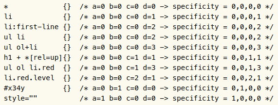

CSS 可以在同份文件上使用多個 style sheet 來設定文件的樣式。如果你在不同 style sheet 內對同一個元素或屬性設定值時，就會 CSS 會透過 [cascading](https://www.w3.org/TR/css-cascade-3/#cascade) 這個特性來解決這個衝突。本篇將介紹 CSS 的 Cascading 和 specificity。

<!-- more -->

## 前言

> 「重新認識 CSS」這個系列名稱的由來就如其名，我想要重新認識它。雖然以前就有學過 CSS，但這次想從 CSS Spec 中學到最原始的定義和內容，更加了解 CSS 的原理，讓我在切版的時候可以更加確定自己在做什麼，我踩到的雷只是因為我不夠了解它才會炸開。
> 
> 在這 30 天的內容中，會將 Spec 內看到的資料整理成這個系列，也希望正在學 CSS 的各位可以更加了解它。另外我也會同時將文章發至我的 Blog，如果想直接看文內的程式碼 Demo 畫面，可以到我的 Blog 來看 😃。
>
> 本文同步發表於 iT 邦幫忙：[重新認識 CSS - Cascading & Specificity](https://ithelp.ithome.com.tw/articles/10220677)
> 
> 「重新認識 CSS」系列文章發文於：
> - [iT 邦幫忙](https://ithelp.ithome.com.tw/users/20117586/ironman/2617)
> - [Titangene Blog](https://titangene.github.io/tags/it-%E9%90%B5%E4%BA%BA%E8%B3%BD/)

## Cascading

cascade 接受給定 (given) 元素上的給定屬性的 declared value 的無序列表，根據如下所述按照其宣告的優先度對它們進行排序，並輸出一個 cascaded value

cascade 會使用各元素上屬性的 declared value 的無序列表，透過下面所述的 Cascading 流程，以宣告的優先度從高到低進行排序，並輸出一個 cascaded value：
1. Origin and Importance
2. Specificity
3. Order of Appearance

### Origin and Importance

- Origin：根據宣告的[來源 (origin)](https://www.w3.org/TR/css-cascade-3/#origin)
- Importance：該屬性值是否被宣告為 `!important`

各種來源的優先度按降序 (高到低) 排列：

1. Transition declarations [CSS Transitions](https://www.w3.org/TR/css-transitions-1/)
2. Important user agent declarations
3. Important user declarations
4. Important author declarations
5. Animation declarations [CSS Animations Level 1](https://www.w3.org/TR/css-animations-1/)
6. Normal author declarations
7. Normal user declarations
8. Normal user agent declarations

### Specificity

選擇器的 specificity 計算方式的背後是計算 `a`、`b`、`c` 和 `d` 個四個數字，此方法會分別在各個 selector 上計算，四個數字各別如下：
- `a`：如果在直接在 HTML 元素上設定 `style` 屬性，那 `a = 1`，否則為 0
- `b`：計算使用 ID selector 的數量
- `c`：計算使用 class selector、attributes selector 和 pseudo-class 的數量
- `d`：計算使用 type selector 和 pseudo-element 的數量

另外還有幾點要特別注意：
- specificity 會忽略 universal selector
- 如果你用 attributes selector 來 match `id` 屬性 (例如：`[id=titan]` )，也還是算成 attributes selector (也就是 `a = 0`、`b = 0`、`c = 1` 和 `d = 0` )

下面是 [CSS 2.2](https://www.w3.org/TR/CSS22/cascade.html#specificity) 提供的 specificity 範例：



下面舉個實際的範例；

```html
<head>
  <style type="text/css">
    #titan { color: red; }
  </style>
</head>
<body>
  <p id="titan" style="color: green">
</body>
```

因為 `p` 元素有設定 `style` 屬性，會覆蓋 `style` 元素中 以 ID selector `#titan` 的宣告 (因為 `style` 屬性的 specificity 更高)，所以 `p` 元素的文字結果為綠色。

### Order of Appearance

越放在 HTML 最後的宣告優先度越高：
- [imported style sheet](https://www.w3.org/TR/css-cascade-3/#at-ruledef-import) 中的宣告會按順序來排序
- HTML 外部連結的 style sheet 中的宣告會按順序來排序
- `style` 屬性的宣告是根據 `style` 屬性出現在該元素的文件順序來排序，並且全部放在任何 style sheet 之後

資料來源：
- [CSS 2.2 - 6. Assigning property values, Cascading, and Inheritance](https://www.w3.org/TR/CSS22/cascade.html)
- [CSS Cascading and Inheritance Level 3](https://www.w3.org/TR/css-cascade-3/)