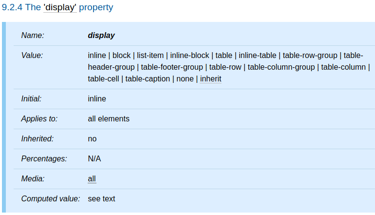

本篇將介紹 CSS 中的各種 `display` 屬性值。

<!-- more -->

## 前言

> 「重新認識 CSS」這個系列名稱的由來就如其名，我想要重新認識它。雖然以前就有學過 CSS，但這次想從 CSS Spec 中學到最原始的定義和內容，更加了解 CSS 的原理，讓我在切版的時候可以更加確定自己在做什麼，我踩到的雷只是因為我不夠了解它才會炸開。
> 
> 在這 30 天的內容中，會將 Spec 內看到的資料整理成這個系列，也希望正在學 CSS 的各位可以更加了解它。另外我也會同時將文章發至我的 Blog，如果想直接看文內的程式碼 Demo 畫面，可以到我的 Blog 來看 😃。
> 
> 本文同步發表於 iT 邦幫忙：[重新認識 CSS - display](https://ithelp.ithome.com.tw/articles/10225430)
> 
> 「重新認識 CSS」系列文章發文於：
> - [iT 邦幫忙](https://ithelp.ithome.com.tw/users/20117586/ironman/2617)
> - [Titangene Blog](https://titangene.github.io/tags/it-%E9%90%B5%E4%BA%BA%E8%B3%BD/)

## `display` 屬性

- `block`：使元素產生 principal block box
- `inline-block`：使元素產生 principal inline-level block container (inline-block 的內部被格式化為 block box，元素本身被格式化為 atomic inline-level box)
- `inline`：使元素產生一個或多個 inline box
- `list-item`：使元素 (例如：HTML 中的 `li` 元素) 產生 principal block box 和 marker box。有關列表的資訊和列表格式 (list formatting) 的範例，請參閱[列表](https://www.w3.org/TR/CSS22/generate.html#lists)的部分
- `none`：
  - 使元素不會出現在 [formatting structure](https://www.w3.org/TR/CSS22/intro.html#formatting-structure) 中 (也就是在 visual media 中，該元素不產生任何 box 且對佈局沒有影響)
  - descendant 元素也不產生任何 box
  - 元素及其內容將從 formatting structure 中完全刪除
  - 如果元素設為 `display: none` 時，其 descendant 元素無法用其他 `display` 屬性值來覆蓋父元素的 `display` 設定
  - 請注意，`display: none` 不會建立不可見的 box；它根本不會建立任何 box。CSS 包括使元素能夠在 formatting structure 中產生影響 formatting 但本身不可見的 box 的機制。有關詳細資訊，請查閱 [`visibility`](https://www.w3.org/TR/CSS22/visufx.html#visibility) 部分
- `table`、`inline-table`、`table-row-group`、`table-header-group`、`table-footer-group`、`table-row`、`table-column-group`、`table-column`、`table-cell`、`table-caption`：使元素的行為類似於表格元素

除了定位元素、float 元素 (請參閱 [`display`、`position` 和 `float` 之間的關係](https://www.w3.org/TR/CSS22/visuren.html#dis-pos-flo)) 和 root 元素之外，computed value 與 specified value 相同。對於 root 元素，computed value 將按照 [`display`、`position` 和 `float` 之間的關係](https://www.w3.org/TR/CSS22/visuren.html#dis-pos-flo)部分中所述進行變更。

請注意，儘管 `display` 的 initial value 為 `inline`，但 UA 的預設樣式表中的規則可能會覆蓋該值。請參閱附錄中的 [HTML 4 範例樣式表](https://www.w3.org/TR/CSS22/sample.html)。

資料來源：
- [CSS 2.2 - 9.2.4. The `display` property](https://www.w3.org/TR/CSS22/visuren.html#propdef-display)
- [CSS Display Module Level 3](https://www.w3.org/TR/css-display/)