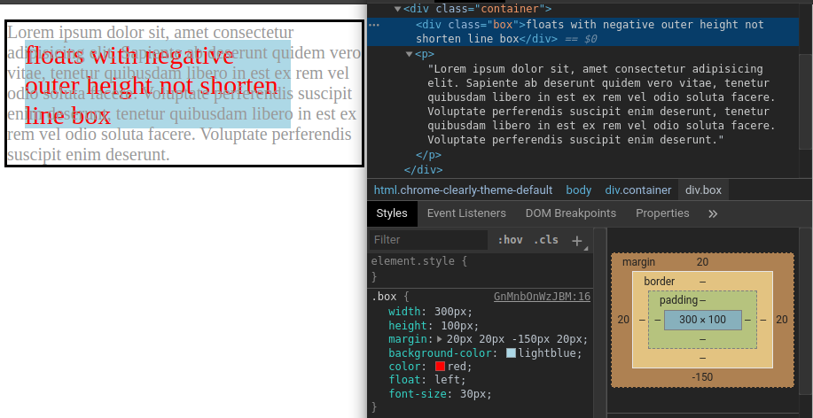
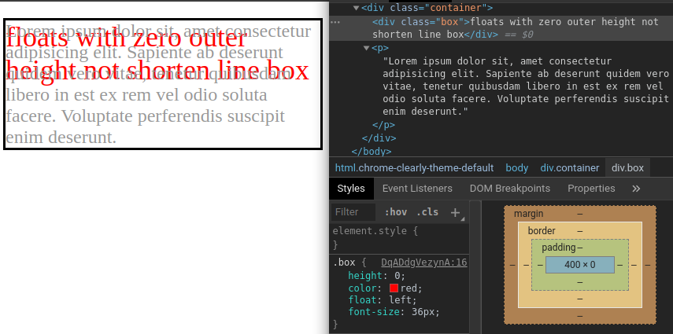

本篇將介紹 CSS 的 `float` 屬性。

<!-- more -->

## 前言

> 「重新認識 CSS」這個系列名稱的由來就如其名，我想要重新認識它。雖然以前就有學過 CSS，但這次想從 CSS Spec 中學到最原始的定義和內容，更加了解 CSS 的原理，讓我在切版的時候可以更加確定自己在做什麼，我踩到的雷只是因為我不夠了解它才會炸開。
> 
> 在這 30 天的內容中，會將 Spec 內看到的資料整理成這個系列，也希望正在學 CSS 的各位可以更加了解它。另外我也會同時將文章發至我的 Blog，如果想直接看文內的程式碼 Demo 畫面，可以到我的 Blog 來看 😃。
> 
> 本文同步發表於 iT 邦幫忙：[重新認識 CSS - float](https://ithelp.ithome.com.tw/articles/10226157)
> 
> 「重新認識 CSS」系列文章發文於：
> - [iT 邦幫忙](https://ithelp.ithome.com.tw/users/20117586/ironman/2617)
> - [Titangene Blog](https://titangene.github.io/tags/it-%E9%90%B5%E4%BA%BA%E8%B3%BD/)

原本 `float` 屬性是為了可以實作出簡單的文書排版，例如：報紙中的文繞圖。如下圖：


> 圖片來源：[Wikipedia](https://zh.wikipedia.org/wiki/File:Newspaper_fatima_353.jpg)

## `float` 的特性

box 會先根據 normal flow 來佈局，然後 box 會脫離 normal flow，並將 box 在該行 (current line) 向左或向右移動，直到 box 的外邊緣 (outer edge) 接觸到 containing block 的邊緣或另一個 float 的外邊緣。float box 的外部頂端 (outer top) 與當前 line box 的頂端對齊。

如果水平空間沒有空間可以 float，就會將 box 向下移動，直到有適合 (fits) 的空間或不再有 float 為止。

因為 float box 脫離了 normal flow，所以在 float box 之前和之後建立的 non-positioned block box 會以垂直排列，就很像 float box 不存在一樣。

跟 float 元素在同一個 line box 或之後的 line box 都會因 float 元素而縮短 (shortened) line box，如果 float 元素有設定 `margin`，line box 也會縮短 margin box 所佔用的空間。

當垂直位置滿足以下所有四個條件時，line box 會與 float 相鄰：
1. 在 line box 頂端或之下
2. 在 line box 底部或之上
3. 在 float 的 top margin edge 之下
4. 在 float 的 bottom margin edge 之上

而 float box 的內容會沿著 float box 的那一側排列 (flow along its side)，可以透過 `clear` 屬性來禁止此行為：
- `float: left`：內容從 left-floated box 的右側往下排列
- `float: right`：內容從 right-floated box 的左側往下排列

### float box 不會縮短 line box 的情況

以下狀況 float box 不會縮短 line box：
- 外部高度 (outer height) 為 0
- 外部高度為負數

直接看範例，下面是外部高度為負數的範例：

```html
<div class="container">
  <div class="box">floats with negative outer height not shorten line box</div>
  <p>Lorem ipsum dolor sit...</p>
</div>
```

```css
.container {
  width: 400px;
  outline: 3px solid black;
  font-size: 20px;
  color: #999;
}
.box {
  width: 300px;
  height: 100px;
  margin: 20px 20px -150px 20px;
  background-color: lightblue;
  color: red;
  float: left;
  font-size: 30px;
}
```

Demo：[Codepen 連結](https://codepen.io/titangene/pen/oNNgmEm)

`.box` 元素：
- `height` 為 100px
- `margin-top` 為 20px
- `margin-bottom` 為 -150px

所以 `.box` 元素的外部高度計算為 `100 + 20 - 150 = -10px`，因此外部高度為負數。如下圖結果，就算 `.box` 元素有設定 `float: left` 也不會縮短 line box：



<iframe height="265" style="width: 100%;" scrolling="no" title="floats with negative outer height not shorten line box" src="https://codepen.io/titangene/embed/oNNgmEm?height=265&theme-id=dark&default-tab=html,result" frameborder="no" allowtransparency="true" allowfullscreen="true">
  See the Pen <a href='https://codepen.io/titangene/pen/oNNgmEm'>floats with negative outer height not shorten line box</a> by Titangene
  (<a href='https://codepen.io/titangene'>@titangene</a>) on <a href='https://codepen.io'>CodePen</a>.
</iframe>

接著是外部高度為 0 的範例：

```html
<div class="container">
  <div class="box">floats with zero outer height not shorten line box</div>
  <p>Lorem ipsum dolor sit...</p>
</div>
```

```css
.container {
  width: 400px;
  outline: 3px solid black;
  font-size: 24px;
  color: #999;
}
.box {
  height: 0;
  color: red;
  float: left;
  font-size: 36px;
}
```

Demo：[Codepen 連結](https://codepen.io/titangene/pen/MWWYLXE)

因為 `.box` 元素的 `height` 為 0，而且也沒有設定 `margin`，所以 `.box` 元素的外部高度為 0。如下圖結果，就算 `.box` 元素有設定 `float: left` 也不會縮短 line box：



<iframe height="265" style="width: 100%;" scrolling="no" title="floats with zero outer height not shorten line box" src="https://codepen.io/titangene/embed/MWWYLXE?height=265&theme-id=dark&default-tab=css,result" frameborder="no" allowtransparency="true" allowfullscreen="true">
  See the Pen <a href='https://codepen.io/titangene/pen/MWWYLXE'>floats with zero outer height not shorten line box</a> by Titangene
  (<a href='https://codepen.io/titangene'>@titangene</a>) on <a href='https://codepen.io'>CodePen</a>.
</iframe>