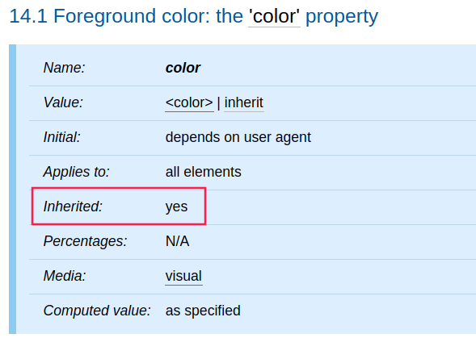

今天來介紹 CSS 的 Inheritance (繼承) 以及 `inherit` 這個關鍵字的屬性值。

<!-- more -->

## 前言

> 「重新認識 CSS」這個系列名稱的由來就如其名，我想要重新認識它。雖然以前就有學過 CSS，但這次想從 CSS Spec 中學到最原始的定義和內容，更加了解 CSS 的原理，讓我在切版的時候可以更加確定自己在做什麼，我踩到的雷只是因為我不夠了解它才會炸開。
> 
> 在這 30 天的內容中，會將 Spec 內看到的資料整理成這個系列，也希望正在學 CSS 的各位可以更加了解它。另外我也會同時將文章發至我的 Blog，如果想直接看文內的程式碼 Demo 畫面，可以到我的 Blog 來看 😃。
>
> 本文同步發表於 iT 邦幫忙：[重新認識 CSS - Inheritance (繼承)](https://ithelp.ithome.com.tw/articles/10219679)
> 
> 「重新認識 CSS」系列文章發文於：
> - [iT 邦幫忙](https://ithelp.ithome.com.tw/users/20117586/ironman/2617)
> - [Titangene Blog](https://titangene.github.io/tags/it-%E9%90%B5%E4%BA%BA%E8%B3%BD/)

## Inheritance (繼承)

某些值是由 document tree 中的元素的 children 繼承。每個屬性都[定義](https://www.w3.org/TR/CSS22/about.html#property-defs)了是否繼承。

像下圖是 [`color`](https://www.w3.org/TR/CSS22/colors.html#propdef-color) 屬性的定義，可以看到在 `Inherited` 欄位中是定義為可被繼承：



例如：下面範例中，如果沒有在 `em` 元素設定 `color` 屬性，就會繼承 `h1` 元素的 `color` 屬性：

```html
<h1>The headline <em>is</em> important!</h1>
```

如果 `h1` 元素的 `color` 設為藍色，那 `em` 元素的 `color` 也會是藍色：

```css
h1 { color: blue; }
```

發生繼承時，元素會繼承 computed value。來自父元素的 computed value 會同時成為子元素上的 specified value 和 computed value。

例如以下範例：

- `h1` 元素的 `font-size` 屬性的 computed value 會是 13px ( `130% x 10px`，也就是使用父元素 `body` 的 `font-size` 屬性值：`10px`，乘上 `h1` 元素的 `130%` )
- `em` 元素繼承了 `h1` 元素的 `font-size` 屬性的 computed value，因此 `em` 元素也會是 `13px` 的 computed value
- 如果 UA 沒有可用的 `13px` 字體，則 `h1` 和 `em` 元素的 `font-size` 的 actual value 可能會是 `12px` (例如：瀏覽器預設最小字體為 `12px` )

```html
<body>
  <h1>A <em>large</em> heading</h1>
</body>
```

```css
body { font-size: 10px; }
h1 { font-size: 130%; }
```

### 繼承屬性值：`inherit`

每個屬性都可以使用 `inherit` 這個繼承屬性值，只要設定了這個值，該屬性就會將元素的 parent 的 computed value 作為 specified value，也就是說，`inherit` 這個值是用於強制繼承，也可用於原本在屬性定義表中定義為 `Inherited: no` 的屬性，讓該屬性變成可繼承的父元素。

如果在 root 元素的屬性上設定了 `inherit` 值，則會為該屬性設定其 initial value。

例如：
- 在 `body` 元素上設定了 [`color`](https://www.w3.org/TR/CSS22/colors.html#propdef-color) 和 [`background`](https://www.w3.org/TR/CSS22/colors.html#propdef-background) 屬性
- 所有其他元素的 `color` 屬性設為 `inherit`，並且 `background` 屬性設為 `transparent` (也就是透明背景)

```css
body {
  color: black !important; 
  background: white !important;
}
* { 
  color: inherit !important; 
  background: transparent !important;
}
```

如果上面這些規則都是使用者的 style sheet，則會在整個文件中強制使用白底黑字 (因為其他元素的 `color` 屬性會繼承 `body` 元素的黑色，而其他元素都被設為透明色的背景)。

資料來源：
- [CSS 2.2 - 6. Assigning property values, Cascading, and Inheritance](https://www.w3.org/TR/CSS22/cascade.html)
- [CSS Cascading and Inheritance Level 3](https://www.w3.org/TR/css-cascade-3/)