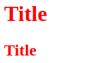

CSS 是 Cascading Style Sheets 的縮寫，是一種 style sheet (樣式表) 語言，可將自訂的樣式 (例如：字體、顏色) 附加在 HTML 文件上。這篇會先簡介 CSS，以及如何在 HTML 設定 CSS。

<!-- more -->

## 前言

> 「重新認識 CSS」這個系列名稱的由來就如其名，我想要重新認識它。雖然以前就有學過 CSS，但這次想從 CSS Spec 中學到最原始的定義和內容，更加了解 CSS 的原理，讓我在切版的時候可以更加確定自己在做什麼，我踩到的雷只是因為我不夠了解它才會炸開。
> 
> 在這 30 天的內容中，會將 Spec 內看到的資料整理成這個系列，也希望正在學 CSS 的各位可以更加了解它。另外我也會同時將文章發至我的 Blog，如果想直接看文內的程式碼 Demo 畫面，可以到我的 Blog 來看 😃。

CSS 規則是由 selector 和宣告 (declaration) 組成，以下面程式碼的 CSS 規則為例，`h1` 就是 selector，`color: red` 就是宣告。在 HTML 中，元素名稱不分大小寫，例如：`H1` 和 `h1` 相同，但通常會寫小寫。

宣告又由屬性名稱和屬性值組成，以下面程式碼為例，`color` 就是屬性名稱，`red` 就是屬性值。

```html
<!DOCTYPE html>
<html>
  <head>
    <title>Document</title>
  </head>
  <body>
    <h1>Title</h1>
  </body>
</html>
```

```css
h1 { color: red; }
```

## 在 HTML 設定 CSS

要在 HTML 內設定 CSS 有三種方法：
- Inline CSS：元素上的 `style` 屬性
- Internal CSS：`style` 元素
- External CSS：`link` 元素引入外部 CSS

### Inline CSS：元素上的 `style` 屬性

- 在指定的元素上透過 `style` 屬性來設定 CSS 樣式
- 相同的樣式無法共用，如果要在不同元素設定相同的樣式，就需要在每個元素上設定 `style` 屬性
- CSS 樣式與 HTML 結構寫在一起，可讀性差，不建議這樣寫

```html
<!DOCTYPE html>
<html>
  <head>
    <title>Document</title>
  </head>
  <body>
    <h1 style="color: red;">Title</h1>
    <h2 style="color: red;">Title</h2>
  </body>
</html>
```

Demo：



<iframe height="214" style="width: 100%;" scrolling="no" title="Inline CSS" src="https://codepen.io/titangene/embed/JjPBmzR/?height=214&theme-id=dark&default-tab=html,result" frameborder="no" allowtransparency="true" allowfullscreen="true">
  See the Pen <a href='https://codepen.io/titangene/pen/JjPBmzR/'>Inline CSS</a> by Titangene
  (<a href='https://codepen.io/titangene'>@titangene</a>) on <a href='https://codepen.io'>CodePen</a>.
</iframe>

### Internal CSS：`style` 元素

- 直接在 HTML 原始碼內利用 `style` 元素來設定 CSS
- 只能在單獨的 HTML 內使用 `style` 元素裡的樣式

```html
<!DOCTYPE html>
<html>
  <head>
    <title>Document</title>
    <style>
      h1 { color: red; }
    </style>
  </head>
  <body>
    <h1>Title</h1>
  </body>
</html>
```

Demo：


### External CSS：`link` 元素引入外部 CSS

- 使用 `link` 元素引入外部 CSS 檔案內的樣式
- 可將 HTML 與 CSS 的原始碼分開管理
  - 若要更改樣式，只要更換成其他 CSS 檔案或修改外部 CSS 檔案內的樣式
- 同一份 CSS 樣式可套用至多個 HTML 文件使用
- 常見會使用 CDN (Content Delivery Network)

[`link` 元素](https://html.spec.whatwg.org/multipage/semantics.html#the-link-element) 上的設定：
- 用 `rel` 屬性 (relationships) 設定連結類型：`stylesheet`
- 用 `href` 屬性 (hyperlink reference) 指定的 CSS 路徑

```html
<!DOCTYPE html>
<html>
  <head>
    <title>Document</title>
    <link rel="stylesheet" href="./style.css">
  </head>
  <body>
    <h1>Title</h1>
  </body>
</html>
```

下面內容為 `style.css`：

```css
h1 { color: red; }
```

Demo：


### Multiple Style Sheets

如果以不同的方式來對同一個元素設定樣式，則會使用最後設定的樣式。

例如：同時使用 internal CSS 和 external CSS 的方式設定 CSS：

```html
<!DOCTYPE html>
<html>
  <head>
    <title>Document</title>
    <link rel="stylesheet" href="./style.css" type="text/css">
    <style>
      h1 { color: green; }
    </style>
  </head>
  <body>
    <h1>Title</h1>
  </body>
</html>
```

下面內容為 `style.css`：

```css
h1 { color: red; }
```

那 `h1` 的顏色會是綠色：


如果更換 `style` 和 `link` 元素的順序，`h1` 的顏色則會是紅色：

```html
<!DOCTYPE html>
<html>
  <head>
    <title>Document</title>
    <style>
      h1 { color: green; }
    </style>
    <link rel="stylesheet" href="./style.css" type="text/css">
  </head>
  <body>
    <h1>Title</h1>
  </body>
</html>
```


資料來源：
- [Style Sheets in HTML documents](https://www.w3.org/TR/html401/present/styles.html)
- [HTML Standard - 4.2.4 The link element](https://html.spec.whatwg.org/multipage/semantics.html#the-link-element)