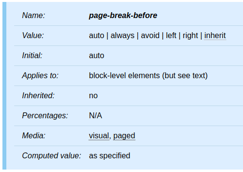
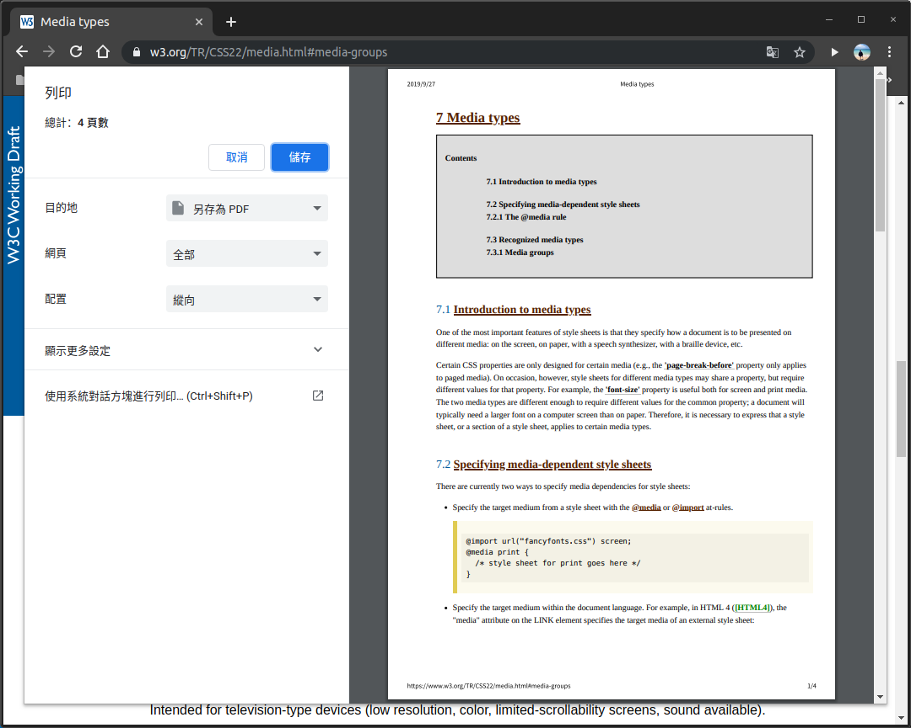

如果同將一份文件應用在不同的 media 上呈現，就可以使用 media type 來指定適用的 media。本篇將介紹 CSS 的 media type。

<!-- more -->

## 前言

> 「重新認識 CSS」這個系列名稱的由來就如其名，我想要重新認識它。雖然以前就有學過 CSS，但這次想從 CSS Spec 中學到最原始的定義和內容，更加了解 CSS 的原理，讓我在切版的時候可以更加確定自己在做什麼，我踩到的雷只是因為我不夠了解它才會炸開。
> 
> 在這 30 天的內容中，會將 Spec 內看到的資料整理成這個系列，也希望正在學 CSS 的各位可以更加了解它。另外我也會同時將文章發至我的 Blog，如果想直接看文內的程式碼 Demo 畫面，可以到我的 Blog 來看 😃。
>
> 本文同步發表於 iT 邦幫忙：[重新認識 CSS - Media type](https://ithelp.ithome.com.tw/articles/10221152)
> 
> 「重新認識 CSS」系列文章發文於：
> - [iT 邦幫忙](https://ithelp.ithome.com.tw/users/20117586/ironman/2617)
> - [Titangene Blog](https://titangene.github.io/tags/it-%E9%90%B5%E4%BA%BA%E8%B3%BD/)

有些 CSS 屬性只在某些 media 上適用，例如：[`page-break-before`](https://www.w3.org/TR/CSS22/page.html#propdef-page-break-before) 屬性僅適用於 `paged` media，而 `visual` 是 media group，如下圖：



不同 media type 的 style sheet 可以對同一個元素的同一個屬性進行設定，但是各屬性有不同的設定值。例如：`font-size` 在電腦螢幕上通常都會比在紙上還要大，所以可以在不同 media type 分別設定不同的字體大小。

## 指定與 media 相關的 style sheet

下面有幾種方法可以為 style sheet 指定 media：

1. 使用 `@media` 規則指定目標 media：

```css
@media screen {
  body { font-size: 10pt; }
}
@media print {
  body { font-size: 10pt; }
}
```

2. 使用 `@import` 規則指定目標 media：

```css
@import url("style.css") screen;
@import url("print.css") print;
```

3. 在 HTML 要引入 style sheet 時，在 `link` 元素上的 `media` 屬性指定外部 style sheet 的目標 media：

```html
<!DOCTYPE html>
<html>
  <head>
    <title>Document</title>
    <link rel="stylesheet" media="screen" href="./style.css">
    <link rel="stylesheet" media="print" href="./print.css">
  </head>
  <body>
    <h1>Title</h1>
  </body>
</html>
```

## `@media` 規則

可在同一個 style sheet 內，為各種 media 使用 style sheet 規則：

```css
@media print {
  body { font-size: 10pt; }
}
@media screen {
  body { font-size: 13px; }
}
@media screen, print {
  body { line-height: 1.2; }
}
```

## media type

常用的 media type：
- `all`：適用於所有裝置
- `screen`：主要用於彩色電腦螢幕 (包含手機和平版)
- `speech`：適用於語音合成器 (speech synthesizer)、語音朗讀裝置
- `print`：適用於 paged material 和在列印預覽模式下在螢幕上查看的文件，例如：用瀏覽器的「列印預覽」模式察看文件 (如下圖)



> `print` 的 paged media 部份可參閱 [CSS 2.2 - paged media](https://www.w3.org/TR/CSS22/page.html)。

:::info
在 [CSS 2.1](https://www.w3.org/TR/CSS2/media.html#media-types) 定義了其他幾種比較少見的 media type：`braille`、`embossed`、`handheld`、`projection`、`tty`、`tv` 和 `aural`，但這些 media type 在 [Media Queries Level 4](https://www.w3.org/TR/mediaqueries/#media-types) 已被棄用，所以不建議使用這些 media type。

當初在決定有哪些 media type 的時候，不同的 media type 有很大的區別，例如：`screen` 和 `handheld`，分別為電腦螢幕和手持裝置 (例如：PDA)，但後來這兩個的界線從愈來愈模糊，變成沒有界線。
:::

資料來源：
- [CSS 2.2 - 7. Media types](https://www.w3.org/TR/CSS22/media.html)
- [CSS 2.2 - 13. Paged media](https://www.w3.org/TR/CSS22/page.html#propdef-page-break-before)
- [Media Queries](https://www.w3.org/TR/css3-mediaqueries/)
- [Media Queries Level 4](https://www.w3.org/TR/mediaqueries/)