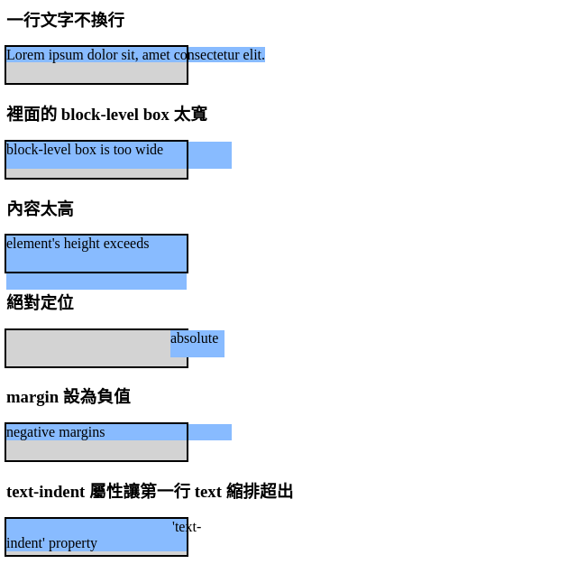
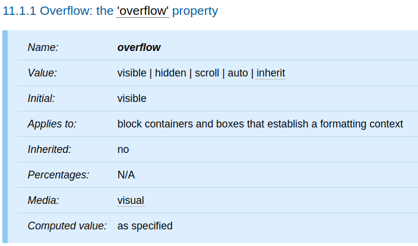

本篇將介紹 CSS 的 `overflow` 屬性。

<!-- more -->

## 前言

> 「重新認識 CSS」這個系列名稱的由來就如其名，我想要重新認識它。雖然以前就有學過 CSS，但這次想從 CSS Spec 中學到最原始的定義和內容，更加了解 CSS 的原理，讓我在切版的時候可以更加確定自己在做什麼，我踩到的雷只是因為我不夠了解它才會炸開。
> 
> 在這 30 天的內容中，會將 Spec 內看到的資料整理成這個系列，也希望正在學 CSS 的各位可以更加了解它。另外我也會同時將文章發至我的 Blog，如果想直接看文內的程式碼 Demo 畫面，可以到我的 Blog 來看 😃。
> 
> 本文同步發表於 iT 邦幫忙：[重新認識 CSS - overflow](https://ithelp.ithome.com.tw/articles/10227474)
> 
> 「重新認識 CSS」系列文章發文於：
> - [iT 邦幫忙](https://ithelp.ithome.com.tw/users/20117586/ironman/2617)
> - [Titangene Blog](https://titangene.github.io/tags/it-%E9%90%B5%E4%BA%BA%E8%B3%BD/)

## overflow 的情境

通常 block box 的內容僅限於 box 的 content edge。在某些情況下，box 可能會 overflow (溢出)，代表 box 的部分或全部內容都位於 box 的外面，例如：

- 一行文字不換行，導致 line box 比 block box 還要寬
- 在 containing block 裡面的 block-level box 的寬度比 containing block 還寬 (也就是當元素的 `width` 屬性值設定大於 containing block 的寬度時會發生)
- 元素設定 `height` 屬性將 containing block 的高度設定成小於元素的內容高度 (也就是元素內容的高度大於 containing block 的高度，containing block 的高度由 `height` 屬性決定，而不是內容高度決定)
- descendant box 設定 `position: absolute` 時超出 containing block
- descendant box 將 `margin` 設為負值時超出 containing block
- 設定 `text-indent` 屬性導致第一行 text 縮排超出 containing block

下面根據上面這幾個狀況分別舉例，如以下範例：

```html
<h3>一行文字不換行</h3>
<div class="containing-block">
  <span class="inner not-wrap">Lorem ipsum dolor sit, amet consectetur elit.</span>
</div>

<h3>裡面的 block-level box 太寬</h3>
<div class="containing-block">
  <div class="inner box-too-wide">block-level box is too wide</div>
</div>

<h3>內容太高</h3>
<div class="containing-block">
  <div class="inner height-exceeds">element's height exceeds</div>
</div>

<h3>絕對定位</h3>
<div class="containing-block">
  <div class="inner absolute">absolute</div>
</div>

<h3>margin 設為負值</h3>
<div class="containing-block">
  <div class="inner negative-margins">negative margins</div>
</div>

<h3>text-indent 屬性讓第一行 text 縮排超出</h3>
<div class="containing-block">
  <div class="inner text-indent">'text-indent' property</div>
</div>
```

```css
.containing-block {
  width: 200px;
  height: 40px;
  outline: 2px solid;
  background-color: lightgray;
}
.inner {
  background-color: #8bf;
}
.not-wrap {
  white-space: nowrap;
}
.box-too-wide {
  width: 250px;
  height: 30px;
}
.height-exceeds {
  height: 60px;
}
.absolute {
  width: 60px;
  height: 30px;
  position: absolute;
  left: 190px;
}
.negative-margins {
  margin-right: -50px;
}
.text-indent {
  text-indent: 11.5rem;
}
```

Demo：[Codepen 連結](https://codepen.io/titangene/pen/zYYrZOe)



<iframe height="731" style="width: 100%;" scrolling="no" title="overflow 情境" src="https://codepen.io/titangene/embed/zYYrZOe?height=731&theme-id=dark&default-tab=css,result" frameborder="no" allowtransparency="true" allowfullscreen="true">
  See the Pen <a href='https://codepen.io/titangene/pen/zYYrZOe'>overflow 情境</a> by Titangene
  (<a href='https://codepen.io/titangene'>@titangene</a>) on <a href='https://codepen.io'>CodePen</a>.
</iframe>

## `overflow` 屬性

下面是 `overflow` 屬性的定義表：



此屬性指定 block container 元素的內容 overflow 元素 box 時是否被裁切。它會影響所有元素內容的裁切，但其 containing block 是該元素的 viewport 或 ancestor 的任何 descendant 元素 (及其各自的內容和 descendant) 除外。值具有以下含義：

- `visible`：內容沒有被裁切，也就是可以在 block box 外呈現
- `hidden`：內容被裁切，並且不應提供捲動 UI 來查看裁切區域之外的內容
- `scroll`：內容已被裁切，並且如果 UA 使用螢幕上可見的捲動機制 (例如：scroll bar 或 panner)，則無論該內容是否有內容，都應在 box 上顯示該機制被裁切。這避免了滾動條在動態環境中出現和消失的任何問題。指定此值且目標 medium 為 `print` 時，可能會列印出 overflow 的內容。在 table box 上使用時，此值與 `visible` 具有相同的含義
- `auto`：此值的行為取決於 UA，但應導致為 overflow 的 box 提供捲動機制。在 table box 上使用時，此值與 `visible` 具有相同的含義

資料來源：
- [話說 Overflow 是什麼呢？ - 每天來點 CSS Specification - iT 邦幫忙](https://ithelp.ithome.com.tw/articles/10224932)
- [CSS 2.2 - 11. Visual effects](https://www.w3.org/TR/CSS22/visufx.html)