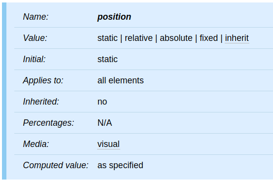

本篇將介紹 CSS 的 `position` 屬性，包括 `static`、`relative`、`absolute` 和 `fixed`。

<!-- more -->

## 前言

> 「重新認識 CSS」這個系列名稱的由來就如其名，我想要重新認識它。雖然以前就有學過 CSS，但這次想從 CSS Spec 中學到最原始的定義和內容，更加了解 CSS 的原理，讓我在切版的時候可以更加確定自己在做什麼，我踩到的雷只是因為我不夠了解它才會炸開。
> 
> 在這 30 天的內容中，會將 Spec 內看到的資料整理成這個系列，也希望正在學 CSS 的各位可以更加了解它。另外我也會同時將文章發至我的 Blog，如果想直接看文內的程式碼 Demo 畫面，可以到我的 Blog 來看 😃。
> 
> 本文同步發表於 iT 邦幫忙：[重新認識 CSS - position](https://ithelp.ithome.com.tw/articles/10225808)
> 
> 「重新認識 CSS」系列文章發文於：
> - [iT 邦幫忙](https://ithelp.ithome.com.tw/users/20117586/ironman/2617)
> - [Titangene Blog](https://titangene.github.io/tags/it-%E9%90%B5%E4%BA%BA%E8%B3%BD/)

## Positioning schemes (定位方案)

在 CSS 2.2 中，可根據三種定位方案對 box 進行佈局：
1. Normal flow：
  - block-level box 的 block formatting
  - inline-level box 的 inline formatting
  - block-level 和 inline-level box 的相對定位
2. Float：在 float model 中，box 會先根據 normal flow 來佈局，然後 box 會被移出 flow，並儘可能的向左或向右移動。內容可能會沿著 float 的那一側排列 (Content may flow along the side of a float.)
3. 絕對定位：在絕對定位 model 中，box 會從 normal flow 中完全刪除 (它不會影響到以後的 sibling)，並根據 containing block 來分配位置

如果一個元素是 float 的、絕對定位的或者是 root 元素，則該元素被稱為 out of flow。如果元素不是 out of flow，則稱為 in-flow。

## `position` 屬性

下面是 `position` 屬性的定義表：

圖片來源：[CSS 2.2 - 9.3.1. Choosing a positioning scheme: `position` property](https://www.w3.org/TR/CSS22/visuren.html#choose-position)

### `static`

- box 是 normal box，按照 normal flow 來佈局
- `top`、`right`、`bottom` 和 `left` 屬性不適用

### `relative`

- box 的位置是根據 normal flow 來計算的 (這稱為 normal flow 中的位置)，然後 box 相對於其正常位置 (normal position) 偏移
- 當 box B 相對定位時，計算下一個 box 的位置，就好像 B 沒有偏移一樣
- `position:relative` 對 `table-row-group`、`table-header-group`、`table-footer-group`、`table-row`、`table-column-group`、`table-column`、`table-cell`、`table-caption` 元素的影響未定義

### `absolute`

- box 的位置 (可能還有大小) 由 `top`、`right`、`bottom` 和 `left` 屬性指定
- 這些屬性指定相對於 box 的 [containing block](https://www.w3.org/TR/CSS22/visuren.html#containing-block) 的偏移量
- 絕對定位的 box 會從 normal flow 中取出，也就是說它們不會影響到以後的 sibling 的佈局
- 同樣，儘管絕對定位的 box 具有 margin，但它們不會與其他 margin  發生 collapsing margin

### `fixed`

- box 的位置是根據 `absolute` model 計算得出的，但除此之外，該 box 相對於某些參考是 fixed (固定的)
- 與 `absolute` model 一樣，box 的 margin 不會與其他任何 margin 一起 collapse
- 當 media type 為 `screen` 時，該 box 相對於 viewport 是 fixed，捲動時不會移動

資料來源：
- [CSS 2.2 - 9. Visual formatting model](https://www.w3.org/TR/CSS22/visuren.html)