Selector (選擇器) 可用來選擇 HTML 和 XML 文件中的節點，並將樣式屬性綁定到文件 (HTML 和 XML) 中的元素上。當選擇器與某元素 match 的時候，就可以對選到的元素進行 CSS 樣式設定。

<!-- more -->

## 前言

> 「重新認識 CSS」這個系列名稱的由來就如其名，我想要重新認識它。雖然以前就有學過 CSS，但這次想從 CSS Spec 中學到最原始的定義和內容，更加了解 CSS 的原理，讓我在切版的時候可以更加確定自己在做什麼，我踩到的雷只是因為我不夠了解它才會炸開。
> 
> 在這 30 天的內容中，會將 Spec 內看到的資料整理成這個系列，也希望正在學 CSS 的各位可以更加了解它。另外我也會同時將文章發至我的 Blog，如果想直接看文內的程式碼 Demo 畫面，可以到我的 Blog 來看 😃。
>
> 本文同步發表於 iT 邦幫忙：[重新認識 CSS - CSS Selector (前傳)](https://ithelp.ithome.com.tw/articles/10216566)
> 
> 「重新認識 CSS」系列文章發文於：
> - [iT 邦幫忙](https://ithelp.ithome.com.tw/users/20117586/ironman/2617)
> - [Titangene Blog](https://titangene.github.io/tags/it-%E9%90%B5%E4%BA%BA%E8%B3%BD/)

## Selector 語法

Selector 是由一個或多個 simple selector (簡單選擇器) 序列組合，並用 combinator 分隔的一串東西。

simple selector 序列：
- 由多個 simple selector 組成，沒有被 combinator 分隔
- 以 type selector 或 universal selector 為開頭

以下這些都是 simple selector：
- type selector：例如 `E`
- universal selector：例如 `*`
- attribute selector：例如 `E[foo]`
- class selector：例如 `.myclass`
- ID selector：例如 `#myid`
- pseudo-class：例如 `E:hover`

combinator 是 ` ` (空白字元)、`>`、`+`、`~`，例如：

```
E F { color: red; }
E > F { color: red; }
E + F { color: red; }
E ~ F { color: red; }
```

simple selector 與 combinator 之間可以加上空白，不加空白也可以。例如：下面兩個選擇器是相同的：

```
E > F
E>F
```

不過，通常在之間都會加空白，因為可讀性較佳。

## Groups of selector

當多個選擇器共享相同的宣告時，它們可以用逗號來分隔每個選擇器，每個選擇器都會選到 match 的所有元素，例如：

```html
<h1>header 1</h1>
<h2>header 2</h2>
<h3>header 3</h3>
```

```css
h1 { color: red; }
h2 { color: red; }
h3 { color: red; }
```

等同於：

```css
h1, h2, h3 { color: red; }
```

Demo：[Codepen 連結](https://codepen.io/titangene/pen/ExYevee)

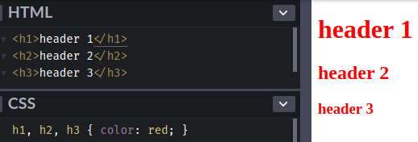

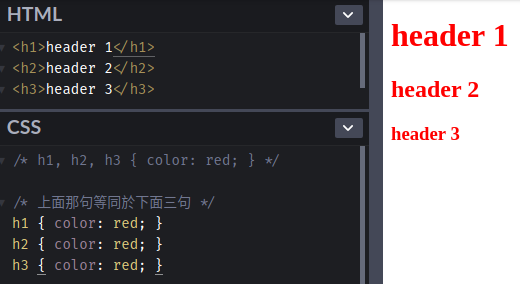

<iframe height="244" style="width: 100%;" scrolling="no" title="Groups of selector" src="https://codepen.io/titangene/embed/ExYevee/?height=244&theme-id=dark&default-tab=css,result" frameborder="no" allowtransparency="true" allowfullscreen="true">
  See the Pen <a href='https://codepen.io/titangene/pen/ExYevee/'>Groups of selector</a> by Titangene
  (<a href='https://codepen.io/titangene'>@titangene</a>) on <a href='https://codepen.io'>CodePen</a>.
</iframe>

不要要注意的是，上面兩個範例會有一樣的結果是因為所有選擇器都是有效的選擇器 (valid selector)。如果其中一個選擇器為無效時，就會讓整個選擇器群組都無效。不過，若將三個選擇器分開宣告時，就只有那一個會失效。例如：

```html
<h1>header 1</h1>
<h2>header 2</h2>
<h3>header 3</h3>
```

```css
h1 { color: red; }
h2..foo { color: red; }
h3 { color: red; }
```

不等於：

```css
h1, h2..foo, h3 { color: red; }
```

Demo：[Codepen 連結](https://codepen.io/titangene/pen/gOYdxQP)

如下圖，因為上面其中的 `h2..foo` 是無效選擇器 (invalid selector)，所以會造成 `h1, h2..foo, h3` 完全無效，並且會刪除這個樣式規則：

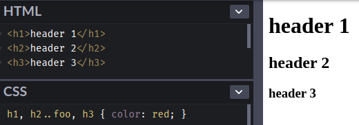

如果是分開宣告，就只會刪除 `h2..foo` 這個樣式規則，如下圖：

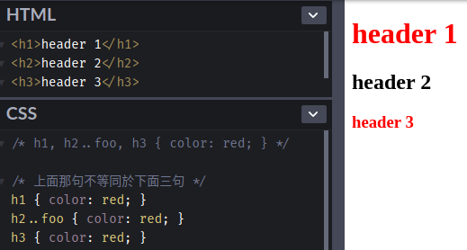

<iframe height="268" style="width: 100%;" scrolling="no" title="Groups of selector: valid selector" src="https://codepen.io/titangene/embed/gOYdxQP/?height=268&theme-id=dark&default-tab=css,result" frameborder="no" allowtransparency="true" allowfullscreen="true">
  See the Pen <a href='https://codepen.io/titangene/pen/gOYdxQP/'>Groups of selector: valid selector</a> by Titangene
  (<a href='https://codepen.io/titangene'>@titangene</a>) on <a href='https://codepen.io'>CodePen</a>.
</iframe>

## Simple selector

以下這些都是 simple selector：
- type selector
- universal selector
- attribute selector
- class selector
- ID selector
- pseudo-class

### Type selector

選到 HTML tag 名稱的元素，例如：match 所有 h1 元素：

```html
<h1>header 1</h1>
```

```css
h1 { color: red; }
```

Demo：[Codepen 連結](https://codepen.io/titangene/pen/JjPaMpm)

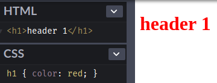

<iframe height="265" style="width: 100%;" scrolling="no" title="type selector" src="https://codepen.io/titangene/embed/JjPaMpm/?height=265&theme-id=dark&default-tab=css,result" frameborder="no" allowtransparency="true" allowfullscreen="true">
  See the Pen <a href='https://codepen.io/titangene/pen/JjPaMpm/'>type selector</a> by Titangene
  (<a href='https://codepen.io/titangene'>@titangene</a>) on <a href='https://codepen.io'>CodePen</a>.
</iframe>

### Universal Selector

Universal selector 是使用 `*` 來 match 任何元素。

例如：下面範例可以選到所有元素：

```html
<h1>header 1</h1>
<h2>header 2</h2>
<h3>header 3</h3>
<a href="https://titangene.github.io/">Titangene Blog</a>
```

```css
* { color: red; }
```

Demo：[Codepen 連結](https://codepen.io/titangene/pen/NWKLvQg)

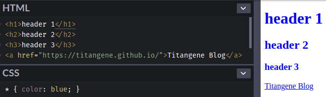

<iframe height="285" style="width: 100%;" scrolling="no" title="Universal Selector" src="https://codepen.io/titangene/embed/NWKLvQg/?height=285&theme-id=dark&default-tab=html,result" frameborder="no" allowtransparency="true" allowfullscreen="true">
  See the Pen <a href='https://codepen.io/titangene/pen/NWKLvQg/'>Universal Selector</a> by Titangene
  (<a href='https://codepen.io/titangene'>@titangene</a>) on <a href='https://codepen.io'>CodePen</a>.
</iframe>

### Class selector

如果要對多個元素需要相同的樣式時，就可以用 `class` 這個屬性來標識它們。在 CSS 是使用 `.` 來代表 class 屬性，也等同於 `~=` 表示法 (notation)，屬性值必須在 `.` 之後。例如：

```html
<h1>header 1</h1>
<h1 class="highlight">highlight header 1</h1>
```

```css
h1.highlight { color: red; }
```

等同於：

```css
h1[class~=highlight] { color: red; }
```

Demo：[Codepen 連結](https://codepen.io/titangene/pen/gOYdXOe)

第一個 `h1` 元素的字體顏色不會變成紅色，只有第二個 `h1` 元素才會變紅色：

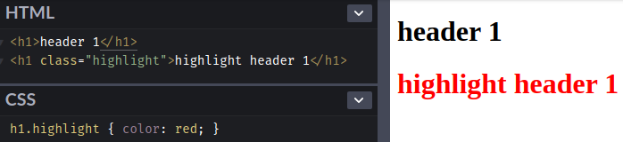

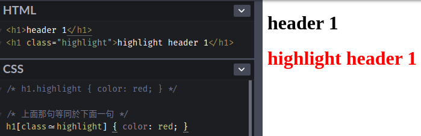

<iframe height="240" style="width: 100%;" scrolling="no" title="class selector" src="https://codepen.io/titangene/embed/gOYdXOe/?height=240&theme-id=dark&default-tab=css,result" frameborder="no" allowtransparency="true" allowfullscreen="true">
  See the Pen <a href='https://codepen.io/titangene/pen/gOYdXOe/'>class selector</a> by Titangene
  (<a href='https://codepen.io/titangene'>@titangene</a>) on <a href='https://codepen.io'>CodePen</a>.
</iframe>

如果只單獨使用 class selector (也就是 `.` )，也等同於在前面加上 universal selector (也就是 `*` )。例如：

```html
<h1>header 1</h1>
<h1 class="highlight">highlight header 1</h1>
<h2>header 2</h2>
<h2 class="highlight">highlight header 2</h2>
```

```css
*.highlight { color: red; }
```

```css
.highlight { color: red; }
```

Demo：[Codepen 連結](https://codepen.io/titangene/pen/GRKXOZx)

第一個 `h1` 和 `h2` 元素的字體顏色不會變成紅色，只有第二個 `h1` 和 `h2` 元素才會變紅色：

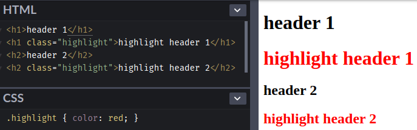

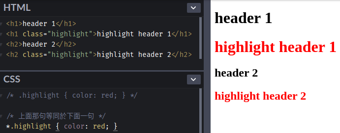

<iframe height="320" style="width: 100%;" scrolling="no" title="class selector &amp; universal selector" src="https://codepen.io/titangene/embed/GRKXOZx/?height=320&theme-id=dark&default-tab=html,result" frameborder="no" allowtransparency="true" allowfullscreen="true">
  See the Pen <a href='https://codepen.io/titangene/pen/GRKXOZx/'>class selector &amp; universal selector</a> by Titangene
  (<a href='https://codepen.io/titangene'>@titangene</a>) on <a href='https://codepen.io'>CodePen</a>.
</iframe>

如果需要同時指定某元素上的兩個 class，可以寫成這樣：

```html
<h1>header 1</h1>
<h1 class="text-primary highlight">highlight header 1</h1>
<h2>header 2</h2>
<h2 class="highlight">highlight header 2</h2>
```

```css
.text-primary.highlight { color: red; }
```

:::info
註：在 HTML 要對某元素上同時設定多個 class，是使用空白字元來分隔多個 class。以上面範例來說，第二個 `h1` 上有兩個 class，分別是 `text-primary` 和 `highlight`。
:::

Demo：[Codepen 連結](https://codepen.io/titangene/pen/WNegdxr)

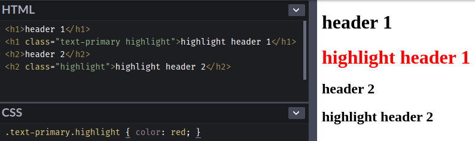

<iframe height="320" style="width: 100%;" scrolling="no" title="multi class selector" src="https://codepen.io/titangene/embed/WNegdxr/?height=320&theme-id=dark&default-tab=html,result" frameborder="no" allowtransparency="true" allowfullscreen="true">
  See the Pen <a href='https://codepen.io/titangene/pen/WNegdxr/'>multi class selector</a> by Titangene
  (<a href='https://codepen.io/titangene'>@titangene</a>) on <a href='https://codepen.io'>CodePen</a>.
</iframe>

### ID selector

如果要對某個元素作唯一的標示，就可以用 `id` 這個屬性來標識它們。在 CSS 是使用 `#` 來代表 id 屬性，屬性值必須在 `#` 之後。例如：

```html
<h1>header 1</h1>
<h1 id="titan">header 1</h1>
<h2>header 2</h2>
<h2 id="titan">header 2</h2>
```

```css
#titan { color: red; }
```

Demo：[Codepen 連結](https://codepen.io/titangene/pen/GRKXyjb)

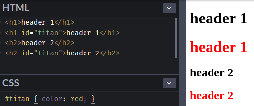

<iframe height="320" style="width: 100%;" scrolling="no" title="id selector" src="//codepen.io/titangene/embed/GRKXyjb/?height=320&theme-id=dark&default-tab=html,result" frameborder="no" allowtransparency="true" allowfullscreen="true">
  See the Pen <a href='https://codepen.io/titangene/pen/GRKXyjb/'>id selector</a> by Titangene
  (<a href='https://codepen.io/titangene'>@titangene</a>) on <a href='https://codepen.io'>CodePen</a>.
</iframe>

如果只想選擇帶有 `titan` 這個 id 的 `h2` 元素，可以寫成這樣：

```css
h2#titan { color: red; }
```

Demo：[Codepen 連結](https://codepen.io/titangene/pen/KKPxZma)

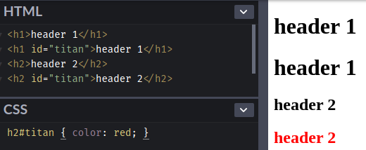

<iframe height="320" style="width: 100%;" scrolling="no" title="id selector: specific element" src="//codepen.io/titangene/embed/KKPxZma/?height=320&theme-id=dark&default-tab=html,result" frameborder="no" allowtransparency="true" allowfullscreen="true">
  See the Pen <a href='https://codepen.io/titangene/pen/KKPxZma/'>id selector: specific element</a> by Titangene
  (<a href='https://codepen.io/titangene'>@titangene</a>) on <a href='https://codepen.io'>CodePen</a>.
</iframe>

## 最後

今天介紹一些 simple selector，接下來幾天會接續介紹其他 selector。

資料來源：
- [CSS 2.2 Specification - Selectors](https://www.w3.org/TR/CSS22/selector.html)
- [Selectors Level 3](https://www.w3.org/TR/selectors-3/)
- [Selectors Level 4](https://www.w3.org/TR/selectors-4/)