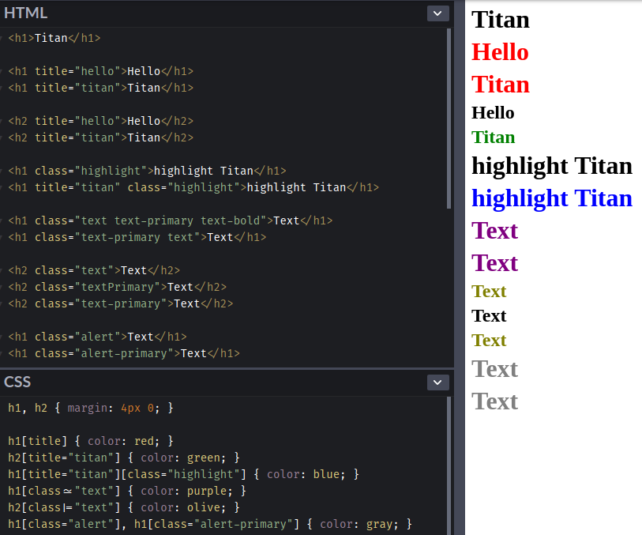
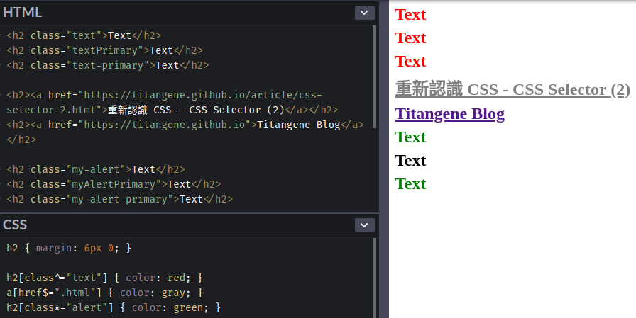

Selector (選擇器) 可用來選擇 HTML 和 XML 文件中的節點，並將樣式屬性綁定到文件 (HTML 和 XML) 中的元素上。當選擇器與某元素 match 的時候，就可以對選到的元素進行 CSS 樣式設定。本篇會介紹 attribute selector (屬性選擇器)。

<!-- more -->

## 前言

> 「重新認識 CSS」這個系列名稱的由來就如其名，我想要重新認識它。雖然以前就有學過 CSS，但這次想從 CSS Spec 中學到最原始的定義和內容，更加了解 CSS 的原理，讓我在切版的時候可以更加確定自己在做什麼，我踩到的雷只是因為我不夠了解它才會炸開。
> 
> 在這 30 天的內容中，會將 Spec 內看到的資料整理成這個系列，也希望正在學 CSS 的各位可以更加了解它。另外我也會同時將文章發至我的 Blog，如果想直接看文內的程式碼 Demo 畫面，可以到我的 Blog 來看 😃。
>
> 本文同步發表於 iT 邦幫忙：[重新認識 CSS - CSS Selector (2)](https://ithelp.ithome.com.tw/articles/10217082)
> 
> 「重新認識 CSS」系列文章發文於：
> - [iT 邦幫忙](https://ithelp.ithome.com.tw/users/20117586/ironman/2617)
> - [Titangene Blog](https://titangene.github.io/tags/it-%E9%90%B5%E4%BA%BA%E8%B3%BD/)

## Attribute selector

Selector 允許表示元素的屬性。當 selector 作為 expression (表達式) 來 match 元素時，如果該元素具有與 attribute selector (屬性選擇器) 表示的屬性 match 的屬性，則必須將 attribute selector 視為與元素 match。

### Attribute presence and value selector

[CSS2](https://www.w3.org/TR/CSS22/selector.html#attribute-selectors) 引入了四個 attribute selector：
- `[att]`：代表具有 `att` 屬性的元素，無論屬性的值為何
- `[att=val]`：代表具有 `att` 屬性的元素，且該屬性值為 `val`
- `[att~=val]`：代表具有 `att` 屬性的元素，該屬性的值是以空格分隔的單詞列表，其中一個正好是 `val`
  - 如果 `val` 包含空格，就不代表任何內容 (因為單字之間是用空格來分隔)
  - 如果 `val` 是空字串，就不代表任何內容
- `[att|=val]`：代表具有 `att` 屬性的元素，且該屬性值為 `val` 或以 `val` 為開頭，後面接著 `-` (也就是以 `val-` 為開頭)

直接看範例：

```html
<h1>Titan</h1>

<h1 title="hello">Hello</h1>
<h1 title="titan">Titan</h1>

<h2 title="hello">Hello</h2>
<h2 title="titan">Titan</h2>

<h1 class="highlight">highlight Titan</h1>
<h1 title="titan" class="highlight">highlight Titan</h1>

<h1 class="text text-primary text-bold">Text</h1>
<h1 class="text-primary text">Text</h1>

<h2 class="text">Text</h2>
<h2 class="textPrimary">Text</h2>
<h2 class="text-primary">Text</h2>

<h1 class="alert">Text</h1>
<h1 class="alert-primary">Text</h1>
```

```css
h1[title] { color: red; }
h2[title="titan"] { color: green; }
h1[title="titan"][class="highlight"] { color: blue; }
h1[class~="text"] { color: purple; }
h2[class|="text"] { color: olive; }
h1[class="alert"], h1[class="alert-primary"] { color: gray; }
```

- `h1[title]`：帶有 `title` 屬性的 `h1` 元素
- `h2[title="titan"]`：帶有 `title` 屬性的 `h2` 元素，並且該屬性值為 `titan`
- `h1[title="titan"][class="highlight"]`：帶有 `title` 和 `class` 屬性的 `h1` 元素，並且 `title` 的屬性值為 `titan` 以及 `class` 屬性值為 `highlight`
- `h1[class~="text"]`：帶有 `class` 屬性的 `h1` 元素，並且該屬性值需包含 `text`
- `h2[class|="text"]`：帶有 `class` 屬性的 `h2` 元素，並且該屬性值為需為 `text` 或以 `text-` 為開頭
- `h1[class="alert"], h1[class="alert-primary"]`：帶有 `class` 屬性的 `h1` 元素，並且該屬性值為 `alert`，以及帶有 `class` 屬性的 `h1` 元素，並且該屬性值為 `alert-primary`

:::info
註：`[title="titan"]` 中的 `title` 是屬性名稱，`titan` 是名為 `title` 的屬性值。
:::

Demo：[Codepen 連結](https://codepen.io/titangene/pen/MWgPyyG)



<iframe height="590" style="width: 100%;" scrolling="no" title="Attribute presence and value selectors" src="https://codepen.io/titangene/embed/MWgPyyG/?height=590&theme-id=dark&default-tab=html,result" frameborder="no" allowtransparency="true" allowfullscreen="true">
  See the Pen <a href='https://codepen.io/titangene/pen/MWgPyyG/'>Attribute presence and value selectors</a> by Titangene
  (<a href='https://codepen.io/titangene'>@titangene</a>) on <a href='https://codepen.io'>CodePen</a>.
</iframe>

### Substring matching attribute selector

在 [Selectors Level 3](https://www.w3.org/TR/selectors-3/#attribute-substrings) 提供了三個額外的 attribute selector，用於 match 屬性值中的子字串：
- `[att^=val]`：代表具有 `att` 屬性的元素，該屬性值以 `val` 為開頭。如果 `val` 是空字串，則 selector 不代表任何內容
- `[att$=val]`：代表具有 `att` 屬性的元素，該屬性值以 `val` 為結尾。如果 `val` 是空字串，則 selector 不代表任何內容
- `[att*=val]`：代表具有 `att` 屬性的元素，該屬性值至少包含 `val` 這個子字串。如果 `val` 是空字串，則 selector 不代表任何內容

直接看範例：

```html
<h2 class="text">Text</h2>
<h2 class="textPrimary">Text</h2>
<h2 class="text-primary">Text</h2>

<h2><a href="https://titangene.github.io/article/css-selector-2.html">重新認識 CSS - CSS Selector (2)</a></h2>
<h2><a href="https://titangene.github.io">Titangene Blog</a></h2>

<h2 class="my-alert">Text</h2>
<h2 class="myAlertPrimary">Text</h2>
<h2 class="my-alert-primary">Text</h2>
```

```css
h2[class^="text"] { color: red; }
a[href$=".html"] { color: gray; }
h2[class*="alert"] { color: green; }
```

- `h2[class^="text"]`：代表具有 `class` 屬性的元素，該屬性值以 `text` 為開頭
- `a[href$=".html"]`：代表具有 `href` 屬性的元素，該屬性值以 `.html` 為結尾 (也就是該頁面為 `.html` 檔)
- `h2[class*="alert"]`：代表具有 `class` 屬性的元素，該屬性值至少包含 `alert` 這個子字串

Demo：[Codepen 連結](https://codepen.io/titangene/pen/vYBVKEm)



<iframe height="383" style="width: 100%;" scrolling="no" title="Substring matching attribute selectors" src="https://codepen.io/titangene/embed/vYBVKEm/?height=383&theme-id=dark&default-tab=html,result" frameborder="no" allowtransparency="true" allowfullscreen="true">
  See the Pen <a href='https://codepen.io/titangene/pen/vYBVKEm/'>Substring matching attribute selectors</a> by Titangene
  (<a href='https://codepen.io/titangene'>@titangene</a>) on <a href='https://codepen.io'>CodePen</a>.
</iframe>

## 最後

今天介紹一些 attribute selector，接下來幾天會接續介紹其他 selector。

資料來源：
- [CSS 2.2 Specification - Selectors](https://www.w3.org/TR/CSS22/selector.html)
- [Selectors Level 3](https://www.w3.org/TR/selectors-3/)
- [Selectors Level 4](https://www.w3.org/TR/selectors-4/)