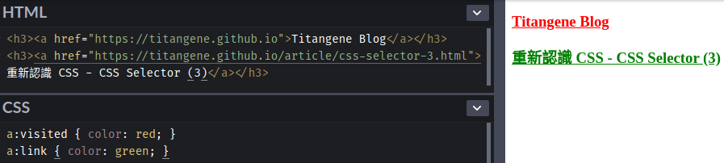
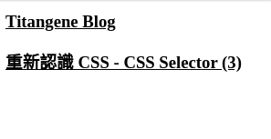
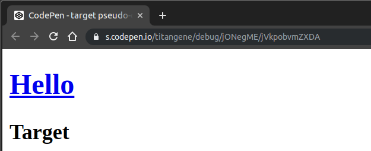
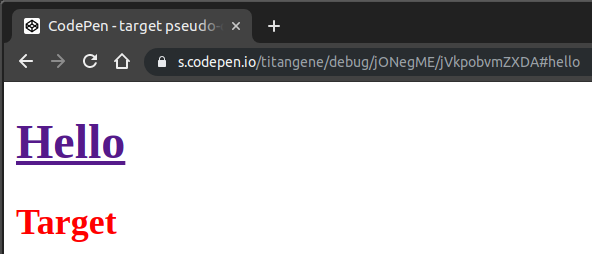
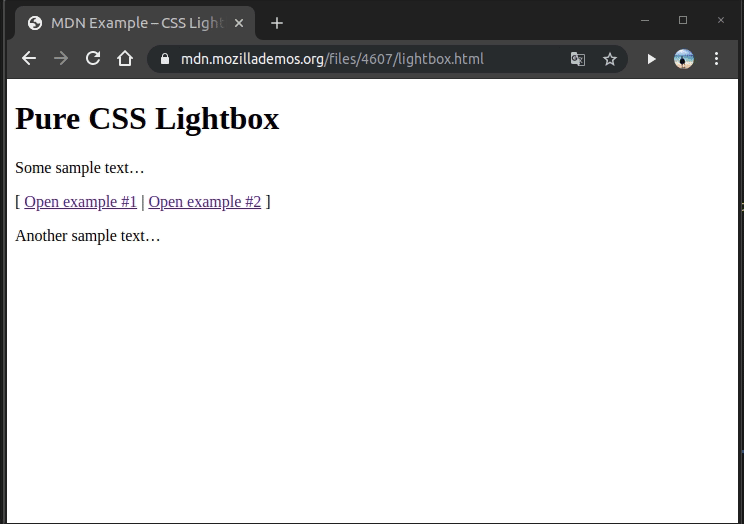
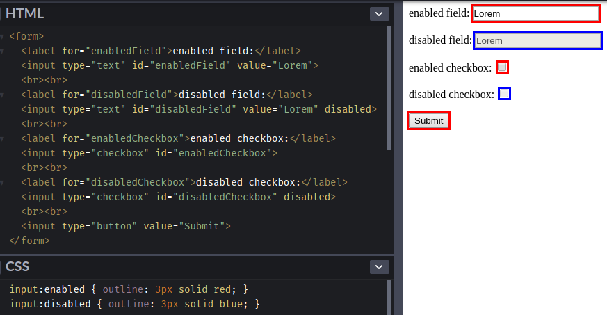
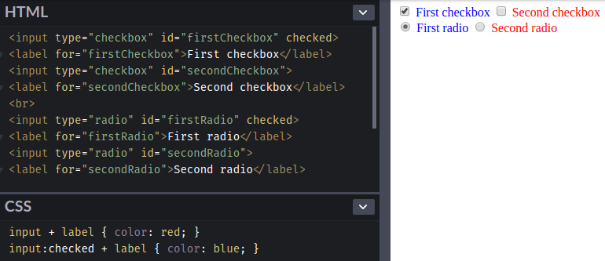

Selector (選擇器) 可用來選擇 HTML 和 XML 文件中的節點，並將樣式屬性綁定到文件 (HTML 和 XML) 中的元素上。當選擇器與某元素 match 的時候，就可以對選到的元素進行 CSS 樣式設定。本篇會介紹 pseudo-class (偽類)。

<!-- more -->

## 前言

> 「重新認識 CSS」這個系列名稱的由來就如其名，我想要重新認識它。雖然以前就有學過 CSS，但這次想從 CSS Spec 中學到最原始的定義和內容，更加了解 CSS 的原理，讓我在切版的時候可以更加確定自己在做什麼，我踩到的雷只是因為我不夠了解它才會炸開。
> 
> 在這 30 天的內容中，會將 Spec 內看到的資料整理成這個系列，也希望正在學 CSS 的各位可以更加了解它。另外我也會同時將文章發至我的 Blog，如果想直接看文內的程式碼 Demo 畫面，可以到我的 Blog 來看 😃。
>
> 本文同步發表於 iT 邦幫忙：[重新認識 CSS - Pseudo-class (偽類) (1)](https://ithelp.ithome.com.tw/articles/10217730)
> 
> 「重新認識 CSS」系列文章發文於：
> - [iT 邦幫忙](https://ithelp.ithome.com.tw/users/20117586/ironman/2617)
> - [Titangene Blog](https://titangene.github.io/tags/it-%E9%90%B5%E4%BA%BA%E8%B3%BD/)

之前有提到以下這些都是 simple selector：
- type selector
- universal selector
- attribute selector
- class selector
- ID selector
- pseudo-class

> 本篇會介紹 pseudo-class，如果想了解其他 simple selector 可參閱之前介紹的「[重新認識 CSS - Simple Selector & Groups of selector](https://ithelp.ithome.com.tw/articles/10216566)」。

## Pseudo-classes

pseudo-class 是以 `:` 為開頭，後面接著 pseudo-class 的名稱，有些會在後面加上括號 `()`，並在括號之間加上值。例如：`:nth-child(2)`。

:::warning
注意：
- pseudo-class 和 pseudo-element 不相同
- pseudo-class 是以 `:` 為開頭
- pseudo-element 是以 `::` 為開頭，但也可以以 `:` 為開頭，因為在舊版的 W3C Spec 中沒有將 pseudo-class 和 pseudo-element 區分成 `:` 和 `::`。如果你寫 pseudo-element 是用 `:`，大部份瀏覽器也還是會支援這種語法。
:::

### Dynamic pseudo-classes

Dynamic pseudo-classes 不會出現在 document source 或 document tree 中。

Dynamic pseudo-classes 又分為：
- link pseudo-classes：`:link` 和 `:visited`
- user action pseudo-classes：`:hover`、`:active` 和 `:focus`

#### The link pseudo-classes：`:link` 和 `:visited`
[UA](https://www.w3.org/TR/CSS22/conform.html#user-agent) (User agent，對 HTML 來說就是瀏覽器) 以不同的方式來顯示連結是否已訪問：
- `:link`：未訪問過的連結
- `:visited`：已訪問過的連結

不過，過了一段時間之後，UA 可以將已訪問的連結從 `:visited` 變回 `:link` 的狀態。

```html
<h3><a href="https://titangene.github.io">Titangene Blog</a></h3>
<h3><a href="https://titangene.github.io/article/css-selector-pseudo-class-1.html">重新認識 CSS - CSS Selector (3)</a></h3>
```

```css
a:visited { color: red; }
a:link { color: green; }
```

Demo：[Codepen 連結](https://codepen.io/titangene/pen/jONejbv)



<iframe height="215" style="width: 100%;" scrolling="no" title="link pseudo-class: :visited &amp; :link" src="https://codepen.io/titangene/embed/jONejbv/?height=215&theme-id=dark&default-tab=html,result" frameborder="no" allowtransparency="true" allowfullscreen="true">
  See the Pen <a href='https://codepen.io/titangene/pen/jONejbv/'>link pseudo-class: :visited &amp; :link</a> by Titangene
  (<a href='https://codepen.io/titangene'>@titangene</a>) on <a href='https://codepen.io'>CodePen</a>.
</iframe>

#### The user action pseudo-classes：`:hover`、`:active` 和 `:focus`

用於 response 使用者的操作：
- `:hover`：
  - 當 cursor (滑鼠指標) hover 在元素上時，visual UA 就可以應用此 pseudo-class
  - 不支援 [互動式 media](https://www.w3.org/TR/CSS22/media.html#media-groups) 的 UA 不用支援此 pseudo-class
- `:active`：
  - 在使用者按下滑鼠按鈕並放開它之間的時間會應用此 pseudo-class
  - 如果滑鼠上有多個按鈕時，`:active` 只適用於主要或主要 actived 的按鈕 (通常為滑鼠左鍵) ...等
- `:focus`：當元素有焦點時會應用此 pseudo-class，例如：按鍵盤的 Tab 鍵所選到的元素

```html
<h3><a href="https://titangene.github.io">Titangene Blog</a></h3>
<h3><a href="https://titangene.github.io/article/css-selector-pseudo-class-1.html">重新認識 CSS - CSS Selector (3)</a></h3>
```

```css
a { color: black; }
a:hover { color: red; }
a:focus { color: gray; }
a:active { color: purple; }
```

Demo：[Codepen 連結](https://codepen.io/titangene/pen/YzKJobe)



<iframe height="227" style="width: 100%;" scrolling="no" title="user action pseudo-class" src="https://codepen.io/titangene/embed/YzKJobe/?height=227&theme-id=dark&default-tab=html,result" frameborder="no" allowtransparency="true" allowfullscreen="true">
  See the Pen <a href='https://codepen.io/titangene/pen/YzKJobe/'>user action pseudo-class</a> by Titangene
  (<a href='https://codepen.io/titangene'>@titangene</a>) on <a href='https://codepen.io'>CodePen</a>.
</iframe>

也可以一次使用多個 dynamic pseudo-class，如下範例：
- 同時有 `:focus` 和 `:hover` 的狀態
- 同時有 `:link` 和 `:active` 的狀態

```css
a:focus:hover { color: teal; }
a:link:active { color: fuchsia; }
```

### The target pseudo-classes：`:target`

有些 URI 的最後會以 `#` (number sign) 為結尾，後面會接著 anchor identifier (也稱為 fragment identifier)，代表該 URI 是指向資源中的某個位置。通常帶有 fragment identifier 的 URL 會 link 到文件中的某些元素，該元素被稱為 target 元素。

例如：在下面的 HTML 文件中有名為 `hello` 的 anchor (錨點) (也就是 `<a href="#hello">Hello</a>` 這個連結)：

```html
<h1><a href="#hello">Hello</a></h1>
<div id="hello">
  <h2>Target</h2>
</div>
```

```css
#hello:target { color: red; }
```

Demo：[Codepen 連結](https://codepen.io/titangene/pen/jONegME)

如果此 HTML 的 URL 為：

```
https://s.codepen.io/titangene/debug/jONegME/vWkRwRNmBvOM
```

在還沒點擊 `#hello` 錨點時，畫面如下：



只要點擊 `#hello` 錨點後，下面的 "Target" 文字就會變成紅色 (也就是會應用 `#hello:target` 的樣式)，畫面如下：



並且 URL 的最後會加上 `#hello`，而 `#hello` 就是 fragment identifier。

剛剛點擊的錨點會 link 到 target 元素，而 target 元素就是 `<div id="hello">`，所以 selector 才會 match 到 `#hello:target`。

<iframe height="227" style="width: 100%;" scrolling="no" title="target pseudo-classes :target" src="https://codepen.io/titangene/embed/jONegME/?height=227&theme-id=dark&default-tab=html,result" frameborder="no" allowtransparency="true" allowfullscreen="true">
  See the Pen <a href='https://codepen.io/titangene/pen/jONegME/'>target pseudo-classes :target</a> by Titangene
  (<a href='https://codepen.io/titangene'>@titangene</a>) on <a href='https://codepen.io'>CodePen</a>.
</iframe>

在 [MDN](https://developer.mozilla.org/zh-TW/docs/Web/CSS/:target#Creating_a_pure_CSS_lightbox) 有一個範例也蠻有趣的，可以用 `:target` pseudo-class 來實作 lightbox：



運作原理是用 `display: none` 和 `display: block` 來控制 lightbox 是否開啟，觸發的機制就是用剛剛介紹的 `:target` pseudo-class 來做的。

> 這個範例很有趣，以前用 JavaScript 才能做到的事情，沒想到也能用純 CSS 來實作出來。

### UI element states pseudo-classes

分為：
- `:enabled`：處於啟用狀態的 UI 元素
- `:disabled`：處於禁用狀態的 UI 元素
- `:checked`：選取 radio 或勾選 checkbox 元素時會應用

#### `:enabled` & `:disabled` pseudo-class

直接看範例：

```html
<form>
  <label for="enabledField">enabled field:</label>
  <input type="text" id="enabledField" value="Lorem">
  <br><br>
  <label for="disabledField">disabled field:</label>
  <input type="text" id="disabledField" value="Lorem" disabled>
  <br><br>
  <label for="enabledCheckbox">enabled checkbox:</label>
  <input type="checkbox" id="enabledCheckbox">
  <br><br>
  <label for="disabledCheckbox">disabled checkbox:</label>
  <input type="checkbox" id="disabledCheckbox" disabled>
  <br><br>
  <input type="button" value="Submit">
</form>
```

```css
input:enabled { outline: 3px solid red; }
input:disabled { outline: 3px solid blue; }
```

Demo：[Codepen 連結](https://codepen.io/titangene/pen/qBWQBEd)

只要被加上 `disabled` 屬性的 `input` 元素都代表該元素處於禁用狀態，所以這些元素就會套用 `input:disabled` 此 selector 的樣式。其餘的元素則會套用 `input:enabled` 此 selector 的樣式。



:::info
不過要注意的事元素有無啟用，跟一些會影響使用者互動 UI 元素的 CSS 屬性沒關係，這些都不會影響 selector 是否 match 到 `:enabled` 或 `:disabled`。

例如：`display` 和 `visibility` 屬性都會讓元素在畫面上消失，但是都不會影響到啟用或禁用的狀態。

- `display: none` 不會讓元素出現在 [formatting structure](https://www.w3.org/TR/CSS22/intro.html#formatting-structure) 中，很像不在畫面上，會完全消失
- `visibility: hidden` 生成的 box 是看不見的，完全透明，不會 draw 任何內容，但會影響佈局，也就是會在畫面上佔用空間，但會看不到元素的樣子
:::

<iframe height="299" style="width: 100%;" scrolling="no" title=":enabled and :disabled pseudo-classes" src="https://codepen.io/titangene/embed/qBWQBEd/?height=299&theme-id=dark&default-tab=css,result" frameborder="no" allowtransparency="true" allowfullscreen="true">
  See the Pen <a href='https://codepen.io/titangene/pen/qBWQBEd/'>:enabled and :disabled pseudo-classes</a> by Titangene
  (<a href='https://codepen.io/titangene'>@titangene</a>) on <a href='https://codepen.io'>CodePen</a>.
</iframe>

#### `:checked` pseudo-class

直接看範例：

```html
<input type="checkbox" id="firstCheckbox" checked>
<label for="firstCheckbox">First checkbox</label>
<input type="checkbox" id="secondCheckbox">
<label for="secondCheckbox">Second checkbox</label>
<br>
<input type="radio" id="firstRadio" checked>
<label for="firstRadio">First radio</label>
<input type="radio" id="secondRadio">
<label for="secondRadio">Second radio</label>
```

```css
input + label { color: red; }
input:checked + label { color: blue; }
```

Demo：[Codepen 連結](https://codepen.io/titangene/pen/vYBQYrW)



<iframe height="280" style="width: 100%;" scrolling="no" title=":checked pseudo-class" src="https://codepen.io/titangene/embed/vYBQYrW/?height=280&theme-id=dark&default-tab=html,result" frameborder="no" allowtransparency="true" allowfullscreen="true">
  See the Pen <a href='https://codepen.io/titangene/pen/vYBQYrW/'>:checked pseudo-class</a> by Titangene
  (<a href='https://codepen.io/titangene'>@titangene</a>) on <a href='https://codepen.io'>CodePen</a>.
</iframe>

## 最後

今天介紹一些 pseudo-class，接下來幾天會接續介紹其他 selector。

資料來源：
- [CSS 2.2 Specification - Selectors](https://www.w3.org/TR/CSS22/selector.html)
- [Selectors Level 3](https://www.w3.org/TR/selectors-3/)
- [Selectors Level 4](https://www.w3.org/TR/selectors-4/)
- [:target - CSS | MDN](https://developer.mozilla.org/zh-TW/docs/Web/CSS/:target)

> About MDN by Mozilla Contributors is licensed under CC-BY-SA 2.5