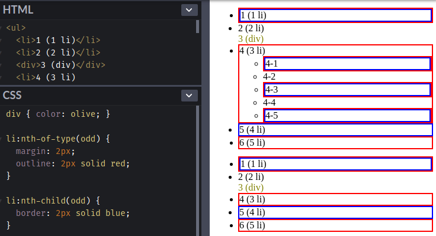

Selector (選擇器) 可用來選擇 HTML 和 XML 文件中的節點，並將樣式屬性綁定到文件 (HTML 和 XML) 中的元素上。當選擇器與某元素 match 的時候，就可以對選到的元素進行 CSS 樣式設定。本篇會介紹 structural pseudo-class (偽類)，包括 `:root`、`nth-child`、`nth-of-type` ...等 selector。

<!-- more -->

## 前言

> 「重新認識 CSS」這個系列名稱的由來就如其名，我想要重新認識它。雖然以前就有學過 CSS，但這次想從 CSS Spec 中學到最原始的定義和內容，更加了解 CSS 的原理，讓我在切版的時候可以更加確定自己在做什麼，我踩到的雷只是因為我不夠了解它才會炸開。
> 
> 在這 30 天的內容中，會將 Spec 內看到的資料整理成這個系列，也希望正在學 CSS 的各位可以更加了解它。另外我也會同時將文章發至我的 Blog，如果想直接看文內的程式碼 Demo 畫面，可以到我的 Blog 來看 😃。
>
> 本文同步發表於 iT 邦幫忙：[重新認識 CSS - Pseudo-class (偽類) (2)](https://ithelp.ithome.com.tw/articles/10218197)
> 
> 「重新認識 CSS」系列文章發文於：
> - [iT 邦幫忙](https://ithelp.ithome.com.tw/users/20117586/ironman/2617)
> - [Titangene Blog](https://titangene.github.io/tags/it-%E9%90%B5%E4%BA%BA%E8%B3%BD/)

## Structural pseudo-classes

當使用 structural pseudo-class 時，它會計算各 sibling 元素的位置：
- 不計算 standalone (獨立) text 和其他非元素節點
- index 編號從 1 開始
- 只適用於 document tree 中的元素，不會 match 到 pseudo-element

### `:root` pseudo-class

- `:root` pseudo-class 代表文件的 root 元素
- 在 DOM 文件中，`:root` pseudo-class 與 [`Document`](https://dom.spec.whatwg.org/#document) 物件的 root 元素會 match
- 在 HTML 中，root 元素就是 [`<html>`](https://html.spec.whatwg.org/multipage/semantics.html#the-html-element) 元素

### Child-indexed Pseudo-classes

此 pseudo-class 會根據 [inclusive sibling](https://dom.spec.whatwg.org/#concept-tree-inclusive-sibling) 之間的 index 來選擇元素。

選擇 index 為多少的 sibling (兄弟，同層) 元素，元素的第一個子元素的 index 是 1。

只有開頭為 `nth` 的 Child-indexed Pseudo-classes 和 Typed Child-indexed Pseudo-classes 都可以在 `()` 括號裡面可以使用下面這幾種值：

- `an + b`：
  - `n` 可以是任何​​正整數或 0 的數值
  - `a` 和 `b` 的值必須是整數 (正數、負數或 0)
  - 當 `a` 和 `b` 都大於 0 時，可以更好的將 sibling 元素劃分為元素群組 (groups of a elements)，並選擇每個群組的第 `b` 個元素， 例如：
    - `3n + 1` 可以 match 到第 1、4、7...等子元素
    - `0n + 5` 等同於 `5`
  - 當 `a` 為負值，且 `n >= 0` 時，只有 `an + b` 為正值才可以代表 document tree 中的元素
- `odd`：奇數的所有 sibling 元素，等同於 `2n + 1`
- `even`偶數的所有 sibling 元素，等同於 `2n`

> 語法詳情可參閱 Selectors Level 3 的「[6.6.5.2. :nth-child() pseudo-class](https://www.w3.org/TR/selectors-3/#nth-child-pseudo)」章節部份。

Child-indexed Pseudo-classes 有下面這些 selector：

- `:nth-child(an+b)`：
  - 選擇指定 index 的所有 sibling 元素，從第一個 sibling 元素開始數
- `:nth-last-child(an+b)`：
  - 選擇指定 index 的所有 sibling 元素，從最後一個 sibling 元素開始數
- `:first-child()`：
  - 選擇 sibling 列表中的第一個元素
  - 等同於 `:nth-child(1)`
- `:last-child()`：
  - 選擇 sibling 列表中的最後一個元素
  - 等同於 `:nth-last-child(1)`
- `:only-child()`：
  - 選擇沒有 sibling 的元素
  - 等同於 `:first-child:last-child` 或 `:nth-child(1):nth-last-child(1)`，但 [specificity](https://www.w3.org/TR/CSS22/cascade.html#specificity) 較低

### Typed Child-indexed Pseudo-classes

此 pseudo-class 類似於 Child Index Pseudo-classes，但此 pseudo-class 是基於 sibling 列表中相同 [type (tag 名稱)](https://www.w3.org/TR/selectors-4/#type-selectors) 的元素之間的元素 index 來解析。

Typed Child-indexed Pseudo-classes 有下面這些 selector：

- `:nth-of-type(an+b)`：
  - 選擇指定 index 的所有相同 type 的 sibling 元素，從第一個 sibling 元素開始數
- `:nth-last-of-type(an+b)`
  - 選擇指定 index 的所有相同 type 的 sibling 元素，從最後一個 sibling 元素開始數
- `:first-of-type()`
  - 選擇 sibling 列表中的第一個相同 type 的元素
  - 等同於 `:nth-of-type(1)`
- `:last-of-type()`
  - 選擇 sibling 列表中的最後一個相同 type 的元素
  - 等同於 `:nth-last-of-type(1)`
- `:only-of-type()`
  - 選擇沒有相同 type 的 sibling 元素
  - 等同於 `:first-of-type:last-of-type` 或 `:nth-of-type(1):nth-last-of-type(1)`，但 [specificity](https://www.w3.org/TR/CSS22/cascade.html#specificity) 較低

### `:nth-of-type()` 與 `:nth-child()` 的差異

下面是 `:nth-of-type()` 和 `:nth-child()` 的範例：

```html
<ul>
  <li>1 (1 li)</li>
  <li>2 (2 li)</li>
  <div>3 (div)</div>
  <li>4 (3 li)
    <ul class="nested-list">
      <li>4-1</li>
      <li>4-2</li>
      <li>4-3</li>
      <li>4-4</li>
      <li>4-5</li>
    </ul>
  </li>
  <li>5 (4 li)</li>
  <li>6 (5 li)</li>
</ul>
<ul>
  <li>1 (1 li)</li>
  <li>2 (2 li)</li>
  <div>3 (div)</div>
  <li>4 (3 li)</li>
  <li>5 (4 li)</li>
  <li>6 (5 li)</li>
</ul>
```

```css
div { color: olive; }

li:nth-of-type(odd) {
  margin: 2px;
  outline: 2px solid red;
}

li:nth-child(odd) {
  border: 2px solid blue;
}
```

這個範例有兩個 `ul` 元素，裡面各有五個 `li` 元素，而且在與第二個 `li` 元素同層的後面加上一個 `div` 元素，這是用來驗證 `:nth-of-type()` 和 `:nth-child()` 的差異用的。另外，在第一個 `ul` 元素裡面還有一個巢狀 `<ul class="nested-list">` 元素，它放在第四個 `li` 元素裡面，這是用來巢狀的元素也可以被 selector 選到。

每個元素的前面都有一個編號，代表在 sibling 元素之間的 index。而後面的括號是用來告訴你它是 `li` 元素還是 `div` 元素，如果是 `li` 元素就會註記是第幾個 `li` 元素。例如：`4 (3 li)` 就代表是第四個 sibling 元素，並且是第三個 `li` 元素。

可以看到那些有紅色 `outline` 的元素都有 match 到 `li:nth-of-type(odd)`，因為此 pseudo-class 是以 `of-type` 為結尾，所以此 selector 只會找相同 type 的 sibling 元素 (OS：就很像是忽略了 `div` 元素的存在)。只要是奇數的 sibling 元素都會被選起來，套用紅色的 outline 樣式。

而那些有藍色 `border` 的元素都有 match 到 `li:nth-child(odd)`，因為此 pseudo-class 是以 `child` 為結尾，所以此 selector 會直接找是 `li` 的 sibling 元素，並且要是奇數的 sibling 元素。不過，第三個 sibling 元素是 `div` 元素，不是 `li` 元素，因此 `li:nth-child(odd)` 就不會 match 到此 `div` 元素

而巢狀 `<ul class="nested-list">` 元素裡面只有五個 `li` 元素，沒有其他 type 的元素，所以都會選到奇數的 sibling 元素 (因為沒有亂路的元素)。

Demo：[Codepen 連結](https://codepen.io/titangene/pen/NWKEwmo)



<iframe height="541" style="width: 100%;" scrolling="no" title=":nth-child &amp; :nth-of-type" src="https://codepen.io/titangene/embed/NWKEwmo/?height=541&theme-id=dark&default-tab=html,result" frameborder="no" allowtransparency="true" allowfullscreen="true">
  See the Pen <a href='https://codepen.io/titangene/pen/NWKEwmo/'>:nth-child &amp; :nth-of-type</a> by Titangene
  (<a href='https://codepen.io/titangene'>@titangene</a>) on <a href='https://codepen.io'>CodePen</a>.
</iframe>

### The negation pseudo-class

`:not(X)` 是一個函數符號，可將一個 simple selector (不包括 `:not(X)` 本身) 作為參數。`:not(X)` 代表不選擇 match 到 `X` simple selector 的元素。

> 註：以下這些都是 simple selector：
> - type selector：例如 `div`
> - universal selector：例如 `*`
> - attribute selector：例如 `div[foo]`
> - class selector：例如 `.myclass`
> - ID selector：例如 `#myid`
> - pseudo-class：例如 `a:hover`

不能巢狀使用，所以 `:not(:not(...))` 是無效的。另外請注意，因為 pseudo-element 不是 simple selector，所以 pseudo-element 不是 `:not()` 的有效參數。

例如：match HTML 文件中所有未被禁用的 `button` 元素：

```css
button:not([disable])
```

> 註：`[disable]` 是 attribute selector，詳情請參閱我前幾天寫的「[重新認識 CSS - Attribute selector (屬性選擇器)](https://titangene.github.io/article/css-attribute-selector.html)」。

match 除了 `#titan` 元素之外的所有元素：

```css
*:not(#titan)
```

> 註：`#titan` 是 ID selector，詳情請參閱我前幾天寫的「[重新認識 CSS - CSS Selector (前傳)](https://titangene.github.io/article/css-selector-1.html)」。

## 最後

今天介紹一些 structural pseudo-class，接下來幾天會接續介紹其他 selector。

資料來源：
- [CSS 2.2 Specification - Selectors](https://www.w3.org/TR/CSS22/selector.html)
- [Selectors Level 3](https://www.w3.org/TR/selectors-3/)
- [Selectors Level 4](https://www.w3.org/TR/selectors-4/)