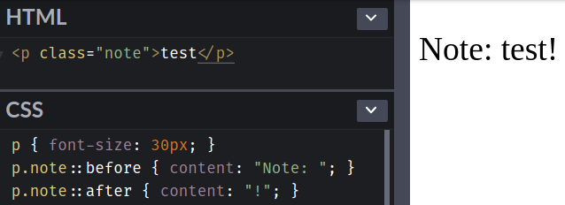
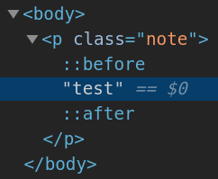

Selector (選擇器) 可用來選擇 HTML 和 XML 文件中的節點，並將樣式屬性綁定到文件 (HTML 和 XML) 中的元素上。當選擇器與某元素 match 的時候，就可以對選到的元素進行 CSS 樣式設定。本篇會介紹 pseudo-element (偽元素)，包括 `::before` 和 `::after`。

<!-- more -->

## 前言

> 「重新認識 CSS」這個系列名稱的由來就如其名，我想要重新認識它。雖然以前就有學過 CSS，但這次想從 CSS Spec 中學到最原始的定義和內容，更加了解 CSS 的原理，讓我在切版的時候可以更加確定自己在做什麼，我踩到的雷只是因為我不夠了解它才會炸開。
> 
> 在這 30 天的內容中，會將 Spec 內看到的資料整理成這個系列，也希望正在學 CSS 的各位可以更加了解它。另外我也會同時將文章發至我的 Blog，如果想直接看文內的程式碼 Demo 畫面，可以到我的 Blog 來看 😃。
>
> 本文同步發表於 iT 邦幫忙：[重新認識 CSS - Pseudo-element (偽元素)](https://ithelp.ithome.com.tw/articles/10218712)
> 
> 「重新認識 CSS」系列文章發文於：
> - [iT 邦幫忙](https://ithelp.ithome.com.tw/users/20117586/ironman/2617)
> - [Titangene Blog](https://titangene.github.io/tags/it-%E9%90%B5%E4%BA%BA%E8%B3%BD/)

## Pseudo-elements

pseudo-element 代表不直接存在於 document tree 中的元素。

document language (文件語言) 不提供存取元素內容的第一個字母或第一行的機制，但是可以用 `::first-letter` 和 `::first-line` 這兩個 pseudo-element 選到，這樣就可以對這些元素設定樣式。

另外，pseudo-element 還可以表示原始文件 (source document) 中根本不存在的內容，例如 `::before` 和 `::after` 這兩個 pseudo-element 可以在任何元素的內容之前或之後插入其他內容。

pseudo-class 和 pseudo-element 都不會出現在 document source 或 document tree 中，或是不會對其進行修改。所以，pseudo-class 和 pseudo-element 都不會影響到 [structural pseudo-class](https://titangene.github.io/article/css-selector-pseudo-class-2.html) 或與它們的 [originating (原始) 元素](https://www.w3.org/TR/selectors-4/#originating-element) 或其 tree 有關的其他 selector 的解譯 (interpretation)。

> Structural pseudo-class 詳情可參考我前幾天寫的「[重新認識 CSS - Pseudo-class (偽類) (2)](https://titangene.github.io/article/css-selector-pseudo-class-2.html)」。

:::info
### originating (原始) 元素是什麼？

pseudo-element 綁定到頁面上的某個元素，而此元素就稱為 originating 元素。例如：

```css
div a::before { content: 'Hi '; }
```

在 selector `div a::before` 中，與 selector match 的 `a` 元素就是 originating 元素。
:::

如果想更了解 pseudo-element，可以看它在以下這些 CSS Spec 的定義：
- [CSS 2.1](https://www.w3.org/TR/CSS2/selector.html)
- [Selectors Level 3](https://www.w3.org/TR/selectors-3/#pseudo-elements)
- [CSS Pseudo-Elements Module Level 4](https://www.w3.org/TR/css-pseudo-4/)

### Generated Content Pseudo-elements: `::before` and `::after`

- `::before`：在 originating 元素的內容之前建立的 child pseudo-element
- `::after`：在 originating 元素的內容之後建立的 child pseudo-element

`::before` 和 `::after` 的 CSS [`content`](https://www.w3.org/TR/css-content-3/#propdef-content) 屬性的[初始值](https://www.w3.org/TR/css-cascade/#initial-values)為 [`normal`](https://www.w3.org/TR/css-content-3/#valdef-content-normal)，[計算值](https://www.w3.org/TR/css-cascade/#computed)為 [`none`](https://www.w3.org/TR/css-content-3/#valdef-content-none)。

當 `::before` 和 `::after` 的計算 [`content`](https://www.w3.org/TR/css-content-3/#propdef-content) 值不為 [`none`](https://www.w3.org/TR/css-content-3/#valdef-content-none) 時，這些 pseudo-element 就會產生 box，就好像它們是其 [originating (原始) 元素](https://www.w3.org/TR/selectors-4/#originating-element)的直接子元素一樣，並且可以像在 document tree 中任何 normal document-sourced (基於文件) 的元素一樣進行樣式設定

例如：

- 在 class 為 `note` 的 `p` 元素的內容之前插入字串 "Note: "
- 在 class 為 `note` 的 `p` 元素的內容之後插入字串 "!"

```html
<p class="note">test</p>
```

```css
p.note::before { content: "Note: "; }
p.note::after { content: "!"; }
```

Demo：[Codepen 連結](https://codepen.io/titangene/pen/QWLzNjE)

`::before` 和 `::after` 的 `display` 的初始值為 `inline`，所以會生成 inline box。與 `p` 元素的其他 inline children 一樣，它會參與 `p` 元素的 [IFC (inline formatting context)](https://www.w3.org/TR/CSS22/visuren.html#inline-formatting)，有可能與其他內容共享一行。

就如下面範例那樣，因為 `::before` 和 `::after` 都是 `display: inline`，並且在 `p` 元素的內容 `test` 之前加上 `::before` 的內容 `"Note: "`，以及在 `test` 之後加上 `::after` 的內容 `"！"`，所以在畫面上顯示的結果就變成 `Note: test!`。






<iframe height="202" style="width: 100%;" scrolling="no" title="Generated Content Pseudo-elements: `::before` and `::after`" src="https://codepen.io/titangene/embed/QWLzNjE?height=202&theme-id=dark&default-tab=css,result" frameborder="no" allowtransparency="true" allowfullscreen="true">
  See the Pen <a href='https://codepen.io/titangene/pen/QWLzNjE'>Generated Content Pseudo-elements: `::before` and `::after`</a> by Titangene
  (<a href='https://codepen.io/titangene'>@titangene</a>) on <a href='https://codepen.io'>CodePen</a>.
</iframe>

## 最後

今天介紹一些 `::before` 和 `::after` 這兩個 pseudo-element，接下來幾天會接續介紹其他 selector。

資料來源：
- [CSS 2.2 Specification - Selectors](https://www.w3.org/TR/CSS22/selector.html)
- [Selectors Level 3](https://www.w3.org/TR/selectors-3/)
- [Selectors Level 4](https://www.w3.org/TR/selectors-4/)
- [CSS Pseudo-Elements Module Level 4](https://www.w3.org/TR/css-pseudo-4/)
- [CSS Generated Content Module Level 3](https://www.w3.org/TR/css-content-3/#propdef-content)
- [CSS Cascading and Inheritance Level 4](https://www.w3.org/TR/css-cascade/)