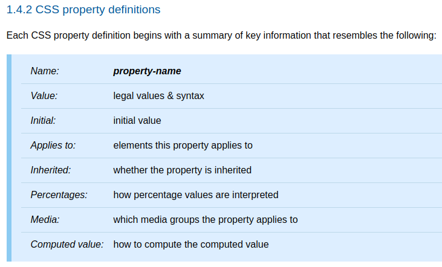

今天來介紹 CSS 如何處理屬性值。

<!-- more -->

## 前言

> 「重新認識 CSS」這個系列名稱的由來就如其名，我想要重新認識它。雖然以前就有學過 CSS，但這次想從 CSS Spec 中學到最原始的定義和內容，更加了解 CSS 的原理，讓我在切版的時候可以更加確定自己在做什麼，我踩到的雷只是因為我不夠了解它才會炸開。
> 
> 在這 30 天的內容中，會將 Spec 內看到的資料整理成這個系列，也希望正在學 CSS 的各位可以更加了解它。另外我也會同時將文章發至我的 Blog，如果想直接看文內的程式碼 Demo 畫面，可以到我的 Blog 來看 😃。
>
> 本文同步發表於 iT 邦幫忙：[重新認識 CSS - CSS 如何處理屬性值](https://ithelp.ithome.com.tw/articles/10220084)
> 
> 「重新認識 CSS」系列文章發文於：
> - [iT 邦幫忙](https://ithelp.ithome.com.tw/users/20117586/ironman/2617)
> - [Titangene Blog](https://titangene.github.io/tags/it-%E9%90%B5%E4%BA%BA%E8%B3%BD/)

每個屬性的定義表 (definition table) 都定義了：
- Name：屬性名稱
- Value：屬性值
- Initial：initial value 為何
- Applies to：此屬性適用於哪些元素
- Inherited：是否為 [inherited properties](https://www.w3.org/TR/css-cascade-3/#inherited-property)
- Percentages：百分比值如何 interpreted
- Media：該屬性適用於哪些 media group
- Computed value：如何計算 Computed value

如下圖：



圖片來源：[CSS 2.2 - 1.4.2 CSS property definitions](https://www.w3.org/TR/CSS22/about.html#property-defs)

> 詳情可參閱 [CSS 2.2 Spec - 1.4.2 CSS property definitions](https://www.w3.org/TR/CSS22/about.html#property-defs)

## Value Processing

UA 解析了文件並在建構了 [document tree](https://www.w3.org/TR/CSS22/conform.html#doctree) 之後，UA 必須為 tree 中的每個元素以及 formatting structure (格式化結構) 中的每個 box 分配對應於目標 [media type](https://www.w3.org/TR/CSS22/media.html) 的屬性值。

:::info
document tree：source document (原始文件，在這邊可以指 HTML 或 XML) 中編碼的元素的 tree。該 tree 中的每個元素都只有一個父元素，但 root 元素 (在 HTML 中就是  `<html>` 元素) 除外。
:::

所以每個屬性都會有一個值，而這些值 (也就是說元素或 box 的 CSS 屬性的 final value) 會通過下面幾個步驟來計算決定。

在說明步驟之前先來說這個計算過程中會用到的幾種值：
- declared value
- cascaded value
- specified value
- computed value
- used value
- actual value

### Declared values

為了找到 declared value，應用於每個元素的每個屬性宣告，都會以 [filtering declarations (過濾宣告)](https://www.w3.org/TR/css-cascade-3/#filtering) 的方式來標識出 (identify) 可以適用於每個元素的所有宣告。只要符合下列情況，宣告就適用於各元素：
- 宣告屬於當前適用於此文件的 style sheet
- 宣告不符合，帶有錯誤條件的條件規則 [CSS Conditional Rules Module Level 3](https://www.w3.org/TR/css3-conditional/)
- 宣告屬於該 [selector 與該元素 match 的樣式規則](https://www.w3.org/TR/selectors-3/)。 (必要時需要考慮[範圍 (scope)](https://www.w3.org/TR/selectors-4/#scoping) )
- 有效語法：宣告的屬性是已知的屬性名稱，並且 declared value 與該屬性的語法 match

適用於每個元素上的每個屬性的 declared value 會形成 declared value 的列表，此列表會由 cascade 來進行優先度排序。

### Cascaded values

cascade 會使用各元素上屬性的 declared value 的無序列表，透過 [Cascading](https://www.w3.org/TR/css-cascade-3/#cascading) (明天會介紹) 流程選擇一個 "winning value"，也就是按照宣告的優先度來進行排序，優先度最高的宣告就會輸出一個 cascaded value (也可以說是在 [cascade 的輸出 (output of the cascade)](https://www.w3.org/TR/css-cascade-3/#output-of-the-cascade) 中排在最前面的值)。

如果 cascade 的輸出為空 (empty) 列表時，則沒有 cascade value。

:::info
cascade 的輸出 (output of the cascade)：每元素上的每個屬性的 declared value 的排序列表 (可能為 empty)。
:::

### Specified Values

Specified value 是由 style sheet 的作者 (也就是網頁開發者) 針對該元素指定的屬性值。

cascaded value 會透過 [defaulting](https://www.w3.org/TR/css-cascade-3/#defaulting) 流程來計算 specified value，以確保每個元素上的每個屬性都有一個 specified value，流程如下：
- 是否為 [inherited properties](https://www.w3.org/TR/css-cascade-3/#inherited-property)：
  - 是：通過繼承從該父元素中取得 initial value
  - 否：採用該屬性的 initial value
- Explicit Defaulting (顯式預設)：當 cascaded value 為下面某個 [CSS-wide keywords](https://www.w3.org/TR/css3-values/#css-wide-keywords) 時 (所有屬性都可以使用這些關鍵字)，會有對應的處理方式
  - `initial`：將 initial value 作為屬性的 specified value
  - `inherit`：將 computed value 作為屬性的 specified value 和 computed value
  - `unset`：是否為 inherited property：
    - 是：等同於 `inherit` 的作用
    - 否：等同於 `initial` 的作用

如果沒有 cascaded value 時，也會依照上面流程來決定 specified value。

### Computed Values

- computed value 是解析屬性定義表 (definition table) 中的 "Computed Value" 定義的 specified value 的計算結果
- 通常將其絕對化以準備[繼承](https://www.w3.org/TR/css-cascade-3/#inheritance)


### Order of Appearance

越放在 HTML 最後的宣告優先度越高：
- [imported style sheet](https://www.w3.org/TR/css-cascade-3/#at-ruledef-import) 中的宣告會按順序來排序
- HTML 外部連結的 style sheet 中的宣告會按順序來排序
- `style` 屬性的宣告是根據 `style` 屬性出現在該元素的文件順序來排序，並且全部放在任何 style sheet 之後


資料來源：
- [CSS 2.2 - 6. Assigning property values, Cascading, and Inheritance](https://www.w3.org/TR/CSS22/cascade.html)
- [CSS Cascading and Inheritance Level 3](https://www.w3.org/TR/css-cascade-3/)


```
4.1 Declared Values
4.2 Cascaded Values
4.3 Specified Values
4.4 Computed Values x

5 Filtering
6 Cascading 上半部，詳細順序還沒提到，下一篇會提到
### Origin and Importance
### Specificity
### Order of Appearance x

7 Defaulting
7.1 Initial Values
7.2 Inheritance
7.3 Explicit Defaulting

之後寫：
- Cascaded values
  - Cascading
- Specified Values
  - Defaulting
  - Explicit Defaulting：三個 CSS-wide keywords
```