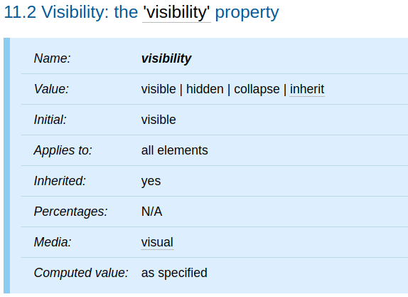
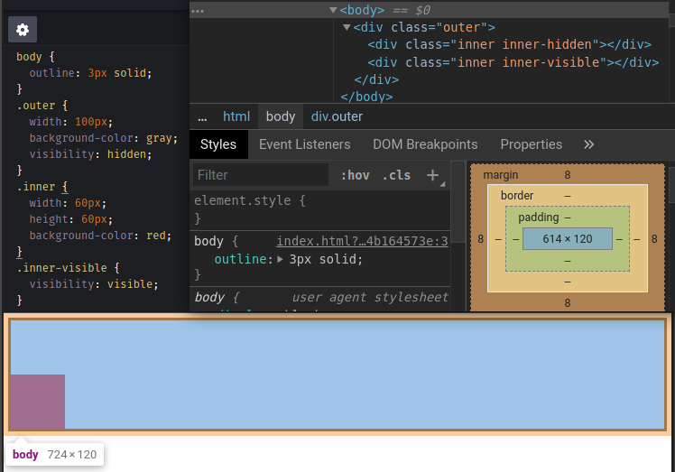
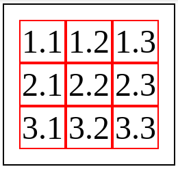
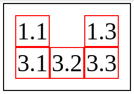
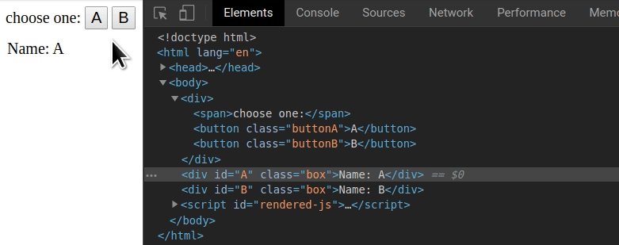

本篇將介紹 CSS 的 `visibility` 屬性。

<!-- more -->

## 前言

> 「重新認識 CSS」這個系列名稱的由來就如其名，我想要重新認識它。雖然以前就有學過 CSS，但這次想從 CSS Spec 中學到最原始的定義和內容，更加了解 CSS 的原理，讓我在切版的時候可以更加確定自己在做什麼，我踩到的雷只是因為我不夠了解它才會炸開。
> 
> 在這 30 天的內容中，會將 Spec 內看到的資料整理成這個系列，也希望正在學 CSS 的各位可以更加了解它。另外我也會同時將文章發至我的 Blog，如果想直接看文內的程式碼 Demo 畫面，可以到我的 Blog 來看 😃。
> 
> 本文同步發表於 iT 邦幫忙：[重新認識 CSS - visibility](https://ithelp.ithome.com.tw/articles/10227785)
> 
> 「重新認識 CSS」系列文章發文於：
> - [iT 邦幫忙](https://ithelp.ithome.com.tw/users/20117586/ironman/2617)
> - [Titangene Blog](https://titangene.github.io/tags/it-%E9%90%B5%E4%BA%BA%E8%B3%BD/)

## `visibility` 屬性

`visibility` 屬性是用於指定是否 render 由元素產生的 box，可用來顯示或隱藏 box，而無需更改文件的佈局。

下面是 `visibility` 屬性的定義表：



- 此元素的 initial value 為 `visible`
- 適用於所有元素
- 此元素為可繼承屬性，descendant 會繼承父元素的 `visibility` 屬性設定

下面介紹各屬性值：

### `visible`

- `visibility` 屬性的 initial value
- 產生的 box 是可見的

### `hidden`

- 產生的 box 是不可見的 (完全透明，不會繪製 (drawn) 在畫面上)
- 但不可見的 box 還是會影響佈局
- 如果元素的 descendant 設定 `visibility: visible`，則它們將是可見的

如以下範例，`.outer` 元素設定 `visibility: hidden`，而 `.outer` 元素有兩個 descendant，所有 descendant 都會繼承父元素 `.outer` 的 `visibility` 屬性設定：

- `.inner-hidden` 元素：因為沒有在此元素設定 `visibility: visible`，所以元素為不可見的
- `.inner-visible` 元素：也就是畫面中的紅色矩形，因為有在此元素設定 `visibility: visible`，所以元素就變為可見的

在紅色矩形上面所空出的空間，其實就是 `.inner-hidden` 元素佔用的。雖然 `.inner-hidden` 元素是不可見的，但它只是被隱藏而已，元素所產生的 box 不會從文件佈局中刪除，所以 box 還是會影響佈局。

```html
<div class="outer">
  <div class="inner inner-hidden"></div>
  <div class="inner inner-visible"></div>
</div>
```

```css
body {
  outline: 3px solid;
}
.outer {
  width: 100px;
  background-color: gray;
  visibility: hidden;
}
.inner {
  width: 60px;
  height: 60px;
  background-color: red;
}
.inner-visible {
  visibility: visible;
}
```

Demo：[Codepen 連結](https://codepen.io/titangene/pen/Baajxbx)



<iframe height="382" style="width: 100%;" scrolling="no" title="descendant visibility: visible" src="https://codepen.io/titangene/embed/Baajxbx?height=382&theme-id=dark&default-tab=css,result" frameborder="no" allowtransparency="true" allowfullscreen="true">
  See the Pen <a href='https://codepen.io/titangene/pen/Baajxbx'>descendant visibility: visible</a> by Titangene
  (<a href='https://codepen.io/titangene'>@titangene</a>) on <a href='https://codepen.io'>CodePen</a>.
</iframe>

### `collapse`

- 在表格的 row 或 column (row、row group、column 和 column group 元素，也就是分別為 HTML 中的 `tr`、`tbody`、`col` 和 `colgroup` 元素) 使用 `visibility: collapse` 時：
  - 會導致整個 row 或 column 從顯示結果中刪除，原本佔用的空間會讓其他內容使用，也就是說顯示結果很像是將 `display: none` 應用在表格的 row 或 column 一樣
  - 與 collapsed column 或 row (合併欄或合併列) 相交 (intersect) 的 spanned row 或 column (跨欄或跨列) 的內容會被裁切掉 (clipped)
  - 可以在不強制重新佈局 (re-layout) 表格的情況下，使用動態效果來刪除表格的 row 或 column
- 對 table cell (也就是 HTML 中的 `td` 或 `th` 元素) 使用 `visibility: collapse` 時，效果相當於 `visibility: hidden`
- 除了上述以外的其他元素使用 `visibility: collapse` 時，效果相當於 `visibility: hidden`

下面是表格的範例：

```html
<table>
  <tr>
    <td>1.1</td>
    <td class="collapse">1.2</td>
    <td>1.3</td>
  </tr>
  <tr class="collapse">
    <td>2.1</td>
    <td>2.2</td>
    <td>2.3</td>
  </tr>
  <tr>
    <td>3.1</td>
    <td>3.2</td>
    <td>3.3</td>
  </tr>
</table>
```

```css
table{
  outline: 1px solid;
  font-size: 24px;
  padding: 10px;
}
td {
  outline: 1px solid red;
}
.collapse {
  visibility: collapse;
}
```

Demo：[Codepen 連結](https://codepen.io/titangene/pen/vYYLVmd)

如下圖，此範例為 3 x 3 的表格，在沒有設定 `visibility: collapse` 之前，表格原本長這樣：



如果對 `1.2` 此 table cell 和第二列設定 `visibility: collapse`：
- `1.2` 此 table cell 只會被隱藏，不會刪除原本佔用的空間
- 第二列會被隱藏，並且刪除原本佔用的空間



<iframe height="302" style="width: 100%;" scrolling="no" title="table row &amp; column：visibility: collapse" src="https://codepen.io/titangene/embed/vYYLVmd?height=302&theme-id=dark&default-tab=css,result" frameborder="no" allowtransparency="true" allowfullscreen="true">
  See the Pen <a href='https://codepen.io/titangene/pen/vYYLVmd'>table row &amp; column：visibility: collapse</a> by Titangene
  (<a href='https://codepen.io/titangene'>@titangene</a>) on <a href='https://codepen.io'>CodePen</a>.
</iframe>

## `display: none` 與 `visibility: hidden` 的差異

`display: none` 和 `visibility: hidden` 都是可以隱藏元素，但差別在於：

- `display: none` 會將元素所產生的 box 從文件佈局中刪除
- `visibility: hidden` 不會將元素所產生的 box 從文件佈局中刪除

所以，如果將元素設定 `display: none`，就會影響到其他元素的佈局，而 `visibility: hidden` 就不會，因為就只是「真正」意義上的隱藏元素而已。

## `visibility` 屬性用於動態效果

可以使用 JavaScript 控制哪個元素要顯示或是隱藏。下面是 `visibility` 屬性的動態效果範例：

Demo：[Codepen 連結](https://codepen.io/titangene/pen/dyyGeOo)



<iframe height="293" style="width: 100%;" scrolling="no" title="dynamic visibility" src="https://codepen.io/titangene/embed/dyyGeOo?height=293&theme-id=dark&default-tab=css,result" frameborder="no" allowtransparency="true" allowfullscreen="true">
  See the Pen <a href='https://codepen.io/titangene/pen/dyyGeOo'>dynamic visibility</a> by Titangene
  (<a href='https://codepen.io/titangene'>@titangene</a>) on <a href='https://codepen.io'>CodePen</a>.
</iframe>

在一開始進入範例頁面時，`A` 元素是使用 `visibility` 的預設值 `visible`，而 `B` 元素是設定 `visibility: hidden` 隱藏元素。

在此範例中，`A` 元素和 `B` 元素都是使用絕對定位，並設定在相同的位置，所以當要顯示一個元素，並隱藏另一個元素時，畫面的動態效果就很像是一個元素替換成另一個元素。CSS 樣式如下：

```css
.box {
  position: absolute;
  top: 50px;
  left: 10px;
}
```

範例中有兩個按鈕：
- 點擊 A 按鈕會顯示 `A` 元素 (也就是顯示 "Name: A" )，並隱藏 `B` 元素 (也就是隱藏 "Name: B")
- 點擊 B 按鈕會顯示 `B` 元素 (也就是顯示 "Name: B" )，並隱藏 `A` 元素 (也就是隱藏 "Name: A")

顯示元素其實就是將元素設定成 `visibility: visible`，在 JavaScript 可以使用下面程式碼來設定：

```javascript
element.style.visibility = 'visible'
```

隱藏元素則是元素設定成 `visibility: hidden`，在 JavaScript 可以使用下面程式碼來設定：

```javascript
element.style.visibility = 'hidden'
```

這樣就可以實作出 `A` 和 `B` 元素切換的動態效果。

此範例的完整原始碼如下：

```html
<div>
  <span>choose one:</span>
  <button class="buttonA">A</button>
  <button class="buttonB">B</button>
</div>
<div id="A" class="box">Name: A</div>
<div id="B" class="box">Name: B</div>
```

```css
div, button { font-size: 20px }
.box {
  position: absolute;
  top: 50px;
  left: 10px;
}
#B { visibility: hidden; }
```

```javascript
var buttonA = document.querySelector('.buttonA');
var buttonB = document.querySelector('.buttonB');

function show(elementIdName) {
  var element = document.getElementById(elementIdName);
  element.style.visibility = 'visible';
}
function hide(elementIdName) {
  var element = document.getElementById(elementIdName);
  element.style.visibility = 'hidden';
}

buttonA.addEventListener('click', function() {
  show('A');
  hide('B');
});
buttonB.addEventListener('click', function() {
  show('B');
  hide('A');
});
```

> JavaScript 跑錯棚啦 XD

資料來源：
- [CSS 2.2 - 11.2. Visibility: the `visibility` property](https://www.w3.org/TR/CSS22/visufx.html#visibility)
- [CSS 2.2 - 17.5.5. Dynamic row and column effects](https://www.w3.org/TR/CSS22/tables.html#dynamic-effects)
- [`visibility` - CSS: Cascading Style Sheets | MDN](https://developer.mozilla.org/en-US/docs/Web/CSS/visibility)