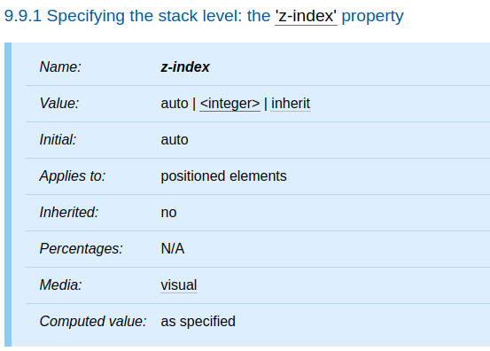
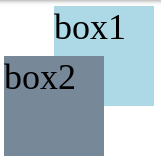
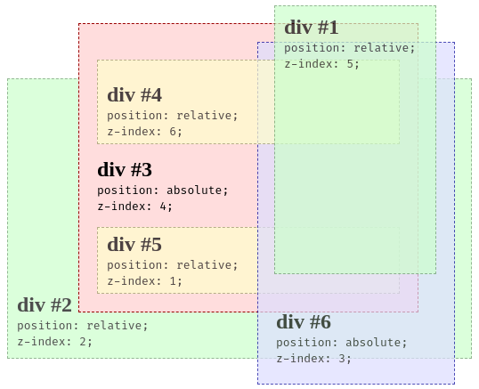

本篇將介紹 CSS 的 `z-index` 屬性和 stacking context。

<!-- more -->

## 前言

> 「重新認識 CSS」這個系列名稱的由來就如其名，我想要重新認識它。雖然以前就有學過 CSS，但這次想從 CSS Spec 中學到最原始的定義和內容，更加了解 CSS 的原理，讓我在切版的時候可以更加確定自己在做什麼，我踩到的雷只是因為我不夠了解它才會炸開。
> 
> 在這 30 天的內容中，會將 Spec 內看到的資料整理成這個系列，也希望正在學 CSS 的各位可以更加了解它。另外我也會同時將文章發至我的 Blog，如果想直接看文內的程式碼 Demo 畫面，可以到我的 Blog 來看 😃。
> 
> 本文同步發表於 iT 邦幫忙：[重新認識 CSS - z-index & stacking context](https://ithelp.ithome.com.tw/articles/10228026)
> 
> 「重新認識 CSS」系列文章發文於：
> - [iT 邦幫忙](https://ithelp.ithome.com.tw/users/20117586/ironman/2617)
> - [Titangene Blog](https://titangene.github.io/tags/it-%E9%90%B5%E4%BA%BA%E8%B3%BD/)

從 CSS 2.1 開始，每個 box 在三維空間上都有一個位置，除了水平和垂直的位置之外，這些 box 還會沿著 z 軸來排列，讓一個 box 可以疊在另一個 box 的上面，這個概念就類似於圖層。

當使用者面對螢幕時，元素的 `z-index` 屬性設定的數值愈大，則該元素就會愈靠近使用者。

## `z-index` 屬性

下面是 `z-index` 屬性的定義表：



- 此元素的 initial value 為 `auto`
- 只適用於定位元素，也就是元素的 `position` 屬性不為預設值 `static`，包括：`absolute`、`relative`、`fixed`
- 此元素為不可繼承屬性

`z-index` 屬性是對 positioned box 指定了：
- 當前 stacking context 中 box 的 stack level
- 該 box 是否建立 stacking context

下面介紹各屬性值：
- `<integer>`：該整數是當前 stacking context 中產生的 box 的 stack level。該 box 還建立了一個新的 stacking context
- `auto`：當前 stacking context 中產生的 box 的 stack level 為 0。如果該 box 具有 `position: fixed` 或是 root，則它還會建立新的 stacking context

## stacking context

> 原本元素會 in-flow 來排列，當元素使用 `position` 屬性設定排列的位置時，會從原本的位置移至指定的位置，甚至是 out-of-flow，此時就會建立新的 stacking context

- render tree 繪製 (painted) 到 canvas 上的順序是根據 stacking context 來決定的
- 每個 box 都屬於一個 stacking context，並且每個定位的 box 都有一個整數的 stack level
  - stack level：代表該 box 在 z 軸上相對於同一個 stacking context 中其他 stack level 的位置
- stack level 較高的 box 會在 stack level 較低的 box 前面
- box 的 stack level 可能為負數
- 在 stacking context 中，stack level 相同的 box 會根據 document tree 的順序來堆疊 (stacked)，也就是越寫在 HTML 後面的元素會蓋住前面的元素
- stacking context 可以包含其他 stacking context

如以下範例：

```html
<div class="box box1">box1</div>
<div class="box box2">box2</div>
```

```css
.box {
  width: 100px;
  height: 100px;
  font-size: 36px;
}
.box1 {
  background-color: lightblue;
  margin: 0 0 -50px 50px;
}
.box2 {
  background-color: lightslategray;
}
```

Demo：[Codepen 連結](https://codepen.io/titangene/pen/OJJNJJY)

`.box2` 元素在 `.box1` 元素之後，所以 `.box2` 元素會蓋住 `.box1` 元素：




```html
<div id="div1">
  <h2>div #1</h2>
  <code>position: relative;<br/>z-index: 5;</code>
</div>
<div id="div2">
  <h2>div #2</h2>
  <code>position: relative;<br/>z-index: 2;</code>
</div>
<div id="div3">
  <div id="div4">
    <h2>div #4</h2>
    <code>position: relative;<br/>z-index: 6;</code>
  </div>
  <h2>div #3</h2>
  <code>position: absolute;<br/>z-index: 4;</code>
  <div id="div5">
    <h2>div #5</h2>
    <code>position: relative;<br/>z-index: 1;</code>
  </div>
  <div id="div6">
    <h2>div #6</h2>
    <code>position: absolute;<br/>z-index: 3;</code>
  </div>
</div>
```

```css
* { margin: 0; }
html { padding: 20px; }
div {
  position: relative;
  opacity: 0.7;
}
#div1,
#div2 {
  background-color: #cfc;
  padding: 10px;
  border: 1px dashed #696;
}
#div1 {
  width: 160px;
  height: 280px;
  margin-bottom: -220px;
  left: 300px;
  z-index: 5;
}
#div2 {
  width: 500px;
  padding-top: 240px;
  z-index: 2;
}
#div3 {
  background-color: #fdd;
  padding: 40px 20px 20px;
  border: 1px dashed #900;
  position: absolute;
  top: 40px;
  left: 100px;
  width: 340px;
  z-index: 4;
  opacity: 1;
}
#div4,
#div5 {
  background-color: #ffc;
  border: 1px dashed #996;
}
#div4 {
  padding: 25px 10px 5px;
  margin-bottom: 15px;
  z-index: 6;
}
#div5 {
  padding: 5px 10px;
  margin-top: 15px;
  z-index: 1;
}
#div6 {
  width: 180px;
  background-color: #ddf;
  padding: 300px 20px 20px;
  border: 1px dashed #009;
  position: absolute;
  top: 20px;
  left: 200px;
  z-index: 3;
}
```

Demo：[Codepen 連結](https://codepen.io/titangene/pen/KKKzwZe)

範例如圖：



<iframe height="559" style="width: 100%;" scrolling="no" title="stacking context: z-index" src="https://codepen.io/titangene/embed/KKKzwZe?height=559&theme-id=dark&default-tab=css,result" frameborder="no" allowtransparency="true" allowfullscreen="true">
  See the Pen <a href='https://codepen.io/titangene/pen/KKKzwZe'>stacking context: z-index</a> by Titangene
  (<a href='https://codepen.io/titangene'>@titangene</a>) on <a href='https://codepen.io'>CodePen</a>.
</iframe>

資料來源：
- [CSS 2.2 - 9.9.1. Specifying the stack level: the `z-index` property](https://www.w3.org/TR/CSS22/visuren.html#z-index)
- [The stacking context - CSS: Cascading Style Sheets | MDN](https://developer.mozilla.org/en-US/docs/Web/CSS/CSS_Positioning/Understanding_z_index/The_stacking_context)

---

