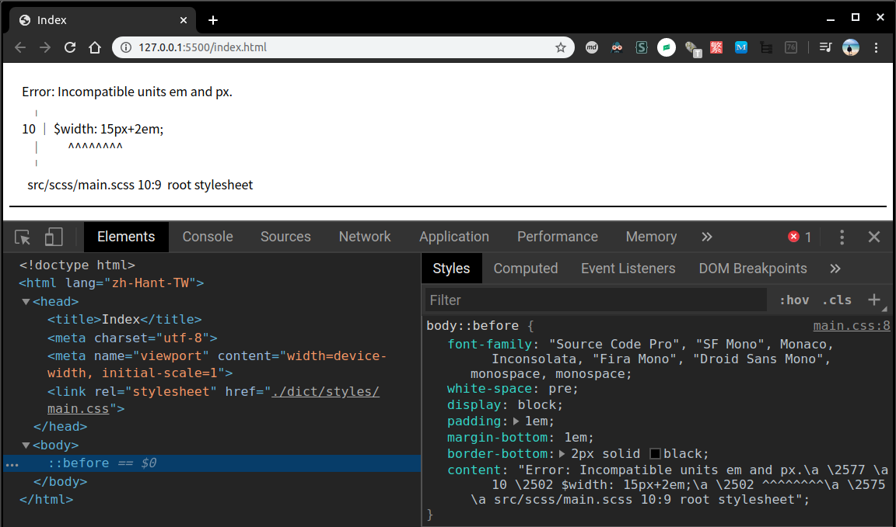

[Dart Sass](https://github.com/sass/dart-sass) 是 Sass 的主要實作，過去常見的是 Ruby Sass，而現今 [Sass 官方推薦大家改用 Dart Sass](https://sass-lang.com/ruby-sass)，尤其是用 JavaScript 或 Node.js 開發的相關專案。

<!-- more -->

Dart Sass 是 Sass 的 Dart 實作，效能比 Ruby Sass 還要快，且易於安裝，還可編譯成純 JavaScript，讓我們可以輕鬆的整合至現有的 Web 開發工作流程中。

# 安裝

有多種安裝和執行 Dart Sass 的方法：

## Standalone

從 [GitHub Release 頁面](https://github.com/sass/dart-sass/releases/)下載適用於你 OS 的 standalone Dart Sass archive，其中包含 Dart VM 和 executable 的 snapshot。

使用方法很簡單，下載後並解壓縮，將解壓縮後的目錄新增至 `PATH` ([這篇](https://katiek2.github.io/path-doc/) 提供各 OS 如何設定 `PATH` 的步驟)，接著重新啟動 terminal，然後就能執行 `sass` executable 開始使用！

## npm

可透過 npm 安裝 [Dart Sass](https://www.npmjs.com/package/sass)，該套件是已編譯為 JavaScript，且沒有任何 native code 或外部依賴。提供 command-line `sass` executable 和 Node.js API。

全域安裝：

```shell
$ npm install -g sass
```

local 安裝：新增至專案

```shell
$ npm init -y
$ npm install --save-dev sass
```

:::info
其餘的安裝方式可參考 [Dart Sass GitHub Repo 的 README 說明](https://github.com/sass/dart-sass#using-dart-sass)。
:::

# 為何用 Dart？

在 [Dart Sass GitHub Repo](https://github.com/sass/dart-sass#why-dart) 的 README 有提到為何 Dart Sass 會取代 Ruby Sass，有以下幾個優點：
- 效能快：比 Ruby 塊，且與 C++ 差不多
- 免安裝：
  - Dart VM 沒有外部依賴，可將應用程式編譯成獨立的 snapshot 檔案，因此可將 Dart Sass 只需發佈三個檔案 (VM、snapshot 和 wrapper script)
  - 可編譯成 JavaScript，所以可透過 npm 發佈
- 容易寫：
  - Dart 是比 C++ 更高級的語言，不需要太多的記憶體管理和建制系統的麻煩
  - Dart 是靜態型別 (statically typed)，與 Ruby 相比 可更容易的進行大型重構
- 對貢獻者更友好：
  - Dart 比 Ruby 更容易學習

# Command Line

Dart Sass executable 有兩種使用模式：
- One-to-One Mode (一對一模式)
- Many-to-many Mode (多對多模式)

## One-to-One Mode

```shell
$ sass <input.scss> [output.css]
```

- 一個輸入檔 ( `input.scss` ) 編譯成一個輸出檔 ( `output.scss` )
- 若為提供輸出路徑，會將已編譯的 CSS 列印至 terminal 上
- 若輸入檔的副檔名是：
  - `.scss`：解析成 [SCSS](https://sass-lang.com/documentation/syntax#scss)
  - `.sass`：解析成 [縮排語法 (indented syntax)](https://sass-lang.com/documentation/syntax#the-indented-syntax)
  - `.css`：解析成 [純 CSS](https://sass-lang.com/documentation/at-rules/import#importing-css)
  - 若都不是以上三種，或來至標準輸入，預設會解析成 SCSS
    - 也可用 `--indented` flag 來控制輸出格式

## Many-to-many Mode

```shell
$ sass [<input.css>:<output.css>] [<input/>:<output/>]...
```

- 一個或多個輸入檔編譯成一個或多個輸出檔
- 輸入和輸出用 `:` 字元來隔開
- 可將目錄中的所有 Sass 檔編譯為另一個目錄中具有相同名稱的 CSS 檔

例如：

將 `style.scss` 編譯成 `style.css`

```shell
$ sass style.scss:style.css
```

將 `light.scss` 和 `dark.scss` 編譯成 `light.css` 和 `dark.css`：

```shell
$ sass light.scss:light.css dark.scss:dark.css

```

將 `src/scss/` 目錄內的所有 Sass 檔編譯至 `public/css/` 目錄中，且會編譯成 CSS 檔：

```shell
$ sass src/scss:public/css
```

:::info
編譯整個目錄時，如果只想編譯出一個 CSS 檔案 (例如：`main.css` )，就要將主要檔案之外的其他檔案的名稱，改為以 `_` 為開頭的 (例如：`_color.scss`，這種檔案被稱為 [partial 檔案](https://sass-lang.com/documentation/at-rules/import#partials))。
:::

## CLI option

### `--indented`

指定輸入檔要解析成縮排語法 (indented syntax)

### `--load-path`，`-I`

- 新增額外的載入路徑來查找 stylesheet
- 此 option 可使用多次，代表提供多個載入路徑
- 最先載入的會優先於較晚載入的路徑

例如：如果沒有使用 `--load-path` option，要 import Bootstrap 就必須使用很長的路徑：

```scss
@import "../node_modules/bootstrap/scss/functions";
@import "../node_modules/bootstrap/scss/variables";
@import "../node_modules/bootstrap/scss/mixins";
```

若使用 `--load-path` option，就能簡短 import Bootstrap 的路徑：

```shell
$ sass --load-path=node_modules src/main.scss dist/main.css
```

```scss
@import "bootstrap/scss/functions";
@import "bootstrap/scss/variables";
@import "bootstrap/scss/mixins";
```

### `--style`，`-s`

指定 CSS 的輸出樣式。

Dart Sass 支援兩種輸出樣式：
- `expanded`：預設，將每個選擇器和宣告寫在自己的那行上
- `compressed`：刪除盡可能多的多餘字元，並將整個 stylesheet 寫成一行

```shell
$ sass --style=expanded style.scss
h1 {
  font-size: 40px;
}

$ sass --style=compressed style.scss
h1{font-size:40px}
```

### `--error-css`

- 當編譯期間發生錯誤時，會告訴 Sass 是否 emit CSS 檔案
- 該 CSS 檔會在註解和 `body::before` 的 `content` property 中描述錯誤
  - 可在瀏覽器中察看錯誤訊息，而不會切回 terminal 察看
- 預設若要編譯至少一個檔案 (不是標準輸出)，就會啟用 error CSS
  - 可在編譯成標準輸出時加上 `--error-css` 來啟用 error CSS
  - 也可以加上 `--no-error-css` 來禁用 error CSS
- 禁用 error CSS 後，`--update` flag 和 `--watch` flag 會在發生錯誤時刪除 CSS 檔案

例如：以下 Sass 檔的內容是錯誤的：

```scss
// main.scss
$width: 15px + 2em;
```

編譯此 Sass 檔會出現以下錯誤：

```shell
$ sass --error-css main.scss main.css
Error: Incompatible units em and px.
  ╷
1 │ $width: 15px + 2em;
  │         ^^^^^^^^^^
  ╵
  test.scss 1:9  root stylesheet
```

而輸出的 `main.css` 檔的內容如下：

```scss
/* Error: Incompatible units em and px.
 *   ,
 * 1 | $width: 15px + 2em;
 *   |         ^^^^^^^^^^
 *   '
 *   test.scss 1:9  root stylesheet */

body::before {
  font-family: "Source Code Pro", "SF Mono", Monaco, Inconsolata, "Fira Mono",
      "Droid Sans Mono", monospace, monospace;
  white-space: pre;
  display: block;
  padding: 1em;
  margin-bottom: 1em;
  border-bottom: 2px solid black;
  content: "Error: Incompatible units em and px.\a   \2577 \a 1 \2502  $width: 15px + 2em;\a   \2502          ^^^^^^^^^^\a   \2575 \a   test.scss 1:9  root stylesheet";         
}
```

若用瀏覽器察看使用此 `main.css` 檔的頁面會像下圖這樣：



### `--update`

- 當 stylesheets 的依賴更新時，Sass 就只會編譯 stylesheets
- 更新 stylesheets 時，會列印狀態訊息

```shell
$ sass --update themes:public/css
Compiled themes/light.scss to public/css/light.css.
```

### `--watch`

類似 `--update`，但是在完成第一次編譯後，Sass 保持 open 狀態，並在 stylesheets 或其依賴發生更改時繼續編譯 stylesheets。

```shell
$ sass --watch themes:public/css
Compiled themes/light.scss to public/css/light.css.

# Then when you edit themes/dark.scss...
Compiled themes/dark.scss to public/css/dark.css.
```

## 常用的 option

開發用：
- `--watch`：watch 模式
- `-I node_modules`：新增額外載入的 `node_modules` 目錄

```shell
$ sass --watch -I node_modules src/scss:dict/styles
```

部署用 (build)：
- `-s compressed`：CSS Minifier

```shell
$ sass -s compressed src/scss:dict/styles
```

:::info
更多 CLI option 可參閱 [Sass 文件](https://sass-lang.com/documentation/cli/dart-sass)。
:::

# 資料來源
- [sass/dart-sass: The reference implementation of Sass, written in Dart.](https://github.com/sass/dart-sass#using-dart-sass)
- [Sass: Ruby Sass](https://sass-lang.com/ruby-sass)
- [sass - npm](https://www.npmjs.com/package/sass)
- [Sass: Install Sass](https://sass-lang.com/install)
- [CSS 預處理器 Sass 的預設實作將遷移到 Dart Sass - 分享 - Dart 中文社區](https://www.dart-china.org/t/topic/146)
- [Sass: Dart Sass Command-Line Interface](https://sass-lang.com/documentation/cli/dart-sass)