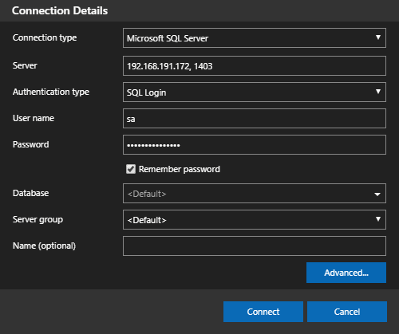

在 SQL Server 2017 時，微軟推出了 Linux 版，同時也在 Docker Hub 上提供了 [microsoft/mssql-server-linux](https://hub.docker.com/r/microsoft/mssql-server-linux/) 的 Docker image。本篇會介紹如何在 Docker 下，透過此 image 來建立並使用 MSSQL Server for Linux。

<!-- more -->

## MSSQL Server for Linux 要求
- 必須 Docker Engine 1.8+，支援任何平台 (Windows/Mac/Linux)
- 硬碟空間至少 2 GB
- RAM 至少 2 GB
- image 必要的環境變數：
  - `ACCEPT_EULA=Y`：確認同意授權合約
  - `MSSQL_SA_PASSWORD=<YourStrong!Passw0rd>`：設定 SA 密碼
- A strong system administrator (SA) 密碼必須符合以下規則：
  - 至少 8 個字元
  - 必需包含英文大寫、英文小寫、數字、非字母數字符號四者中的其中三種即可

> 詳情可參考官方的 [SQL Server on Liunx 的系統需求](https://docs.microsoft.com/zh-tw/sql/linux/sql-server-linux-setup?view=sql-server-2017#system) 文件。

## 建立 Container
Docker Hub：[microsoft/mssql-server-linux](https://hub.docker.com/r/microsoft/mssql-server-linux/)

```shell
# 從 Docker Hub 提取 SQL Server 2017 Linux container image
$ docker pull microsoft/mssql-server-linux:2017-latest

# 建立並執行 Docker container
$ docker run -e 'ACCEPT_EULA=Y' -e 'MSSQL_SA_PASSWORD=<YourStrong!Passw0rd>' \
  -p 1401:1433 --name sql1 \
  -d microsoft/mssql-server-linux:2017-latest
```

- `-e 'ACCEPT_EULA=Y'`：確認同意授權合約
- `-e 'MSSQL_SA_PASSWORD=<YourStrong!Passw0rd>'`：必需是強密碼並至少 8 個字元。強密碼英文大寫、英文小寫、數字、非字母數字符號四者中的其中三種即可。
- `-p hostPort:containerPort`：host 對外開 1401 port，container 內開 1433 port
- `--name`：指定 container 名稱
- `-d`：背景執行
- `microsoft/mssql-server-linux:2017-latest`：使用 SQL Server 2017 Linux image 建立 container

如果列表 `NAMES` 顯示 sql1 並且 `STATUS` 顯示 UP 就代表 SQL Server 已在背景執行：

```shell
# 查看 container 的狀態
$ docker ps
CONTAINER ID   IMAGE                                      COMMAND                  CREATED          STATUS          PORTS                    NAMES
08e2f151d579   microsoft/mssql-server-linux:2017-latest   "/bin/sh -c /opt/mss…"   31 minutes ago   Up 31 minutes   0.0.0.0:1401->1433/tcp   sql1
```

## 連接至 SQL Server
使用 SQL Server 命令列工具 `sqlcmd`，連接到 SQL Server container：

```shell
# 在外部向執行中的 container 內部下指令，啟動 Container 內部的互動式 bash shell，來執行你下的指令
$ docker exec -it sql1 bash

# 使用 SQL Server 命令列工具 `sqlcmd`，並登入帳號密碼連接到 SQL Server
$ /opt/mssql-tools/bin/sqlcmd -S localhost -U SA
Password:

# 出現 "1>" 就代表已成功登入並已進入 sqlcmd
1>
```

## 變更 SA 的密碼
SA 帳號是在安裝期間建立的 SQL Server 實例上的系統管理員。建立 SQL Server container 之後，在 container 中執行 `echo $MSSQL_SA_PASSWORD`，即可查看 SA 的密碼：

```shell
$ docker exec -it sql1 bash
root@xxx:/# echo $MSSQL_SA_PASSWORD
YourStrong!Passw0rd
```

執行下面指令可以變更 SA 的密碼，而 `opt/mssql-tools/bin/sqlcmd` 是 `sqlcmd` 所在的路徑：

```shell
$ docker exec -it sql1 /opt/mssql-tools/bin/sqlcmd \
  -S localhost -U SA -P '<YourStrong!Passw0rd>' \
  -Q 'ALTER LOGIN SA WITH PASSWORD="<YourNewStrong!Passw0rd>"'
```

參數說明：
- `-S`：server
- `-U`：user name
- `-P`：password
- `-Q`：query，執行 SQL 指令後結束 `sqlcmd` 

## 建立資料庫及查詢資料

```shell
# 查詢 server 上所有 DB 名稱
1> SELECT Name from sys.Databases
# 在 sqlcmd 指令模式下，要輸入 GO 指令才會執行
2> GO
Name
------------
master
tempdb
model
msdb

(4 rows affected)

# 建立資料庫
1> CREATE DATABASE TestDB
2> GO
# 出現下面畫面 "1>" 就代表已成功建立資料庫
1>

# 離開 sqlcmd
1> quit
```

## 使用 Azure Data Studio 連接 SQL Server
[Azure Data Studio](https://github.com/Microsoft/azuredatastudio) (以前稱為 SQL Operations Studio) 是一個輕量且免費的跨平台 SQL Server 開源管理工具，支援 Windows、macOS、Linux。


### 安裝 Azure Data Studio
#### for Windows
下載並解壓縮，接著執行 `\azuredatastudio-windows\sqlops.exe` 即可開始使用。

#### for Linux
下載並解壓縮，接著將 Azure Data Studio 執行檔加入 `PATH` 環境變數，以後即可在終端機輸入 `azuredatastudio` 開啟 Azure Data Studio：

```shell
$ cd ~
$ cp ~/Downloads/azuredatastudio-linux-<version string>.tar.gz ~
$ tar -xvf ~/azuredatastudio-linux-<version string>.tar.gz
$ echo 'export PATH="$PATH:~/azuredatastudio-linux-x64"' >> ~/.bashrc
$ source ~/.bashrc
$ azuredatastudio
```

#### for macOS
下載並解壓縮，然後將 Azure Data Studio 加入 Launchpad，將 `Studio.app` 拖曳到應用程式目錄 (Applications folder) 即可。

> 安裝詳情可參考官方的 [下載並安裝 - Azure Data Studio | Microsoft Docs](https://docs.microsoft.com/zh-tw/sql/azure-data-studio/download?view=sql-server-2017) 文件。

### 登入 SQL Server
Server name 的格式： `IP, Port`
- IP：
  - Linux：使用 `ifconfig` 指令查詢 IP
  - Windows：使用 `ipconfig` 指令查詢 IP
- Port：要看前面建立的 container 是設定多少 Port

此範例 (也就是下面的指令) 是設定使用 1401 port，所以只要輸入 `YourIP, 1401` 就能與 SQL Server 連接。

```shell
$ docker run -e 'ACCEPT_EULA=Y' -e 'MSSQL_SA_PASSWORD=<YourStrong!Passw0rd>' \
  -p 1401:1433 --name sql1 \
  -d microsoft/mssql-server-linux:2017-latest
```



## 建立資料表和資料，並查詢資料
執行下面指令，建立資料表和資料，並查詢資料：

```sql
-- 切換至 TestDB 資料庫
use TestDB;
-- 建立資料表
CREATE TABLE People(Name nvarchar(50), Age int);
-- 新增資料
INSERT INTO People VALUES ('Titan', 18), ('John', 6), ('Alex', 40);
-- 查詢年齡小於 20 歲的人
SELECT * FROM People WHERE Age < 20;
```

執行完的結果如下圖，看到此查詢結果就代表已成功新增資料：


## 刪除 Container
指定刪除名為 `sql1` 的 container：

```shell
# 查詢目前的正在執行的 container
$ docker ps

# container 停止執行
$ docker stop sql

# 刪除 container
$ docker rm sql1
```

或是可以在未停止執行 container 的情況下，直接強制刪除 container：
```shell
# 強制刪除 container
$ docker rm -f sql1
```

## 透過 Volume 將資料庫的資料儲存至主機
在 `docker run` 指令上加 `-v` 參數可以建立實體資料夾與 container 資料夾的對應關係，將主機上的指定目錄綁定到 container 的指定目錄，也就是可以存資料庫的資料至主機，參數語法為 `-v <host directory>:/var/opt/mssql`：

```shell
# 執行 Docker container image
$ docker run -e 'ACCEPT_EULA=Y' -e 'MSSQL_SA_PASSWORD=<YourStrong!Passw0rd>' \
  -p 1402:1433 --name sql2 \
  -v `pwd`/mssql:/var/opt/mssql \
  -d microsoft/mssql-server-linux:2017-latest
```

## 備份與還原資料庫
### 範例前置準備：建立資料庫、資料表和資料
下面的 SQL 指令是用來立資料庫、資料表和資料，因為此 container 是剛剛另外新建的，之前的 container 已經刪除了 (因為沒有利用 Volume 儲存資料庫的資料)，所以需要重新建立資料：

```sql
-- 建立 資料庫
CREATE DATABASE TestDB;
GO
-- 切換至 TestDB 資料庫
use TestDB;
-- 建立資料表
CREATE TABLE People(Name nvarchar(50), Age int);
-- 新增資料
INSERT INTO People VALUES ('Titan', 18), ('John', 6), ('Alex', 40);
```

### 備份資料庫
使用 sqlcmd 連接到 SQL Server，並完整備份 TestDB 資料庫，備份檔存至 `./data/testdb.bak`：

```shell
$ docker exec -it sql2 /opt/mssql-tools/bin/sqlcmd -S localhost -U SA \
  -Q "BACKUP DATABASE TestDB TO DISK = N'/var/opt/mssql/data/testdb.bak' WITH NOFORMAT, NOINIT, NAME = 'demodb-full', SKIP, NOREWIND, NOUNLOAD, STATS = 10"
```

當執行此指令時，SQL Server 將會提示需輸入密碼。輸入密碼後，很快就會備份完成，如果備份成功畫面就會顯示「BACKUP DATABASE successfully ...」：

```shell
Password: 
10 percent processed.
20 percent processed.
30 percent processed.
40 percent processed.
50 percent processed.
60 percent processed.
70 percent processed.
80 percent processed.
90 percent processed.
Processed 312 pages for database 'TestDB', file 'TestDB' on file 1.
100 percent processed.
Processed 6 pages for database 'TestDB', file 'TestDB_log' on file 1.
BACKUP DATABASE successfully processed 318 pages in 0.348 seconds (7.139 MB/sec).
```

### 範例前置處理：刪除 container 和資料庫資料
下面是要模擬把 container 刪除後，要如何將剛剛備份的資料庫資料 (也就是 `./data/testdb.bak` ) 還原，因此也要刪除透過 Volume 儲存的資料庫資料，如以下步驟：

1. 刪除 container

```shell
# 查詢目前的正在執行的 container
$ docker ps
# 強制刪除 container
$ docker rm -f sql2
```

2. 刪除透過 Volume 儲存的資料庫資料

```shell
# 查看剛剛刪除的 container 保存下來的 DB 資料檔 (TestDB_log.ldf 和 TestDB.mdf)
$ cd mssql/data
$ pwd
/home/titan/project/mssql/data
$ tree
├── master.mdf
├── mastlog.ldf
├── modellog.ldf
├── model.mdf
├── msdbdata.mdf
├── msdblog.ldf
├── tempdb.mdf
├── templog.ldf
├── testdb.bak
├── TestDB_log.ldf   <---
└── TestDB.mdf       <---

# 刪除 TestDB.mdf 和 TestDB_log.ldf
$ sudo rm TestDB*
$ tree
├── master.mdf
├── mastlog.ldf
├── modellog.ldf
├── model.mdf
├── msdbdata.mdf
├── msdblog.ldf
├── tempdb.mdf
├── templog.ldf
└── testdb.bak
```

3. 在建立一個新的 container (用來做還原資料庫用的)

先回到專案的根目錄：

```shell
$ pwd
/home/titan/project/mssql/data
$ cd ../..
$ pwd
/home/titan/project
```

接著建立一個新的 container，名稱叫做 sql3：

```shell
$ docker run -e 'ACCEPT_EULA=Y' -e 'MSSQL_SA_PASSWORD=<YourStrong!Passw0rd>' \
  -p 1403:1433 --name sql3 \
  -v `pwd`/mssql:/var/opt/mssql \
  -d microsoft/mssql-server-linux:2017-latest
```

### 還原資料庫
使用 sqlcmd 連接到 SQL Server，並還原 TestDB 資料庫 (要還原的備份檔存至 `./data/testdb.bak` )：
```shell
$ docker exec -it sql3 /opt/mssql-tools/bin/sqlcmd -S localhost -U SA \
  -Q "RESTORE DATABASE TestDB FROM DISK = N'/var/opt/mssql/data/testdb.bak' WITH  FILE = 1, NOUNLOAD, REPLACE, STATS = 5"
```

當執行此指令時，SQL Server 將會提示需輸入密碼。輸入密碼後，很快就會還原完成，如果還原成功畫面就會顯示「RESTORE DATABASE successfully ...」：

```shell
Password: 
6 percent processed.
11 percent processed.
15 percent processed.
20 percent processed.
25 percent processed.
31 percent processed.
36 percent processed.
41 percent processed.
45 percent processed.
50 percent processed.
57 percent processed.
61 percent processed.
66 percent processed.
70 percent processed.
75 percent processed.
82 percent processed.
86 percent processed.
91 percent processed.
95 percent processed.
100 percent processed.
Processed 344 pages for database 'TestDB', file 'TestDB' on file 1.
Processed 7 pages for database 'TestDB', file 'TestDB_log' on file 1.
RESTORE DATABASE successfully processed 351 pages in 0.321 seconds (8.530 MB/sec).
```

檢查一下剛剛刪除的 `TestDB.mdf` 和 `TestDB_log.ldf` 都正確的還原了：

```shell
$ cd mssql/data
$ tree
├── master.mdf
├── mastlog.ldf
├── modellog.ldf
├── model.mdf
├── msdbdata.mdf
├── msdblog.ldf
├── tempdb.mdf
├── templog.ldf
├── testdb.bak
├── TestDB_log.ldf   <---
└── TestDB.mdf       <---
```

使用 `select` SQL 指令可以看到資料確實已還原：


## 使用 Azure Data Studio 備份或還原資料庫
如果覺得打指令很麻煩，其實 Azure Data Studio、[SQL Server Management Studio (SSMS)](https://docs.microsoft.com/zh-tw/sql/linux/sql-server-linux-manage-ssms?view=sql-server-2017)、[SQL Server Data Tools (SSDT)](https://docs.microsoft.com/zh-tw/sql/linux/sql-server-linux-develop-use-ssdt?view=sql-server-2017) 或 [Visual Studio Code (VS Code) 的 mssql 擴充功能](https://docs.microsoft.com/zh-tw/sql/linux/sql-server-linux-develop-use-vscode?view=sql-server-2017) 都有提供 GUI 的介面，可以直接備份或還原資料庫。

下圖是 Azure Data Studio 備份或還原資料庫的畫面：


> 詳情可參考官方的 [備份與還原的資料庫 - Azure Data Studio | Microsoft Docs](https://docs.microsoft.com/zh-tw/sql/azure-data-studio/tutorial-backup-restore-sql-server?view=sql-server-2017) 文件。

## 參考連結
- [開始使用 Docker （Linux 上執行 SQL Server） 上的 SQL Server 容器 - SQL Server | Microsoft Docs](https://docs.microsoft.com/zh-tw/sql/linux/quickstart-install-connect-docker?view=sql-server-2017)
- [在 Docker 上的 SQL Server 組態選項 - SQL Server | Microsoft Docs](https://docs.microsoft.com/zh-tw/sql/linux/sql-server-linux-configure-docker?view=sql-server-2017)
- [在 Docker 中的 SQL Server 資料庫還原 - SQL Server | Microsoft Docs](https://docs.microsoft.com/zh-tw/sql/linux/tutorial-restore-backup-in-sql-server-container?view=sql-server-2017)
- [Github repo: Microsoft/mssql-docker](https://github.com/Microsoft/mssql-docker/tree/master/linux/preview)