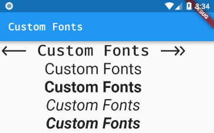

雖然 Android 和 iOS 內建都有字型，但常有自訂字型的需求，所以這篇會教你如何在 Flutter 使用自訂字型。

<!-- more -->

## 將字型檔放入專案資料夾內

此範例是放在 `./assets/fonts` 資料夾內：

```
assets/
  fonts/
    FiraCode-Medium.ttf
    mononoki-Bold.ttf
    mononoki-BoldItalic.ttf
    mononoki-Italic.ttf
    mononoki-Regular.ttf
```

## 在 `pubspec.yaml` 定義字型資訊

```yaml
flutter:
  fonts:
    - family: FiraCode
      fonts:
        - asset: assets/fonts/FiraCode-Medium.ttf
    - family: Mononoki
      fonts:
        - asset: assets/fonts/mononoki-Regular.ttf
        - asset: assets/fonts/mononoki-Bold.ttf
          weight: 700
        - asset: assets/fonts/mononoki-Italic.ttf
          style: italic
        - asset: assets/fonts/mononoki-BoldItalic.ttf
          weight: 700
          style: italic
```

## 設定預設字型


```dart
MaterialApp(
  title: 'Custom Fonts',
  theme: ThemeData(fontFamily: 'FiraCode'),
  home: MyHomePage(title: 'Custom Fonts'),
);
```

## 在特定 Widget 設定字型


```dart
Text(
  'Custom Fonts',
  style: TextStyle(
    fontFamily: 'Mononoki',
    fontSize: 30.0,
    fontWeight: FontWeight.w700,
    fontStyle: FontStyle.italic,
  ),
)
```

## 完整範例程式碼



```dart
import 'package:flutter/material.dart';

void main() => runApp(new MyApp());

class MyApp extends StatelessWidget {
  @override
  Widget build(BuildContext context) {
    return new MaterialApp(
      title: 'Custom Fonts',
      theme: new ThemeData(
        primarySwatch: Colors.blue,
        fontFamily: 'FiraCode',
      ),
      home: new MyHomePage(title: 'Custom Fonts'),
    );
  }
}

class MyHomePage extends StatelessWidget {
  MyHomePage({Key key, this.title}) : super(key: key);

  final String title;

  @override
  Widget build(BuildContext context) {
    return new Scaffold(
      appBar: new AppBar(
        title: new Text(this.title),
      ),
      body: Column(
        children: <Widget>[
          new Text(
            '<-- Custom Fonts ->>',
            style: TextStyle(fontSize: 30.0),
          ),
          new Text(
            'Custom Fonts',
            style: TextStyle(
              fontFamily: 'Mononoki',
              fontSize: 30.0,
            ),
          ),
          new Text(
            'Custom Fonts',
            style: TextStyle(
              fontFamily: 'Mononoki',
              fontSize: 30.0,
              fontWeight: FontWeight.w700,
            ),
          ),
          new Text(
            'Custom Fonts',
            style: TextStyle(
              fontFamily: 'Mononoki',
              fontSize: 30.0,
              fontStyle: FontStyle.italic,
            ),
          ),
          new Text(
            'Custom Fonts',
            style: TextStyle(
              fontFamily: 'Mononoki',
              fontSize: 30.0,
              fontWeight: FontWeight.w700,
              fontStyle: FontStyle.italic,
            ),
          ),
        ],
      ),
    );
  }
}

```

> 詳情可參考 [Using custom fonts - Flutter](https://flutter.io/cookbook/design/fonts/) 官方文件
