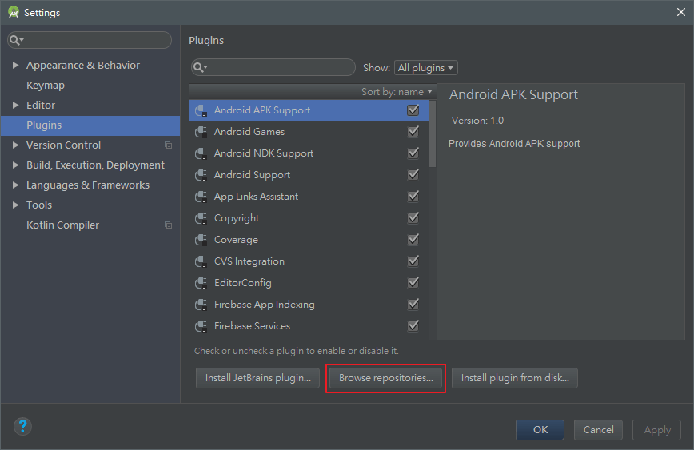

最近剛接觸 Flutter，於是就把在 Windows 上建置環境的記錄寫成一篇筆記，裡面包括 Android Studio 和 VS Code 的開發流程。

<!-- more -->

詳情可參考官方連結：[Get Started: Install on Windows | Flutter](https://flutter.io/setup-windows/)

## 系統要求

- OS：Windows 7 SP1 或以上 (64-bit)
- 硬碟空間：400 MB (不包括 IDE 和工具的空間)
- 工具
  - [PowerShell 5.0](https://docs.microsoft.com/en-us/powershell/scripting/setup/installing-windows-powershell?view=powershell-6#upgrading-existing-windows-powershell) 或更新版
  - [Git for Windows](https://git-scm.com/download/win) (勾選 `Use Git from the Windows Command Prompt` 選項，若沒打勾可自行將 Git 安裝目錄內的 `bin` 資料夾設定為 `Path` 環境變數，預設目錄為 `C:\Program Files\Git\bin` )

## 安裝 Flutter SDK

1. 下載 Flutter SDK，可下載[歷史版本](https://flutter.io/sdk-archive/#windows)，但建議安裝新版。
2. 解壓檔內有一個 `flutter` 資瞭夾，將此資料夾放在 Flutter SDK 所需的安裝目錄 (e.g `D:\dev\flutter`，請勿將 `flutter` 資瞭夾放在需要提高權限之類的目錄內，e.g. `C:\Program Files\` )。
3. 將 `flutter\bin` 的完整目錄 (e.g. `D:\dev\flutter\bin` ) 加入 `Path` 環境變數 (各完整路徑記得用 `;` 分號分隔)


4. 接著就可以在 Console 內執行 Flutter commands
5. 執行 `flutter --version` 指令確定已成功安裝 Flutter SDK

```shell
$ flutter --version
Flutter 0.7.3 • channel beta • https://github.com/flutter/flutter.git
Framework • revision 3b309bda07 (12 days ago) • 2018-08-28 12:39:24 -0700
Engine • revision af42b6dc95
Tools • Dart 2.1.0-dev.1.0.flutter-ccb16f7282
```

6. 之後請定期執行 `flutter upgrade` 指令更新 Flutter (因為目前還在 beta，大約幾週就會有新版)

執行 `flutter --version` 指令後，若看到下面畫面就代表現在有新版可以更新：

```shell
$ flutter --version
  ╔════════════════════════════════════════════════════════════════════════════╗
  ║ A new version of Flutter is available!                                     ║
  ║                                                                            ║
  ║ To update to the latest version, run "flutter upgrade".                    ║
  ╚════════════════════════════════════════════════════════════════════════════╝


Flutter 0.7.3 • channel beta • https://github.com/flutter/flutter.git
Framework • revision 3b309bda07 (3 weeks ago) • 2018-08-28 12:39:24 -0700
Engine • revision af42b6dc95
Tools • Dart 2.1.0-dev.1.0.flutter-ccb16f7282
```

執行 `flutter upgrade` 指令更新 Flutter：

```shell
$ flutter upgrade
Upgrading Flutter from D:\dev\flutter...
...
Flutter 0.7.3 • channel beta • https://github.com/flutter/flutter.git
Framework • revision 3b309bda07 (3 weeks ago) • 2018-09-07 12:33:05 -0700
Engine • revision 58a1894a1c
Tools • Dart 2.1.0-dev.1.0.flutter-ccb16f7282

Running flutter doctor...
Doctor summary (to see all details, run flutter doctor -v):
[√] Flutter (Channel beta, v0.8.2, on Microsoft Windows [Version 10.0.17134.285], locale zh-TW)
[√] Android toolchain - develop for Android devices (Android SDK 28.0.2)
[√] Android Studio (version 3.1)
[√] VS Code (version 1.27.2)
[!] Connected devices
    ! No devices available

! Doctor found issues in 1 category.
```

在執行一次 `flutter --version` 確認已更新至新的版本：

```shell
$ flutter --version
Flutter 0.8.2 • channel beta • https://github.com/flutter/flutter.git
Framework • revision 5ab9e70727 (13 days ago) • 2018-09-07 12:33:05 -0700
Engine • revision 58a1894a1c
Tools • Dart 2.1.0-dev.3.1.flutter-760a9690c2
```

## flutter doctor

下面指令是用來查看是否需要安裝任何依賴才能完成設定，因此他會檢查你的環境並顯示檢查報告：

```shell
$ flutter doctor
```

Dart SDK is bundled with Flutter，不用另外安裝 Dart。從檢查報告的輸出中可以了解需要安裝的其他軟體或執行的其他任務 (以粗體顯示)。例如：

```shell
$ flutter doctor
Doctor summary (to see all details, run flutter doctor -v):
[√] Flutter (Channel beta, v0.7.3, on Microsoft Windows [Version 10.0.17134.228], locale zh-TW)
[!] Android toolchain - develop for Android devices (Android SDK 28.0.2)
    X Android license status unknown.
[√] Android Studio (version 3.1)
    X Flutter plugin not installed; this adds Flutter specific functionality.
    X Dart plugin not installed; this adds Dart specific functionality.
[!] Connected devices
    ! No devices available

! Doctor found issues in 2 categories.
```

下面會介紹如何執行這些任務並完成設定過程。可再次執行 `flutter doctor` 指令來驗證是否已正確設定所有內容。

如果已驗證設定所有內容，就會看到下面輸出結果：

```shell
$ flutter doctor
Doctor summary (to see all details, run flutter doctor -v):
[√] Flutter (Channel beta, v0.7.3, on Microsoft Windows [Version 10.0.17134.285], locale zh-TW)
[√] Android toolchain - develop for Android devices (Android SDK 28.0.2)
[√] Android Studio (version 3.1)
[√] Connected devices (1 available)

• No issues found!
```

加上參數 `-v`，可以看更詳細的驗證說明：

```shell
$ flutter doctor -v
[√] Flutter (Channel beta, v0.7.3, on Microsoft Windows [Version 10.0.17134.285], locale zh-TW)
    • Flutter version 0.7.3 at D:\dev\flutter
    • Framework revision 3b309bda07 (3 weeks ago), 2018-08-28 12:39:24 -0700
    • Engine revision af42b6dc95
    • Dart version 2.1.0-dev.1.0.flutter-ccb16f7282

[√] Android toolchain - develop for Android devices (Android SDK 28.0.2)
    • Android SDK at C:\Users\Titan\AppData\Local\Android\sdk
    • Android NDK location not configured (optional; useful for native profiling support)
    • Platform android-28, build-tools 28.0.2
    • ANDROID_HOME = C:\Users\Titan\AppData\Local\Android\sdk
    • Java binary at: C:\Program Files\Android\Android Studio\jre\bin\java
    • Java version OpenJDK Runtime Environment (build 1.8.0_152-release-1024-b02)
    • All Android licenses accepted.

[√] Android Studio (version 3.1)
    • Android Studio at C:\Program Files\Android\Android Studio
    • Flutter plugin version 28.0.1
    • Dart plugin version 173.4700
    • Java version OpenJDK Runtime Environment (build 1.8.0_152-release-1024-b02)

[√] Connected devices (1 available)
    • SM N950F • 988a98444d********** • android-arm64 • Android 8.0.0 (API 26)

• No issues found!
```

## Android 設定

:::info
Flutter 依賴於 Android Studio 以提供 Android 平台的依賴性。但也可以使用其他編輯器來寫 Flutter App。
:::

### 安裝 Java JDK

1. 安裝 [JDK](http://www.oracle.com/technetwork/java/javase/downloads/index.html)
2. 將 Java JDK 安裝目錄設定為 `JAVA_HOME` 環境變數 (e.g. `C:\Program Files\Java\jdk1.8.0_151` )，並在將 Java JDK 安裝目錄內的 `bin` 資料夾設定為 `Path` 環境變數 (e.g. `C:\Program Files\Java\jdk1.8.0_151\bin`，也可設定為 `%JAVA_HOME%\bin` )

### 安裝 Android Studio

1. 安裝 [Android Studio](https://developer.android.com/studio/)，請安裝 Recommended (建議) 版
2. 執行 Android Studio，並瀏覽 `Android Studio Setup Wizard`，安裝最新的 Android SDK、Android SDK Platform-Tools、Android SDK Build-Tools，這些都是 Flutter 在開發 Android 時所必須的。


3. 將 Android SDK 目錄設定為 `ANDROID_HOME` 環境變數 (預設目錄為 `C:\Users\Titan\AppData\Local\Android\sdk` )
4. 定期更新 Android SDK (於 `Android Studio` > `Configure` > `SDK Manager` 安裝)

### 設定你的 Android 裝置

想在 Android 裝置上執行和測試 Flutter App，需要 Android 4.1 (API level 16) 或更高版本的 Android 設備。

1. 裝置請開啟 `開發者模式` 內的 `USB 偵錯`，詳情可參考 [Configure on-device developer options  |  Android Developers](https://developer.android.com/studio/debug/dev-options) 此 Android 官方文件


2. 安裝 [Google USB Driver](https://developer.android.com/studio/run/win-usb) (限 Windows)
3. 使用 USB 線將裝置連接至電腦，如果你的裝置有出現提示，請授權你的電腦可訪問你的裝置


4. 開啟終端機，執行 `flutter devices` 指令以驗證 Flutter 是否成功連結 Android 裝置

```shell
# 像我連接到 Note 8
$ flutter devices
1 connected device:

SM N950F • 988a98444d********** • android-arm64 • Android 8.0.0 (API 26)
```

Flutter 預設會以 `adb` 工具基於的 Android SDK 版本來使用，若想用其他版本的 Android SDK，可設定你所需的 Android SDK 目錄為 `ANDROID_HOME` 環境變數。

如果執行 `flutter run`指令，而且成功將 App 安置手機並執行，就會看到 App 的畫面


### 設定 Android 模擬器 (emulator)

想在 Android 模擬器上執行和測試 Flutter App，請依照下面步驟：

1. 在主機上啟用 [VM acceleration](https://developer.android.com/studio/run/emulator-acceleration)
2. 啟動 **Android Studio** > **Tools** > **AVD Manager** 並點選 **Create Virtual Device**


1. 選擇設備定義，然後點擇 **Next**


2. 選擇你所需的 Android 版本的 OS image，然後點選 **Next** (建議選擇 _x86_ 或 x86_64 image)


3. 在 Emulated Performance 欄位請選擇 **Hardware - GLES 2.0** 以啟用 [hardware acceleration](https://developer.android.com/studio/run/emulator-acceleration)


4. 驗證 AVD 設定是否正確，若確定請點選 **Finish**
5. 在 Android Virtual Device Manager 中，選擇某台模擬器並點擊 Run


有關上述步驟的詳情可參考 [Managing AVDs](https://developer.android.com/studio/run/managing-avds.html)

## 設定編輯器

### 設定 Android Studio

安裝 Flutter 和 Dart plugins (外掛)，有兩個 plugin 支援 Flutter：

- `Flutter` 外掛：支持 Flutter 開發人員工作流程 (running, debugging, hot reload ... 等)
- `Dart` 外掛：提供程式碼分析 (輸入時的程式碼驗證、程式碼自動補全)

安裝步驟：

1. 執行 Android Studio
2. 開啟外掛選項 (**File** > **Settings** > **Plugins**)


3. 點選 **Browse repositories…**，接著搜尋 `Flutter` 並選擇並安裝名為 `Flutter` 的 plugin (請注意，安裝 `Flutter` 外掛時會同時安裝 `Dart` 語言外掛)




4. 點擊 **Restart Android Studio**


### 設定 VS Code

- 安裝 Flutter plugin：
  - 安裝 [Flutter](https://marketplace.visualstudio.com/items?itemName=Dart-Code.flutter) 此擴充功能，並重啟 VS Code。


- 使用 Flutter Doctor 驗證你的設定環境：
  - 按 `F1` 或 `ctrl + shift + p` 後，輸入 **Flutter** 並點選 **Flutter: Run Flutter Doctor** 即可至 **OUTPUT (輸出)** 查看驗證結果。


## 使用 Android Studio 開發

### 建立新 app

在 Android Studio 中建立 Flutter 專案 ( **File** > **New** > **New Flutter Project...** )


接著選擇 **Flutter Application**，並點選 **Next**


請設定專案名稱、確定 Flutter SDK 目錄、設定專案儲存位置與填寫專案的簡單描述後，點選 **Next**


最後輸入公司網域 (e.g. example.com) 後，點選 **Finish** 即可建立新的 Flutter 專案


### 執行 app

下圖為 Android Studio 的工具列：


圖片來源：[Get Started: Test Drive | Flutter](https://flutter.io/get-started/test-drive/#androidstudio)

1. 在 **target selector** 中，選擇已執行的 Android 裝置，若當前未啟動或未連接任何 Android 裝置，選擇某一模擬器時，Android Studio 就會開啟該選擇的模擬器。如果沒有可用的裝置，可至前面介紹的 [設定 Android 模擬器](#設定-Android-模擬器-emulator) 段落來新建模擬器。
2. 點擊 **Run** 圖示執行 app
3. 稍後就會在模擬器或裝置上看到下圖的 app 畫面
   1. 等待的過程中會初始化 gradle
   2. gradle 會 resolve dependencies
   3. 將專案轉成 apk
   4. 將 apk 安裝並執行於裝置上


```shell
Launching lib\main.dart on Android SDK built for x86 64 in debug mode...
Initializing gradle...
Resolving dependencies...
Running 'gradlew assembleDebug'...
Built build\app\outputs\apk\debug\app-debug.apk.
Installing build\app\outputs\apk\app.apk...
D/OpenGLRenderer( 4777): HWUI GL Pipeline
I/OpenGLRenderer( 4777): Initialized EGL, version 1.4
D/OpenGLRenderer( 4777): Swap behavior 1
D/        ( 4777): HostConnection::get() New Host Connection established 0x7073cf2e5b00, tid 4831
W/OpenGLRenderer( 4777): Failed to choose config with EGL_SWAP_BEHAVIOR_PRESERVED, retrying without...
D/OpenGLRenderer( 4777): Swap behavior 0
D/EGL_emulation( 4777): eglCreateContext: 0x7073cf2a7600: maj 2 min 0 rcv 2
D/EGL_emulation( 4777): eglMakeCurrent: 0x7073cf2a7600: ver 2 0 (tinfo 0x7073b4be9300)
D/EGL_emulation( 4777): eglCreateContext: 0x7073cf3b10a0: maj 2 min 0 rcv 2
D/EGL_emulation( 4777): eglMakeCurrent: 0x7073cf3b10a0: ver 2 0 (tinfo 0x7073c2fe87c0)
Syncing files to device Android SDK built for x86 64...
D/EGL_emulation( 4777): eglMakeCurrent: 0x7073cf2a7600: ver 2 0 (tinfo 0x7073b4be9300)
D/        ( 4777): HostConnection::get() New Host Connection established 0x7073cf2e65e0, tid 4813
D/EGL_emulation( 4777): eglMakeCurrent: 0x7073cf3b10a0: ver 2 0 (tinfo 0x7073c560d6c0)
```

### 嘗試 hot reload

修改一些內容並儲存，app 就會自動做 hot reload，就會很快地看到最新的更新。

## 使用 VS Code 開發

### 建立新 app

1. 按 `F1` 或 `ctrl + shift + p` 後，輸入 **Flutter** 並點選 **Flutter: New Project**


2. 輸入專案名稱後，按 `enter` 鍵


3. 選擇專案目錄的儲存位置
4. 等待專案建立完成，並在畫面顯示 `lib/main.dart` 檔案


### 執行 app

1. 從 VS Code 底部的藍色狀態欄中點選 **Device Selector**

   - 若要使用實體裝置，詳情至 [設定你的 Android 裝置](#%E8%A8%AD%E5%AE%9A%E4%BD%A0%E7%9A%84-Android-%E8%A3%9D%E7%BD%AE) 參考。若連結成功會在 VS Code 底部的藍色狀態欄中看到你的裝置名稱

     

   - 如果沒有可用的裝置，請點選 **No Devices** 並啟動模擬器

     

     

2. 執行 **Debug**


3. 等待 App 執行，可在偵錯主控台 (Debug Console) 看到執行進度，稍後就會在模擬器或裝置上看到下圖的 app 畫面


## 使用 Terminal + Editor 開發

### 建立新 app

使用 `flutter create` 指令來建立 Flutter 專案，裡面包含 [Material Components](https://material.io/design/) 的範例 app。app 的程式碼在 `lib/main.dart`。

```shell
$ flutter create <prject-name>
$ cd <prject-name>
```

### 執行 app

使用 `flutter devices` 指令可檢查是否有正在執行的模擬器或裝置。如果沒有可用的裝置，可至前面介紹的 [設定 Android 模擬器](#設定-Android-模擬器-emulator) 段落來新建模擬器。

```shell
$ flutter devices
1 connected device:

Android SDK built for x86 64 • emulator-5554 • android-x64 • Android 8.0.0 (API 26) (emulator)
```

使用 `flutter run` 指令可執行 app，並提供以下功能的快速鍵：

- `r`：hot reload
- `R`：hot restart (and rebuild state)
- `h`：顯示更多幫助訊息
- `q`：停止執行

```shell
$ flutter run
Using hardware rendering with device Android SDK built for x86 64. If you get graphics artifacts, consider enabling software rendering with "--enable-software-rendering".
Launching lib/main.dart on Android SDK built for x86 64 in debug mode...
Initializing gradle...                                       1.7s
Resolving dependencies...                                   48.1s
Running 'gradlew assembleDebug'...                          88.5s
Built build\app\outputs\apk\debug\app-debug.apk.
Installing build\app\outputs\apk\app.apk...                 11.4s
Syncing files to device Android SDK built for x86 64...
D/        ( 5458): HostConnection::get() New Host Connection established 0x7073c31aabe0, tid 5513
D/EGL_emulation( 5458): eglMakeCurrent: 0x7073cf3b1280: ver 2 0 (tinfo 0x7073c2ab65c0)                                       12.3s

🔥  To hot reload changes while running, press "r". To hot restart (and rebuild state), press "R".
An Observatory debugger and profiler on Android SDK built for x86 64 is available at: http://127.0.0.1:2158/
For a more detailed help message, press "h". To quit, press "q".
```
