本篇是紀錄在 Google 的 Qwiklab 平台內，完成「[Set Up Network and HTTP Load Balancers](https://www.qwiklabs.com/focuses/558?parent=catalog)」這個 quest 所學到的內容，包括如何建立多個 web server instance，以及如何建立 network load balancer 和 HTTP load balancer。

<!-- more -->

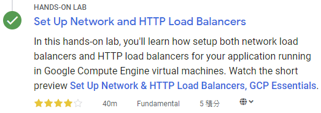

在此 lab 中，你將了解 network load balancer 和 HTTP load balancer 之間的差異，以及如何為 Google Compute Engine (GCE) VM 上執行的應用程式設定 load balancer。

你可通過多種方式[在 GCP 內進行負載平衡 (load balance)](https://cloud.google.com/load-balancing/docs/load-balancing-overview#a_closer_look_at_cloud_load_balancers)。此 lab 將教你完成以下 load balancer 的設定：

- L3 (Network Layer) [Network Load Balancer ](https://cloud.google.com/compute/docs/load-balancing/network/)
- L7 (Application Layer) [HTTP(s) Load Balancer](https://cloud.google.com/compute/docs/load-balancing/http/)

## 本篇將會做什麼？

- 設定 network load balancer
- 設定 HTTP load balancer
- 透過實作，了解 network load balancer 和 HTTP load balancer 之間的差異

## 準備

在點擊「Start Lab」之前，準備好網路瀏覽器 (推薦用 Google Chrome)，並且至少 40 分鐘可以專注的時間，因為 lab 是有時間限制，當你按下「Start Lab」開始學習時，無法暫停倒數計時，你只能在這段時間內使用 lab 提供給你的全新暫時 GCP Console 可用帳號，時間到之後的幾分鐘就會自動登出。

:::warning
注意：如果你有自己的個人 GCP 帳號或專案，請不要在此 lab 使用
:::

## 開始你的 Lab，然後登入 GCP Console

1. 如果準備要開始，可以點擊右上角的「Start Lab」開始：

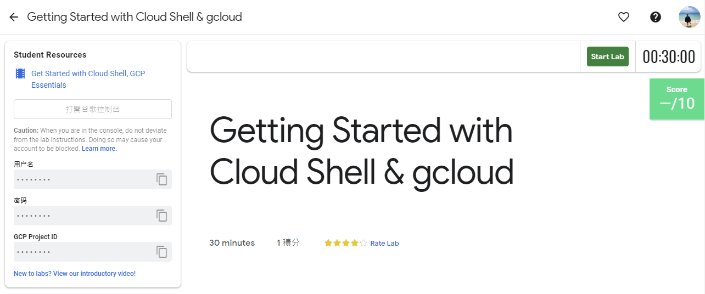

2. 接著會出現這個畫面，因為我參加 [GDG Tainan](https://www.facebook.com/events/2005848903055499/) 的活動，活動有提供 Qwiklabs 一個月的免費額度，所以我點選下圖左邊的「Use Subscription」：

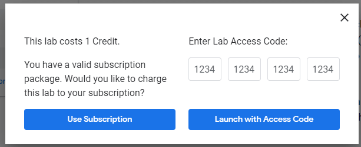

3. Lab 會提供給你免費暫時的 GCP 帳號，複製帳號和密碼，然後點擊「Open Google Console」開啟 [GCP Console](https://cloud.google.com/storage/docs/cloud-console)：

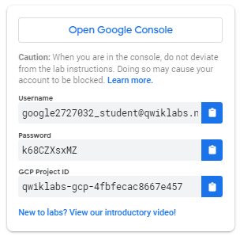

圖片來源：[Creating a Virtual Machine | Qwiklabs](https://www.qwiklabs.com/focuses/3563?parent=catalog)

4. 接著就會開啟登入頁面，建議另外開 Chrome 無痕模式來登入 lab 提供的帳號和密碼，因為 Chrome 會紀錄帳密，現在登入的只是暫時帳號，未來不需要用到：

:::warning
注意：這邊是登入 lab 提供的帳號 (也就是 email 必須為 `googlexxxxxx_student@qwiklabs.net` )，如果你有自己的 GCP 帳號，請不要用於此 lab，避免產生費用

> 類似於 `googlexxxxxx_student@qwiklabs.net` 的帳號是一個 Google 帳號，專為 Qwiklabs 學生使用而建立的。它具有特定的域名 (也就是 `qwiklabs.net` )，並且已分配了 IAM 角色，允許你去存取該 GCP 專案。

:::

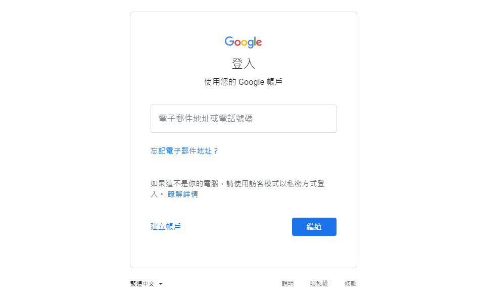

5. 接受 terms 和 conditions：

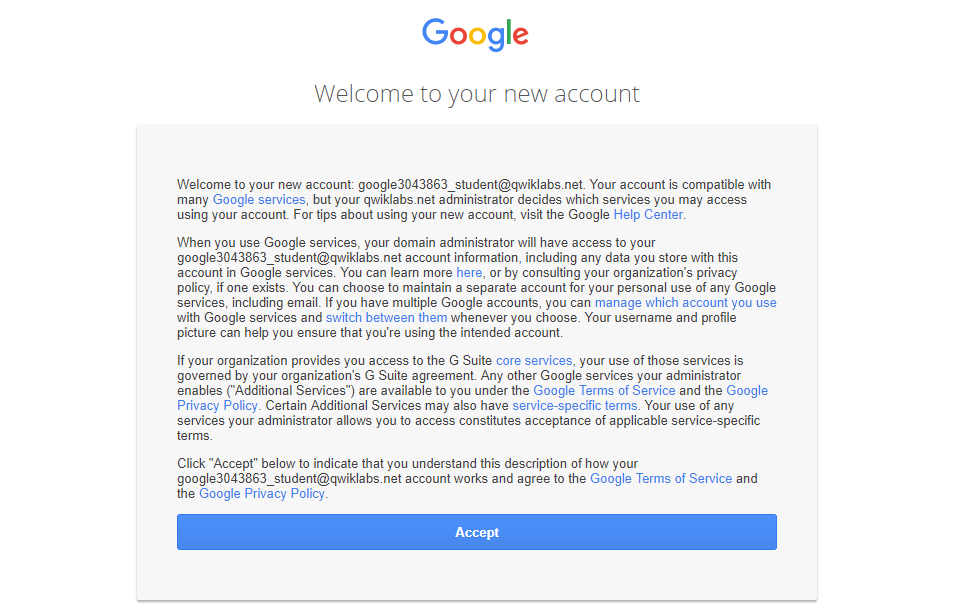

6. 不要新增 recovery options 或 two-factor authentication (因為這是一個臨時帳號)：

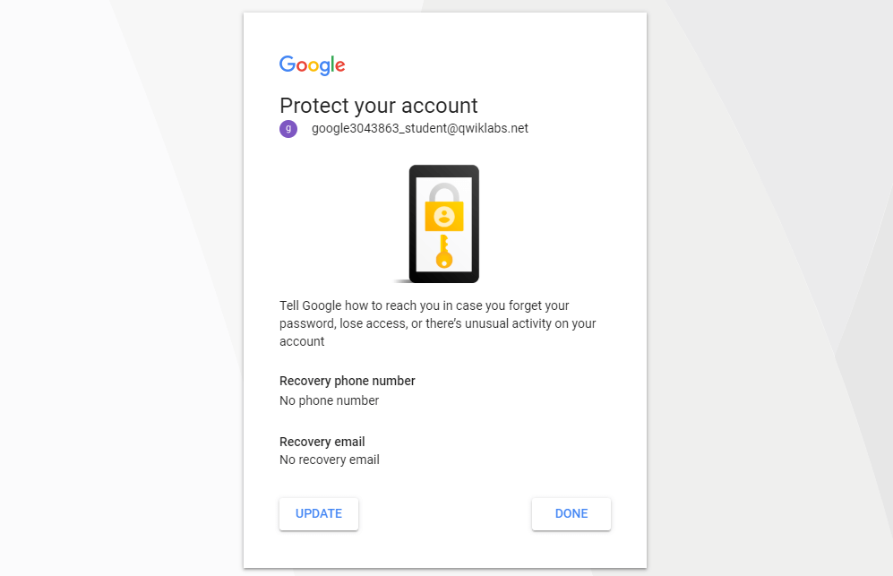

7. 勾選同意服務條款：

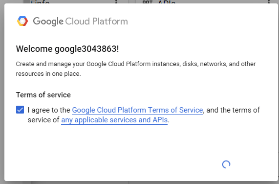

之後就可以開始使用 GCP Console 囉：

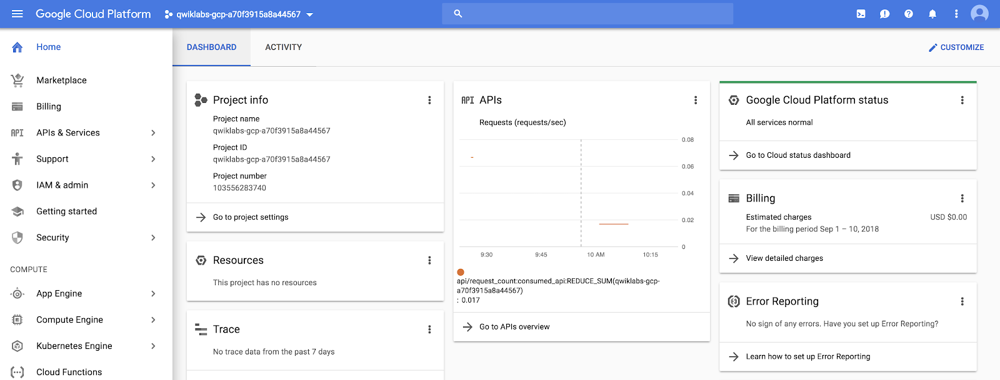

## 啟動 Google Cloud Shell

Google Cloud Shell 是載入了開發工具的 VM，它提供 5GB 的 home 目錄，並在 Google Cloud 上執行。可用 Google Cloud Shell 提供的 command-line 來存取 GCP 的資源。

1. 在 GCP console 的右上方工具列中，點擊「Activate Cloud Shell」按鈕：

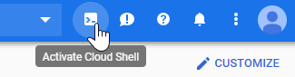

2. 在打開的對話框內，點擊「START CLOUD SHELL」：

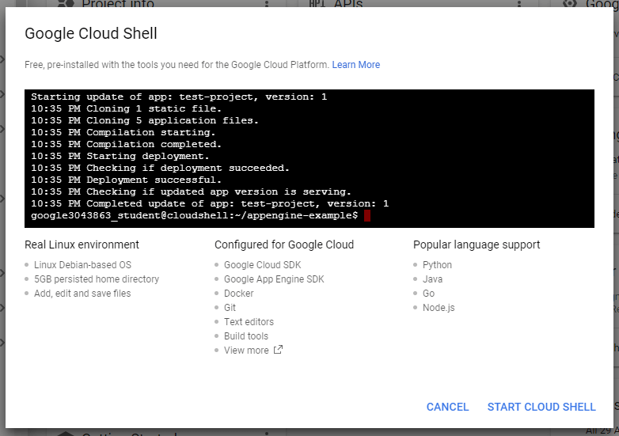

3. 連接和提供環境需要一些時間：

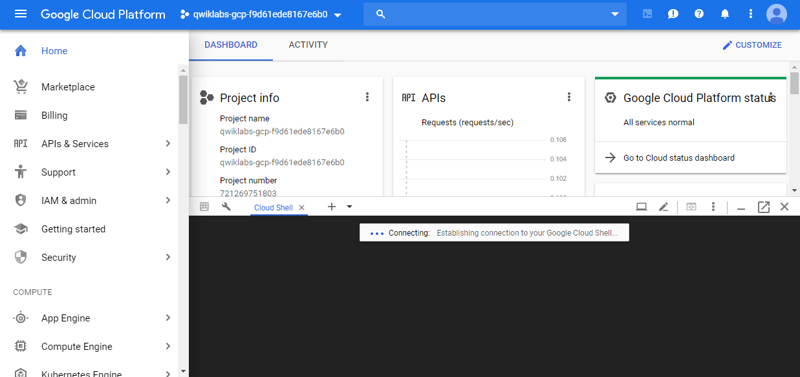

4. 連接後，就代表你已經過身份驗證，專案已設置為 `PROJECT_ID`，以下圖的為例，此專案的 ID 為 `qwiklabs-gcp-f9d61ede8167e6b0`：

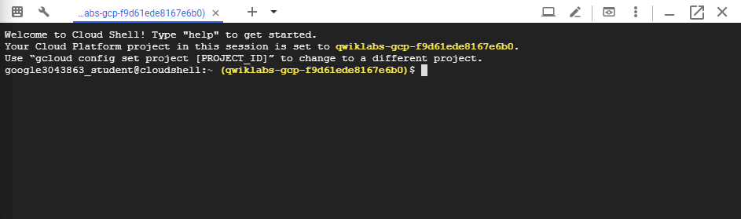

`gcloud` 是 GCP 的 command-line 工具，他已預先安裝在 Cloud Shell 上，並且支援 tab 自動補齊 (tab-completion)。

使用下面指令可列出有效帳號名稱：

```shell
$ gcloud auth list
          Credentialed Accounts
ACTIVE  ACCOUNT
*       google3043863_student@qwiklabs.net

To set the active account, run:
    $ gcloud config set account `ACCOUNT`
```

可以使用以下指令列出專案 ID：

```shell
$ gcloud config list project
[core]
project = qwiklabs-gcp-f9d61ede8167e6b0

Your active configuration is: [cloudshell-9292]
```

> 詳情可參考官方的 [Google Cloud gcloud Overview](https://cloud.google.com/sdk/gcloud/) 文件。

## 為所有資源設定預設的 region 和 zone

在 Cloud Shell 中，執行以下指令設定預設 zone 為 `us-central1-a`：

```shell
$ gcloud config set compute/zone us-central1-a
Updated property [compute/zone].
```

在 Cloud Shell 中，執行以下指令設定預設 region 為 `us-central1`：

```shell
$ gcloud config set compute/region us-central1
Updated property [compute/region].
```

> 詳情可參考官方的 [Regions & Zones](https://cloud.google.com/compute/docs/regions-zones/) 文件。

:::info
注意：在自己的機器上執行 `gcloud` 時，`config` 設定在 session 中保持不變 (persist across)。在 Cloud Shell 中，你需要為每個新的 session 或重新連接設定此項。
:::

## 建立多個 web server instance

為了模擬來至一個叢集主機的服務，請使用 [Instance Templates](https://cloud.google.com/compute/docs/instance-templates) 和 [Managed Instance Groups](https://cloud.google.com/compute/docs/instance-groups/) 建立一個簡單的 Nginx web server 叢集來提供靜態內容。Instance Templates 定義叢集中每個 VM 的規格 (硬碟、CPU、記憶體...等)，Managed Instance Groups 使用 Instance Templates 實例化 (instantiate) 多個 VM instance。

要建立一個 Nginx web server 叢集，請建立以下內容：

- 一個用來在每個 VM instance 啟動時設定 Nginx server 的 startup script
- 一個要使用 startup script 的 instance template
- 一個 target pool
- 一個使用 instance template 的 managed instance group

### 建立 startup script

在 Cloud Shell 執行下面指令，建立要讓每個 VM instance 使用的 startup script。此 script 會在啟動時設定 Nginx server：

```bash
cat << EOF > startup.sh
#! /bin/bash
apt-get update
apt-get install -y nginx
service nginx start
sed -i -- 's/nginx/Google Cloud Platform - '"\$HOSTNAME"'/' /var/www/html/index.nginx-debian.html
EOF
```

### 建立 instance template

建立一個使用 startup script 的 instance template：

- `nginx-template`：instance template 的名稱
- `--metadata-from-file startup-script=startup.sh`：`--metadata-from-file` 參數會從 local 檔案中找到指定的 startup script

```shell
$ gcloud compute instance-templates create nginx-template \
         --metadata-from-file startup-script=startup.sh
```

輸出：

```shell
Created [https://www.googleapis.com/compute/v1/projects/qwiklabs-gcp-.../global/instanceTemplates/nginx-template].
NAME            MACHINE_TYPE   PREEMPTIBLE  CREATION_TIMESTAMP
nginx-template  n1-standard-1               2019-04-22T04:53:53.045-07:00
```

如果上面指令沒有提供明確的 template 設定，`gcloud compute` 會使用以下預設值建立 template：

- 機型：`n1-standard-1`
- image：最新版的 Debian image
- 開機磁碟：以 instance 命名的新標準開機磁碟
- 網路：`default` VPC 網路
- IP 位址：臨時的外部 IP 位址

> 詳情可參考官方的 [`gcloud compute instance-templates`](https://cloud.google.com/sdk/gcloud/reference/compute/instance-templates/) 文件。

> 若想了解更多建立 instance template 的方法，詳情可參考官方的 [Creating Instance Templates](https://cloud.google.com/compute/docs/instance-templates/create-instance-templates) 文件。

### 建立 target pool

target pool 資源定義了一組可以從 forwarding rules 接收收到流量的 instance。當 forwarding rules 將流量導向到 target pool 時，Google Cloud Load Balancing 會根據 source IP 和 port 以及目標 IP 和 port 的 hash 值，從這些 target pool 中選擇一個 instance。

建立 target pool，target pool 允許單個存取點到群組中的所有 instance，而且對於之後步驟的負載平衡來說是必需的：

```shell
$ gcloud compute target-pools create nginx-pool
```

輸出：

```shell
Created [https://www.googleapis.com/compute/v1/projects/qwiklabs-gcp-.../regions/us-central1/targetPools/nginx-pool].
NAME        REGION       SESSION_AFFINITY  BACKUP  HEALTH_CHECKS
nginx-pool  us-central1  NONE
```

> 詳情可參考官方文件：
>
> - 建立 target pool 指令：[`gcloud compute target-pools create`](https://cloud.google.com/sdk/gcloud/reference/compute/target-pools/create)
> - [Network Load Balancing Concepts](https://cloud.google.com/load-balancing/docs/network/)
> - [Using Target Pools](https://cloud.google.com/load-balancing/docs/target-pools)

### 建立 managed instance group

使用 instance template 建立 managed instance group：

- `nginx-group`：instance group 的名稱
- `--base-instance-name nginx`：其中的 `nginx` 是指在此 managed instance group 中建立的 instance 使用的名稱。由於這些 instance 都一樣，系統會用隨機字串來作為 instance 名稱的一部分，例如：如果 base 名稱是 `nginx`，instance 的名稱就可能會是 `nginx-cl3t`、`nginx-sqgw` ... 等
- `--size 2`：instance group 的大小
- `--template nginx-template`：用於此群組的 instance template 的名稱
- `--target-pool nginx-pool`：要新增此 instance group 的 target pool 的名稱 (可多個 target pool)

```shell
$ gcloud compute instance-groups managed create nginx-group \
         --base-instance-name nginx \
         --size 2 \
         --template nginx-template \
         --target-pool nginx-pool
```

輸出：

```shell
Created [https://www.googleapis.com/compute/v1/projects/qwiklabs-gcp-.../zones/us-central1-a/instanceGroupManagers/nginx-group].
NAME         LOCATION       SCOPE  BASE_INSTANCE_NAME  SIZE  TARGET_SIZE  INSTANCE_TEMPLATE  AUTOSCALED
nginx-group  us-central1-a  zone   nginx               0     2            nginx-template     no
```

> 詳情可參考官方的 [Creating groups of managed instances](https://cloud.google.com/compute/docs/instance-groups/creating-groups-of-managed-instances) 文件。

執行上面的指令後，會建立兩個 VM instance，名稱會以 `nginx-` 為前綴，可能需要等幾分鐘。

接著查看已建立的所有 compute engine instance：

```shell
$ gcloud compute instances list
```

輸出：

```shell
NAME        ZONE           MACHINE_TYPE   PREEMPTIBLE  INTERNAL_IP  EXTERNAL_IP     STATUS
nginx-cl3t  us-central1-a  n1-standard-1               10.128.0.3   35.193.149.246  RUNNING
nginx-sqgw  us-central1-a  n1-standard-1               10.128.0.2   130.211.208.12  RUNNING
```

### 設定防火牆

設定防火牆後，就可以透過 `EXTERNAL_IP` 位址和 80 port 來連接機器：

```shell
$ gcloud compute firewall-rules create www-firewall --allow tcp:80
```

輸出：

```shell
Creating firewall...⠛Created [https://www.googleapis.com/compute/v1/projects/qwiklabs-gcp-.../global/firewalls/www-firewall].
Creating firewall...done.
NAME          NETWORK  DIRECTION  PRIORITY  ALLOW   DENY  DISABLED
www-firewall  default  INGRESS    1000      tcp:80        False
```

執行上面的指令後，應該就能透過外部 IP 位址 (也就是 `http://EXTERNAL_IP/` ) 來連接剛剛建立的兩個 instance，可以在各別的頁面中，看到各個 instance 的名稱：

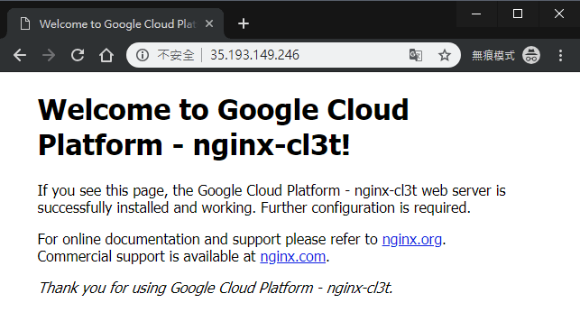

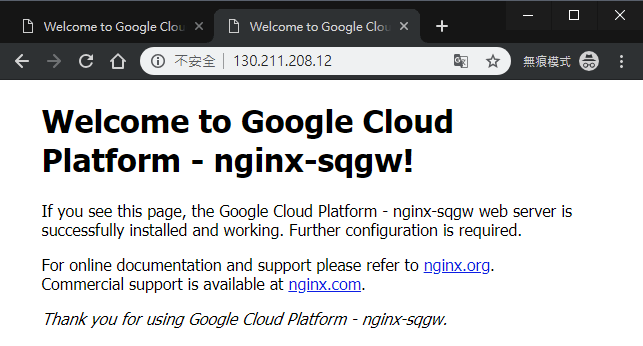

## 建立 Network Load Balancer

Network load balancing 允許你依據收到的 IP 協定資料 (例如：位址、port 和協定類型) 來平衡系統的負載。你還可以取得 HTTP(S) load balancing 沒有提供的一些選項。例如：可以對其他基於 TCP/UDP 的協定 (例如：SMTP 流量) 進行負載平衡。如果你的應用程式對 TCP 連接相關的特性感興趣，network load balancing 也允許你的應用程式去檢查封包，而 HTTP(S) load balancing 則沒有提供。

> 詳情可參考官方的 [Setting Up Network Load Balancing](https://cloud.google.com/compute/docs/load-balancing/network/) 文件。

針對你的 instance group 來建立 L3 network load balancer：

```shell
$ gcloud compute forwarding-rules create nginx-lb \
         --region us-central1 \
         --ports=80 \
         --target-pool nginx-pool
```

輸出：

```shell
Created [https://www.googleapis.com/compute/v1/projects/qwiklabs-gcp-.../regions/us-central1/forwardingRules/nginx-lb].
```

Forwarding rule 要與 target pool 一起使用，以支援 load balancing 功能，要使用 load balancing 就必須建立 forwarding rule，這樣才會將流量導向到特定的 target pool (用於 load balancing)，而下面指令中的 `--ports=80` 代表指向 target pool 的外部 port 範圍。

列出專案中所有 Google Compute Engine (GCE) 的 Forwarding rule：

```shell
$ gcloud compute forwarding-rules list
```

輸出：

```shell
NAME      REGION       IP_ADDRESS      IP_PROTOCOL  TARGET
nginx-lb  us-central1  35.202.173.185  TCP          us-central1/targetPools/nginx-pool
```

接著透過 `http://IP_ADDRESS/` 來存取 load balancer，`IP_ADDRESS` 是上面執行的指令中所輸出的 IP 位址。

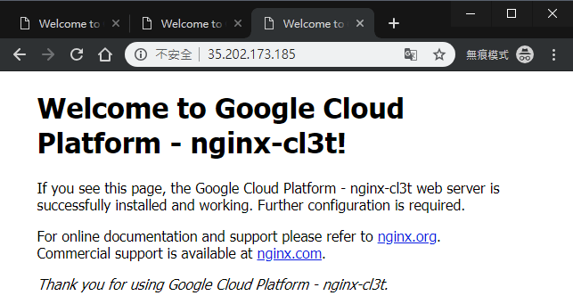

## 建立 HTTP(S) Load Balancer

HTTP(S) Load Balancing 提供全球性的 load balancing，能將 HTTP 請求送往你的 instance。你可以設定 URL 規則，將一些 URL 路由 (route) 到一組 instance，並將其他 URL 路由到其他 instance。請求都會路由到最接近使用者的 instance group，前提是該 group 具有足夠的資源，並且適合請求。如果最近的 group 沒有足夠的資源，那請求將會送至具有足夠資源，並且是最接近使用者的 group。

> 詳情可參考官方的 [HTTP(S) Load Balancer](https://cloud.google.com/compute/docs/load-balancing/http/) 文件。

首先，建立 [health check](https://cloud.google.com/compute/docs/load-balancing/health-checks)。health check 可以確認 instance 是否有回應 HTTP 或 HTTPS 流量，其他的 `http-basic-check` 是 legacy health check 的名稱。在專案中，每個 legacy health check 的名稱不能重複：

```shell
$ gcloud compute http-health-checks create http-basic-check
```

輸出：

```shell
Created [https://www.googleapis.com/compute/v1/projects/qwiklabs-gcp-.../global/httpHealthChecks/http-basic-check].
NAME              HOST  PORT  REQUEST_PATH
http-basic-check        80    /
```

定義 HTTP service，並將 port 號 map 到 instance group 的相關 port。現在 load balancing service 可以將流量 forward 到指定的 port 號：

```shell
$ gcloud compute instance-groups managed \
       set-named-ports nginx-group \
       --named-ports http:80
```

輸出：

```shell
Updated [https://www.googleapis.com/compute/v1/projects/qwiklabs-gcp-.../zones/us-central1-a/instanceGroups/nginx-group].
```

> 詳情可參考官方的 [Creating groups of managed instances](https://cloud.google.com/compute/docs/instance-groups/creating-groups-of-managed-instances) 文件。

建立 [後端服務 (backend service)](https://cloud.google.com/compute/docs/reference/latest/backendServices)：

```shell
$ gcloud compute backend-services create nginx-backend \
      --protocol HTTP \
      --http-health-checks http-basic-check \
      --global
```

輸出：

```shell
Created [https://www.googleapis.com/compute/v1/projects/qwiklabs-gcp-.../global/backendServices/nginx-backend].
NAME           BACKENDS  PROTOCOL
nginx-backend            HTTP
```

將 instance group 加到後端服務中：

```shell
$ gcloud compute backend-services add-backend nginx-backend \
    --instance-group nginx-group \
    --instance-group-zone us-central1-a \
    --global
```

輸出：

```shell
Updated [https://www.googleapis.com/compute/v1/projects/qwiklabs-gcp-.../global/backendServices/nginx-backend].
```

建立一個預設的 URL map，將所有收到的請求導向你的所有 instance：

```shell
$ gcloud compute url-maps create web-map \
    --default-service nginx-backend
```

輸出：

```shell
Created [https://www.googleapis.com/compute/v1/projects/qwiklabs-gcp-.../global/urlMaps/web-map].
NAME     DEFAULT_SERVICE
web-map  backendServices/nginx-backend
```

> 若要根據請求的 URL 將流量導向不同的 instance，詳情可參考官方的 [content-based routing](https://cloud.google.com/compute/docs/load-balancing/http/content-based-example) 文件。

建立 target HTTP proxy，將請求路由到 URL map：

```shell
$ gcloud compute target-http-proxies create http-lb-proxy \
    --url-map web-map
```

輸出：

```shell
Created [https://www.googleapis.com/compute/v1/projects/qwiklabs-gcp-.../global/targetHttpProxies/http-lb-proxy].
NAME           URL_MAP
http-lb-proxy  web-map
```

建立 [global forwarding rule](https://cloud.google.com/load-balancing/docs/https/global-forwarding-rules)，以處理和路由收到的請求。forwarding rule 會根據指定的 IP 位址、IP 協定和 port，將流量送至特定的 target HTTP 或 HTTPS proxy。global forwarding rule 不支援多 port。

```shell
$ gcloud compute forwarding-rules create http-content-rule \
        --global \
        --target-http-proxy http-lb-proxy \
        --ports 80
```

輸出：

```shell
Created [https://www.googleapis.com/compute/v1/projects/qwiklabs-gcp-.../global/forwardingRules/http-content-rule].
```

建立 global forwarding rule 後，設定可能需要幾分鐘才能傳播 (propagate)：

```shell
$ gcloud compute forwarding-rules list
```

輸出：

```shell
NAME               REGION       IP_ADDRESS      IP_PROTOCOL  TARGET
http-content-rule               34.96.77.47     TCP          http-lb-proxy
nginx-lb           us-central1  35.202.173.185  TCP          us-central1/targetPools/nginx-pool
```

複製 forwarding rule 內的 `http-content-rule` 中的 `IP_ADDRESS`。

你可能需要幾分鐘才能透過瀏覽器連接到 `http://IP_ADDRESS/`。如果無法連接 (就像下圖這樣)，請稍等一下，再重新整理瀏覽器：

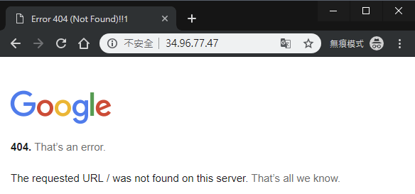

下面兩張圖就是多次連接 `http://IP_ADDRESS/` 的時候，常會看到畫面在這兩個之前建立的 VM instance 間切換：

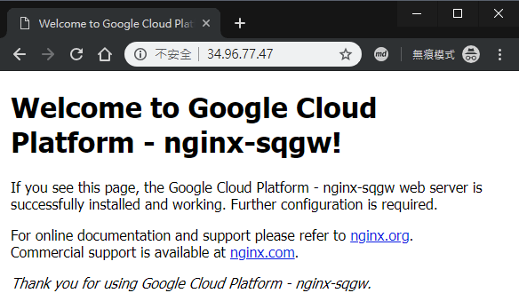

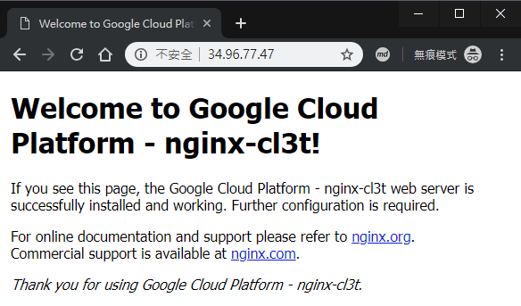

## 參考來源

- [Set Up Network and HTTP Load Balancers](https://www.qwiklabs.com/focuses/558?parent=catalog)
