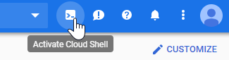
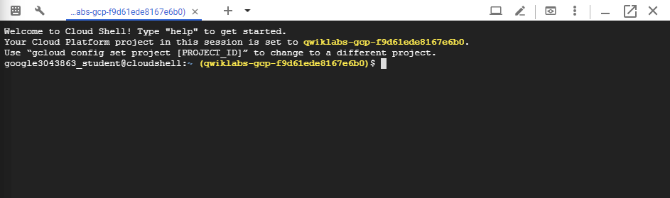
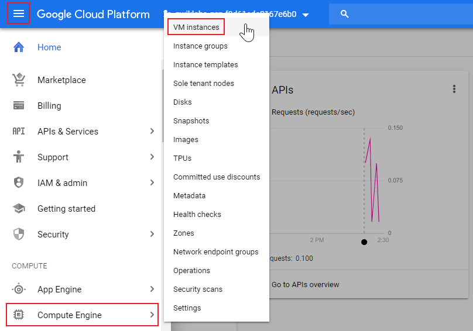

本篇是紀錄在 Google 的 Qwiklab 平台內，完成「[Creating a Virtual Machine](https://www.qwiklabs.com/focuses/3563?parent=catalog)」這個 quest 所學到的內容，包括如何透過 GCP Console 和 command-line 工具 `gcloud` 在 GCP 建立 instance，如何使用 `gcloud` 透過 SSH 連接到你的 instance，以及如何在 VM 上部署 NIGNX web server。

<!-- more -->


透過 Google Compute Engine，可在 Google 基礎架構上，建立執行不同作業系統的 VM (virtual machine，虛擬機)，包括多種 Linux (Debian、Ubuntu、Suse、Red Hat、CoreOS) 和 Windows Server。

可以學到如何使用 Google Cloud Platform (GCP) Console 和 `gcloud` command-line 建立各種機器類型的虛擬機 instance (實例)，還能學習如何將 NGINX web server 連接到 VM。

## 本篇將會做什麼？
- 使用 GCP Console 建立 VM
- 使用 `gcloud` command-line 建立 VM
- 在 VM 上部署 web server

## 準備
在點擊「Start Lab」之前，準備好網路瀏覽器 (推薦用 Google Chrome)，並且至少 40 分鐘可以專注的時間，因為 lab 是有時間限制，當你按下「Start Lab」開始學習時，無法暫停倒數計時，你只能在這段時間內使用 lab 提供給你的全新暫時 GCP Console 可用帳號，時間到之後的幾分鐘就會自動登出。

:::warning
注意：如果你有自己的個人 GCP 帳號或專案，請不要在此 lab 使用
:::

## 開始你的 Lab，然後登入 GCP Console
1. 如果準備要開始，可以點擊右上角的「Start Lab」開始：


2. 接著會出現這個畫面，因為我參加 [GDG Tainan](https://www.facebook.com/events/2005848903055499/) 的活動，活動有提供 Qwiklabs 一個月的免費額度，所以我點選下圖左邊的「Use Subscription」：


3. Lab 會提供給你免費暫時的 GCP 帳號，複製帳號和密碼，然後點擊「Open Google Console」：


圖片來源：[Creating a Virtual Machine | Qwiklabs](https://www.qwiklabs.com/focuses/3563?parent=catalog)

4. 接著就會開啟登入頁面，建議另外開 Chrome 無痕模式來登入 lab 提供的帳號和密碼，因為 Chrome 會紀錄帳密，現在登入的只是暫時帳號，未來不需要用到：

:::warning
注意：這邊是登入 lab 提供的帳號，如果你有自己的 GCP 帳號，請不要用於此 lab，避免產生費用
:::


5. 接受 terms 和 conditions：


6. 不要新增 recovery options 或 two-factor authentication (因為這是一個臨時帳號)


7. 勾選同意服務條款：


## 啟動 Google Cloud Shell
Google Cloud Shell 是載入了開發工具的 VM，它提供 5GB 的 home 目錄，並在 Google Cloud 上執行。可用 Google Cloud Shell 提供的 command-line 來存取 GCP 的資源。

1. 在 GCP console 的右上方工具列中，點擊「Activate Cloud Shell」按鈕：



2. 在打開的對話框內，點擊「START CLOUD SHELL」：


3. 連接和提供環境需要一些時間：


4. 連接後，就代表你已經過身份驗證，專案已設置為 `PROJECT_ID`，以下圖的為例，此專案的 ID 為 `qwiklabs-gcp-f9d61ede8167e6b0`：



`gcloud` 是 GCP 的 command-line 工具，他已預先安裝在 Cloud Shell 上，並且支援 tab 自動補齊 (tab-completion)。

未來可使用 `gcloud` 的下面指令並透過 `PROJECT_ID` 來更換成其他專案：

```shell
$ gcloud config set project [PROJECT_ID]
```

使用下面指令可列出有效帳號名稱：

```shell
$ gcloud auth list
          Credentialed Accounts
ACTIVE  ACCOUNT
*       google3043863_student@qwiklabs.net

To set the active account, run:
    $ gcloud config set account `ACCOUNT`
```

可以使用以下指令列出專案 ID：

```shell
$ gcloud config list project
[core]
project = qwiklabs-gcp-f9d61ede8167e6b0

Your active configuration is: [cloudshell-9292]
```

## 理解 Regions 和 Zones
Compute Engine 資源位於不同的 regions (地區) 或 zones (區域)。region 是你可以執行資源的所在特定地理位置。每個 region 都有一個或多個 zones。例如，`us-central1` region 代表美國中部地區，其中包含的 Zones 有 `us-central1-a`、`us-central1-b`、`us-central1-c` 與 `us-central1-f`。


圖片來源：[Creating a Virtual Machine | Qwiklabs](https://www.qwiklabs.com/focuses/3563?parent=catalog)

位於 zone 中的資源都稱為 zonel (區域) 資源，VM instance (實例) 和 persistent disk (永久磁碟) 都位於 zone 中，如果要將 persistent disk 附加到 VM instance，這兩個資源都必須位於同一個 zone 中。同樣，如果要將靜態 IP 位址分配到 instance，此 instance 就必須與靜態 IP 位於同一個 region 中。

> 詳情可參考 GCP 官方的 [Regions & Zones](https://cloud.google.com/compute/docs/regions-zones/) 文件。

## 從 Cloud Console 建立新的 instance
在 GCP Console 的右上角，點選「Navigation menu > Compute Engine > VM Instances」：



接著點擊「Create」建立新的 instance：


建立新的 instance 時可以設定很多參數。在此 lab 中會使用以下設定：

| 欄位 | 值 | 額外資訊 |
| ------ | ----------- | ---------- |
| name | `gcelab` |  |
| region |`us-central1 (Iowa)`<br>或<br>`asia-south1 (Mumbai)` | [更多關於 regions 的資訊](https://cloud.google.com/compute/docs/regions-zones/) |
| zone | `us-central1-c`<br>或<br>`asia-south1-c`<br>注意：記住你選擇的 zone，之後會用到 | [更多關於 zones 的資訊](https://cloud.google.com/compute/docs/regions-zones/) |
| Machine Type | `2 vCPU` <br> 這是一個 ( `n1-standard-2` )<br>2-CPU, 7.5 GB RAM instance <br><br> 有很多機型可以選擇，從 micro instance 類型的到 32-core/208 GB RAM 的都有，詳情可參考[機型種類](https://cloud.google.com/compute/docs/machine-types)文件 | 注意：新專案具有預設的[資源配額](https://cloud.google.com/compute/quotas)，可能會限制 CPU 核心數。可在此 lab 之外的專案上申請到更高的規格 |
| Boot Disk | `New 10 GB standard persistent disk` <br> `OS Image: Debian GNU/Linux 9 (Stretch)` | 有很多 images 可以選擇，包括：Debian、Ubuntu、CoreOS，以及 premium images，像是 RedHat Enterprise Linux 和 Windows Server，詳情可參考 [OS](https://cloud.google.com/compute/docs/images) 文件 |
| Firewall | 勾選 `Allow HTTP traffic`，勾選此選項才能存取之後安裝的 web server | 注意：這會自動建立防火牆規則，允許 80 port 的 HTTP 流量 |

設定好之後，點擊「Create」：


等待 instance 建立：


看到下面畫面就代表 instance 已建立完成，接著點擊右邊的「SSH」按鈕，會開啟新的瀏覽器頁面：


此頁面是直接從瀏覽器啟動 SSH client 連接到 VM：


> 詳情可參考官方的 [Connect to an instance using ssh](https://cloud.google.com/compute/docs/instances/connecting-to-instance) 文件。

## 安裝 NGINX web server
1. 透過 SSH 連接 VM 之後，請使用 `sudo` 取得 `root` 的存取權限：

```shell
$ sudo su -
```

2. 更新 OS：

```shell
$ apt-get update
Get:1 http://security.debian.org stretch/updates InRelease [94.3 kB]
Ign:2 http://deb.debian.org/debian stretch InRelease      
Get:3 http://deb.debian.org/debian stretch-updates InRelease [91.0 kB]     
...
```

3. 安裝 NGINX：

```shell
$ apt-get install nginx -y
```

4. 檢查 NGINX 是否正在執行：

```shell
$ ps auwx | grep nginx
root      2339  0.0  0.0 159532  1628 ?        Ss   06:37   0:00 nginx: master process /usr/sbin/nginx -g daemon on; master_process on;
www-data  2340  0.0  0.0 159864  3200 ?        S    06:37   0:00 nginx: worker process
www-data  2341  0.0  0.0 159864  3200 ?        S    06:37   0:00 nginx: worker process
root      2350  0.0  0.0  12780   952 pts/0    S+   06:37   0:00 grep nginx
```

:::info
註：如果關掉 NGINX 就不會出現關於 NGINX 的 process：

```
$ service nginx stop

$ ps auwx | grep nginx
root      2359  0.0  0.0  12780  1012 pts/0    S+   14:23   0:00 grep nginx
```

使用下面指令可以啟動 NGINX：

```shell
$ service nginx start
```

:::

5. 回到 Cloud Console，並點擊 VM instance 的 External IP 連結：


6. 就會開啟新分頁，可以看到 NGINX web server 的預設網頁：


## 使用 gcloud 建立新的 instance
前面介紹的是利用 GCP Console 來建立 VM instance，這邊要介紹的是可以使用預裝在 [Google Cloud Shell](https://cloud.google.com/shell/#how_do_i_get_started) 中的 command-line 工具 `gcloud` 來完成一樣的事。Cloud Shell 是基於 Debian 的 VM，預載你所需的所有開發工具 (`gcloud`、`git` ... 等其他)，並提供 5 GB persistent disk 的 home 目錄。

> 詳情可參考 [gcloud command line tool guide](https://cloud.google.com/sdk/gcloud/)。

在 Cloud Shell 使用 command-line 工具 `gcloud` 建立一台新的 VM instance，將 `[YOUR_ZONE]` 替換成前面使用的 zone：

```shell
$ gcloud compute instances create gcelab2 --machine-type n1-standard-2 --zone [your_zone]
```

像我前面的 zone 是用 `asia-south1-c`，所以指令如下：

```shell
$ gcloud compute instances create gcelab2 --machine-type n1-standard-2 --zone asia-south1-c
Created [https://www.googleapis.com/compute/v1/projects/qwiklabs-gcp-f9d61ede8167e6b0/zones/asia-south1-c/instances/gcelab2].
NAME     ZONE           MACHINE_TYPE   PREEMPTIBLE  INTERNAL_IP  EXTERNAL_IP   STATUS
gcelab2  asia-south1-c  n1-standard-2               10.160.0.3   35.244.6.170  RUNNING
```

建立的 instance 具有以下預設值：
- 最新的 [Debian 9 (stretch)](https://cloud.google.com/compute/docs/images#debian) image
- 預設機型 (machine type) 為 `n1-standard-2`，在此 lab 中，你也可以使用 `n1-highmem-4` 或 `n1-highcpu-4` 其他[機型](https://cloud.google.com/compute/docs/machine-types)。在 lab 之外的專案可以指定[自訂的機型](https://cloud.google.com/compute/docs/instances/creating-instance-with-custom-machine-type)
- root persistent disk 預設與 instance 的名稱一樣，disk 會自動附加到 instance

執行下面指令可以查看所有預設值：

```shell
$ gcloud compute instances create --help
```

:::info
Note：如果你總是使用同一個 region/zone，並且不希望每次都使用 `--zone` 參數，就可以使用下面指令，將指定的 region 和 zones 設為預設：

```shell
$ gcloud config set compute/zone ...
$ gcloud config set compute/region ...
```

> 詳情可參考官方的 [gcloud compute | Compute Engine Documentation](https://cloud.google.com/compute/docs/gcloud-compute/#default-properties) 文件。
:::

若要查看剛剛建立的 instance 是否成功建立，就要回到「Navigation menu > Compute Engine > VM Instances」頁面，如果還是沒有看到，就可以點擊「REFRESH」按鈕重新整理此頁面，應該就會看到剛剛建立名為 `gcelab2` 的 instance：


接著你也可以使用 `gcloud` 透過 SSH 連接到你的 instance，連線時，請確認指令後面 `--zone` 參數的 `[YOUR_ZONE]` 是否和當初建立的一樣，或是如果你已在全域設定預設 (上面 Note 提到的部分)，就可以省略 `--zone` 參數：

```shell
$ gcloud compute ssh gcelab2 --zone [YOUR_ZONE]
```

像我沒有在全域設定預設，所以需要在指令後面加上 `--zone` 參數，`[YOUR_ZONE]` 則是當初建立的 `asia-south1-c`，指令如下：

```shell
$ gcloud compute ssh gcelab2 --zone asia-south1-c
WARNING: The public SSH key file for gcloud does not exist.
WARNING: The private SSH key file for gcloud does not exist.
WARNING: You do not have an SSH key for gcloud.
WARNING: SSH keygen will be executed to generate a key.
This tool needs to create the directory
[/home/google3043863_student/.ssh] before being able to generate SSH
keys.

Do you want to continue (Y/n)?
```

接著會出現下面畫面，請輸入 `Y` 繼續：

```shell
Do you want to continue (Y/n)?  y
```

此時會產生一對公鑰 (public key) 和私鑰 (private key)，接著按 `Enter` 鍵，不輸入也不設定 passphrase (如果是在真正的專案就建議輸入 passphrase，因為當別人拿走你的私鑰時，就無法直接登入主機，還要輸入 passphrase，安全性會比較高)：

```
Generating public/private rsa key pair.
Enter passphrase (empty for no passphrase):
Enter same passphrase again:
Your identification has been saved in /home/google3043863_student/.ssh/google_compute_engine.
Your public key has been saved in /home/google3043863_student/.ssh/google_compute_engine.pub.
The key fingerprint is:
SHA256:LJMylIaZY1aNf2v0uP/a83TSVw506GazmtvrTyPCxqU google3043863_student@cs-6000-devshell-vm-8e6e4e18-0f7e-4771-ac48-22ab57ceb161
The key's randomart image is:
+---[RSA 2048]----+
|    .o           |
|   =...        . |
|  B +.        o .|
| o +  .oo    o . |
|    o +oS+   .* .|
|     o o+ + oo *.|
|       . . E .+.*|
|        . ..o=.+o|
|         .oo*==o.|
+----[SHA256]-----+
Warning: Permanently added 'compute.3226821850929314737' (ECDSA) to the list of known hosts.
Linux gcelab2 4.9.0-8-amd64 #1 SMP Debian 4.9.144-3.1 (2019-02-19) x86_64

The programs included with the Debian GNU/Linux system are free software;
the exact distribution terms for each program are described in the
individual files in /usr/share/doc/*/copyright.

Debian GNU/Linux comes with ABSOLUTELY NO WARRANTY, to the extent
permitted by applicable law.
Creating directory '/home/google3043863_student'.
```


## 使用 gcloud 設定防火牆
如果我已經跟著之前的步驟安裝完 NGINX 了，就會發現剛剛建立的 instance 沒有做防火牆設定，也就是不允許 80 port 的 HTTP 流量，所以就可以是用下面指令來設定：

```shell
$ gcloud compute firewall-rules create nginx --allow tcp:80
```

執行指令後會看到下面訊息，訊息內容是無法建立防火牆，這是因為請求的身分權限不足：

```shell
Creating firewall...failed.
ERROR: (gcloud.compute.firewall-rules.create) Could not fetch resource:
 - Insufficient Permission: Request had insufficient authentication scopes.
```


那如何知道目前的有效帳號名稱？可以使用下面指令來查看，可以看到目前的帳號不是之前 lab 暫時給我們用的帳號：

```shell
$ gcloud auth list
                  Credentialed Accounts
ACTIVE  ACCOUNT
*       721269751803-compute@developer.gserviceaccount.com

To set the active account, run:
    $ gcloud config set account `ACCOUNT`
```

所以必須登入之前的帳號，可以使用下面指令：

```shell
$ gcloud auth login
You are running on a Google Compute Engine virtual machine.
It is recommended that you use service accounts for authentication.

You can run:

  $ gcloud config set account `ACCOUNT`

to switch accounts if necessary.

Your credentials may be visible to others with access to this
virtual machine. Are you sure you want to authenticate with
your personal account?

Do you want to continue (Y/n)?
```

接著會出現下面畫面，請輸入 `Y` 繼續：

```shell
Do you want to continue (Y/n)?
```

接著會出現一長串的連結，點擊這個連結：

```shell
Do you want to continue (Y/n)?  y

Go to the following link in your browser:

    https://accounts.google.com/o/oauth2/auth?redirect_uri=urn%3Aietf%3Awg%3Aoauth%3A2.0%3Aoob&prompt=select_account&response_type=code&client_id=32555940559.apps.googleusercontent.com&scope=https%3A%2F%2Fwww.googleapis.com%2Fauth%2Fuserinfo.email+https%3A%2F%2Fwww.googleapis.com%2Fauth%2Fcloud-platform+https%3A%2F%2Fwww.googleapis.com%2Fauth%2Fappengine.admin+https%3A%2F%2Fwww.googleapis.com%2Fauth%2Fcompute+https%3A%2F%2Fwww.googleapis.com%2Fauth%2Faccounts.reauth&access_type=offline


Enter verification code:
```

該連結就是要你用 lab 提供的帳號登入：


接著要同意 Google Cloud SDK 存取此帳號：


接著複製此授權碼，將授權碼貼至剛剛的 shell：


```
Enter verification code: 4/KwEnGIyzJ0P_ZvFeKt5264lP_3CdzZhUb-ZXoEJ0TbVFQVUQyYSBF58
WARNING: `gcloud auth login` no longer writes application default credentials.
If you need to use ADC, see:
  gcloud auth application-default --help

You are now logged in as [google3043863_student@qwiklabs.net].
Your current project is [qwiklabs-gcp-f9d61ede8167e6b0].  You can change this setting by running:
  $ gcloud config set project PROJECT_ID
```

登入成功後，可以再次執行下面指令看一下目前有效帳號的名稱，變成 lab 暫時給我們用的帳號囉：

```shell
$ gcloud auth list
                  Credentialed Accounts
ACTIVE  ACCOUNT
        721269751803-compute@developer.gserviceaccount.com
*       google3043863_student@qwiklabs.net

To set the active account, run:
    $ gcloud config set account `ACCOUNT`
```

接著再次執行下面指令，就可以成功設定防火牆：

```
$ gcloud compute firewall-rules create nginx --allow tcp:80
Creating firewall...⠶Created [https://www.googleapis.com/compute/v1/projects/qwiklabs-gcp-f9d61ede8167e6b0/global/firewalls/nginx].
Creating firewall...done.
NAME   NETWORK  DIRECTION  PRIORITY  ALLOW   DENY  DISABLED
nginx  default  INGRESS    1000      tcp:80        False
```

雖然 GCP Console 介面上 VM instance 的 External IP 沒有變成可以點擊的連結，但可以將 External IP 複製到新的瀏覽器分頁：


就能成功看到 NGINX web server 的預設網頁：


下圖就是我成功完成此 quest 的畫面：


## 參考來源
- [Creating a Virtual Machine | Qwiklabs](https://www.qwiklabs.com/focuses/3563?parent=catalog)
- [在 GCP 上開立一台虛擬機 | Ray's Coding Journey](https://tn710617.github.io/zh-tw/createAVirtualMachineInGCP/)