本篇是紀錄在 Google 的 Qwiklab 平台內，完成「[Compute Engine: Qwik Start - Windows](https://www.qwiklabs.com/focuses/560?parent=catalog)」這個 quest 所學到的內容，包括如何透過 GCP Console 在 GCP 建立 instance 架設 Windows Server，以及如何使用 [Chrome RDP for GCP](https://chrome.google.com/webstore/detail/chrome-rdp-for-google-clo/mpbbnannobiobpnfblimoapbephgifkm) 擴充功能直接從瀏覽器進行 RDP 連接至 Windows Server。

<!-- more -->

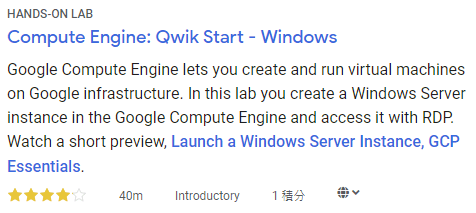

Google Compute Engine 可讓你在 Google 基礎架構上建立和執行 VM。 Compute Engine 提供擴展、效能和價值，讓你可以輕鬆地在 Google 基礎架構上啟動大型運算群集。

你可以在 Google Compute Engine 上執行 Windows 應用程式，並利用 VM instance 可用的許多優勢，例如：可靠的[儲存選項](https://cloud.google.com/compute/docs/disks/)、[Google 網路](https://cloud.google.com/compute/docs/vpc)的速度和[自動擴展 (Autoscaling)](https://cloud.google.com/compute/docs/autoscaler/)。

在此 lab 中，你將學習如何在 Google Compute Engine 中啟動 Windows Server instance，並使用遠端桌面協定連接到該 instance。

> 若想了解如何 [在 GCP 上建立 VM 架設 NIGNX Web server](./gcp-vm-nignx-web-server.html) 可參考此篇。

如果你未在 local 主機上使用 Windows，請安裝第三方的 RDP client，例如：FusionLabs 的 [Chrome RDP](https://chrome.google.com/webstore/detail/chrome-rdp/cbkkbcmdlboombapidmoeolnmdacpkch)。

## 準備
在點擊「Start Lab」之前，準備好網路瀏覽器 (推薦用 Google Chrome)，並且至少 40 分鐘可以專注的時間，因為 lab 是有時間限制，當你按下「Start Lab」開始學習時，無法暫停倒數計時，你只能在這段時間內使用 lab 提供給你的全新暫時 GCP Console 可用帳號，時間到之後的幾分鐘就會自動登出。

:::warning
注意：如果你有自己的個人 GCP 帳號或專案，請不要在此 lab 使用
:::

## 開始你的 Lab，然後登入 GCP Console
1. 如果準備要開始，可以點擊右上角的「Start Lab」開始：

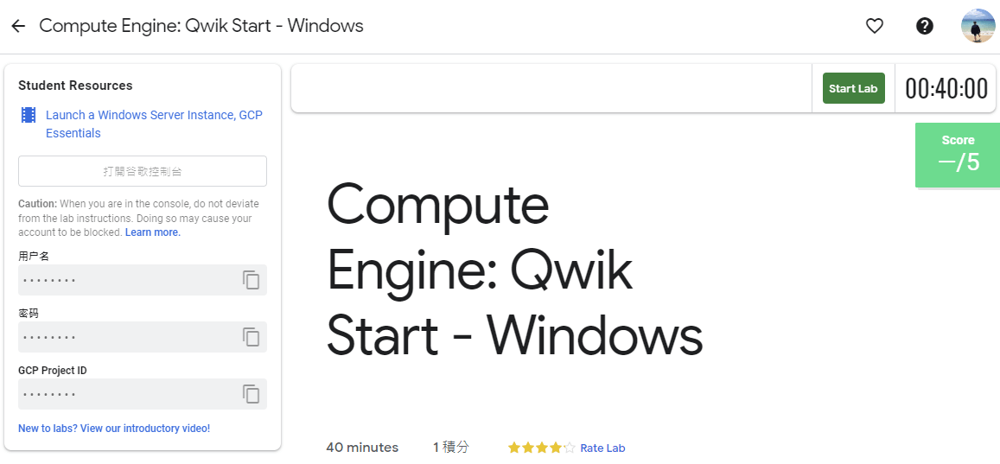

2. 接著會出現這個畫面，因為我參加 [GDG Tainan](https://www.facebook.com/events/2005848903055499/) 的活動，活動有提供 Qwiklabs 一個月的免費額度，所以我點選下圖左邊的「Use Subscription」：


3. Lab 會提供給你免費暫時的 GCP 帳號，複製帳號和密碼，然後點擊「Open Google Console」開啟 [GCP Console](https://cloud.google.com/storage/docs/cloud-console)：


圖片來源：[Creating a Virtual Machine | Qwiklabs](https://www.qwiklabs.com/focuses/3563?parent=catalog)

4. 接著就會開啟登入頁面，建議另外開 Chrome 無痕模式來登入 lab 提供的帳號和密碼，因為 Chrome 會紀錄帳密，現在登入的只是暫時帳號，未來不需要用到：

:::warning
注意：這邊是登入 lab 提供的帳號 (也就是 email 必須為 `googlexxxxxx_student@qwiklabs.net` )，如果你有自己的 GCP 帳號，請不要用於此 lab，避免產生費用

> 類似於 `googlexxxxxx_student@qwiklabs.net` 的帳號是一個 Google 帳號，專為 Qwiklabs 學生使用而建立的。它具有特定的域名 (也就是 `qwiklabs.net` )，並且已分配了 IAM 角色，允許你去存取該 GCP 專案。
:::


5. 接受 terms 和 conditions：


6. 不要新增 recovery options 或 two-factor authentication (因為這是一個臨時帳號)


7. 勾選同意服務條款：


之後就可以開始使用 GCP Console 囉：


## 建立 VM instance
在 GCP Console 的左上角，點選「Navigation menu > Compute Engine > VM Instances」：

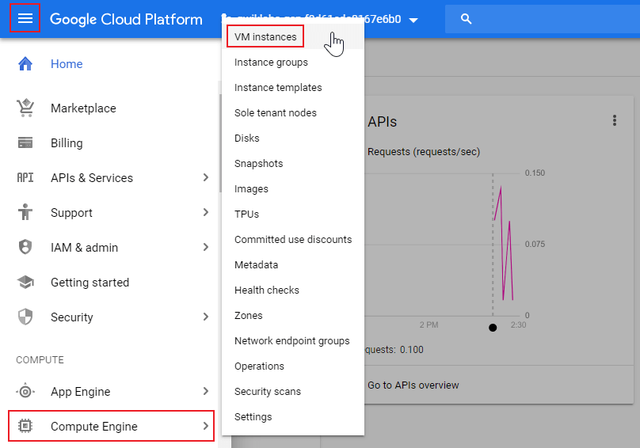

接著點擊「Create」按鈕建立新的 instance：

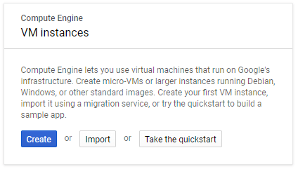

在「Boot disk」部分中，點擊「Change」按鈕以開始配置 boot disk：

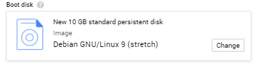

選擇「Windows Server 2012 R2 Datacenter」，然後點擊「Select」按鈕：

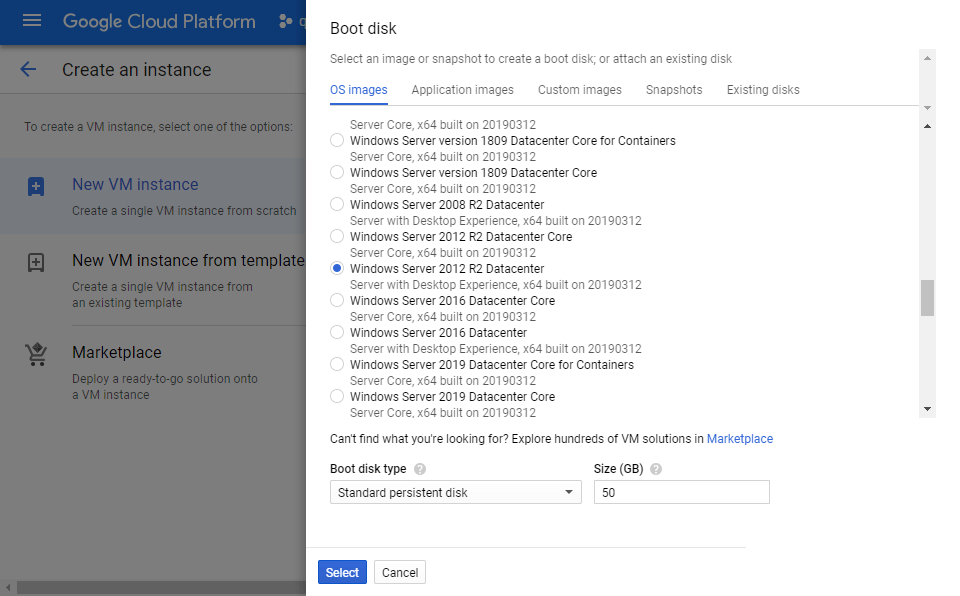

將所有其他設定都保留為預設值。設定好之後，點擊「Create」按鈕建立 instance：

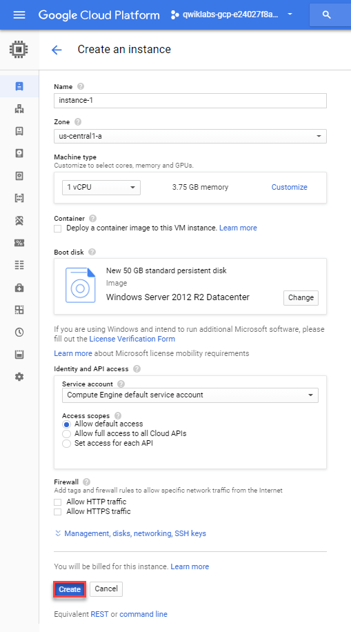

## 啟動 Google Cloud Shell
Google Cloud Shell 是載入了開發工具的 VM，它提供 5GB 的 home 目錄，並在 Google Cloud 上執行。可用 Google Cloud Shell 提供的 command-line 來存取 GCP 的資源。

1. 在 GCP console 的右上方工具列中，點擊「Activate Cloud Shell」按鈕：


2. 在打開的對話框內，點擊「START CLOUD SHELL」：


3. 連接和提供環境需要一些時間：


4. 連接後，就代表你已經過身份驗證，專案已設置為 `PROJECT_ID`，以下圖的為例，此專案的 ID 為 `qwiklabs-gcp-f9d61ede8167e6b0`：


使用下面指令可列出有效帳號名稱：

```shell
$ gcloud auth list
          Credentialed Accounts
ACTIVE  ACCOUNT
*       google3043863_student@qwiklabs.net

To set the active account, run:
    $ gcloud config set account `ACCOUNT`
```

可以使用以下指令列出專案 ID：

```shell
$ gcloud config list project
[core]
project = qwiklabs-gcp-f9d61ede8167e6b0

Your active configuration is: [cloudshell-9292]
```

> 詳情可參考官方的 [Google Cloud gcloud Overview](https://cloud.google.com/sdk/gcloud) 文件。

## 測試 Windows Startup 的狀態
在「VM Instances」頁面上看到帶有綠色狀態的 icon 就代表該 instance 已建立完成，如下圖：

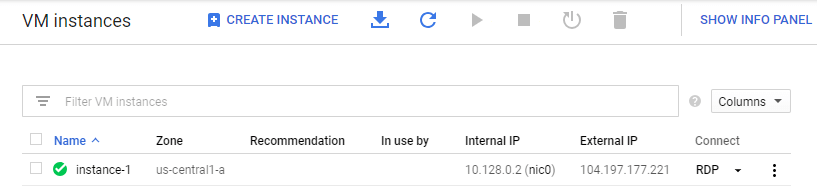

但是，它可能尚未準備好接受 RDP 連接，因為所有 OS 元件初始化都需要一段時間。

要查看 server 是否已準備好進行 RDP 連接，請在 Cloud Shell terminal command-line 中執行以下指令，其中的 `instance-1` 是剛剛建立的 instance 名稱：

```shell
$ gcloud compute instances get-serial-port-output instance-1 --zone us-central1-a
```

重複這個指令，直到指令輸出以下內容為止。這個指令的輸出會告訴你 OS 元件已初始化，並且 Windows Server 已準備好接受 RDP 連接 (嘗試下一步)。

```shell
Finished running startup scripts.
```

這個指令完整的輸出訊息會類似下面這樣：

```shell
$ gcloud compute instances get-serial-port-output instance-1 --zone us-central1-a
SeaBIOS (version 1.8.2-20190322_093631-google)
Total RAM Size = 0x00000000f0000000 = 3840 MiB
CPUs found: 1     Max CPUs supported: 1
found virtio-scsi at 0:3
virtio-scsi vendor='Google' product='PersistentDisk' rev='1' type=0 removable=0
virtio-scsi blksize=512 sectors=104857600 = 51200 MiB
drive 0x000f29f0: PCHS=0/0/0 translation=lba LCHS=1024/255/63 s=104857600
Booting from Hard Disk 0...
2019/04/15 15:39:21 GCEWindowsAgent: GCE Agent Started (version 4.6.0@1)
2019/04/15 15:39:56 GCEInstanceSetup: Starting sysprep specialize phase.
2019/04/15 15:39:57 GCEInstanceSetup: All networks set to DHCP.
2019/04/15 15:39:57 GCEInstanceSetup: Running 'netsh' with arguments 'interface ipv4 set interface Ethernet mtu=1460'
2019/04/15 15:39:57 GCEInstanceSetup: --> Ok.
2019/04/15 15:39:58 GCEInstanceSetup: MTU set to 1460.
2019/04/15 15:39:58 GCEInstanceSetup: Running 'route' with arguments '/p add 169.254.169.254 mask 255.255.255.255 0.0.0.0 if 12 metric 1'
2019/04/15 15:39:58 GCEInstanceSetup: --> OK!
2019/04/15 15:39:58 GCEInstanceSetup: Added persistent route to metadata netblock via first netkvm adapter.
2019/04/15 15:39:58 GCEInstanceSetup: Getting hostname from metadata server.
2019/04/15 15:39:58 GCEInstanceSetup: Changing hostname from WIN-MQ2QFF14J03 to instance-1.
2019/04/15 15:39:58 GCEInstanceSetup: Renamed from WIN-MQ2QFF14J03 to instance-1.
2019/04/15 15:39:58 GCEMetadataScripts: Starting specialize scripts (version 4.2.1@1).
2019/04/15 15:39:58 GCEMetadataScripts: No specialize scripts to run.
2019/04/15 15:39:58 GCEMetadataScripts: Finished running specialize scripts.
2019/04/15 15:39:58 GCEInstanceSetup: Finished with sysprep specialize phase, restarting...
2019/04/15 15:39:59 GCEWindowsAgent: GCE Agent Stopped
SeaBIOS (version 1.8.2-20190322_093631-google)
Total RAM Size = 0x00000000f0000000 = 3840 MiB
CPUs found: 1     Max CPUs supported: 1
found virtio-scsi at 0:3
virtio-scsi vendor='Google' product='PersistentDisk' rev='1' type=0 removable=0
virtio-scsi blksize=512 sectors=104857600 = 51200 MiB
drive 0x000f29f0: PCHS=0/0/0 translation=lba LCHS=1024/255/63 s=104857600
Booting from Hard Disk 0...
2019/04/15 15:40:36 GCEWindowsAgent: GCE Agent Started (version 4.6.0@1)
2019/04/15 15:40:43 GCEInstanceSetup: Disabled Ctrl + Alt + Del.
2019/04/15 15:40:43 GCEInstanceSetup: Enable RDP firewall rules.
2019/04/15 15:40:43 GCEInstanceSetup: Running 'netsh' with arguments 'advfirewall firewall set rule group=remote desktop new enable=Yes'
2019/04/15 15:40:43 GCEInstanceSetup: --> Updated 3 rule(s).
2019/04/15 15:40:43 GCEInstanceSetup: --> Ok.
2019/04/15 15:40:43 GCEInstanceSetup: Restarting Terminal Service services, to enable RDP.
2019/04/15 15:40:44 GCEInstanceSetup: Enabled Remote Desktop.
2019/04/15 15:40:44 GCEInstanceSetup: Configuring WinRM...
2019/04/15 15:40:47 GCEInstanceSetup: Running 'netsh' with arguments 'advfirewall firewall add rule profile=any name=Windows Remote Management (HTTPS-In) dir=in localport=5986 protocol=TCP action=allow'
2019/04/15 15:40:47 GCEInstanceSetup: --> Ok.
2019/04/15 15:40:48 GCEInstanceSetup: Setup of WinRM complete.
2019/04/15 15:40:48 GCEInstanceSetup: Running startup scripts from metadata server.
2019/04/15 15:40:48 GCEInstanceSetup: Running 'schtasks' with arguments '/run /tn GCEStartup'
2019/04/15 15:40:48 GCEInstanceSetup: --> SUCCESS: Attempted to run the scheduled task "GCEStartup".
2019/04/15 15:40:48 GCEInstanceSetup: ------------------------------------------------------------
2019/04/15 15:40:48 GCEInstanceSetup: Instance setup finished. instance-1 is ready to use.
2019/04/15 15:40:48 GCEInstanceSetup: ------------------------------------------------------------
2019/04/15 15:40:51 GCEInstanceSetup: Checking instance license activation status.
2019/04/15 15:40:51 GCEInstanceSetup: instance-1 needs to be activated by a KMS Server.
2019/04/15 15:40:51 GCEInstanceSetup: Key Management Service machine name set to kms.windows.googlecloud.com successfully.
2019/04/15 15:40:51 GCEInstanceSetup: Installed product key W3GGN-FT8W3-Y4M27-J84CP-Q3VJ9 successfully.
2019/04/15 15:40:51 GCEInstanceSetup: Activating instance...
2019/04/15 15:40:52 GCEInstanceSetup: Activating Windows(R), ServerDatacenter edition (00091344-1ea4-4f37-b789-01750ba6988c) ...
2019/04/15 15:40:52 GCEInstanceSetup: Product activated successfully.
2019/04/15 15:40:52 GCEInstanceSetup: Activation successful.
2019/04/15 15:40:53 GCEMetadataScripts: Starting startup scripts (version 4.2.1@1).
2019/04/15 15:40:53 GCEMetadataScripts: No startup scripts to run.
2019/04/15 15:40:53 GCEMetadataScripts: Finished running startup scripts.


Specify --start=4643 in the next get-serial-port-output invocation to get only the new output starting from here.
```

## 連接 instance
點擊 VM 的名稱：

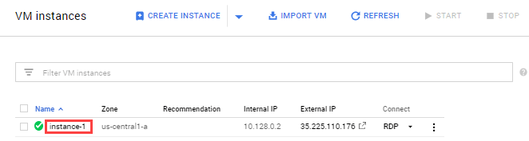

在「Remote Access」部分點擊「Set Windows Password」按鈕：

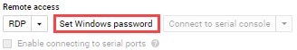

輸入 username 後，點擊「Set」按鈕來產生此 Windows instance 的密碼。如果沒有此 username 的 Windows 帳號，就會建立該帳號並使用新密碼，如果已有此帳號，密碼則會被重設：

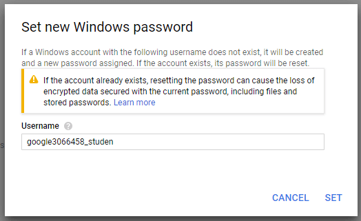

複製密碼並儲存，稍後登入 instance 時會用到：

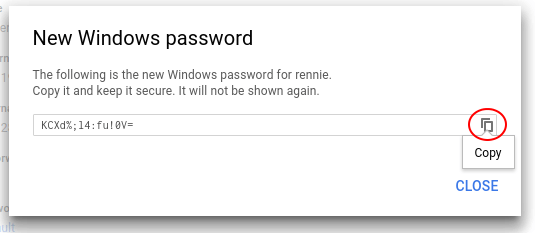

## 使用遠端桌面 (RDP) 進入 Windows Server
可以使用 [Chrome RDP for Google Cloud Platform](https://chrome.google.com/webstore/detail/chrome-rdp-for-google-clo/mpbbnannobiobpnfblimoapbephgifkm) 擴充功能直接從瀏覽器進行 RDP 連接，點擊「RDP」按鈕進行連接：

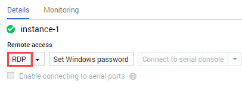

:::info
如果剛剛是用 Chrome 的無痕模式登入帳號，就會發生點擊「RDP」按鈕沒有反應的狀況，換成原本的模式就可以正常使用。
:::

它會提示你安裝 RDP 擴充功能。安裝完成後，GCP 會打開像下圖的登入畫面，請使用 Windows 使用者和密碼登入 (貼上之前儲存的密碼)：

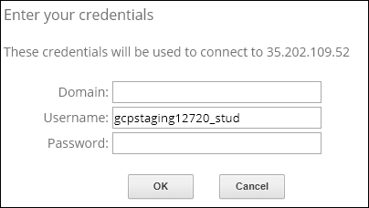

點擊「Continue」按鈕以確認你要連接：

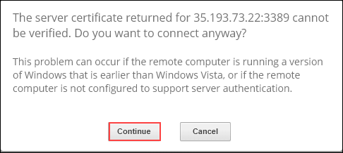

打開 Server Manager 時，就會連接到 Windows Server 上的 VM instance。

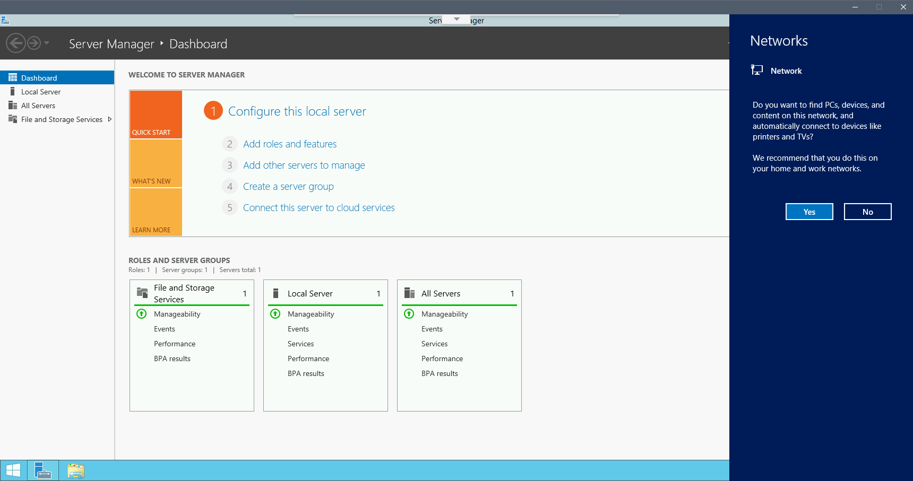

## 使用 RDP client 複製和貼上
登入到 instance 後，可以按 `Ctrl + V` 貼上資料 (如果是 Mac 的使用者，按 `Cmd + V` 會無法貼上）。如果要貼至 PuTTY 和 Powershell，請按滑鼠右鍵就可以貼上。如果在 Powershell 視窗中，請確保已點擊該視窗，否則會無法貼上。

## 參考來源
- [Compute Engine: Qwik Start - Windows](https://www.qwiklabs.com/focuses/560?parent=catalog) (本篇大多數的圖片來源)