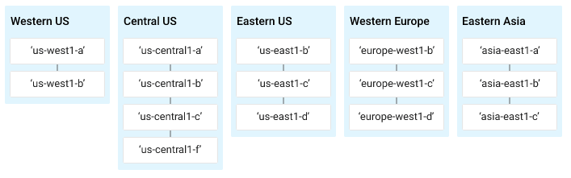

本篇是紀錄在 Google 的 Qwiklab 平台內，完成「[Getting Started with Cloud Shell & gcloud](https://www.qwiklabs.com/focuses/563?parent=catalog)」這個 quest 所學到的內容，包括如何使用 `gcloud` 指令，以及如何使用 `gsutil` 工具來管理 Cloud Storage 資源，將檔案上傳至指定的 bucket。

<!-- more -->


Google Cloud Shell 為你提供 `gcloud` command-line 存取 GCP 上託管的運算資源。Cloud Shell 是基於 Debian 的 VM，具有 5 GB persistent disk 的 home 目錄，讓你可以輕鬆管理 GCP 專案和資源。你需要的 Cloud SDK `gcloud` 和其他工具都已預裝在 Cloud Shell 中，讓你可以快速啟動和執行。

> 若想了解如何 [在 GCP 上建立 VM 架設 NIGNX Web server](./gcp-vm-nignx-web-server.html) 可參考此篇。
> 若想了解如何 [在 GCP 上建立 VM 架設 Windows Server](./gcp-vm-windows-server.html) 可參考此篇。

## 準備
在點擊「Start Lab」之前，準備好網路瀏覽器 (推薦用 Google Chrome)，並且至少 40 分鐘可以專注的時間，因為 lab 是有時間限制，當你按下「Start Lab」開始學習時，無法暫停倒數計時，你只能在這段時間內使用 lab 提供給你的全新暫時 GCP Console 可用帳號，時間到之後的幾分鐘就會自動登出。

:::warning
注意：如果你有自己的個人 GCP 帳號或專案，請不要在此 lab 使用
:::

## 開始你的 Lab，然後登入 GCP Console
1. 如果準備要開始，可以點擊右上角的「Start Lab」開始：


2. 接著會出現這個畫面，因為我參加 [GDG Tainan](https://www.facebook.com/events/2005848903055499/) 的活動，活動有提供 Qwiklabs 一個月的免費額度，所以我點選下圖左邊的「Use Subscription」：


3. Lab 會提供給你免費暫時的 GCP 帳號，複製帳號和密碼，然後點擊「Open Google Console」開啟 [GCP Console](https://cloud.google.com/storage/docs/cloud-console)：


圖片來源：[Creating a Virtual Machine | Qwiklabs](https://www.qwiklabs.com/focuses/3563?parent=catalog)

4. 接著就會開啟登入頁面，建議另外開 Chrome 無痕模式來登入 lab 提供的帳號和密碼，因為 Chrome 會紀錄帳密，現在登入的只是暫時帳號，未來不需要用到：

:::warning
注意：這邊是登入 lab 提供的帳號 (也就是 email 必須為 `googlexxxxxx_student@qwiklabs.net` )，如果你有自己的 GCP 帳號，請不要用於此 lab，避免產生費用

> 類似於 `googlexxxxxx_student@qwiklabs.net` 的帳號是一個 Google 帳號，專為 Qwiklabs 學生使用而建立的。它具有特定的域名 (也就是 `qwiklabs.net` )，並且已分配了 IAM 角色，允許你去存取該 GCP 專案。
:::


5. 接受 terms 和 conditions：


6. 不要新增 recovery options 或 two-factor authentication (因為這是一個臨時帳號)：


7. 勾選同意服務條款：


之後就可以開始使用 GCP Console 囉：


## 啟動 Google Cloud Shell
Google Cloud Shell 是載入了開發工具的 VM，它提供 5GB 的 home 目錄，並在 Google Cloud 上執行。可用 Google Cloud Shell 提供的 command-line 來存取 GCP 的資源。

1. 在 GCP console 的右上方工具列中，點擊「Activate Cloud Shell」按鈕：


2. 在打開的對話框內，點擊「START CLOUD SHELL」：


3. 連接和提供環境需要一些時間：


4. 連接後，就代表你已經過身份驗證，專案已設置為 `PROJECT_ID`，以下圖的為例，此專案的 ID 為 `qwiklabs-gcp-f9d61ede8167e6b0`：


`gcloud` 是 GCP 的 command-line 工具，他已預先安裝在 Cloud Shell 上，並且支援 tab 自動補齊 (tab-completion)。

使用下面指令可列出有效帳號名稱：

```shell
$ gcloud auth list
          Credentialed Accounts
ACTIVE  ACCOUNT
*       google3043863_student@qwiklabs.net

To set the active account, run:
    $ gcloud config set account `ACCOUNT`
```

可以使用以下指令列出專案 ID：

```shell
$ gcloud config list project
[core]
project = qwiklabs-gcp-f9d61ede8167e6b0

Your active configuration is: [cloudshell-9292]
```

## 理解 Regions 和 Zones
Compute Engine 資源位於不同的 regions (地區) 或 zones (區域)。region 是你可以執行資源的所在特定地理位置。每個 region 都有一個或多個 zones。例如，`us-central1` region 代表美國中部地區，其中包含的 Zones 有 `us-central1-a`、`us-central1-b`、`us-central1-c` 與 `us-central1-f`。



圖片來源：[Creating a Virtual Machine | Qwiklabs](https://www.qwiklabs.com/focuses/3563?parent=catalog)

位於 zone 中的資源都稱為 zonel (區域) 資源，VM instance (實例) 和 persistent disk (永久磁碟) 都位於 zone 中，如果要將 persistent disk 附加到 VM instance，這兩個資源都必須位於同一個 zone 中。同樣，如果要將靜態 IP 位址分配到 instance，此 instance 就必須與靜態 IP 位於同一個 region 中。

> 詳情可參考 GCP 官方的 [Regions & Zones](https://cloud.google.com/compute/docs/regions-zones/) 文件。

## 使用 command line
在 GCP console 的右上方工具列中，點擊「Activate Cloud Shell」按鈕開啟新的 Cloud Shell session：


啟用 Cloud Shell 後，你可以使用 command line invoke Cloud SDK `gcloud` 指令或 VM instance 上可用的其他工具，還可以在不同專案和 Cloud Shell session 之間，將要存取的檔案儲存在 persistent disk storage 的 `$HOME` 目錄內。`$HOME` 目錄是私有的，其他使用者無法存取。

可以在任何 `gcloud` 指令的末端加上 `-h` 參數來查看使用指南：

```shell
$ gcloud -h
```

加上 `--help` 參數或執行 `gcloud help` 可以查看更詳細的 help 內容：

```shell
$ gcloud config --help
```

透過按 `Enter` 或空白建來捲動瀏覽 help 內容，按 `q` 按鍵會退出內容。

下面兩個指令是一樣的意思，都是用來查看詳細的 help 內容：

```shell
$ gcloud config --help
$ gcloud help config
```

## 使用你的 home 目錄
現在讓我們試試你的 `HOME` 目錄。就算去終止和重啟 VM，Cloud Shell `HOME` 錄的內容都會在所有 Cloud Shell session 之間的專案中保留。

變更目前的工作目錄：

```shell
$ cd $HOME
```

使用 `vi` 打開 `.bashrc` 設定檔：

```shell
$ vi ./.bashrc
```

## 使用 gcloud 指令
檢視環境內的設定列表：

```shell
$ gcloud config list
```

如果要檢查其他屬性的設定，請在指令後面加上 `--all` 參數：

```shell
$ gcloud config list --all
```

## 管理 Cloud Storage 資料
可以使用 Cloud Shell 中的 `gsutil` 工具來管理 Cloud Storage 資源，包括建立和刪除 bucket 和物件、複製和移動儲存資料以及管理 bucket 和物件 ACLs (Access Control List)。`gsutil` 還能將資料傳入和傳出 Cloud Shell instance。

bucket 是用於儲存資料的基本容器，儲存在 Cloud Storage 的所有資料都必須放在 bucket 中。你可以用 bucket 來整理資料、控制資料的存取權，但 bucket 不能像目錄和資料夾可以巢狀儲存。由於[建立和刪除 bucket 有一些限制](https://cloud.google.com/storage/quotas)，所以你設計的儲存應用程式應儘量執行密集的物件作業和相對較少的 bucket 作業。

> 詳情可參考官方的 [Buckets](https://cloud.google.com/storage/docs/key-terms#buckets)、[Creating Storage Buckets](https://cloud.google.com/storage/docs/creating-buckets#storage-create-bucket-gsutil) 和 [Access Control List (ACL)](https://cloud.google.com/storage/docs/access-control/lists?hl=zh-tw) 文件。

嘗試建立 Cloud Storage bucket，bucket 名稱不能重複，因此請將 `unique-name` 替換為其他名稱，或者 append 名稱讓它不重複。

```shell
$ gsutil mb gs://unique-name
```

像我是使用名為 `unique-name-titan` 的 bucket，剛好沒有重複，所以成功建立了 bucket：

```shell
$ gsutil mb gs://unique-name-titan
Creating gs://unique-name-titan/...
```

如果使用重複的 bucket 名稱就會出現類似下面的訊息：

```shell
$ gsutil mb gs://unique-name
Creating gs://unique-name/...
ServiceException: 409 Bucket unique-name already exists.
```

現在來建立一些資料，上傳到你的 bucket。首先，建立一個測試檔案：

```shell
$ vi test.dat
```

加一些資料進去：

```shell
Welcome to gcloud!
```

存儲檔案：

```shell
:wq
```

現在，上傳一些檔案到你建立的 bucket，請將 `unique-name` 取代成你的 storage bucket：

```shell
$ gsutil cp test.dat gs://unique-name
```

剛剛我是使用 `unique-name-titan` 的 bucket，所以上傳指令如下，可以看到我已成功上傳：

```shell
$ gsutil cp test.dat gs://unique-name-titan
Copying file://test.dat [Content-Type=application/octet-stream]...
- [1 files][   19.0 B/   19.0 B]
Operation completed over 1 objects/19.0 B.
```

如果是使用重複的 bucket 名稱上傳，就會出現類似下面的訊息：

```shell
$ gsutil cp test.dat gs://unique-name
Copying file://test.dat [Content-Type=application/octet-stream]...
BadRequestException: 400 Project does not exist: 666160882299
```

若要查看你的 bucket 和檔案，請開啟導航選單，然後選擇「Storage > Browser」：


然後點擊你的 bucket：


你應該會看到 `test.dat` 這個檔案：


## 參考來源
- [Getting Started with Cloud Shell & gcloud | Qwiklabs](https://www.qwiklabs.com/focuses/563?parent=catalog) (本篇大多數的圖片來源)