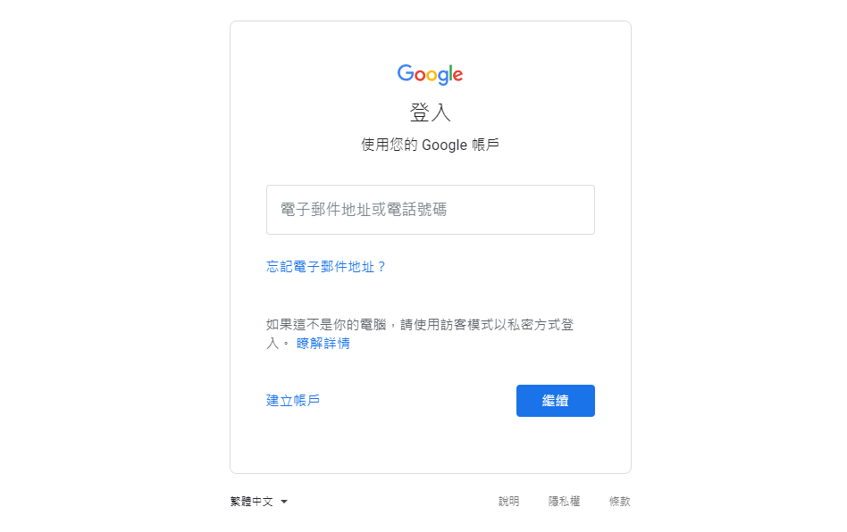
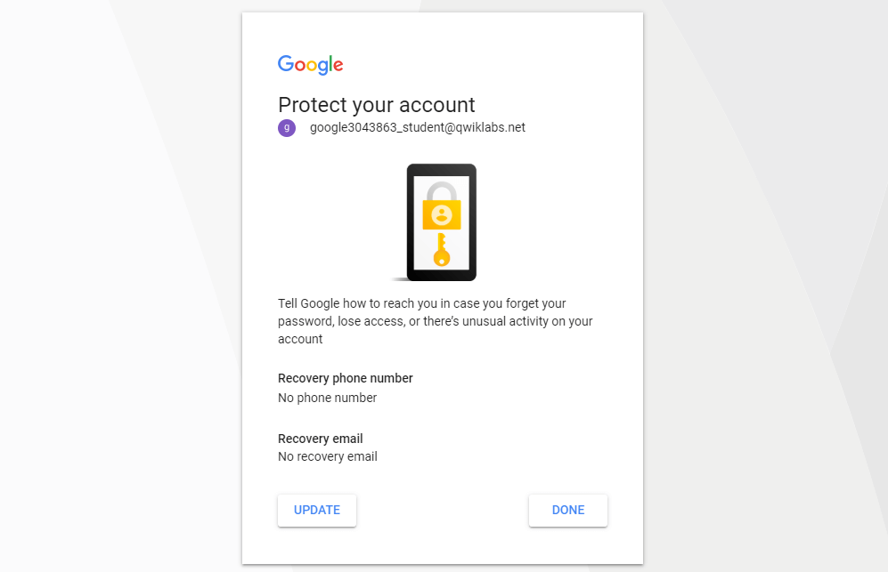
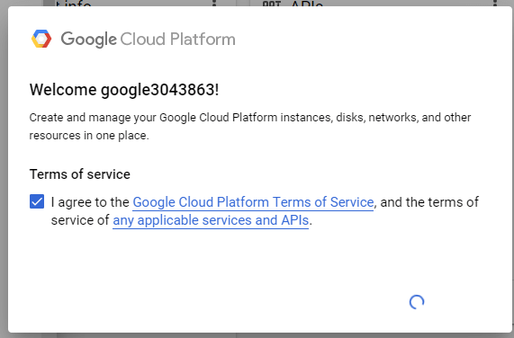
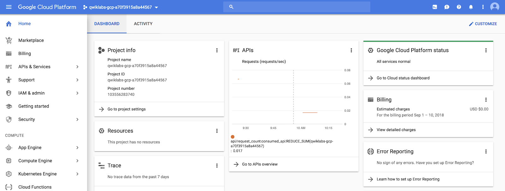

本篇是紀錄在 Google 的 Qwiklab 平台內，完成「[A Tour of Qwiklabs and the Google Cloud Platform](https://www.qwiklabs.com/focuses/2794?parent=catalog)」這個 quest 所學到的內容，包括如何使用以及認識 Qwiklab 和 GCP。

<!-- more -->


[Google Cloud Platform](https://cloud.google.com/) (GCP) 是託管在 Google 基礎架構上的一套雲端服務，從計算和儲存，到資料分析、機器學習、網路、GCP 提供各種服務和 API，可以與任何雲端計算應用程式或專案整合 - 無論是個人還是企業。

在這個入門等級的 lab 中，可透過使用 [GCP console](https://cloud.google.com/cloud-console/) (瀏覽器內的 UI，可讓您存取和管理 Google Cloud 服務) 來練習使用 GCP，了解 GCP 的主要功能，必了解 Qwiklabs 的環境。

## 你會學到什麼
- 了解如何使用特定憑證存取 GCP console
- 認識 GCP 專案
- 了解如何使用 GCP 的導航選單來識別 GCP 服務的類型
- 了解 primitive roles 並使用 Cloud IAM 服務檢查特定使用者的可用操作
- 了解 Cloud Shell 並使用 `gcloud` toolkit 來執行指令
- 了解 API library 並查看其主要功能

> 若想了解怎麼 [在 GCP 上建立 VM 架設 NIGNX Web server](./gcp-vm-nignx-web-server.html) 可參考此篇。

> 其他關於 Qwiklab 的介紹，可至原文 [A Tour of Qwiklabs and the Google Cloud Platform](https://www.qwiklabs.com/focuses/2794?parent=catalog) 查看。

## 存取 GCP Console
如果已經點擊右上角的「Start Lab」開始，應該會看到左側的「Open Google Console」按鈕變成可以被點擊，而且可以看到有帳號、密碼以及 GCP 專案 ID：


### GCP 專案 ID
[GCP 專案](https://cloud.google.com/docs/overview/#projects)是你的 Google 雲端資源的組織實體，包含資源和服務，例如：可以包含一個 VM 的 pool，一組資料庫以及將它們彼此連接的網路，專案還包含設定和權限，這些設定和權限可以指定安全規則以及設定誰有權存取哪些資源。而 GCP Project ID 不會重複，用於將 GCP 資源和 API 連接到你的特定專案。

### 帳號和密碼
帳號和密碼是表示在 GCP 身份和存取管理 (Identity and Access Management，IAM) 服務中，具有存取權限身份 (一個或多個角色) 的憑證，允許你在已分配的專案中使用 GCP 資源。這些憑證是臨時的，只能在 lab 限制的存取時間內使用，所以只要計時器倒數到 0 之後，你就無法再使用這些憑證存取這個的 GCP 專案。

## 登入 GCP
1. Lab 會提供給你免費暫時的 GCP 帳號，複製帳號和密碼，然後點擊「Open Google Console」開啟 [GCP Console](https://cloud.google.com/storage/docs/cloud-console)：


2. 接著就會開啟登入頁面，建議另外開 Chrome 無痕模式來登入 lab 提供的帳號和密碼，因為 Chrome 會紀錄帳密，現在登入的只是暫時帳號，未來不需要用到：

:::warning
注意：這邊是登入 lab 提供的帳號 (也就是 email 必須為 `googlexxxxxx_student@qwiklabs.net` )，如果你有自己的 GCP 帳號，請不要用於此 lab，避免產生費用

> 類似於 `googlexxxxxx_student@qwiklabs.net` 的帳號是一個 Google 帳號，專為 Qwiklabs 學生使用而建立的。它具有特定的域名 (也就是 `qwiklabs.net` )，並且已分配了 IAM 角色，允許你去存取該 GCP 專案。
:::



3. 接受 terms 和 conditions：


4. 不要新增 recovery options 或 two-factor authentication (因為這是一個臨時帳號)



5. 勾選同意服務條款：



之後就可以開始使用 GCP Console 囉：



## GCP Console 中的專案
GCP Console 的左上角，會看到一個名為 Project info 的面板，畫面如下：


一個專案會有名稱、ID、編號，在使用 GCP 服務時會經常使用這些東西。不過你可以存取多個 GCP 專案。在某些 lab 中，可能會使用多個專案來完成分配的任務。如果點擊帶有專案名稱的下拉式選單並選擇「ALL」，就會看到「Qwiklabs Resources」專案也可見：


:::info
目前不要切換到 Qwiklabs 資源專案！但是，你可以稍後在其他 lab 中使用它。
:::

GCP 的大型企業或有經驗的使用者擁有數十到數千個 GCP 專案的情況還蠻常見的，組織會以不同的方式使用 GCP，因此專案分離在雲端運算服務 (以團隊或產品為例) 是個好方法。

"Qwiklabs Resources" 是一個包含某些 lab 的檔案，資料集和機器 image 的專案，可以從每個 GCP lab 環境存取。要注意是 "Qwiklabs Resources" 與所有 Qwiklabs 使用者共享資源 (read only)，也就代表你無法刪除或修改它。

你正在使用名為類似於 `qwiklabs-gcp-xxx` 的 GCP 專案是臨時的，也就代表專案及其包含的所有內容會在 lab 結束後刪除。每次使用的 lab 都可以存取一個或多個新的 GCP 專案，並且在那裡 (不是 "Qwiklabs Resources" ) 執行所有 lab 的步驟。

## 導航選單和服務
在畫面的左上角有一個類似「三」的 icon：


點擊此按鈕會顯示 (或隱藏) GCP 核心服務的導航選單，如果選單沒有打開，請點擊此 icon 並捲動查看所有提供的服務類型：


在導航選單可以快速存取平台的服務，可看到共有 7 類 GCP 的服務：
- Compute：包含支援任何類型的工作負載的各種機型。通過不同的運算選項，可以決定你希望如何參與 operational details 和基礎架構等
- Storage：結構化或非結構化、關係資料或非關係資料的資料儲存和資料庫選項
- Networking：平衡應用程式流量和提供安全規則的服務
- Stackdriver：一套跨雲端日誌記錄 (cross-cloud logging)、監控、追蹤和其他服務的可靠性工具
- Tools：管理部署和應用程式建置 pipeline 的開發人員的服務
- Big Data：用於處理和分析大量資料集的服務
- Artificial Intelligence (AI)：可在 GCP 上執行特定的 AI 和機器學習 (ML，machine learning) 任務的一套 API

> 詳情可查看官方的 [About the GCP Services | Google Cloud](https://cloud.google.com/docs/overview/cloud-platform-services) 文件。

## 角色和權限
除了雲端運算服務之外，GCP 還包含一組權限和角色，用於定義誰可以存取哪些資源，我們就可以使用雲端身份和存取管理 ([Cloud Identity and Access Management，IAM](https://cloud.google.com/iam/)) 服務來檢查和修改角色和權限。

請打開導航選單，然後點擊「IAM & admin」，畫面會跳至包含使用者列表的頁面，該頁面指定給予特定帳號的權限和角色。嘗試篩選這些並找到你登入的 "@qwiklabs" 此使用者名稱：


類似下圖：


member 欄位被設為 `google23396_student@qwiklabs.net`（與你登入的帳號一樣），name 欄位被設為 `google23396_student@qwiklabs.net student`。會看到 Role 欄位被設為 `Editor`，這是 GCP 提供的三種 primitive roles 的其中之一。除非另有指定，否則 primitive roles 是設定專案等級的權限，它們控制對所有 GCP 服務的存取和管理。

下表是從[角色文件](https://cloud.google.com/iam/docs/understanding-roles#primitive_roles)中提取的定義，其中提供了 viewer、editor 和 owner 角色權限的 overview：

| 角色名稱 | 權限 |
| --- | --- |
| roles/viewer | 不影響狀態的 read-only 操作的權限，例如：查看 (但不能修改) 現有的資源或資料 |
| roles/editor | 所有 viewer 的權限，以及修改狀態的操作的權限，例如：修改現有資源 |
| roles/owner | 所有 editor 權限和以下操作的權限：<br>- 管理專案的角色和權限以及專案中的所有資源<br>- 設定專案的計費方式 |

因此 editor 能夠建立、修改和刪除 GCP 資源。但是無法在 GCP 專案中新增或刪除 member。

## API 和服務
Google Cloud API 是 GCP 中重要的部分。與服務類似，從企業管理到機器學習等領域的 200 多個 API 都可以輕鬆地與 GCP 專案和應用程式整合。

API 是 "Application Programming Interfaces"，可以直接或通過 Google Cloud client library 呼叫 (call) 它們。 Cloud API 使用官方的 [Google API Design Guide](https://cloud.google.com/apis/design/) 中描述的資源導向的設計原則。

當 Qwiklabs 為 lab instance 提供新的 GCP 專案時，它可以在背後啟用大多數的 API，以便你可以立即處理 lab 的任務。但要注意的事，當你在 Qwiklabs 之外建立自己的 GCP 專案時，必須自己啟用某些 API。

大多數雲端 API 會為你提供有關專案使用該 API 的詳細資訊 (包括流量、錯誤率、延遲時間)，幫助你快速找到使用 Google服務的應用程序問題。你可以通過打開導航選單並點擊「APIs & Services > Library」來查看此資訊：


在 API 搜尋欄中，輸入 "Dialogflow" 並選擇 Dialogflow API 後，就會看到下圖的頁面：


Dialogflow API 可讓你建置對話式 (conversational) 應用程式 (例如，for Google Assistant)，而無需擔心底層機器學習和自然語言理解 (Natural Language Understanding) schema。

點擊「ENABLE」按鈕後會跳至新頁面，接著點擊瀏覽器的返回按鈕就可看到「API enabled」：


點擊「Try this API」按鈕會以新分頁的方式開啟 Dialogflow API 的文件，並且可以指定可用的 API 方法。


> 詳情可查看 Google Cloud 中名為 [APIs Explorer](https://developers.google.com/apis-explorer/#p/) 的 hands-on 工具。

## Cloud Shell
[Cloud Shell](https://cloud.google.com/shell/docs/features) 是在瀏覽器內的指令提示 (command prompt) 執行環境，允許你在終端提示 (terminal prompt) 下輸入指令來管理 GCP 專案中的資源和服務。Cloud Shell 能讓你在不離開 console 的情況下執行所有 shell 指令，並有預裝的 command-line 工具。

在 console 的右上角點擊「Activate Cloud Shell」按鈕，然後在出現提示時點擊「START CLOUD SHELL」按鈕：


接著會在 console 底部出現一個新的黑色視窗，視窗內會出現類似以下內容的訊息和提示，這代表你已啟動並執行 Cloud Shell session：

```shell
Welcome to Cloud Shell! Type "help" to get started.
Your Cloud Platform project in this session is set to qwiklabs-gcp-76ad0f1342e20013.
Use "gcloud config set project [PROJECT_ID]" to change to a different project.
gcpstaging23396_student@cloudshell:~ (qwiklabs-gcp-76ad0f1342e20013)$
```

接著將下面指令複製並貼 (或輸入) 至 Cloud Shell 上，然後按 Enter 鍵執行，應該會看到類似下面的輸出：

```shell
$ gcloud auth list
Credentialed Accounts
ACTIVE  ACCOUNT
*       gcpstaging23396_student@qwiklabs.net
To set the active account, run:
    $ gcloud config set account `ACCOUNT`
```

其中 `ACTIVE ACCOUNT` 是設為你的 GCP IAM 身份 (也就是 `googlexxxxxx_student@qwiklabs.net` )，[` gcloudauth list`](https://cloud.google.com/sdk/gcloud/reference/auth/list) 指令會列出 GCP 專案中有憑證的帳號。此帳號名稱與之前登入到 console 的 Qwiklabs 帳號相同。：

如之前所說的，Cloud Shell 預裝了特定的 command-line 工具，主要的 GCP toolkit 是 [`gcloud`](https://cloud.google.com/sdk/gcloud/)，是用於平台上的許多任務，例如：資源管理和使用者身份驗證。除了預裝的 toolkit，Cloud Shell 還附帶標準的 unix CLI 工具和 [nano](https://www.nano-editor.org/) 等文字編輯器，在 Cloud Shell 中可以利用它們來建立和編輯檔案。

## 參考來源
- [A Tour of Qwiklabs and the Google Cloud Platform](https://www.qwiklabs.com/focuses/2794?parent=catalog) (本篇大多數的圖片來源)