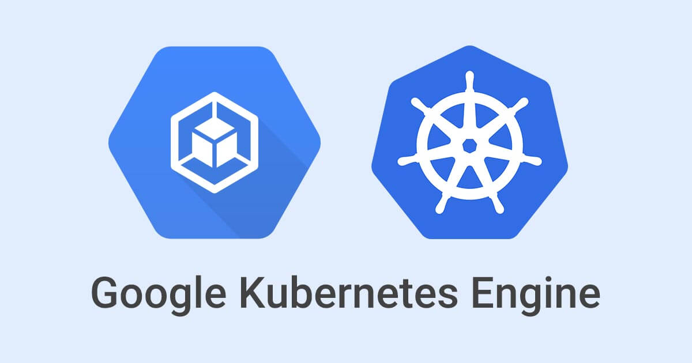
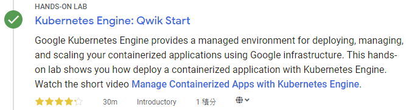
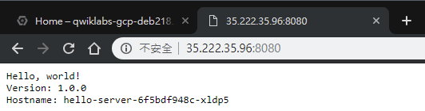

本篇是紀錄在 Google 的 Qwiklab 平台內，完成「[Kubernetes Engine: Qwik Start](https://www.qwiklabs.com/focuses/878?parent=catalog)」這個 quest 所學到的內容，包括如何透過 GKE 建立容器和部署容器化應用程式。

<!-- more -->



[Google Kubernetes Engine](https://cloud.google.com/kubernetes-engine/) (GKE) 提供了一個代管環境，可以使用 Google 基礎架構來部署、管理和擴展容器化應用程式。GKE 提供的環境是由多台機器 (特別是 [Google Compute Engine](https://cloud.google.com/compute) instance) 組成，組成一個[容器叢集](https://cloud.google.com/kubernetes-engine/docs/concepts/cluster-architecture)。在此 lab 中，你將透過 GKE 來實際練習如何建立容器和部署應用程式。

## GKE 的叢集編排管理 (orchestration)

GKE 叢集是由 [Kubernetes](https://kubernetes.io/) 開源叢集管理系統提供技術支援。你可以透過 Kubernetes 提供的機制與容器叢集互動。可以使用 Kubernetes 指令和資源來部署以及管理應用程式、執行管理任務、制訂政策，以及監控已部署工作負載 (workload) 的健康狀態。

Kubernetes 採用相同的設計原則來執行常用的 Google 服務，並提供相同的優勢：應用程序容器的自動管理、監控與有效性探測 (liveness probe)、自動擴展，滾動升級...等。當您在容器叢集上執行應用程序時，你所使用的技術是由 Google 在容器中執行 production 工作負載的十餘年經驗的技術。

## GCP 上的 Kubernetes

執行 GKE 叢集時，你也可以獲得 GCP 所提供的進階叢集管理功能優點，其中包括：

- Google Compute Engine (GCE) instances 提供的[負載平衡](https://cloud.google.com/compute/docs/load-balancing-and-autoscaling)
- [節點池 (Node Pools)](https://cloud.google.com/kubernetes-engine/docs/concepts/node-pools) 可以指定叢集中的子集節點，以獲得額外的靈活性
- [自動擴展 (Automatic scaling)](https://cloud.google.com/kubernetes-engine/docs/cluster-autoscaler) 叢集的節點 instance 數量
- [自動升級](https://cloud.google.com/kubernetes-engine/docs/concepts/node-auto-upgrades)叢集的節點軟體
- [自動修復節點](https://cloud.google.com/kubernetes-engine/docs/concepts/node-auto-repair)：可維護節點的健康狀態和可用性
- 使用 Stackdriver 來[記錄 (logging)](https://cloud.google.com/kubernetes-engine/docs/how-to/logging) 和[監控](https://cloud.google.com/kubernetes-engine/docs/how-to/monitoring)，用於查看叢集的狀態

## 準備

在點擊「Start Lab」之前，準備好網路瀏覽器 (推薦用 Google Chrome)，並且至少 40 分鐘可以專注的時間，因為 lab 是有時間限制，當你按下「Start Lab」開始學習時，無法暫停倒數計時，你只能在這段時間內使用 lab 提供給你的全新暫時 GCP Console 可用帳號，時間到之後的幾分鐘就會自動登出。

:::warning
注意：如果你有自己的個人 GCP 帳號或專案，請不要在此 lab 使用
:::

## 開始你的 Lab，然後登入 GCP Console

1. 如果準備要開始，可以點擊右上角的「Start Lab」開始：


2. 接著會出現這個畫面，因為我參加 [GDG Tainan](https://www.facebook.com/events/2005848903055499/) 的活動，活動有提供 Qwiklabs 一個月的免費額度，所以我點選下圖左邊的「Use Subscription」：


3. Lab 會提供給你免費暫時的 GCP 帳號，複製帳號和密碼，然後點擊「Open Google Console」開啟 [GCP Console](https://cloud.google.com/storage/docs/cloud-console)：


圖片來源：[Creating a Virtual Machine | Qwiklabs](https://www.qwiklabs.com/focuses/3563?parent=catalog)

4. 接著就會開啟登入頁面，建議另外開 Chrome 無痕模式來登入 lab 提供的帳號和密碼，因為 Chrome 會紀錄帳密，現在登入的只是暫時帳號，未來不需要用到：

:::warning
注意：這邊是登入 lab 提供的帳號 (也就是 email 必須為 `googlexxxxxx_student@qwiklabs.net` )，如果你有自己的 GCP 帳號，請不要用於此 lab，避免產生費用

> 類似於 `googlexxxxxx_student@qwiklabs.net` 的帳號是一個 Google 帳號，專為 Qwiklabs 學生使用而建立的。它具有特定的域名 (也就是 `qwiklabs.net` )，並且已分配了 IAM 角色，允許你去存取該 GCP 專案。

:::


5. 接受 terms 和 conditions：


6. 不要新增 recovery options 或 two-factor authentication (因為這是一個臨時帳號)：


7. 勾選同意服務條款：


之後就可以開始使用 GCP Console 囉：


## 啟動 Google Cloud Shell

Google Cloud Shell 是載入了開發工具的 VM，它提供 5GB 的 home 目錄，並在 Google Cloud 上執行。可用 Google Cloud Shell 提供的 command-line 來存取 GCP 的資源。

1. 在 GCP console 的右上方工具列中，點擊「Activate Cloud Shell」按鈕：


2. 在打開的對話框內，點擊「START CLOUD SHELL」：


3. 連接和提供環境需要一些時間：


4. 連接後，就代表你已經過身份驗證，專案已設置為 `PROJECT_ID`，以下圖的為例，此專案的 ID 為 `qwiklabs-gcp-f9d61ede8167e6b0`：


`gcloud` 是 GCP 的 command-line 工具，他已預先安裝在 Cloud Shell 上，並且支援 tab 自動補齊 (tab-completion)。

使用下面指令可列出有效帳號名稱：

```shell
$ gcloud auth list
          Credentialed Accounts
ACTIVE  ACCOUNT
*       google3043863_student@qwiklabs.net

To set the active account, run:
    $ gcloud config set account `ACCOUNT`
```

可以使用以下指令列出專案 ID：

```shell
$ gcloud config list project
[core]
project = qwiklabs-gcp-f9d61ede8167e6b0

Your active configuration is: [cloudshell-9292]
```

> 詳情可參考官方的 [Google Cloud gcloud Overview](https://cloud.google.com/sdk/gcloud/) 文件。

## 設定預設的 compute zone

[compute zone](https://cloud.google.com/compute/docs/regions-zones/#available) 是你的叢集及其資源所在的大概區域位置，例如：`us-central1-a` 是 `us-central1` region 中的一個 zone。

在 Cloud Shell 中啟用新的 session 並執行以下指令，將預設 compute zone 設為 `us-central1-a`：

```shell
$ gcloud config set compute/zone us-central1-a
Updated property [compute/zone].
```

> 詳情可參考官方的 [Managing clusters](https://cloud.google.com/kubernetes-engine/docs/how-to/managing-clusters#before_you_begin) 文件。

## 建立 GKE 叢集

一個[叢集](https://cloud.google.com/kubernetes-engine/docs/concepts/cluster-architecture)包含至少一個叢集主要 (master) 機器和多個稱為 node 的工作 (worker) 機器組成。node 是 [Google Compute Engine (GCE) 的 VM instance](https://cloud.google.com/compute/docs/instances/)，執行 Kubernetes 的必要程序 (process)，使它們成為叢集的一部分。

若要建立叢集，請執行以下指令，並將 `[CLUSTER-NAME]` 替換為自訂的叢集名稱 (例如：`my-cluster` )。叢集名稱必須以字母開頭，結尾必須是字母或數字，且不能超過 40 個字元。

```shell
$ gcloud container clusters create [CLUSTER-NAME]
```

你可以無視下面這些輸出內的任何警告：

```shell
WARNING: In June 2019, node auto-upgrade will be enabled by default for newly created clusters and node pools. To disable it, use the `--no-enable-autoupgrade`flag.
WARNING: Starting in 1.12, new clusters will have basic authentication disabled by default. Basic authentication can be enabled (or disabled) manually using the `--[no-]enable-basic-auth` flag.
WARNING: Starting in 1.12, new clusters will not have a client certificate issued. You can manually enable (or disable) the issuance of the client certificate using the `--[no-]issue-client-certificate` flag.
WARNING: Currently VPC-native is not the default mode during cluster creation. In the future, this will become the default mode and can be disabled using `--no-enable-ip-alias` flag. Use `--[no-]enable-ip-alias` flag to suppress this warning.
WARNING: Starting in 1.12, default node pools in new clusters will have their legacy Compute Engine instance metadata endpoints disabled by default. To create a cluster with legacy instance metadata endpoints disabled in the default node pool, run `clusters create` with the flag `--metadata disable-legacy-endpoints=true`.
This will enable the autorepair feature for nodes. Please see https://cloud.google.com/kubernetes-engine/docs/node-auto-repair for more information on node autorepairs.
WARNING: Starting in Kubernetes v1.10, new clusters will no longer get compute-rw and storage-ro scopes added to what is specified in --scopes (though the latter will remain included in the default --scopes). To use these scopes, add them explicitly to --scopes. To use the new behavior, set container/new_scopes_behavior property (gcloud config set container/new_scopes_behavior true).
```

建立叢集可能需要一些時間，很快應該會看到類似下面的輸出：

```shell
NAME        LOCATION       MASTER_VERSION  MASTER_IP      MACHINE_TYPE   NODE_VERSION   NUM_NODES  STATUS
my-cluster  us-central1-a  1.11.7-gke.12   104.154.18.48  n1-standard-1  1.11.7-gke.12  3          RUNNING
```

> 詳情可參考官方的 [Creating a cluster](https://cloud.google.com/kubernetes-engine/docs/how-to/creating-a-cluster) 文件。

## 取得叢集的驗證憑證

建立叢集後，需要取得驗證憑證 (authentication credentials) 才能操作叢集。

執行下面指定來對叢集進行驗證，將 `[CLUSTER-NAME]` 替換成叢集名成：

```shell
$ gcloud container clusters get-credentials [CLUSTER-NAME]
```

輸出如下：

```shell
Fetching cluster endpoint and auth data.
kubeconfig entry generated for my-cluster.
```

> 詳情可參考官方的 [Cluster access for kubectl](https://cloud.google.com/kubernetes-engine/docs/how-to/cluster-access-for-kubectl) 文件。

## 將應用部署至叢集

現在你已經建立了一個叢集，可以將[容器化應用程式](https://cloud.google.com/kubernetes-engine/docs/concepts/kubernetes-engine-overview)部署到該叢集。在此 lab 中，你將在叢集中執行 `hello-app`。

GKE 使用 Kubernetes 物件來建立和管理叢集的資源。Kubernetes 提供 [Deployment](https://kubernetes.io/docs/concepts/workloads/controllers/deployment/) 物件來部署 stateless 的應用，例如：web server。[Service](https://kubernetes.io/docs/concepts/services-networking/service/) 物件定義了從網際網路上存取應用程式的規則和負載平衡。

在 Cloud Shell 中執行下面的 [`kubectl run`](https://kubernetes.io/docs/reference/generated/kubectl/kubectl-commands#run) 指令，從 `hello-app` 容器 image 建立新的名為 `hello-server` 的 [Deployment](https://kubernetes.io/docs/concepts/workloads/controllers/deployment/)：

```shell
$ kubectl run hello-server --image=gcr.io/google-samples/hello-app:1.0 --port 8080
deployment.apps "hello-server" created
```

> 我在 Github 上面找到 `hello-app` image 的專案原始碼：[GoogleCloudPlatform/kubernetes-engine-samples](https://github.com/GoogleCloudPlatform/kubernetes-engine-samples/tree/master/hello-app)

> 如果想在自己的專案上使用自己建置的容器 image，並將此 image 的應用部署至 GKE，可參考官方的 [Deploying a containerized web application](https://cloud.google.com/kubernetes-engine/docs/tutorials/hello-app) 文件。

此 Kubernetes 指令建立一個代表 `hello-app` 的 Deployment 物件。在此指令中：

- `--image`：指定要部署的容器 image。在這種情況下，該指令從 [Google Container Registry](https://cloud.google.com/container-registry/docs) bucket 中 pull 範例 image。`gcr.io/google-samples/hello-app:1.0` 代表這個指令要 pull 的特定 image 版本。如果未指定版本，會使用最新版
- `--port`：指定容器要公開的 port

## 將應用公開發佈到網際網路

根據預設，在 GKE 上執行的容器無法從網際網路存取，因為這些容器沒有外部 IP 位址。所以你必須執行 [`kubectl expose`](https://kubernetes.io/docs/reference/generated/kubectl/kubectl-commands#expose) 這個指令：

```shell
$ kubectl expose deployment hello-server --type="LoadBalancer"
service/hello-server exposed
```

此指令會建立一個 Kubernetes Service，它是一個 Kubernetes 資源。GKE 會為應用程式建立外部 IP，明確地將應用程序公開給來自網際網路的流量 (外部流量)。加上 `type="LoadBalancer"` 參數會為容器建立一個 GCE 的 Load Balancer (在自己的專案上使用[需要計費](https://cloud.google.com/compute/pricing#lb))。

GKE 會將外部 IP 位址指派給 Service 資源，而不是指派給 Deployment。如果你想要找出 GKE 為應用程式佈建 (provisioned) 的外部 IP，可執行 [`kubectl get service`](https://kubernetes.io/docs/reference/generated/kubectl/kubectl-commands#get) 來檢查 `hello-server` Service：

```shell
$ kubectl get service hello-server
```

:::info
產生外部 IP 位址可能需要一分鐘。如果 `EXTERNAL-IP` 欄位顯示為 `pending` 狀態時 (如下)，請等待一段時間後，再次執行上面的指令：

```shell
NAME           TYPE           CLUSTER-IP     EXTERNAL-IP   PORT(S)          AGE
hello-server   LoadBalancer   10.39.249.21   <pending>     8080:31693/TCP   51s
```

:::

確認應用程式的外部 IP 位址後 ( `EXTERNAL-IP` 欄位提供的 IP)，請複製此 IP 位址，以下面的輸出範例來說，要複製的 Service 外部 IP 位址就是 `35.222.35.96`：

```shell
NAME           TYPE           CLUSTER-IP     EXTERNAL-IP    PORT(S)          AGE
hello-server   LoadBalancer   10.39.249.21   35.222.35.96   8080:31693/TCP   1m
```

接著將剛剛複製的外部 IP 位址，加上公開的 port，網址格式就會像下面這樣：

```
http://[EXTERNAL-IP]:8080
```

使用瀏覽器開啟此網址，查看應用程式是否能存取。

看到的頁面應該會像下圖這樣：



## 清除

執行下面的指令來刪除 Service，此步驟將取消分配為你的 Service 所建立的 Cloud Load Balancer：

```shell
$ kubectl delete service hello-server
```

執行下面的指令來刪除容器叢集，此步驟會一併刪除容器叢集的組成資源，例如：運算執行個體、磁碟和網路資源：

```shell
$ gcloud container clusters delete [CLUSTER-NAME]
The following clusters will be deleted.
 - [my-cluster] in [us-central1-a]

Do you want to continue (Y/n)?
```

當出現提示時，輸入 `Y` 進行確認。刪除叢集可能需要一些時間。刪除叢集後的輸出會像下面這樣：

```shell
The following clusters will be deleted.
 - [my-cluster] in [us-central1-a]

Do you want to continue (Y/n)?  y

Deleting cluster my-cluster...done.
Deleted [https://container.googleapis.com/v1/projects/qwiklabs-gcp-deb218c6553ee39c/zones/us-central1-a/clusters/my-cluster].
```

> 詳情可查看官方的 [Deleting a cluster | Google Kubernetes Engine](https://cloud.google.com/kubernetes-engine/docs/how-to/deleting-a-cluster) 文件。

## 參考來源

- [Kubernetes Engine: Qwik Start | Qwiklabs](https://www.qwiklabs.com/focuses/878?parent=catalog)
