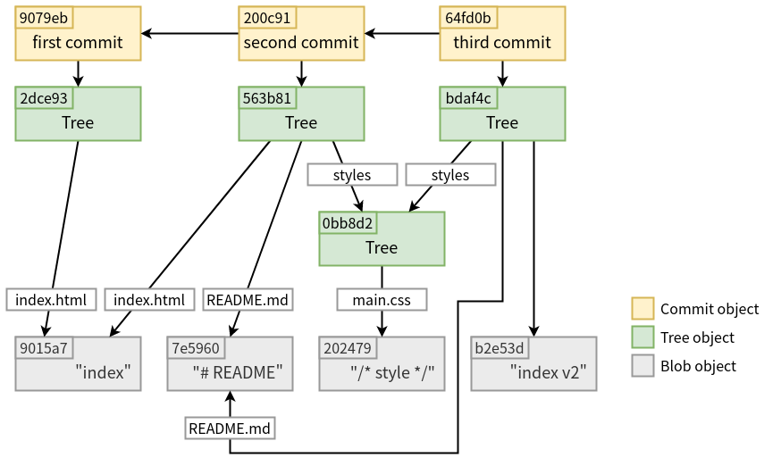

本篇將深入探討 Git 如何運作，在執行 `git commit` 時，Git 會如何建立和儲存 commit 物件。

<!-- more -->

tree 物件會指向追蹤專案的不同 snapshot，若要取得這些 snapshot 就會遇到一些問題：
- 必須記得這些 tree 物件的 SHA-1 值 (麻煩)
- snapshot 是誰儲存的 
- snapshot 是何時儲存的
- 為何要儲存 snapshot

以上這些就是 commit 物件為你儲存的資訊。

## 準備

下面會以這個檔案結構為範例：

```shell
$ mkdir demo
$ cd demo
$ git init
Initialized empty Git repository in /home/titan/project/demo/.git/
$ mkdir styles
$ echo "index" > index.html
$ echo "# README" > README.md
$ echo "/* style */" > styles/main.css

$ tree      
.
├── index.html
├── README.md
└── styles
    └── main.css

1 directories, 3 files
```

## 將第一個檔案加入 index，並建立 tree 物件

先將 `index.html` 加入 index，接著將 index 寫至 tree 物件中：

```shell
$ cat index.html
index
$ git add index.html
$ git write-tree
2dce93ea08ed9059be0a838c6bcf62b7b5c28907
```

:::info
註：`git add` 看起來只是將檔案加入 index，但在 Git 的運作原理其實做了很多步驟，詳情可參閱我之前寫的這幾篇，本篇就不再重複說明這些內容：
- [深入 Git：Git 物件儲存 - blob 物件](https://titangene.github.io/article/git--blob-object.html)
- [深入 Git：Git 物件儲存 - tree 物件](https://titangene.github.io/article/git-tree-object.html)
- [深入 Git：index 檔案](https://titangene.github.io/article/git-index.html)
:::

此時在 `.git/object` 目錄內，已經有兩個 Git 物件，分別為：
- `9015a7` blob 物件：透過 `index.html` 此檔案產生的
- `2dce93` tree 物件：對應到專案根目錄

```shell
$ tree .git/objects
.git/objects
├── 2d
│   └── ce93ea08ed9059be0a838c6bcf62b7b5c28907
├── 90
│   └── 15a7a32ca0681be64471d3ac2f8c1f24c1040d
├── info
└── pack

4 directories, 2 files

$ git cat-file -t 9015a7
blob
$ git cat-file -p 9015a7    
index

$ git cat-file -t 2dce93
tree
$ git cat-file -p 2dce93
100644 blob 9015a7a32ca0681be64471d3ac2f8c1f24c1040d	index.html
```

## 建立第一個 commit 物件

要建立 commit 物件需使用 `git commit-tree` 指令，指定一個 tree 物件的 SHA-1 值以及前一個 commit 物件 (第一個 commit 不需要)。

下面使用剛剛建立的 `2dce93` 的 tree 物件來建立 commit 物件，並且提供 commit 訊息：

```shell
$ echo 'first commit' | git commit-tree 2dce93
9079eb3c74f72f1409dc47ef5d7c8763dbd128f6
```

commit 物件會根據建立的時間和作者的資訊而建立不同的 SHA-1 值。使用 `git cat-file` 指令察看剛剛建立的 commit 物件：

```shell
$ git cat-file -t 9079eb
commit
$ git cat-file -p 9079eb
tree 2dce93ea08ed9059be0a838c6bcf62b7b5c28907
author titangene <titangene.tw@gmail.com> 1584281436 +0800
committer titangene <titangene.tw@gmail.com> 1584281436 +0800

first commit
```

commit 物件的格式包含以下內容：
- 專案 snapshot 的頂層 tree：也就是專案根目錄對應的 tree 物件
- author/committer 訊息：使用 `user.name` 和 `user.email` 的配置和 timestamp
  - author 就是編輯檔案內容的人
  - committer 就是 commit 的人
  - 通常 author 和 committer 會是同一個人
  - 若透過 email 來發送 patch，就可能發生 author 和 committer 是不同人 [^viewing-the-commit-history_pro-git] [^maintaining-a-project_pro-git]
- 一個空行 (blank line)
- commit 訊息

[^viewing-the-commit-history_pro-git]: [Git - Viewing the Commit History](https://git-scm.com/book/en/v2/Git-Basics-Viewing-the-Commit-History)
[^maintaining-a-project_pro-git]: [Git - Maintaining a Project](https://git-scm.com/book/en/v2/Distributed-Git-Maintaining-a-Project#_git_am)

### 將另外兩個檔案加入 index，並建立 tree 物件

接著將 `README.md` 和 `styles/main.css` 加入 index，接著再將 index 寫至 tree 物件中：

```shell
$ cat README.md
# README
$ git add README.md

$ cat styles/main.css
/* style */
$ git add styles/main.css

$ git write-tree
563b8123edfdfd28aeb8bd6cde392a4be9adba2d
```

此時在 `.git/object` 目錄內，多了 4 個 Git 物件，分別為：
- `7e5960` blob 物件：透過 `README.md` 此檔案產生的
- `202479` blob 物件：透過 `styles/main.css` 此檔案產生的
- `0bb8d2` tree 物件：對應到 `styles` 目錄
- `563b81` tree 物件：對應到專案根目錄

```shell
$ tree .git/objects
.git/objects
├── 0b
│   └── b8d2a25db76aec1c38bc948ba579959d443790
├── 20
│   └── 2479c888bf25f40895164be873c63f556a1b76
├── 2d
│   └── ce93ea08ed9059be0a838c6bcf62b7b5c28907
├── 56
│   └── 3b8123edfdfd28aeb8bd6cde392a4be9adba2d
├── 7e
│   └── 59600739c96546163833214c36459e324bad0a
├── 90
│   ├── 15a7a32ca0681be64471d3ac2f8c1f24c1040d
│   └── 79eb3c74f72f1409dc47ef5d7c8763dbd128f6
├── info
└── pack

8 directories, 7 files

$ git cat-file -t 7e5960
blob
$ git cat-file -p 7e5960
# README

$ git cat-file -t 202479
blob
$ git cat-file -p 202479
/* style */

$ git cat-file -t 0bb8d2
tree
$ git cat-file -p 0bb8d2
100644 blob 202479c888bf25f40895164be873c63f556a1b76	main.css

$ git cat-file -t 563b81
tree
$ git cat-file -p 563b81
100644 blob 7e59600739c96546163833214c36459e324bad0a	README.md
100644 blob 9015a7a32ca0681be64471d3ac2f8c1f24c1040d	index.html
040000 tree 0bb8d2a25db76aec1c38bc948ba579959d443790	styles
```

## 建立第二個 commit 物件

接著使用剛剛建立的 `563b81` 的 tree 物件來建立第二個 commit，並且提供 commit 訊息和指定前一個 commit (也就是 parent commit)：
- `-p <parent>`：指定 parent commit 的 ID，在此範例是第一個 commit 物件的 SHA-1 值

```shell
$ echo 'second commit' | git commit-tree 563b81 -p 9079eb
200c91c4acb82e529fb8205ea786a17cc10008b6
```

```shell
$ git cat-file -t 200c91
commit
$ git cat-file -p 200c91
tree 563b8123edfdfd28aeb8bd6cde392a4be9adba2d
parent 9079eb3c74f72f1409dc47ef5d7c8763dbd128f6
author titangene <titangene.tw@gmail.com> 1584285257 +0800
committer titangene <titangene.tw@gmail.com> 1584285257 +0800

second commit
```

## 編輯檔案後加入 index，並建立 tree 物件

接著編輯 `index.html` 後，將變更加入 index，接著再將 index 寫至 tree 物件中：

```shell
$ cat index.html
index
$ echo 'index v2' > index.html
$ git add index.html

$ git write-tree
bdaf4c7dc919738d7d59a27ef2ef3d5ff3107ae6
```

此時在 `.git/object` 目錄內，多了 2 個 Git 物件，分別為：
- `b2e53d` blob 物件：透過 `index.html` 此檔案產生的
- `bdaf4c` tree 物件：對應到專案根目錄

```shell
$ git cat-file -t b2e53d
blob
$ git cat-file -p b2e53d
index v2

$ git cat-file -t bdaf4c
tree
$ git cat-file -p bdaf4c
100644 blob 7e59600739c96546163833214c36459e324bad0a    README.md
100644 blob b2e53d55f22bdb2eafcdfaff9b1b37829309ae50    index.html
040000 tree 0bb8d2a25db76aec1c38bc948ba579959d443790    styles
```

## 建立第三個 commit 物件

接著使用剛剛建立的 `bdaf4c` 的 tree 物件來建立第三個 commit，並且提供 commit 訊息和指定前一個 commit (也就是 parent commit)：
- `-p <parent>`：指定 parent commit 的 ID，在此範例是第一個 commit 物件的 SHA-1 值

```shell
$ echo 'third commit' | git commit-tree bdaf4c -p 200c91
64fd0be6f2b66bc48d26c7c77cab62fab1477072
```

```shell
$ git cat-file -t 64fd0b
commit
$ git cat-file -p 64fd0b
tree bdaf4c7dc919738d7d59a27ef2ef3d5ff3107ae6
parent 200c91c4acb82e529fb8205ea786a17cc10008b6
author titangene <titangene.tw@gmail.com> 1584892171 +0800
committer titangene <titangene.tw@gmail.com> 1584892171 +0800

third commit
```

## 察看歷史紀錄

不過到目前為止，都還無法透過 `git log` 指令來察看剛剛建立的 commit 歷史紀錄，這是因為我們從一開始就是使用底層指令 (plumbing 指令) 來模擬平常我們在用的指令 (porcelain 指令)，而在過程中都沒有建立 `master` 分支：

```shell
$ git log
fatal: your current branch 'master' does not have any commits yet
```

但我們可在 `git log` 指令上，另外指定最後一個建立的 commit 物件，這樣就能看到剛剛建立的 Git 歷史紀錄了：
- `--stat`：顯示每個 commit 的 diff 資訊 (diffstat)

```shell
$ git log --stat 64fd0b
commit 64fd0be6f2b66bc48d26c7c77cab62fab1477072
Author: titangene <titangene.tw@gmail.com>
Date:   Sun Mar 22 23:49:31 2020 +0800

    third commit

 index.html | 2 +-
 1 file changed, 1 insertion(+), 1 deletion(-)

commit 200c91c4acb82e529fb8205ea786a17cc10008b6 (HEAD -> master)
Author: titangene <titangene.tw@gmail.com>
Date:   Sun Mar 15 23:14:17 2020 +0800

    second commit

 README.md       | 1 +
 styles/main.css | 1 +
 2 files changed, 2 insertions(+)

commit 9079eb3c74f72f1409dc47ef5d7c8763dbd128f6
Author: titangene <titangene.tw@gmail.com>
Date:   Sun Mar 15 22:10:36 2020 +0800

    first commit

 index.html | 1 +
 1 file changed, 1 insertion(+)
```

## Git 物件關聯圖

以上這些就是 Git 在執行 `git add` 和 `git commit` 指令時所做的事情：
1. 儲存已變更檔案的 blob 物件
2. 更新 index
3. 利用 index 建立 tree 物件
4. 建立指向頂層 tree 和 parent commit 的 commit 物件

這些物件都存在 `.git/objects` 目錄內。

```shell
$ find .git/objects -type f
.git/objects/2d/ce93ea08ed9059be0a838c6bcf62b7b5c28907 # Tree: ./ dir v1
.git/objects/20/0c91c4acb82e529fb8205ea786a17cc10008b6 # Commit: second commit
.git/objects/20/2479c888bf25f40895164be873c63f556a1b76 # Blob: main.css
.git/objects/7e/59600739c96546163833214c36459e324bad0a # Blob: README.md
.git/objects/0b/b8d2a25db76aec1c38bc948ba579959d443790 # Tree: styles dir
.git/objects/90/79eb3c74f72f1409dc47ef5d7c8763dbd128f6 # Commit: first commit
.git/objects/90/15a7a32ca0681be64471d3ac2f8c1f24c1040d # Blob: index.html
.git/objects/56/3b8123edfdfd28aeb8bd6cde392a4be9adba2d # Tree: ./ dir v2
```

下圖是這些 Git 物件的關聯圖：



:::info
雖然看起來很像目錄和子目錄的關係，但在 Git 中是沒有層級關係的，commit 物件形成[有向無環圖 (directed acyclic graph，DAG)](https://zh.m.wikipedia.org/wiki/有向无环图)，commit 物件有 parent commit (有向)，並且 commit 物件的圖是無環的 (從開始到結束不會是同一個物件) [^dag_git-doc]。

[^dag_git-doc]: [Git - gitglossary Documentation](https://git-scm.com/docs/gitglossary#Documentation/gitglossary.txt-aiddefDAGaDAG)
:::

資料來源：[10.2 Git Internals - Git Objects | Pro Git, 2/e](https://git-scm.com/book/zh-tw/v2/Git-Internals-Git-Objects#r_tree_objects)