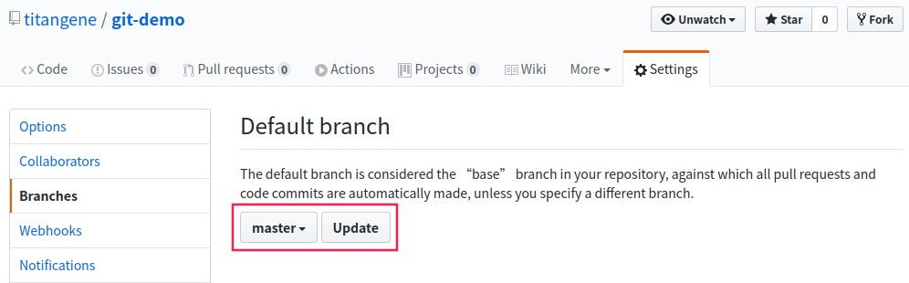
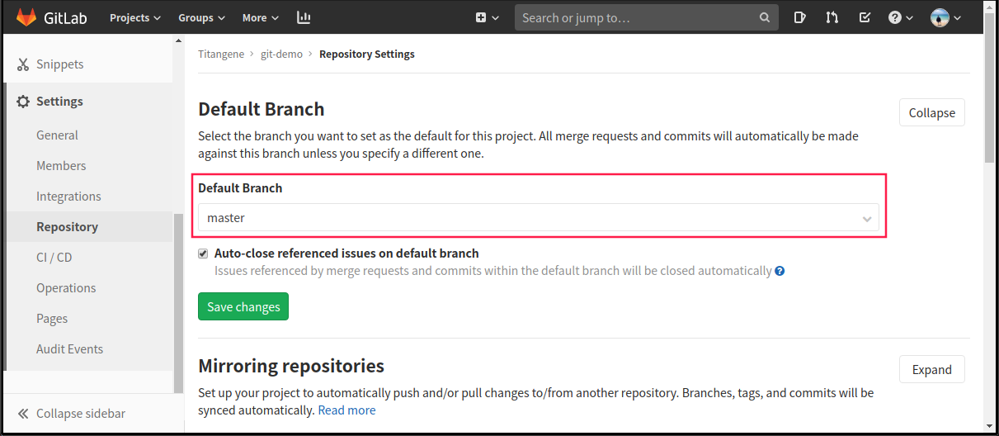
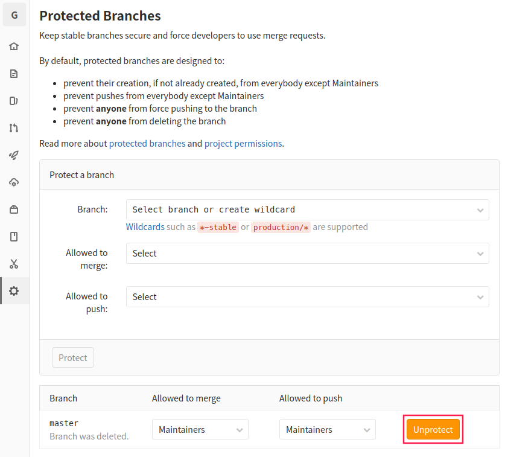

本篇將介紹如何刪除 GitHub 或 GitLab 的遠端分支，以及透過是否可刪除遠端 `master` 分支 (雖然通常不會這樣做)，以了解如何在 GitHub 和 GitLab 修改預設分支。

<!-- more -->

如果某分支已合併至遠端的 `master` 分支 (或穩定版的分支) 時，可在 `git push` 指令加上 `--delete` 或 `-d` 選項來刪除遠端分支 [^git-remote-branch_by-pro-git]：

[^git-remote-branch_by-pro-git]: [Git - Remote Branches | Pro Git, 2/e](https://git-scm.com/book/en/v2/Git-Branching-Remote-Branches#_delete_branches)

```shell
$ git push <remote> --delete <remoteBranchName>
$ git push <remote> -d <remoteBranchName>
```

```shell
$ git push origin --delete dev
To github.com:titangene/git-demo.git
 - [deleted]         dev
```

或是在 ref (在這邊指的是下面指令中的 `<remoteBranchName>` ) 之前加上冒號 ( `:` ) 也可以刪除遠端分支：

```shell
$ git push <remote> :<remoteBranchName>
```

```shell
$ git push origin :dev
To github.com:titangene/git-demo.git
 - [deleted]         dev
```

此指令是在 `origin` repo 中找到與 `dev` match 的 ref (例如：`refs/heads/dev` )，然後將該遠端分支刪除 [^git-push_by-scm]，其實就是刪除遠端 server 上的分支指標。Git Server 會將資料保留一段時間，直到執行 GC (garbage collection，垃圾回收) 為止。所以如果誤刪了分支都很容易恢復。

[^git-push_by-scm]: [Git - git-push Documentation](https://git-scm.com/docs/git-push#Documentation/git-push.txt-codegitpushoriginexperimentalcode)

## 刪除多個遠端分支

如果要刪除多個遠端分支，可直接將多個指定遠端分支加在後面：

```shell
$ git push origin -d feature master
To github.com:titangene/git-demo.git
 - [deleted]         feature
 - [deleted]         master
```

## 無法刪除的遠端分支

通常預設會無法刪除遠端的 `master` 分支，因為遠端通常會將 `master` 分支作為預設分支：

```shell
$ git push origin -d master
To github.com:titangene/git-demo.git
 ! [remote rejected] master (refusing to delete the current branch: refs/heads/master)
error: failed to push some refs to 'git@github.com:titangene/git-demo.git'
```

預設是無法刪除 GitHub 和 GitLab 遠端 repo 的 `master` 分支。

## 刪除 GitHub 的遠端分支

如果要刪除 GitHub 遠端 repo 的 `master` 分支，只要將該 repo 的預設分支改成其他分支，這樣就可以刪掉了。

在 repo 的「Settings > Branches > Default branch > 將預設分支改為其他分支 > Update」，如圖：



```shell
$ git push origin -d master
To github.com:titangene/git-demo.git
 - [deleted]         master
```

## 刪除 GitLab 的遠端分支

刪除 GitLab 遠端 repo 的 `master` 分支時，會發生以下錯誤，錯誤訊息中直接說明 `master` 分支是預設分支，所以無法刪除：

```shell
$ git push gitlab -d master
remote: GitLab: The default branch of a project cannot be deleted.
To gitlab.com:titangene/git-demo.git
 ! [remote rejected] master (pre-receive hook declined)
error: failed to push some refs to 'git@gitlab.com:titangene/git-demo.git'
```

在 repo 的「Settings > Repository > Default branch > 將預設分支改為其他分支 > Save changes」，如圖：



那如果將預設分支改成其他分支呢？結果還是不能刪除：

```shell
$ git push gitlab -d master
remote: GitLab: You can only delete protected branches using the web interface.
To gitlab.com:titangene/git-demo.git
 ! [remote rejected] master (pre-receive hook declined)
error: failed to push some refs to 'git@gitlab.com:titangene/git-demo.git'
```

其實原因也寫在錯誤訊息內，因為 GitLab 會預設將 repo 的 `master` 分支設為受保護的分支 (protected branch) [^remove-protected-branch_by-gitlab] [^protected-branch_by-gitlab]，所以才不能刪除。

[^remove-protected-branch_by-gitlab]: [Permissions · User · Help · GitLab](https://gitlab.com/help/user/permissions)
[^protected-branch_by-gitlab]: [Protected branches · Project · User · Help · GitLab](https://gitlab.com/help/user/project/protected_branches)

如果要刪除受保護的分支，那就讓他不受保護就可以囉 XD。

在 repo 的「Settings > Repository > Protected Branches > Unprotect `master` 分支」，如圖：



設定後就可以刪除 `master` 分支了：

```shell
$ git push gitlab -d master
To gitlab.com:titangene/git-demo.git
 - [deleted]         master
```

## 察看是否刪除遠端分支

另外，如果用 `git branch -vv` 可以看到該分支已被刪除 (輸出訊息中的 `gone` )：

```shell
$ git branch -vv
* dev    44fdaf6 [origin/dev: gone] feat: d
  master 49135dc [origin/master] feat: b
```