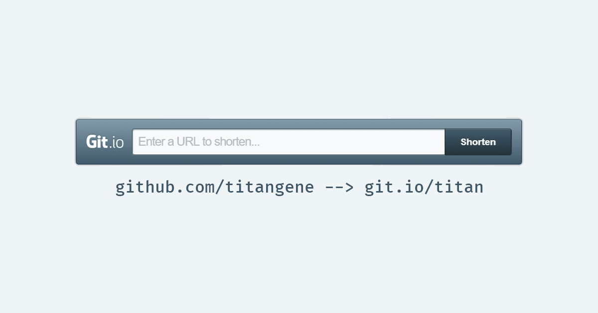

最近發現原來 Github 也有提供縮網址 (URL Shortener) 服務「[Git.io](https://git.io/)」，它只適用於 `gist.github.com` 及 `github.com` 兩個 hostname。

<!-- more -->

下列網址都可以透過 Git.io 來建立縮網址：
- Github 個人或組織專業 ( `https://github.com/<github-id>` )
- Github repository ( `https://github.com/<github-id>/<repo-name>` ) 或 repository 內目錄或檔案
- Gist ( `https://gist.github.com/<github-id>/<gist-id>` )

Git.io 有兩種建立短網址的方法，下面會分別介紹：
- 直接到 [Git.io](https://git.io/) 線上設定
- 使用 `curl` 指令設定：[Git.io: GitHub URL Shortener | GitHub Blog](https://blog.github.com/2011-11-10-git-io-github-url-shortener/)

## [Git.io](https://git.io/) 線上設定
最簡單的方法當然是直接打開 [Git.io](https://git.io/)，接著輸入網址並點擊「shorten」按鈕就會將你剛剛輸入的網址變成短網址，短網址的格式是 `git.io/xxx`。

但缺點是無法自訂短網址名稱，預設是自動隨機英文 + 數字的字串。


## 使用 `curl` 指令建立短網址

- `-i`、`--include`：顯示 HTTP response headers
- `-F`、`--form <name=content>`：設定表單資料，`Content-Type` 會被設為 `multipart/form-data`

```shell
$ curl -i https://git.io -F "url=<想縮短的網址>" -F "code=<自訂短網址名稱>"
```

例如我想將自己的 Github profile URL：`github.com/titangene` 縮短成 `git.io/titan`，就要執行下面指令：

```shell
$ curl -i https://git.io -F "url=https://github.com/titangene" -F "code=titan"
HTTP/1.1 201 Created
...
Location: https://git.io/titan
...

$ curl -i https://git.io -F "url=https://titangene.github.io/" -F "code=titan-blog"
```

只要輸入下面指令就可以確認是否建立成功

```shell
$ curl -i https://git.io/titan
HTTP/1.1 302 Found
...
Location: https://github.com/titangene
...
```

## [小插曲] 縮網址不小心設定錯誤
一開始在 Git.io 測試時，直接用自己的 Github profile URL ( `github.com/titangene` ) 來產生預設隨機英文 + 數字的短網址，想要修改成 `git.io/titan` 卻沒辦法！這是因為 Git.io 沒有直接提供修改短網址的功能。

後來 Google 一下才發現只能聯繫 [Github 客服](https://github.com/contact)來幫忙刪除短網址，然後再自行重新設定。過了不到半天客服就回信幫我解決了！真是太感謝 Github 客服了！