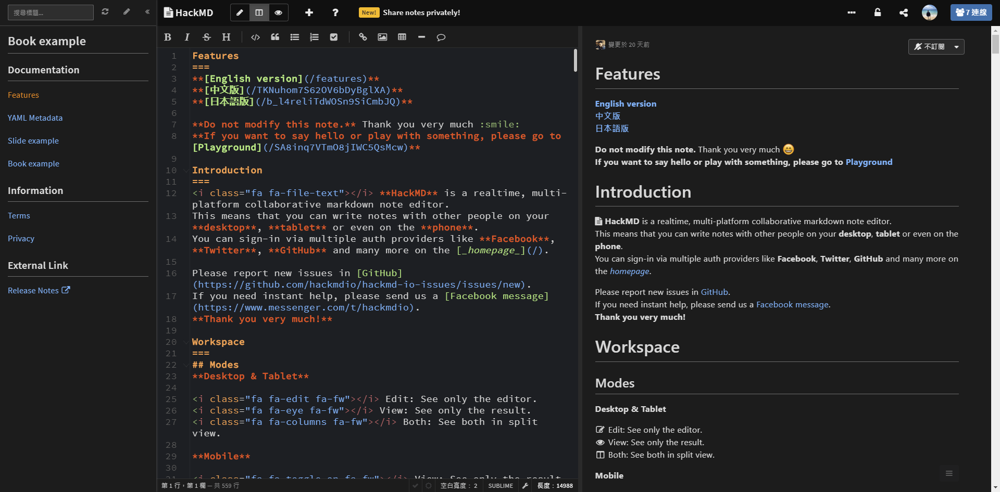
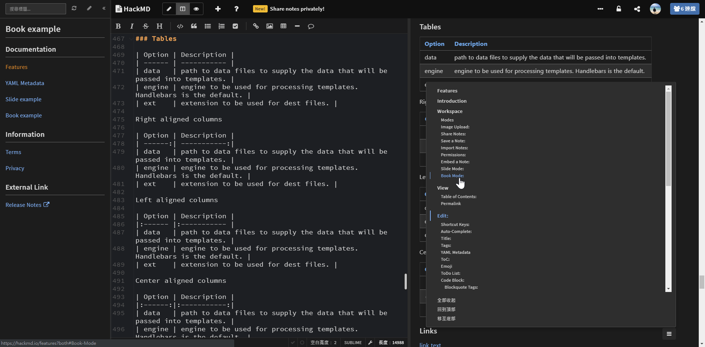

HackMD 是我常用的寫作平台，因官方沒有提供暗主題的瀏覽模式，所以我就刻了自訂的暗主題，也將自訂主題[開源在 GitHub](https://github.com/titangene/hackmd-dark-theme)，歡迎大家發 PR 給我，並記得幫我按個 :star: 星。

<!-- more -->

應該有很多人在瀏覽器安裝 [Dark reader](https://chrome.google.com/webstore/detail/dark-reader/eimadpbcbfnmbkopoojfekhnkhdbieeh) 這個擴充功能吧？通常使用的原因大多是想把畫面變成深色瀏覽模式，比較保護眼睛。但是有些網站使用這個擴充功能之後，有些顏色不是你習慣或喜歡的，尤其是在個人常用的網站上會感覺沒那麼習慣。

而 [HackMD](https://hackmd.io/) 是我常用來寫技術筆記的寫作平台，尤其是程式碼的 highlight，我個人偏好 VS Code 預設的暗主題 (Dark+ 這個主題)，所以我就在網頁上加上自己自訂的 CSS 去改成我想要的主題。

那如何將自定的 CSS 加在指定的網站上呢？原本我是用 [Stylish](https://userstyles.org/) 來管理自訂的網頁樣式，但後來因為[一些原因這個擴充功能多了在背景上傳資訊的功能](https://forum.userstyles.org/discussion/53233/announcement-to-the-community) (雖然官方說不會上傳個資)，於是我就改用 [Stylus](https://github.com/openstyles/stylus) 來管理樣式。Stylus 是 Stylish 的分支，刪除了任何與分析、回傳資料的功能。

## 如何使用主題
1. 在瀏覽器安裝 [Stylus](https://github.com/openstyles/stylus) 擴充功能，Stylus 目前提供這幾種瀏覽器版本的擴充功能：
    - [Chrome](https://chrome.google.com/webstore/detail/stylus/clngdbkpkpeebahjckkjfobafhncgmne)
    - [Firefox](https://addons.mozilla.org/zh-TW/firefox/addon/styl-us/)
    - [Opera](https://addons.opera.com/zh-tw/extensions/details/stylus/)
2. 下載我自定的 [HackMD dark theme](https://userstyles.org/styles/147272/hackmd-dark-theme) 至 Stylus

3. 下載樣式後會自動套用，開啟 HackMD 就會看到介面變成暗主題囉！如果是之前就開啟的 HackMD 頁面，有時會需要重新整理頁面才會套用暗主題。

就是這麼簡單 :smile:。

這邊要另外說明一下，雖然剛剛提到因為 Stylish 有收集資料的問題，所以我改用 Stylus 來管理自定樣式，但是要將自定的樣是分享給別人使用，還是要註冊 [Stylish](https://userstyles.org/) 官方平台的帳號，將要分享的樣式上傳至這個平台，讓其他人可以下載使用。

不過如果只是下載別人的主題是不需要註冊帳號，所以不用擔因。

## 原始碼
這就是我自定 HackMD 樣式的原始碼：[titangene/hackmd-dark-theme](https://github.com/titangene/hackmd-dark-theme)

如果發現需修正的地方，歡迎發 pull request 給我 :sunglasses:。
如果喜歡，記得幫我按個 :star: 星，Thanks。

## 畫面截圖
### Overview

### Recent

### View mode

### Book mode

### Slide mode

### Emoji & Todo list & Code block highlight

### Github Gist

### LaTeX & UML

### Table

### ToC (Table of Contents)

### History

### Permission

### Comment

## 小結
其實這個 side project 我在 2017 年 8 月就開始做了，期間做了一些不定期的更新，這次的更新算是所有我發現想改的部分 (洞) 都填好了 (有可能我眼殘沒發現的部分也需要改 XD，歡迎大家發 PR 給我)，包括最近 HackMD 官方推出的可分享文件給指定帳號的功能，我也把介面變成暗主題了。