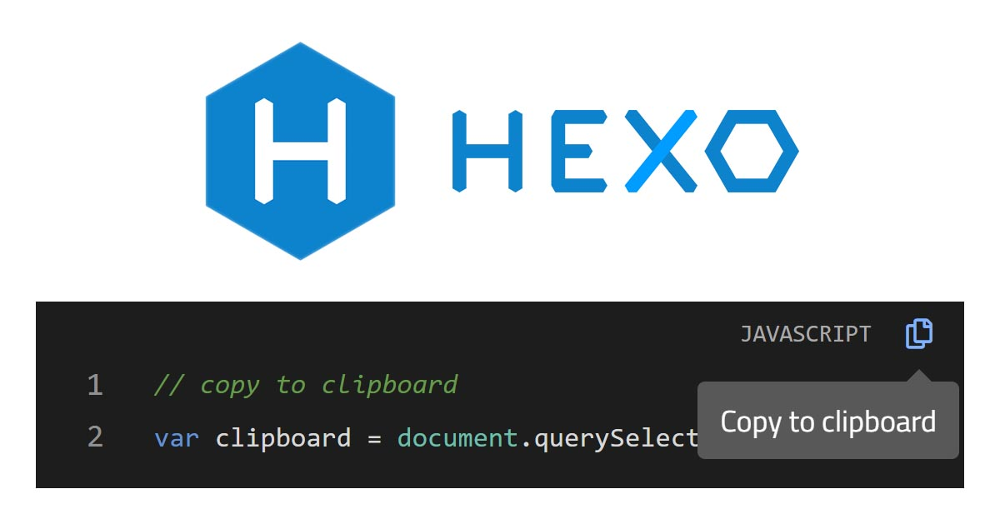
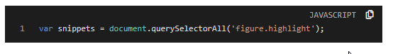

為了提高 blog 的使用體驗，本文將說明如何在 Hexo 主題內，提供程式碼片段複製至剪貼簿的功能。

<!-- more -->

```javascript
// copy to clipboard
var clipboard = document.querySelectorAll('pre');
```


## 載入 clipboard.js
在 `themes\material-flow\layout\_partial\scripts.ejs` 檔案內的載入 clipboard.js：

```html
<script src="https://cdnjs.cloudflare.com/ajax/libs/clipboard.js/2.0.0/clipboard.min.js"></script>
```

## 新增程式碼片段複製功能
每個程式碼片段內都要新增複製功能按鈕，下面說明新增複製按鈕的處理邏輯：
1. 首先要找到所有程式碼區塊：

```javascript
var snippets = document.querySelectorAll('figure.highlight');
```

2. 準備要新增的按鈕結構：

```javascript
var htmlCopyButton = `
  <button class="codecopy-btn tooltipped tooltipped-sw" aria-label="Copy to clipboard">
    <i class="far fa-copy" aria-hidden="true"></i>
  </button>`;
```

3. 在原本的程式碼區塊的 `<figure>` 標籤外多包了一層 `<div>` 標籤
4. 在 `<div>` 標籤上新增 `.code-highlight` class 樣式
5. 在 `<div>` 標籤上新增 `data-lang` 屬性用於記錄此程式碼區塊內的程式碼是哪種程式語言

```javascript
snippets.forEach((snippet) => {
  var parent = snippet.parentNode;
  var wrapper = document.createElement('div');

  parent.replaceChild(wrapper, snippet);
  wrapper.appendChild(snippet);

  wrapper.classList.add('code-highlight');
  wrapper.firstChild.insertAdjacentHTML('beforebegin', htmlCopyButton);

  var lang = (snippet.classList[1] || 'code').toUpperCase();
  wrapper.setAttribute('data-lang', lang);
});
```

6. 接著將名為 `.codecopy-btn` 的 element 上新增複製功能，複製的內容是 `<figure>` 標籤內的程式碼：

```javascript
var clipboard = new ClipboardJS('.codecopy-btn', {
  target: (trigger) => {
    return trigger.nextSibling;
  }
});
```

7. 只要按複製按鈕且複製成功，就會顯示 `Copied!` 提示已成功複製程式碼片段：

```javascript
clipboard.on('success', (e) => {
  e.trigger.setAttribute('aria-label', 'Copied!');
  e.clearSelection();
});
```

8. 將每個複製按鈕新增兩個監聽事件，分別是 `mouseleave` 和 `click`：
    - `mouseleave`：滑鼠離開按鈕就將提示文字變成 `Copy to clipboard`
    - `click`：取消事件的預設行為


```javascript
var btns = document.querySelectorAll('.codecopy-btn');

btns.forEach((btn) => {
  btn.addEventListener('mouseleave', (e) => {
    e.target.setAttribute('aria-label', 'Copy to clipboard');
    e.target.blur();
  });

  btn.addEventListener('click', (e) => {
    e.preventDefault()
  });
});
```

### 完整程式碼
在 `themes\material-flow\source\js` 目錄內建立 `clipboard-use.js`，檔案內容如下：

```javascript
$(function () {
  // ref: https://github.com/zenorocha/codecopy/blob/master/src/scripts/main.js
  var snippets = document.querySelectorAll('figure.highlight');
  var htmlCopyButton = `
    <button class="codecopy-btn tooltipped tooltipped-sw" aria-label="Copy to clipboard">
      <i class="far fa-copy" aria-hidden="true"></i>
    </button>`;

  snippets.forEach((snippet) => {
    var parent = snippet.parentNode;
    var wrapper = document.createElement('div');

    parent.replaceChild(wrapper, snippet);
    wrapper.appendChild(snippet);

    wrapper.classList.add('code-highlight');
    wrapper.firstChild.insertAdjacentHTML('beforebegin', htmlCopyButton);

    var lang = (snippet.classList[1] || 'code').toUpperCase();
    wrapper.setAttribute('data-lang', lang);
  });

  // Add copy to clipboard functionality and user feedback
  var clipboard = new ClipboardJS('.codecopy-btn', {
    target: (trigger) => {
      return trigger.nextSibling;
    }
  });

  clipboard.on('success', (e) => {
    e.trigger.setAttribute('aria-label', 'Copied!');
    e.clearSelection();
  });

  // Replace tooltip message when mouse leaves button
  // and prevent page refresh after click button
  var btns = document.querySelectorAll('.codecopy-btn');

  btns.forEach((btn) => {
    btn.addEventListener('mouseleave', (e) => {
      e.target.setAttribute('aria-label', 'Copy to clipboard');
      e.target.blur();
    });

    btn.addEventListener('click', (e) => {
      e.preventDefault()
    });
  });
});
```

接著在 `themes\material-flow\layout\_partial\scripts.ejs` 檔案內的載入 `clipboard-use.js`：

```html
<%- js('js/clipboard-use.js') %>
```

## CSS 樣式
### 提示文字樣式
在 `themes\material-flow\source\less` 目錄內建立 `_tooltipped.less`，檔案內容如下：

```less
// ref: https://github.com/primer/primer/blob/master/modules/primer-tooltips/lib/tooltips.scss
.tooltipped {
  position: relative;
}

// This is the tooltip bubble
.tooltipped::after {
  position: absolute;
  z-index: 1000000;
  display: none;
  padding: .5em .75em;
  -webkit-font-smoothing: subpixel-antialiased;
  color: #fff;
  text-align: center;
  text-decoration: none;
  text-shadow: none;
  text-transform: none;
  letter-spacing: normal;
  word-wrap: break-word;
  white-space: pre;
  pointer-events: none;
  content: attr(aria-label);
  background: #616161;
  border-radius: 3px;
  opacity: 0;
}

// This is the tooltip arrow
.tooltipped::before {
  position: absolute;
  z-index: 1000001;
  display: none;
  width: 0;
  height: 0;
  color: #616161;
  pointer-events: none;
  content: "";
  border: 6px solid transparent;
  opacity: 0;
}

// delay animation for tooltip
@keyframes tooltip-appear {
  from {
    opacity: 0;
  }

  to {
    opacity: 1;
  }
}

// This will indicate when we'll activate the tooltip
.tooltipped:hover,
.tooltipped:active,
.tooltipped:focus {
  &::before,
  &::after {
    display: inline-block;
    text-decoration: none;
    animation-name: tooltip-appear;
    animation-duration: .1s;
    animation-fill-mode: forwards;
    animation-timing-function: ease-in;
  }
}

// Tooltipped south
.tooltipped-s,
.tooltipped-sw {
  &::after {
    top: 100%;
    right: 50%;
    margin-top: 6px;
  }

  &::before {
    top: auto;
    right: 50%;
    bottom: -7px;
    margin-right: -6px;
    border-bottom-color: #616161;
  }
}

.tooltipped-sw::after {
  margin-right: -16px;
}

// Move the tooltip body to the center of the object.
.tooltipped-s::after {
  transform: translateX(50%);
}
```

接著在 `themes\material-flow\source\style.less` 檔案內的載入 `_tooltipped.less`：

```less
@import "less/_tooltipped.less";
```

### 其他樣式
可參考本站的完整樣式：[原始碼](https://github.com/titangene/hexo-blog/blob/master/themes/material-flow/source/less/_article.less)

```less
figure {
  &.highlight {
    position: relative;
    margin: 1rem 0;
    padding-top: 22px;
  }
}

.code-highlight {
  position: relative;

  &::before {
    content: attr(data-lang);
    font-family: "Roboto Mono", Consolas, monospace, sans-serif;
    font-size: 0.6em;
    color: #b1b1b1;
    line-height: 18px;
    position: absolute;
    top: 4px;
    right: 7px;
    z-index: 1;
  }
}

.codecopy-btn {
  width: 24px;
  height: 26px;
  position: absolute;
  top: 0;
  right: -24px;
  border: none;
  box-shadow: none;
  background: none;
  z-index: 1;
  font-size: 12px;
  color: #fff;
  transition: color 0.2s;

  &:hover {
    color: #7bf;
  }
}
```

## Demo
下面是原本的 HTML：

```html
<figure class="highlight javascript">
  <table>
    <tr>
      <td class="gutter">
        <pre><span class="line">1</span><br></pre>
      </td>
      <td class="code">
        <pre><code class="hljs javascript">...</code></pre>
      </td>
    </tr>
  </table>
</figure>
```

使用後的 HTML：

```html
<div class="code-highlight" data-lang="JAVASCRIPT">
  <button class="codecopy-btn tooltipped tooltipped-sw" aria-label="Copy to clipboard">
    <i class="far fa-copy" aria-hidden="true"></i>
  </button>
  <figure class="highlight javascript">
    <table>
      <tr>
        <td class="gutter">
          <pre><span class="line">1</span><br></pre>
        </td>
        <td class="code">
          <pre><code class="hljs javascript">...</code></pre>
        </td>
      </tr>
    </table>
  </figure>
</div>
```

畫面：



## 參考連結
- [clipboard.js — Copy to clipboard without Flash](https://clipboardjs.com/)
- [GitHub's Primer Tooltips](https://github.com/primer/primer/tree/master/modules/primer-tooltips)
- [zenorocha/codecopy: A browser extension that adds copy to clipboard buttons on every code block](https://github.com/zenorocha/codecopy)