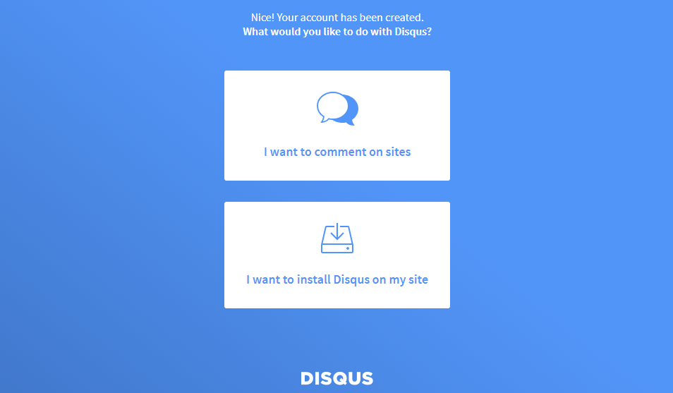

接續從零建置 Github Page + Hexo blog，這次來研究如何在 Hexo 加入 Disqus 討論區。

<!-- more -->

## 建立 Disqus
至 [Disqus](https://disqus.com/) 首頁註冊帳號後並登入，接著點擊首頁的「GET STARTED」


選擇「I want to install Disqus on my site」選項



- Websit Name：自訂 short name，且是唯一，像我是設定 titangene-blog。short name 會在設定 Hexo 時需要
- Category：類別，自行選擇
- Language：語言，自行選擇

填寫後點擊「Create Site」


## 設定 Hexo
在根目錄內的 `_config.yml` 內設定：

```yaml
disqus_shortname: your_disqus_short_name
```

設定後就可以看到每篇文章下面都可以留言囉！

