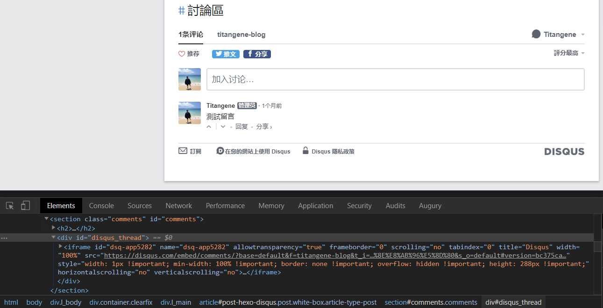

Blog 最重要的是可以增進技術的交流，而交流就可以透過留言版來達成。大部分的 Blog 在每篇文章下面都會有留言板，而最常見的就是 Disqus 留言板，因此本篇會說明如何將 Disqus 留言板和各文章的留言數加入 Hexo 的主題中。

<!-- more -->

## 申請網站留言版帳號

至 [Disqus](https://disqus.com/) 首頁註冊帳號後並登入，接著點擊首頁的「GET STARTED」：


選擇「I want to install Disqus on my site」選項：


需要輸入的欄位：

- Websit Name：自訂 short name，且是唯一，像我是設定 titangene-blog。short name 會在設定 Hexo 時需要
- Category：類別，自行選擇
- Language：語言，自行選擇

填寫後點擊「Create Site」：


## 設定 Hexo

在 [material-flow](https://github.com/stkevintan/hexo-theme-material-flow) 主題內的 `_config.yml` 原有設定是使用 `disqus_shortname` 參數來設定 Disqus 的 short name：

```yaml
disqus_shortname: your_disqus_short_name
```

但我想在 blog 加上留言數，所以才將參數設定改成下面內容：

- `enable`：設定 `true` 或 `false` 來決定是否要啟用 Disqus 的留言版功能
- `shortname`：設定你的 Disqus 的 short name
- `count`：設定 `true` 或 `false` 來決定是否要顯示文章的留言數

```yaml
# Comments
disqus:
  enable: true
  shortname: your_disqus_short_name
  count: true
```

那接著就是將 Disqus 的留言版功能加入主題中，主要分成幾個步驟：

1. 加入 Disqus script
2. 新增 Disqus 留言版
3. 新增 Disqus 留言數

如果在剛剛上面的 `count` 參數設定為 `false` 則可以跳過第三個步驟 [新增 Disqus 留言數](#新增-disqus-留言數)。

下面提供的程式碼可適用於 Hexo 的 [material-flow](https://github.com/stkevintan/hexo-theme-material-flow) 主題，HTML 結構可依各自使用的版型或需求來修改。若想直接看我設定的原始碼，可至此 Blog 的 GitHub Repo「[titangene/hexo-blog](https://github.com/titangene/hexo-blog/tree/master/themes/material-flow/layout)」查看。

### 加入 Disqus script

在 `themes\material-flow\layout\_partial\script\disqus.ejs` 檔案內加入以下程式碼，當頁面載入時，會以非同步的方式將 Disqus 的 script 加入 `<head>` 或 `<body>` 標籤中：

```html
<% if (config.disqus.enable) { %> <% if (page.comments) { %>
<script>
  var disqus_shortname = '<%= config.disqus.shortname %>';
  var disqus_config = function() {
    this.page.url = '<%= page.permalink %>';
    this.page.identifier = '<%= page.path %>';
    this.page.title = '<%= page.title %>';
  };
  (function() {
    var dsq = document.createElement('script');
    dsq.async = true;
    dsq.src = '//' + disqus_shortname + '.disqus.com/embed.js';
    dsq.setAttribute('data-timestamp', '' + new Date());
    (document.head || document.body).appendChild(dsq);
  })();
</script>
<% } %> <% if (config.disqus.count) { %>
<script
  id="dsq-count-scr"
  src="https://<%= config.disqus.shortname %>.disqus.com/count.js"
  async
></script>
<% } %> <% } %>
```

接著在 `themes\material-flow\layout\layout.ejs` 檔案內的 `<body>` 標籤中將剛剛新增的 `disqus.ejs` 載入：

```html
<%- partial('script/disqus') %>
```

### 新增 Disqus 留言版

在 `themes\material-flow\layout\_partial\article.ejs` 檔案內找到適當的位置加入以下程式碼，就可以在文章內新增 Disqus 留言版：

```html
<% if (post.comments && config.disqus.enable) { %>
<section class="comments" id="comments">
  <h2>留言版</h2>
  <div id="disqus_thread">
    <noscript
      >Please enable JavaScript to view the
      <a href="https://disqus.com/?ref_noscript">comments powered by Disqus.</a></noscript
    >
  </div>
</section>
<% } %>
```

上面程式碼中最重要的是 `<div id="disqus_thread">` 這句，因為當頁面載入並將 Disqus 的 script 載入後，就會將此標籤內的內容取代成 Disqus 留言版，而 Disqus 留言版是使用 `<iframe>` 標籤的方式嵌入在頁面中：



### 新增 Disqus 留言數

在 `themes\material-flow\layout\_partial\article.ejs` 檔案內找到適當的位置加入以下程式碼，就可以在文章內新增 Disqus 留言數：

```html
<% if (post.comments && config.disqus.enable && config.disqus.count) { %>
<span class="comments-count">
  <span class="post-meta-item-icon">
    <i class="fas fa-comment"></i>
  </span>
  <a
    href="<%- post.permalink %>#disqus_thread"
    class="article-comment-count"
    data-disqus-identifier="<%= post.path %>"
    itemprop="discussionUrl"
  >
  </a>
</span>
<% } %>
```

也可以在 `themes\material-flow\layout\_partial\post.ejs` 檔案內新增 Disqus 留言數，這樣就可以在首頁看到各文章的留言數。

上面程式碼中最重要的是 `<a href="<%- post.permalink %>#disqus_thread"...>` 這句，因為在連結的最後加上 `#disqus_thread`，就代表要告訴 Disqus 要找哪個連結的留言數，並將留言數設為連結名稱 (例如：1 留言)。而 `data-disqus-identifier` 屬性需設為此頁面的識別名稱：


> 可參考 Disqus 的 [JavaScript configuration variables | Disqus](https://help.disqus.com/developer/javascript-configuration-variables) 文件。

若要設定顯示在頁面上的留言數文字，可至 Disqus 的「Setting > Community > Comment Count Link」內設定，可分別設定三種情況：

- 0 則留言
- 1 則留言
- 多則留言：`{num}` 是作為留言數的變數


## Demo

設定後就可以看到每篇文章下面都可以留言囉！


可在每篇文章看到留言數：


## 參考來源

- [Install instructions for Universal Code | Disqus](https://disqus.com/admin/install/platforms/universalcode/)
- [Adding comment count links to your home page | Disqus](https://help.disqus.com/developer/adding-comment-count-links-to-your-home-page)
