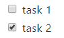

個人很常用 HackMD 紀錄筆記，希望 blog 也可以支援 HackMD 的 Markdown 格式，因此本篇的目標就是要將 Hexo 原本的 Markdown 渲染引擎 `marked`，換成 HackMD 的 Markdown 渲染引擎：`markdown-it`。

<!-- more -->

## 更換渲染引擎
Hexo 預設的 markdown 渲染引擎是 [`marked`](https://github.com/markedjs/marked)，並使用 [`hexo-renderer-marked`](https://github.com/hexojs/hexo-renderer-marked) 此 Hexo 外掛來將 Markdown 轉換成靜態檔案 HTML，但因前面提到的需求，所以要刪除原本的渲染引擎

```shell
$ npm uninstall hexo-renderer-marked --save
```

安裝我們要改用的 Markdown 渲染引擎：`markdown-it`，而使用此渲染引擎的 Hexo 外掛就是 [`hexo-renderer-markdown-it`](https://github.com/hexojs/hexo-renderer-markdown-it)，所以要在 hexo 的專案中安裝此外掛：

```shell
$ npm install git+https://github.com/hexojs/hexo-renderer-markdown-it.git --save
```

為何安裝 NPM 套件時要指定 github 的 repo 呢？因為 `hexo-renderer-markdown-it` 此 NPM 套件的程式沒有更新成 Github 上面的程式版本，請確定剛剛安裝套件中，`node_modules\hexo-renderer-markdown-it\lib\renderer.js` 這個檔案內的下面這段程式碼是否相同：

```javascript
if (opt.plugins) {
  parser = opt.plugins.reduce(function (parser, pugs) {
    if (pugs instanceof Object && pugs.name) {
      return parser.use(require(pugs.name), pugs.options);
    } else {
      return parser.use(require(pugs));
    }
  }, parser);
}
```

若是從 NPM 下載的套件版本 (也就是直接使用 `npm install hexo-renderer-markdown-it --save` 此指令)，會少幾句程式，少了可在載入 `markdown-it` 的外掛時為該外掛設定所需的 options：

```javascript
if (opt.plugins) {
  parser = opt.plugins.reduce(function (parser, pugs) {
    return parser.use(require(pugs));
  }, parser);
}
```

## 安裝渲染引擎外掛套件
我們可以參考 [HackMD](https://github.com/hackmdio/codimd/blob/master/package.json) 的相依套件，只要是名為 `markdown-it-xxx` 的套件就是渲染引擎 `markdown-it` 的外掛：

```json
{
  "dependencies": {
    // ...
    "markdown-it": "^8.2.2",
    "markdown-it-abbr": "^1.0.4",
    "markdown-it-container": "^2.0.0",
    "markdown-it-deflist": "^2.0.1",
    "markdown-it-emoji": "^1.3.0",
    "markdown-it-footnote": "^3.0.1",
    "markdown-it-imsize": "^2.0.1",
    "markdown-it-ins": "^2.0.0",
    "markdown-it-mark": "^2.0.0",
    "markdown-it-mathjax": "^2.0.0",
    "markdown-it-regexp": "^0.4.0",
    "markdown-it-sub": "^1.0.0",
    "markdown-it-sup": "^1.0.0",
    // ...
  }
}
```

而下列是我選擇要安裝的外掛：
- [markdown-it-abbr](https://github.com/markdown-it/markdown-it-abbr)
- [markdown-it-container](https://github.com/markdown-it/markdown-it-container)
- [markdown-it-deflist](https://github.com/markdown-it/markdown-it-deflist)
- [markdown-it-emoji](https://github.com/markdown-it/markdown-it-emoji)
- [markdown-it-footnote](https://github.com/markdown-it/markdown-it-footnote)
- [markdown-it-imsize](https://github.com/tatsy/markdown-it-imsize)
- [markdown-it-ins](https://github.com/markdown-it/markdown-it-ins)
- [markdown-it-mark](https://github.com/markdown-it/markdown-it-mark)
- [markdown-it-regexp](https://github.com/rlidwka/markdown-it-regexp)
- [markdown-it-sub](https://github.com/markdown-it/markdown-it-sub)
- [markdown-it-sup](https://github.com/markdown-it/markdown-it-sup)
- [markdown-it-task-checkbox](https://github.com/linsir/markdown-it-task-checkbox)

```shell
$ npm i markdown-it-abbr markdown-it-checkbox markdown-it-container markdown-it-deflist markdown-it-emoji markdown-it-footnote markdown-it-imsize markdown-it-ins markdown-it-mark markdown-it-regexp markdown-it-sub markdown-it-sup --save
```

### markdown-it-mathjax
為何我未安裝 `markdown-it-mathjax` 這個外掛？這是因為...我之後再單獨寫一篇文章來介紹如何在 Markdown 加上數學式 MathJax。

### markdown-it-task-checkbox
為何我會比 HackMD 多安裝 `markdown-it-task-checkbox` 這個外掛？

有使用過 HackMD 的朋友都知道，只要在 HackMD 輸入下列 Markdown 語法：

```markdown
[ ] task 1
[x] task 2
```

就會被轉換成 HTML 的 checkbox：

```html
<ul>
  <li class="task-list-item"><input type="checkbox" class="task-list-item-checkbox "><label></label>task 1</li>
  <li class="task-list-item"><input type="checkbox" class="task-list-item-checkbox" checked=""><label></label>task 2</li>
</ul>
```

畫面會看到一個未被勾選以及一個已被勾選的 checkbox：



不過 HackMD 不是靠著 Markdown 渲染引擎 `markdown-it` 的外掛來轉換成 HTML 的，而是直接利用正規表示法 (Regular Expression) 找到 `[ ]` 或 `[x]` 的文字，再將這些文字直接轉換成 HTML 的 checkbox。我擷取了 HackMD 的這段程式邏輯，若想看詳細的原始碼可至 HackMD 的原始碼內的 [`public/js/extra.js` 檔案中的第 263 行左右](https://github.com/hackmdio/codimd/blob/master/public/js/extra.js#L263)：

```javascript
if (/^\s*\[[x ]\]\s*/.test(html)) {
  li.innerHTML = html.replace(/^\s*\[ \]\s*/, `<input type="checkbox" class="task-list-item-checkbox" ${disabled}><label></label>`)
            .replace(/^\s*\[x\]\s*/, `<input type="checkbox" class="task-list-item-checkbox" checked ${disabled}><label></label>`)
  if (li.tagName.toLowerCase() !== 'li') {
    li.parentElement.setAttribute('class', 'task-list-item')
  } else {
    li.setAttribute('class', 'task-list-item')
  }
}
```

## 設定 _config.yml
將下面這些設定在根目錄的 `_config.yml` 設定檔中：

```yaml
# Markdown-it config
# Docs: https://github.com/hexojs/hexo-renderer-markdown-it/wiki
markdown:
  render:
    html: true
    xhtmlOut: false
    breaks: true
    linkify: true
    typographer: true
    quotes: '“”‘’'
  plugins:
    - markdown-it-abbr
    - markdown-it-footnote
    - markdown-it-ins
    - markdown-it-sub
    - markdown-it-sup
    - markdown-it-deflist
    - markdown-it-imsize
    - markdown-it-mark
    - markdown-it-regexp
    - markdown-it-task-checkbox
    - name: markdown-it-container
      options: success
    - name: markdown-it-container
      options: info
    - name: markdown-it-container
      options: warning
    - name: markdown-it-container
      options: danger
    - markdown-it-deflist
    - name: markdown-it-emoji
      options:
        shortcuts: {}
  anchors:
    level: 1
    collisionSuffix: 'v'
    permalink: true
    permalinkClass: header-anchor
    permalinkSymbol: ''
```

> 想了解設定詳情可參考 [Advanced Configuration | hexojs/hexo-renderer-markdown-it Wiki](https://github.com/hexojs/hexo-renderer-markdown-it/wiki/Advanced-Configuration) 官方文件。