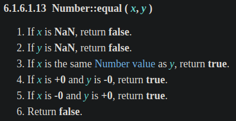

常會有找出陣列中是否包含某元素的需求，過去會使用 `Array.prototype.indexOf()` 來處理，但在 ES2016 (ES7) 提供了 `Array.prototype.includes()` 新的 Array method，更方便好用，那這兩個差在哪？解決過去的哪些問題？讓我們從 ECMAScript spec 中一探究竟吧。

<!-- more -->

> 本文同步發表於 iT 邦幫忙：[JavaScript 之旅 (2)：Array.prototype.includes()](https://ithelp.ithome.com.tw/articles/10238101)
>
> 「JavaScript 之旅」系列文章發文於：
> - [iT 邦幫忙](https://ithelp.ithome.com.tw/users/20117586/ironman/3607)
> - [Titangene Blog](https://titangene.github.io/tags/it-鐵人賽/)

# 過去的 `Array.prototype.indexOf()`

若要確定陣列內是否包含某元素，過去常見的作法是使用 `Array.prototype.indexOf()`，你應該有看過這幾種寫法：

```javascript
let array = ['JS', 'ECMA', 'TC39'];
let searchElement = 'ECMA';

console.log(array.indexOf(searchElement) !== -1);  // true
console.log(array.indexOf(searchElement) >= 0);    // true

if (~array.indexOf(searchElement)) {
  console.log('找到啦！');  // 找到啦！
} else {
  console.log('找不到 QQ');
}
```

利用 `Array.prototype.indexOf()` 回傳的 index 來確定陣列內是否包含該元素：
- 回傳 `-1` 代表陣列內沒有該元素
- 否則就是找到的元素的 index 值

但這些寫法有一些問題：
- 不直覺：需透過 [`Array.prototype.indexOf()`](https://developer.mozilla.org/en-US/docs/Web/JavaScript/Reference/Global_Objects/Array/indexOf) 來問該元素在陣列中第一次被找到的 index 為何，然後使用比較運算子 (即 `===`、`>=` 等) 或位元運算子 (即 [`~`](https://developer.mozilla.org/en-US/docs/Web/JavaScript/Reference/Operators/Bitwise_NOT) ) 來確定該元素是否存在
- 寫法不統一：每個人對於比較運算子的使用習慣不同，有些人會用 `!== -1`，有些人會用 `>= 0` ... 等，但明明都是一樣的行為
- 不適用於 `NaN`：因為 `Array.prototype.indexOf()` 是用嚴格相等來比較，而 `NaN !== NaN` ( `NaN` 本來就不等於自己)，所以你無法在陣列中找出 `NaN`

```javascript
console.log([NaN].indexOf(NaN) !== -1);  // false
```

# 現代的 `Array.prototype.includes()`

於是在 ES2016 (ES7) 提供了 `Array.prototype.includes()` 新的 Array method，不用管陣列的 index，直接就會回傳是否包含該元素的 Boolean 值，`true` 代表包含，`false` 則代表不包含，非常直覺又方便：

```javascript
let array = ['JS', 'ECMA', 'TC39'];
let searchElement = 'ECMA';

console.log(array.includes(searchElement));  // true
```

而且也可以解決 `NaN` 的問題：

```javascript
console.log([NaN].includes(NaN));  // true
```

> 後面會解釋 `Array.prototype.includes()` 是如何解決 `NaN` 的問題，spec 其實都有告訴你！

另外為了一致性，`Array.prototype.includes()` 的參數用法跟 `Array.prototype.indexOf()` 的一樣，下面是他們的語法：

```javascript
Array.prototype.indexOf(searchElement[, fromIndex])
Array.prototype.includes(searchElement[, fromIndex])
```

> 註：`[, fromIndex]` 中的 `[]` 不是代表陣列，在語法表示法中代表的是可選參數，而 `Array.prototype.includes()` 和 `Array.prototype.indexOf()` 的可選參數 `fromIndex` 預設為 `0`，代表會從陣列的最前面開始尋找符合的元素。

兩者實際使用的行為一樣 (除了剛剛提到的 `NaN` 之外)：

```javascript
let array = ['JS', 'ECMA', 'TC39', 'JS', 'ECMA'];
let searchElement = 'JS';

console.log(array.indexOf(searchElement, 2) !== -1);  // true
console.log(array.includes(searchElement, 2));  // true
```

> 關於為什麼 `includes()` 要命名成 `includes`，而不是 `has` 或 `contains`，可參閱 [tc39/Array.prototype.includes 的 FAQ](https://github.com/tc39/Array.prototype.includes#faqs)。

# spec 定義

## `Array.prototype.indexOf()` 的 spec 定義

先來看看 [`Array.prototype.indexOf()`](http://www.ecma-international.org/ecma-262/#sec-array.prototype.indexof) 在 spec 的定義：


大致上就是從陣列中找出與 `searchElement` match 的元素，用嚴格相等比較 (Strict Equality Comparison) 來確認 `searchElement` 是否與陣列中的某元素相同。

> 在 spec 定義的 1~6 步驟明確說明，何時才會真正開始從陣列中尋找 match 的元素，在某些條件下會直接回傳 `-1`，例如：陣列的 length 等於 0，或是 `fromIndex` 的值大於陣列的 length 的時候。


## `Array.prototype.includes()` 的 spec 定義

接著來看 [`Array.prototype.includes()`](http://www.ecma-international.org/ecma-262/#sec-array.prototype.includes) 在 spec 的定義：


大致上的定義和 `Array.prototype.indexOf()` 非常像，但有一些不同：
- 回傳值變成 Boolean 值，而不是 index 值 (型別為 Number)
- 在比對 `searchElement` 是否 match 陣列中的元素時，使用的是 SameValueZero 演算法，而不是嚴格相等比較
  - 透過 SameValueZero 演算法可以找出陣列中的 `NaN` 元素
- 不會跳過空缺的陣列元素 (即 empty slot)，而是視為 `undefined` (所以 `Array.prototype.indexOf()` 會跳過 empty slot，因為它在 spec 定義的步驟 9.a，只要沒有該 property 就會直接跳過，繼續比對下一個元素)

```javascript
let array = Array(3);

console.log(array);                   // [empty × 3]

console.log(array.indexOf() !== -1);  // false
console.log(array.includes());        // true

console.log(array.indexOf(undefined) !== -1);  // false
console.log(array.includes(undefined));        // true
```

看完 `Array.prototype.indexOf()` 和 `Array.prototype.includes()` 的定義之後，讓我們更深入看前者使用的嚴格相等比較 (Strict Equality Comparison) 和後者使用的 SameValueZero 演算法在 spec 中是如何定義的。

## 嚴格相等比較 vs. SameValueZero

### 嚴格相等比較 的 spec 定義

先來看 `Array.prototype.indexOf()` 使用的[嚴格相等比較 (Strict Equality Comparison)](http://www.ecma-international.org/ecma-262/#sec-strict-equality-comparison) 在 spec 的定義：


嚴格相等比較會先比較型別是否相同，不同就回傳 `false`。

然後，如果型別是 `Number` 或 `BigInt` 就會直接進行值的比較。[`Number::equal`](http://www.ecma-international.org/ecma-262/#sec-numeric-types-number-equal) 的定義如下：



> 在步驟 1 和 2 提到，只要值是 `NaN` 就會回傳 `false`，這就是 `NaN` 不等於 `NaN` 的原因

回到嚴格相等比較的步驟 3：否則，其他型別會使用 [SameValueNonNumeric](http://www.ecma-international.org/ecma-262/#sec-samevaluenonnumeric) 演算法，spec 的定義如下：


- 值為 `null` 或 `undefined` 時會回傳 `true`
- `String` 型別就比對字串
- `Boolean`、`Symbol` 和 `Object` 型別都是比較值是否相同 (但 Object 型別的值必須是同一個參考)

如果元素的型別為 `Object`，值看起來相同，但參考不同時，`Array.prototype.indexOf()` 和 `Array.prototype.includes()` 都會找不到一樣的元素 (ECMAScript 表示：啊就真的不一樣啊)：

```javascript
let array = [{id: 1}, {id: 2}, {id: 3}];

console.log(array.indexOf({id: 2}) !== -1);  // false
console.log(array.includes({id: 2}));        // false
```

如果是同一個物件參考，就會找到 match 的元素：

```javascript
let item = {id: 2};
let array = [{id: 1}, item, {id: 3}];

console.log(array.indexOf(item) !== -1);  // true
console.log(array.includes(item));        // true
```

### SameValueZero 的 spec 定義

接著來看 `Array.prototype.includes()` 使用的 SameValueZero 演算法在 spec 的定義：


步驟 1 和嚴格相等比較一樣，會先比較型別是否相同，不同就回傳 `false`。

然後，如果型別是 `Number` 或 `BigInt` 就會進行 `Type(x)::sameValueZero(x, y)` 來比較。那 `Type(x)::sameValueZero(x, y)` 是啥？其實在 spec 內定義，`Number` 或 `BigInt` 型別都是 ECMAScript 內建的 Numeric 型別，而每種內建型別會定義很多 operations，其中的就是 `T::sameValueZero(x, y)`：


> 註：因為表格有太多內容了，所以我把這次不會提到的內容都變成 `...` 了。

接著往下找就會看到詳細的定義：


> 在步驟 1 提到，只要兩個比較的值都是 `NaN`，就會回傳 `true`，這就是 `Array.prototype.includes()` 解決 `NaN` 不等於 `NaN` 這個問題的步驟。

回到嚴格相等比較的步驟 3：否則，使用 [SameValueNonNumeric](http://www.ecma-international.org/ecma-262/#sec-samevaluenonnumeric) 演算法，因為上面提到了，就不重複說明囉。

# polyfill

下面是 [MDN 提供的 polyfill](https://developer.mozilla.org/zh-TW/docs/Web/JavaScript/Reference/Global_Objects/Array/includes#Polyfill)，若跟 spec 相比可以發現簡化一些東西，但大致上的結果會相同：

```javascript
// ref: https://developer.mozilla.org/zh-TW/docs/Web/JavaScript/Reference/Global_Objects/Array/includes#Polyfill
if (!Array.prototype.includes) {
  Object.defineProperty(Array.prototype, 'includes', {
    value: function(searchElement, fromIndex) {

      if (this == null) {
        throw new TypeError('"this" is null or not defined');
      }

      // 1. Let O be ? ToObject(this value).
      var o = Object(this);

      // 2. Let len be ? LengthOfArrayLike(O)
      //    即 Let len be ? ToLength(? Get(O, "length")).
      var len = o.length >>> 0;

      // 3. If len is 0, return false.
      if (len === 0) return false;

      // 4. Let n be ? ToInteger(fromIndex).
      // 5. Assert: If fromIndex is undefined, this n is 0.
      var n = fromIndex | 0;

      // 6. If n >= 0, then
      //   a. Let k be n.
      // 7. Else n < 0,
      //   a. Let k be len + n.
      //   b. If k < 0, set k to 0.
      var k = Math.max(n >= 0 ? n : len - Math.abs(n), 0);

      function sameValueZero(x, y) {
        return (
          x === y || (
            typeof x === 'number' && typeof y === 'number' &&
            isNaN(x) && isNaN(y)
          )
        );
      }

      // 8. Repeat, while k < len
      while (k < len) {
        // a. Let elementK be the result of ? Get(O, ! ToString(k)).
        // b. If SameValueZero(searchElement, elementK) is true, return true.
        if (sameValueZero(o[k], searchElement)) return true;
        // c. Set k to k + 1.
        k++;
      }

      // 9. Return false
      return false;
    }
  });
}
```

> 其他 polyfill：
> - [core-js](https://github.com/zloirock/core-js/blob/master/packages/core-js/internals/array-includes.js)
> - [es-shims](https://github.com/es-shims/array-includes/blob/main/implementation.js)


# 資料來源：

- [tc39/Array.prototype.includes](https://github.com/tc39/Array.prototype.includes)
- [22.1.3.13 `Array.prototype.includes(searchElement[, fromIndex])` | ECMAScript 2021 Language Specification](https://tc39.es/ecma262/#sec-array.prototype.includes)
