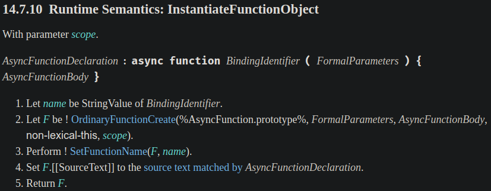
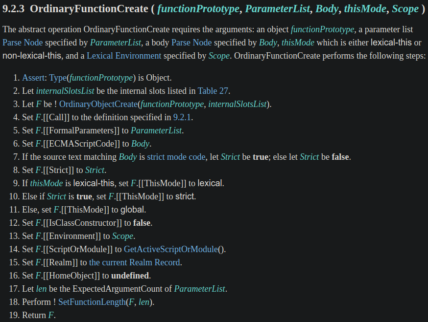
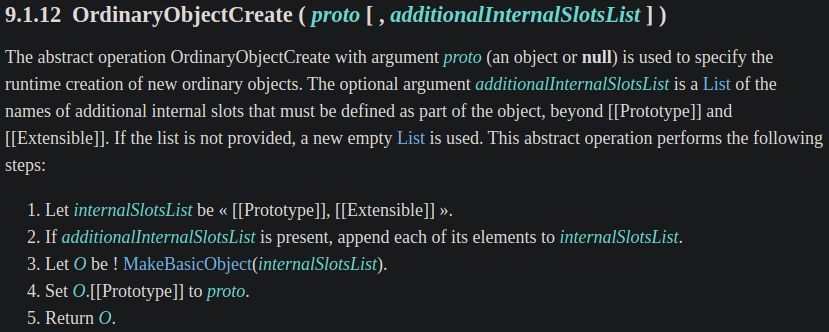
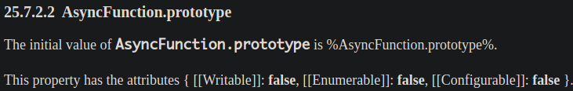
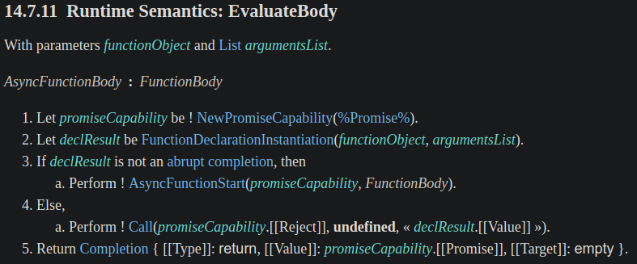
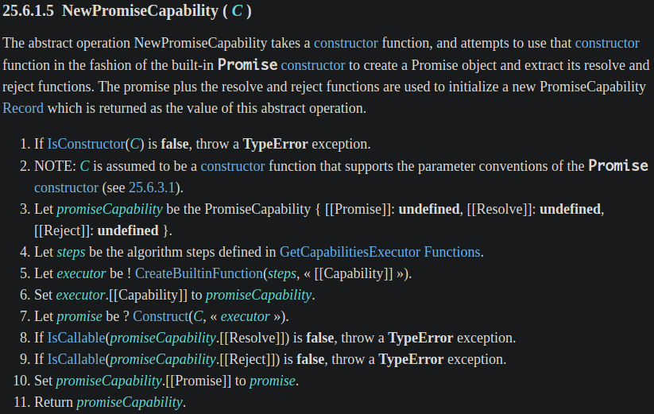
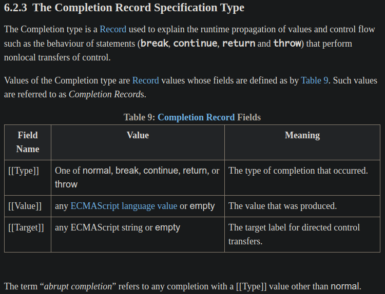
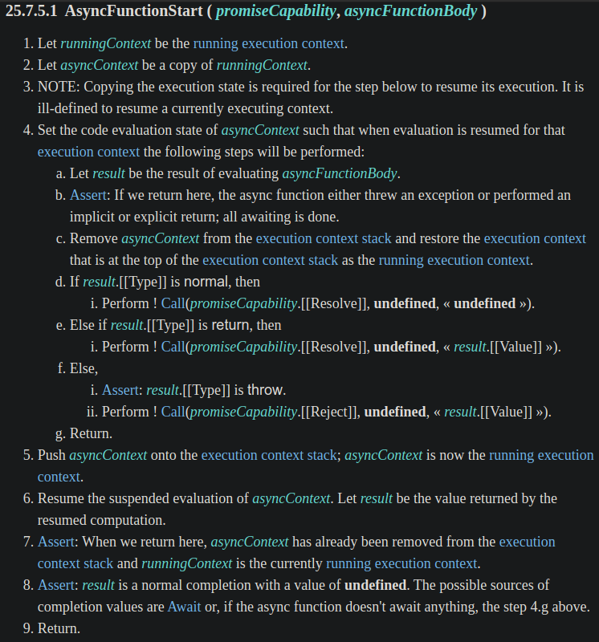

本篇來介紹 Async Functions & await expression。

<!-- more -->

> 本文同步發表於 iT 邦幫忙：[JavaScript 之旅 (6)：Async Functions & await expression (1)](https://ithelp.ithome.com.tw/articles/10241334)
>
> 「JavaScript 之旅」系列文章發文於：
> - [iT 邦幫忙](https://ithelp.ithome.com.tw/users/20117586/ironman/3607)
> - [Titangene Blog](https://titangene.github.io/tags/it-鐵人賽/)


# Async Functions & await expression

## 語法

語法有以下幾種：

Async function declaration：

```javascript
async function foo() {
  // ...
}
```

Async function expression：

```javascript
const foo = async function () {
  // ...
}

// 或

const foo = async function foo() {
  // ...
}
```

Async method：

```javascript
const object = {
  async foo() {
    // ...
  }
};
```

Async arrow function：

```javascript
const foo = async () => {
  // ...
}

// 或

const foo = async foo() => {
  // ...
}
```

## Async function 的回傳值永遠是 `Promise`

不管如何，Async function 的回傳值永遠是 `Promise`。

若 `return` 直接回傳值，回傳值會等同於將值傳入 `Promise.resolve()`：

```javascript
async function asyncFunc() {
  return 'hi';
}

asyncFunc();
// Promise {<fulfilled>: "hi"}

asyncFunc()
  .then(value => console.log(value));
// "hi"
```


若沒有回傳值，則等同於回傳 `Promise.resolve(undefined)`：

```javascript
async function asyncFunc() {
  'hello';
}

asyncFunc();
// Promise {<fulfilled>: undefined}

asyncFunc()
  .then(value => console.log(value));
// undefined
```


若 `throw` 某個值，回傳值會等同於將值傳入 `Promise.reject()`：

```javascript
async function asyncFunc() {
  throw new Error('Oops');
}

asyncFunc();
// Promise {<rejected>: Error: Oops
//     at asyncFunc (<anonymous>:2:9)
//     at <anonymous>:5:1}

asyncFunc()
  .catch(error => console.log(error));
// Error: Oops
//     at asyncFunc (<anonymous>:2:9)
//     at <anonymous>:1:1
```


## `Promise` 的 `then()` vs. `async` / `await`

在還沒有 `async` 和 `await` 之前，都是直接用 `then()` 和 `catch()` 來處理 `Promise`，如果一個 Promise 的結果值需要給其他 Promise 使用，就需在 `then()` 的 callback 內回傳另一個 Promise，而錯誤處理可在 `then()` 的第二個 callback，或是 `catch()` 處理。

例如：我要先從 `/posts` 這支 API 取得某篇文章是由哪個使用者發文的，然後在從 `/users` 這支 API 取得該使用者的 username：

```javascript
const baseUrl = 'https://jsonplaceholder.typicode.com';

function fetchJSON(url) {
  return fetch(url)
    .then(response => response.json())
    .catch(error => console.log(error));
}

function fetchPost(id) {
  const apiURL = `${baseUrl}/posts/${id}`;
  return fetchJSON(apiURL);
}

function fetchUser(id) {
  const apiURL = `${baseUrl}/users/${id}`;
  return fetchJSON(apiURL);
}

function main() {
  const postId = 1;
  fetchPost(postId)
    .then(post => {
      const userId = post.userId;
      return fetchUser(userId);
    })
    .then(user => {
      console.log(user.username);
    });
}

main();
```


如果改用 `async` 和 `await` 會很像平常寫同步的寫法，不須將下一個步驟放在 `then()` 的 callback 中，且錯誤處理可在 `try-catch` 處理，不一定要在 `then()` 的第二個 callback 處理：

```javascript
const baseUrl = 'https://jsonplaceholder.typicode.com';

async function fetchJSON(url) {
  try {
    const response = await fetch(url);
    return response.json();
  } catch (error) {
    console.log(error);
  }
}

async function fetchPost(id) {
  const apiURL = `${baseUrl}/posts/${id}`;
  return fetchJSON(apiURL);
}

async function fetchUser(id) {
  const apiURL = `${baseUrl}/users/${id}`;
  return fetchJSON(apiURL);
}

async function main() {
  const postId = 1;
  const post = await fetchPost(postId);

  const userId = post.userId;
  const user = await fetchUser(userId);

  console.log(user.username);
}

main();
```

> 明天會繼續介紹 Async Functions & await expression


# Spec 定義

## InstantiateFunctionObject 的 spec 定義

先來看 [InstantiateFunctionObject (實例化函數物件)](http://www.ecma-international.org/ecma-262/#sec-async-function-definitions-InstantiateFunctionObject) 的定義：
- 先記住步驟 2 中 `OrdinaryFunctionCreate()` 傳入的第一個參數 `%AsyncFunction.prototype%`，後面會提到傳入這個要幹嘛




深入看 [`OrdinaryFunctionCreate()`](http://www.ecma-international.org/ecma-262/#sec-ordinaryfunctioncreate) 的定義：
- 步驟 3 中 `OrdinaryObjectCreate()` 的第一個參數 `functionPrototype` 就是剛剛傳入的 `%AsyncFunction.prototype%`，我們繼續往內鑽




下面是 [`OrdinaryObjectCreate()`](http://www.ecma-international.org/ecma-262/#sec-ordinaryobjectcreate) 的定義：
- 步驟 4 將「`O.[[Prototype]]` 設為 `proto`」中的 `proto` 就是剛剛傳入的 `%AsyncFunction.prototype%`，所以到這邊的意思就是設定 prototype 為 `AsyncFunction.prototype`




在 [`AsyncFunction.prototype`](http://www.ecma-international.org/ecma-262/#sec-async-function-constructor-prototype) 的 spec 定義也有提到：




這就是為何我們建立的 async function 的 prototype 會是 `AsyncFunction.prototype`：

```javascript
async function asyncFunc() {
  return 'asyncFunc';
}

console.log(Object.getPrototypeOf(asyncFunc));
// AsyncFunction {Symbol(Symbol.toStringTag): "AsyncFunction", constructor: ƒ}
```

且每個 async function 的 prototype 都是 `AsyncFunction.prototype`：

```javascript
async function asyncFunc1() {
  return 'asyncFunc 1';
}

async function asyncFunc2() {
  return 'asyncFunc 2';
}

console.log(Object.getPrototypeOf(asyncFunc1) === Object.getPrototypeOf(asyncFunc2));
// true
```

async function 與一般 function 的 prototype 不同：

```javascript
async function asyncFunc() {
  return 'asyncFunc';
}

function func() {
  return 'func';
}

console.log(Object.getPrototypeOf(asyncFunc));
// AsyncFunction {Symbol(Symbol.toStringTag): "AsyncFunction", constructor: ƒ}

console.log(Object.getPrototypeOf(func));
// ƒ () { [native code] }
console.log(Object.getPrototypeOf(func) === Function.prototype);
// true

console.log(Object.getPrototypeOf(asyncFunc) === Object.getPrototypeOf(func));
// false
```

但我們是無法透過寫 code 的方式碰到 `AsyncFunction`，因為 `AsyncFunction` 只是 spec 內部定義的東西。不過一般 function 的 prototype 就可以拿來使用：

```javascript
console.log(Function.prototype);
// ƒ () { [native code] }

console.log(AsyncFunction);
// ReferenceError: AsyncFunction is not defined
```

## EvaluateBody 的 spec 定義

接著來看 [EvaluateBody](http://www.ecma-international.org/ecma-262/#sec-async-function-definitions-EvaluateBody) 的定義：




下面是步驟 1 [`NewPromiseCapability()`](http://www.ecma-international.org/ecma-262/#sec-newpromisecapability) 的定義：用內建的 `Promise` constructor 來建立 Promise 物件，並提取其 `resolve()` 和 `reject()` 函數




步驟 2 [`FunctionDeclarationInstantiation()`](http://www.ecma-international.org/ecma-262/#sec-functiondeclarationinstantiation) 的定義 (因太長就不截圖了) 大意上就是在建立 ECMAScript 函數的 execution context 時，會建立一個新的 function Environment Record，並在該 Environment Record 中實例化每個 formal parameter 的綁定，而 function body 中的每個宣告也都會被實例化，最後會回傳 `NormalCompletion(empty)`。

步驟 3 提到的 [abrupt completion](http://www.ecma-international.org/ecma-262/#sec-completion-record-specification-type) 指的是具有 `[[Type]]` 值，但不是 normal 的任何 completion。

`[[Type]]` 的值有包含這幾種：normal、break、continue、return 或 throw，`[[Type]]` 的值是用來代表發生 completion 的 type。




所以只要 `declResult` 不是 abrupt completion 就會執行 `AsyncFunctionStart()`，下面是 [`AsyncFunctionStart()`](http://www.ecma-international.org/ecma-262/#sec-async-functions-abstract-operations-async-function-start) 的定義：
- 步驟 d.i：若 `result.[[Type]]` 為 normal 時，等同於是執行 `Promise.resolve(undefined)`
- 步驟 e.i：若 `result.[[Type]]` 為 return 時，等同於是執行 `Promise.resolve(result.[[Value]])`
- 步驟 f.i：否則 (此時 `result.[[Type]]` 一定為 throw)，等同於是執行 `Promise.reject(result.[[Value]])`



> 明天會繼續介紹 Async Functions & await expression

# 資料來源

- [tc39/ecmascript-asyncawait: Async/await for ECMAScript](https://github.com/tc39/ecmascript-asyncawait)
