本篇介紹 ES2020 (ES11) 提供的 `BigInt`。

<!-- more -->

> 本文同步發表於 iT 邦幫忙：[JavaScript 之旅 (22)：BigInt](https://ithelp.ithome.com.tw/articles/10250362)
>
> 「JavaScript 之旅」系列文章發文於：
>
> - [iT 邦幫忙](https://ithelp.ithome.com.tw/users/20117586/ironman/3607)
> - [Titangene Blog](https://titangene.github.io/tags/it-鐵人賽/)


# 過去 `Number`

在過去，只要 JavaScript 提到 primitive 就會想到 `String`、`Number`、`Boolean`，但其實還有在 ES6 提供的 `Symbol`，另外在 spec 的定義中還有 `Undefined`、`Null`。

除了以上這些，還有本篇要介紹的新 primitive：`BigInt`。

下面是 spec 對 [primitive value](https://www.ecma-international.org/ecma-262/#sec-primitive-value) 的定義：

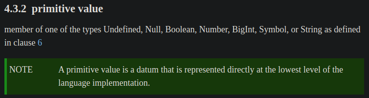

`Number` 只能安全地表示最大為 $2^{53}$ 的整數，但有時會有大整數的需求，例如：

- 社群貼文 ID (例如：[Twitter ID](https://developer.twitter.com/en/docs/twitter-ids))，在 JavaScript 只能用字串儲存
- FinTech 會需要很大的整數，且需要有任意精度的整數來表示金額

例如：在 JavaScript 竟然 `2 ** 53` 會等於 `2 ** 53 + 1`：

```javascript
let x = 2 ** 53;
let y = 2 ** 53 + 1;

console.log(x);
// 9007199254740992
console.log(y);
// 9007199254740992

console.log(x === y);
// true

console.log(typeof x);
// number
console.log(typeof y);
// number
```

很奇怪吧！所以這就是 `BigInt` 被提出的原因！

> 為何會有這個現象是跟 [IEEE 754](https://en.wikipedia.org/wiki/IEEE_754) 的浮點數定義有關，詳請可參閱 [Daniel Ehrenberg 在 JSConf EU 2018 的 演講簡報](https://docs.google.com/presentation/d/1apPbAiv_-mJF35P31IjaII8UA6TwSynCA_zhfDEmgOE/edit#slide=id.g38a1897a56_0_97) 和 [演講影片](https://www.youtube.com/watch?v=RiU5OzMZ7z8)。


# 現代的 `BigInt`

`BigInt` 是一種可用來表示 arbitrary precision (任意精度，高精度) 的整數，也就是可以表示大於 $2^{53}$ 的整數。

例如：剛剛 `2 ** 53` 和 `2 ** 53 + 1` 的例子若改用 `BigInt` 就會如你預期的不一樣 (本來就不同啊 XD)：

```javascript
let x = 2n ** 53n;
let y = 2n ** 53n + 1n;

console.log(x);
// 9007199254740992n
console.log(y);
// 9007199254740993n

console.log(x === y);
// false

console.log(typeof x);
// bigint
console.log(typeof y);
// bigint
```


## 語法

`BigInt` 的語法和 `Number` 直接寫整數不太一樣，`BigInt` literal (字面值) 是在整數的後面加上 `n` 後綴：

```javascript
let x = 9007199254740992n;

console.log(x);
//9007199254740992n
console.log(typeof x);
// bigint
```

另一種方式是呼叫 constructor 來建立 `BigInt`：

```javascript
let x = BigInt(9007199254740992);

console.log(x);
//9007199254740992n
console.log(typeof x);
// bigint
```


## 各種運算子的數學運算

`BigInt` 在 `+`、`-`、`*`、`**` 和 `%` 的運算上跟 `Number` 差不多 (這邊說的差不多是指整數小於 $2^{53}$ 的情況下)：

```javascript
let x = 9007199254740992n;

console.log(x + 1n);
// 9007199254740993n
console.log(x - 1n);
// 9007199254740991n
console.log(x * 2n);
// 18014398509481984n
console.log(x * -2n);
// -18014398509481984n
console.log(x ** 2n);
// 81129638414606681695789005144064n
console.log(x % 10n);
// 2n
```


但在小數運算上跟 `Number` 不同，因為 `BigInt` 不是 `BigDecimals`，所以會 rounded towards 0，即不保留任何小數 (類似無條件捨去)：

```javascript
console.log(5 / 2);
// 2.5
console.log(5n / 2n);
// 2n

console.log(5 / 3);
// 1.6666666666666667
console.log(5n / 3n);
// 1n

console.log(5 / 4);
// 1.25
console.log(5n / 4n);
// 1n
```


在 spec 中的 [`BigInt::divide ( x, y )`](https://www.ecma-international.org/ecma-262/#sec-numeric-types-bigint-divide) 就有定義 rounded towards 0：

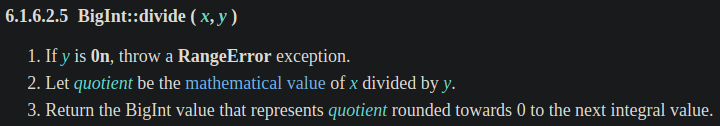


## 數值比較

`BigInt` 不嚴格等於 (not strictly equal) `Number`，例如：

```javascript
console.log(0n === 0);
// false

console.log(0n == 0);
// true
```

在 spec 中的「[Strict Equality Comparison](https://www.ecma-international.org/ecma-262/#sec-strict-equality-comparison)」有定義：
- 步驟 1：當兩個值的型別不同時，就會回傳 `false`，即不嚴格等於
- 步驟 2：其中一個值的型別為 `Number` 或 `BigInt` 就會回傳 `Type(x)::equal(x, y)`

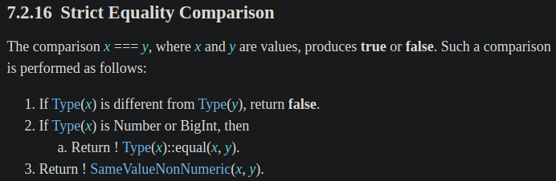


若將上面範例中的 `0n` 帶入 spec，那 `0n` 就是 `x`，所以代表步驟 2 會去執行 [`BigInt::equal (x, y)`](https://www.ecma-international.org/ecma-262/#sec-numeric-types-bigint-equal)，spec 的定義如下：只要兩個值的數學整數值相等時，就會回傳 `true`，否則回傳 `false`

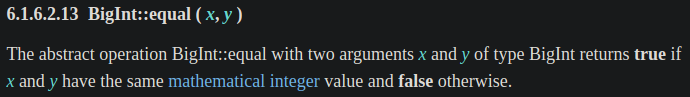


但可照常用 `>`、`<`、`>=` 和 `<=` 進行比較，例如：

```javascript
console.log(3n > 2);
// true
console.log(3n < 2);
// false

console.log(2 < 3n);
// true
console.log(2 > 3n);
// false

console.log(2 < 2n);
// false
console.log(2 > 2n);
// false

console.log(2 <= 2n);
// true
console.log(2 >= 2n);
// true
```


## 條件判斷

若將 `BigInt` 強制轉型成 `Boolean`，行為會跟 `Number` 類似。

例如：`if` 陳述句

```javascript
if (0) {
  console.log('if')
} else {
  console.log('else')
}
// else


if (0n) {
  console.log('if')
} else {
  console.log('else')
}
// else
```


[`if` 陳述句](https://www.ecma-international.org/ecma-262/#sec-if-statement-runtime-semantics-evaluation)會將值進行 `ToBoolean()` 強制轉型，spec 定義如下：

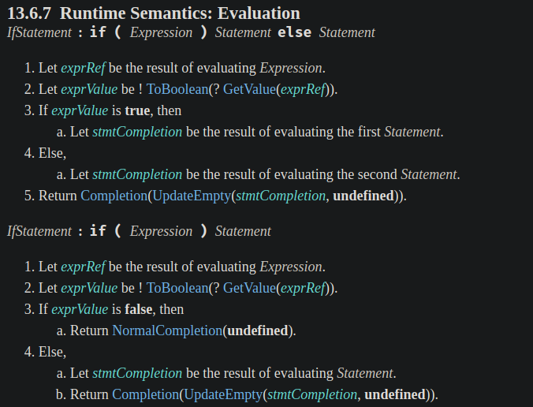


例如：二元邏輯運算子 (binary logical operator) 的 `&&` 和 `||`：

```javascript
console.log(0 || 10);
// 10
console.log(0 && 10);
// 0

console.log(0n || 10n);
// 10n
console.log(0n && 10n);
// 0n
```


[`&&` 和 `||`](https://www.ecma-international.org/ecma-262/#sec-binary-logical-operators-runtime-semantics-evaluation) 會將值進行 `ToBoolean()` 強制轉型，spec 定義如下：

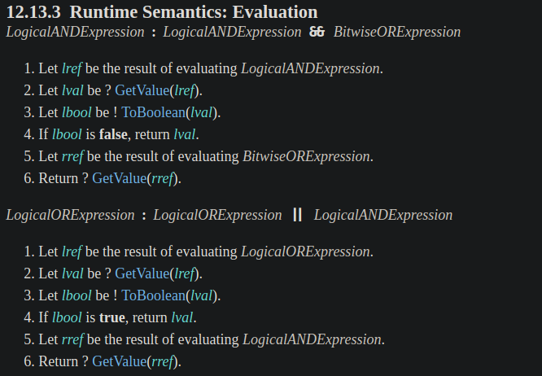


例如：使用 `Boolean()` constructor：

```javascript
console.log(Boolean(0));
// false
console.log(Boolean(10));
// true

console.log(Boolean(0n));
// false
console.log(Boolean(10n));
// true
```


[`Boolean()` constructor](https://www.ecma-international.org/ecma-262/#sec-boolean-constructor-boolean-value) 會將值進行 `ToBoolean()` 強制轉型，spec 定義如下：

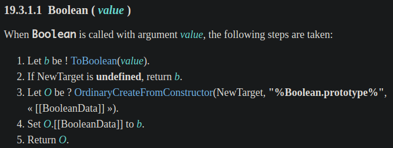


例如：邏輯 NOT 運算子 (logical NOT operator) `!`：

```javascript
console.log(!0);
// true
console.log(!10);
// false

console.log(!0n);
// true
console.log(!10n);
// false
```


[`!`](https://www.ecma-international.org/ecma-262/#sec-logical-not-operator) 會將值進行 `ToBoolean()` 強制轉型，spec 定義如下：

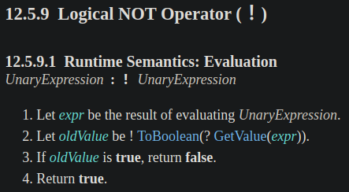


上面說的這些都將值進行 `ToBoolean()` 強制轉型，下面是 [`ToBoolean()`](https://www.ecma-international.org/ecma-262/#sec-toboolean) 的定義：只有 `0n` 會回傳 `false`，其他都回傳 `true` (跟 `Number` 很像對吧？有興趣的可以看 `Number` 的部份)

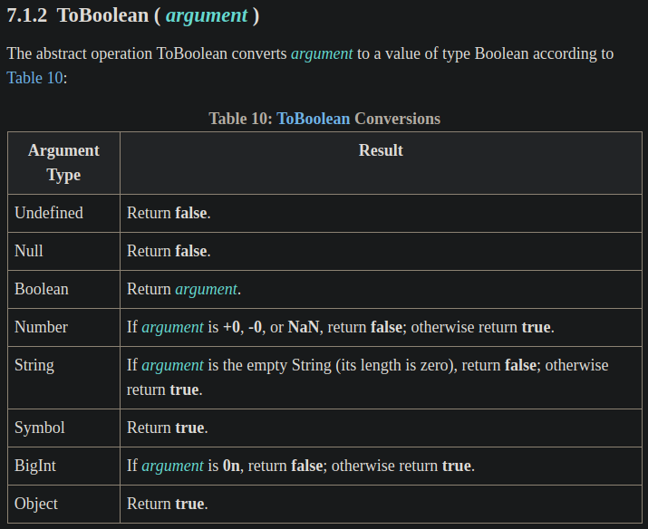


所以這就是 `0n` 會變成 `false` 的原因！


## 有些無法成功強制轉型，會拋出 exception

`BigInt` 不能和 unary `+` 運算子一起使用，需先用 `Number()` constructor 轉換：

```javascript
console.log(+1n);
// TypeError: Cannot convert a BigInt value to a number
console.log(Number(1n));
// 1
```


在 spec 是有定義的，因為 [unary `+` 運算子](https://www.ecma-international.org/ecma-262/#sec-unary-plus-operator)會進行 `ToNumber()` 的強制轉型：

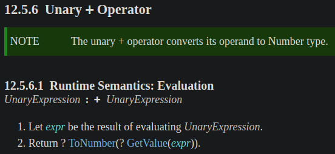


但 [`ToNumber()`](https://www.ecma-international.org/ecma-262/#sec-tonumber) 只要遇到 `BigInt` 就會拋出 `TypeError` exception：

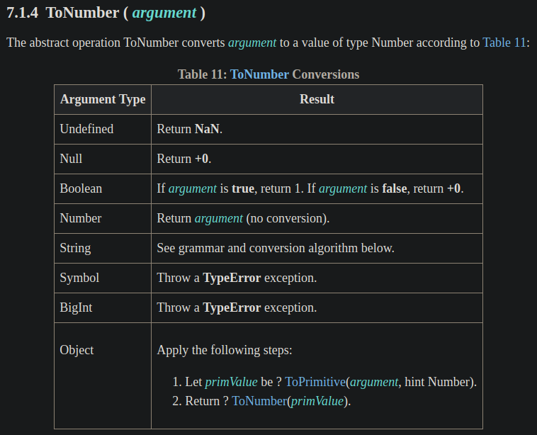


## 不能和 `Number` 一起使用

不能和 `Number` 一起使用，否則會拋出 `TypeError`：

```javascript
console.log(1n + 2);
// TypeError: Cannot mix BigInt and other types, use explicit conversions
console.log(1n * 2);
// TypeError: Cannot mix BigInt and other types, use explicit conversions
```

若要和 `Number` 一起使用，請先用 `Number()` constructor 強制轉型 (即 explicit conversions) 成 `Number`：

```javascript
console.log(Number(1n) + 2);
// 3
console.log(Number(1n) * 2);
// 2
```


下面是 [`+` 運算子](https://www.ecma-international.org/ecma-262/#sec-addition-operator-plus)在 spec 中的定義，其中的步驟 8 和 9 都會將 `+` 左右邊的兩個運算元進行 `ToNumeric()` 的強制轉型：

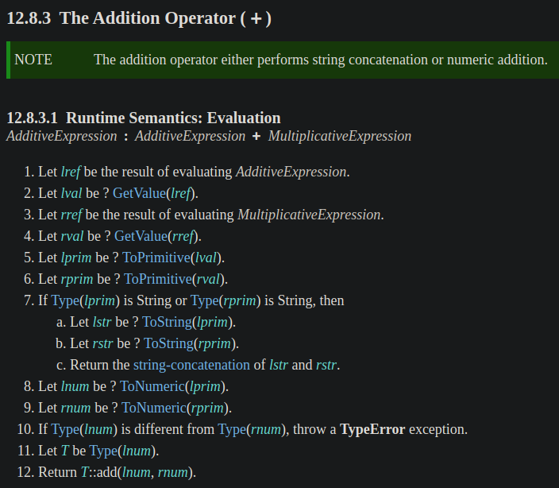


而下面是 [`ToNumeric()`](https://www.ecma-international.org/ecma-262/#sec-tonumeric) 的定義，可以看到步驟 2，只要值為 `BigInt` 就直接回傳值，所以不會跑到步驟 3：

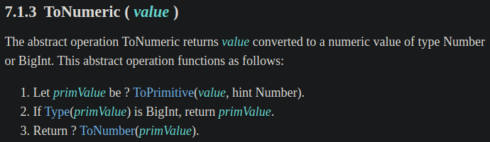

> 步驟 1 的 [`ToPrimitive()`](https://www.ecma-international.org/ecma-262/#sec-toprimitive) 只會對型別為 `Object` 的值才會有特殊行為，所以本篇會跳過這邊的細節 XD，~~否則篇幅會更長~~，在這裡可以簡單當作將 `BigInt` 型別的值傳給 `ToPrimitive()` 會回傳一樣的值，不會有任何強制轉型的行為。
>
> 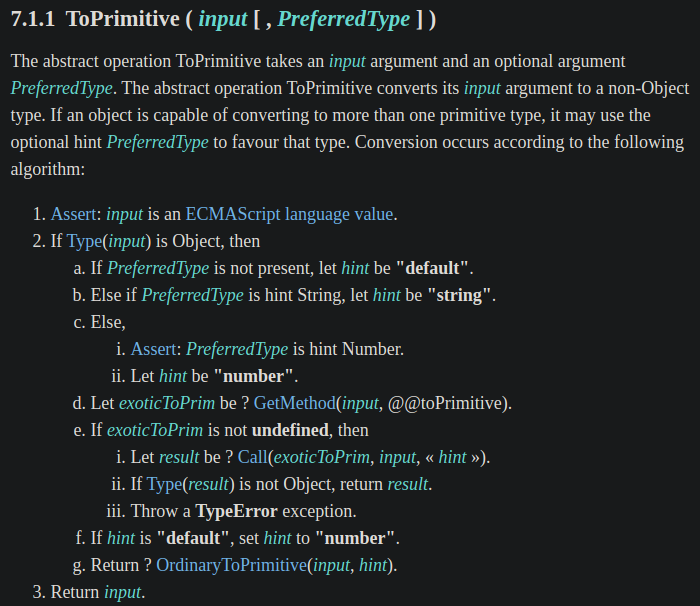


接著回到 [`+` 運算子](https://www.ecma-international.org/ecma-262/#sec-addition-operator-plus)的步驟 (圖重貼一次)：
- 在步驟 8 和 9 時，其中一個值的型別為 `Number`，另一個為 `BigInt` (因為前面的範例是 `1n + 2` )
- 在步驟 10 只要兩個值的型別不同，就會拋出 `TypeError` exception


所以這就是 `BigInt` 不能和 `Number` 一起使用的原因。


## 可與 `String` 進行串接

例如：

```javascript
console.log(1n + '2');
// 12
console.log('2' + 1n);
// 21
```


## `BigInt()` constructor 不能傳入 `Number` 或 `String` 型別的小數

例如：

```javascript
console.log(BigInt(2.5));
// RangeError: The number 2.5 cannot be converted to a BigInt because it is not an integer
console.log(BigInt('2.5'));
// SyntaxError: Cannot convert 2.5 to a BigInt
```


下面是 [`BigInt()` constructor](https://www.ecma-international.org/ecma-262/#sec-bigint-constructor-number-value) 在 spec 的定義：
- 步驟 2：將值進行 `ToPrimitive()` 強制轉型
- 步驟 3：若值的型別為 `Number`，則進行 `NumberToBigInt(prim)` 強制轉型
- 步驟 4：進行 `ToBigInt()` 強制轉型

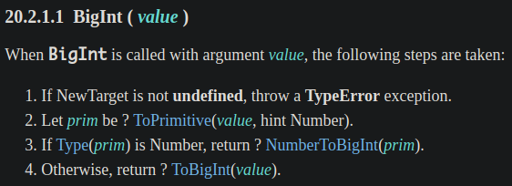


先來看為何不能傳入 `Number` 型別的小數？這跟步驟 3 有關，會進行 `NumberToBigInt(prim)` 強制轉型，spec 的定義如下：
- 步驟 2：若值不是整數就會拋出 `RangeError` exception

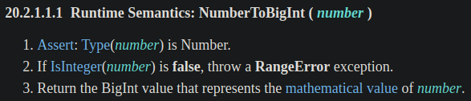


那為何不能傳入 `String` 型別的小數？這跟步驟 4 有關，會進行 [`ToBigInt()`](https://www.ecma-international.org/ecma-262/#sec-tobigint) 強制轉型，spec 的定義如下：
- 步驟 1：進行 `StringToBigInt()` 強制轉型
- 步驟 2：若強制轉型的結果為 `NaN`，會拋出 `SyntaxError` exception

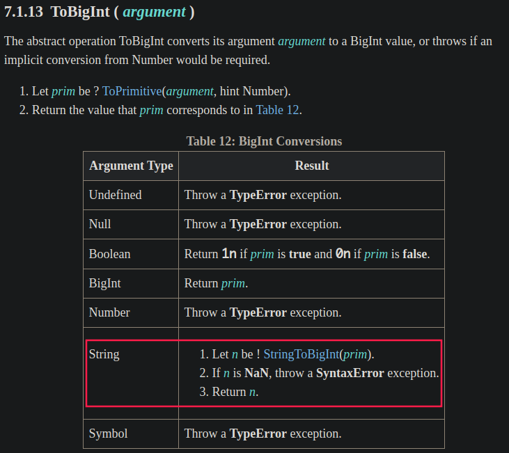


而下面是 [`StringToBigInt()`](https://www.ecma-international.org/ecma-262/#sec-stringtobigint) 的定義：
- 用 [DecimalDigits](https://www.ecma-international.org/ecma-262/#prod-DecimalDigits) 取代 [StrUnsignedDecimalLiteral](https://www.ecma-international.org/ecma-262/#prod-StrUnsignedDecimalLiteral) production，以不允許 `Infinity`、小數點或指數
- 若 [MV (mathematical value)](https://www.ecma-international.org/ecma-262/#mathematical-value) 為 `NaN`，則回傳 `NaN`，否則回傳與 MV 完全對應的 `BigInt`，而不是四捨五入成 `Number`

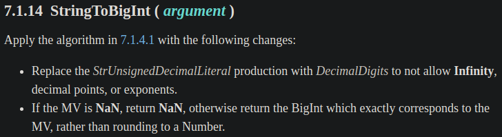


所以字串會透過 `StringToBigInt()` 強制轉行成 `NaN`，就會拋出 `SyntaxError` exception。


# 資料來源

- [tc39/proposal-bigint: Arbitrary precision integers in JavaScript](https://github.com/tc39/proposal-bigint)
- [ECMAScript feature: BigInt - arbitrary precision integers | 2ality](https://2ality.com/2017/03/es-integer.html)
- [BigInt: arbitrary-precision integers in JavaScript · V8](https://v8.dev/features/bigint)
