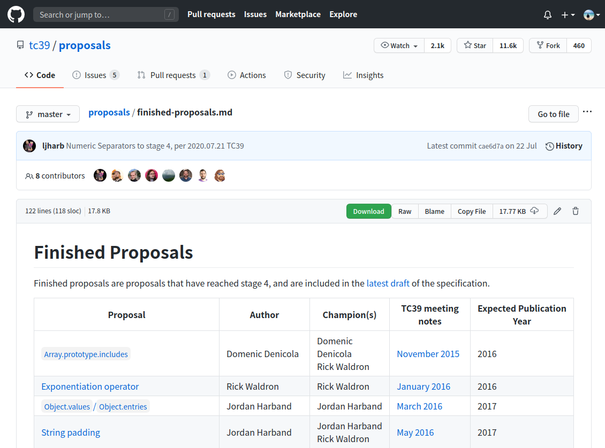
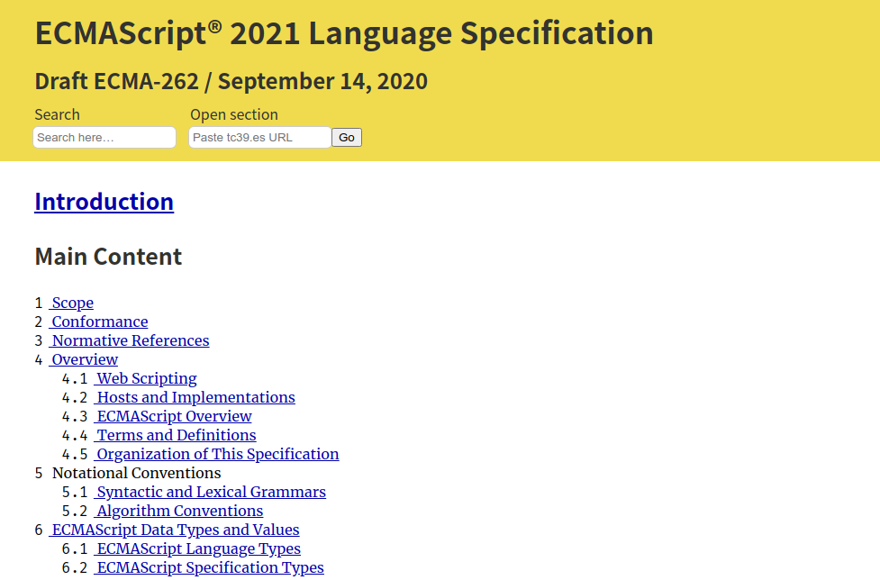
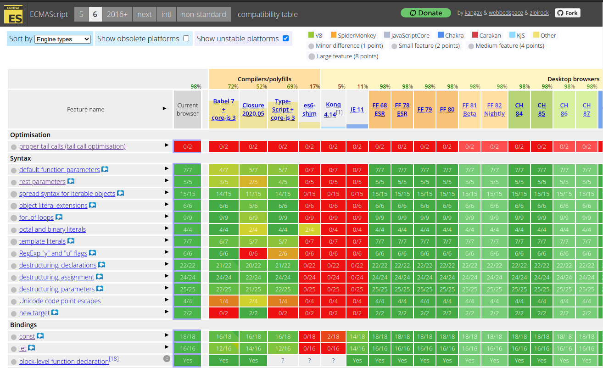
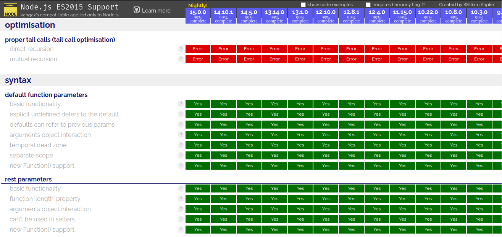

你很常聽到 ES6、ES7 等這些名稱嗎？有聽過 ECMA 和 TC39 嗎？ECMAScript 和 JavaScript 又是什麼？規範要去哪裡看？下面會各別介紹。

<!-- more -->

> 本文同步發表於 iT 邦幫忙：[JavaScript 之旅 (1)：介紹 ECMA、ECMAScript、JavaScript 和 TC39](https://ithelp.ithome.com.tw/articles/10237660)
>
> 「JavaScript 之旅」系列文章發文於：
> - [iT 邦幫忙](https://ithelp.ithome.com.tw/users/20117586/ironman/3607)
> - [Titangene Blog](https://titangene.github.io/tags/it-鐵人賽/)

# ECMA

ECMA 是 European Computer Manufacturers Association (歐洲電腦製造商協會) 的簡稱，協會在 1961 年正式成立，是資訊和通訊系統的標準組織。

後來為了因應國際化，在 1994 年將名稱改為 Ecma International (Ecma 國際)。

Ecma 國際負責的標準包括：
- [ECMA-119：CD-ROM 格式](http://www.ecma-international.org/publications/standards/Ecma-119.htm)
- [ECMA-334：C# 語言規範](http://www.ecma-international.org/publications/standards/Ecma-334.htm)
- [ECMA-408：Dart 語言規範](http://www.ecma-international.org/publications/standards/Ecma-408.htm)
- [ECMA-404：JSON](http://www.ecma-international.org/publications/standards/Ecma-404.htm)
- [ECMA-262：ECMAScript 語言規範](http://www.ecma-international.org/publications/standards/Ecma-262.htm)
- ... 等

> 想知道 Ecma 國際負責哪些標準可參閱：[Ecma Standards - list](http://www.ecma-international.org/publications/standards/Standard.htm)

> 更多有關 ECMA 的歷史可參閱 [History of Ecma](https://www.ecma-international.org/memento/history.htm)。

# ECMAScript & ECMA-262

ECMAScript 簡稱 ES，是一種通用的程式語言，由 Ecma 國際在 ECMA-262 進行標準化。ECMA-262 的第一版在 1997 年由 Ecma General Assembly 出版的。

ECMAScript 是由 Netscape 的 Brendan Eich 發明的，最早出現在 Netscape 的 Navigator 2.0 瀏覽器中。從 IE 3.0 開始，很多瀏覽器開始使用 ECMAScript。

ECMAScript 是 JavaScript 的標準，目的是讓不同瀏覽器之間能根據 spec 來實作。當 ECMAScript 發布第三版 (即 ES3) 之後，成為當時所有瀏覽器支援的程式語言。

以前只能在瀏覽器中使用 ECMAScript，後來也能在 Node.js 寫 server 應用和 service。

# ECMAScript & JavaScript

JavaScript 和 ECMAScript 都是程式語言，但不是一樣的東西。JavaScript 通常縮寫為 JS，是一種符合 ECMAScript spec 的程式語言。

ECMA-262 是 ECMAScript 的規範，而 JavaScript 只是其中一種實作和擴充的程式語言 (雖然 JavaScript 相容於 ECMAScript，但 JavaScript 還提供 ECMAScript 未定義的特性)。

而我們常聽到的 ES6，代表的是 ECMA-262 第 6 版 (ECMA-262 6th Edition)。 

從 ES7 開始，ECMAScript 會在每年釋出新版本，裡面包含已完成的新特性，而瀏覽器就會根據新特性來完成實作，開發者就能開始使用這些新特性。

# TC39

Ecma 標準是由各種技術委員會管理的，而 TC39 就是其中一個 TC，是 Technical Committee (技術委員會) 的縮寫，TC 會處理特定的領域或主題。

TC39 主要負責將通用、跨平台與 vendor 無關的程式語言 ECMAScript 標準化，包括語言的 syntax、semantics 和 library 以及支援該語言的補充技術。

> 詳情可參閱 [TC39 - ECMAScript](https://www.ecma-international.org/memento/tc39.htm)。

> 其實還有其他的 TC，詳情可參閱 [Ecma Technical Committees and Task Groups](https://www.ecma-international.org/memento/TCs&TGs.htm)。

# TC39 的提案流程

Ecma TC39 委員會負責發展 ECMAScript 程式語言並撰寫 spec，要對 spec 進行修改的階段如下：

- stage 0 (Strawperson)：沒有作為正式提案提交的任何討論、想法，或是修改或新增提案都是此階段
- stage 1 (Proposal)：補充理由、描述解決方案、用法的說明範例、提出潛在的 challenges、討論關鍵演算法、abstractions 和 semantics，在這個階段就會有 polyfill 或 demo
- stage 2 (Draft)：用 spec 的方式來精確描述 syntax 和 semantics，此階段會有實驗性的實作
- stage 3 (Candidate)：已完成 spec 的內容，需要大量使用者的使用和反饋才能進入 stage 4，但實作已經符合 spec 了
- stage 4 (Finished)：已準備將提案加入正式的 ECMAScript 標準中，但需兩個相容的實作 (瀏覽器或 Node.js 等環境) 通過驗收測試。此階段的實作已穩定

所以 stage 0 是想法階段，而 stage 1 至 3 都是在進行審查和討論，從 stage 2 開始會有接近正式 spec 的內容，最後的 stage 4 才是正式將提案納入 spec 中。

有些提案還沒到 stage 4 就能在瀏覽器使用了，而且也有對應的 polyfill 可以使用。

> TC39 的提案流程詳情可參閱 [The TC39 Process](https://tc39.es/process-document/)。

# ECMAScript 提案

各提案在哪個 stage，或是被放棄、撤回或拒絕的提案都可在 [tc39/proposals: Tracking ECMAScript Proposals](https://github.com/tc39/proposals/) 這裡找到。

若只想查看已完成的提案，可直接看 [Finished Proposals](https://github.com/tc39/proposals/blob/master/finished-proposals.md) 這份文件，這裡有從 ES2016 開始到最新的所有 Finished Proposals。

# ECMAScript Spec

若要看 ECMAScript spec 主要有兩個地方：
- 最新版、最準確的 spec，包含最新年度 snapshot 的內容以及所有已完成的提案 (即 stage 4 的提案)：http://www.ecma-international.org/ecma-262/
- 過去發佈的 spec 版本：[Standard ECMA-262-archive](http://www.ecma-international.org/publications/standards/Ecma-262-arch.htm)，例如：
  - [ECMAScript 2015 Language Specification - ECMA-262 6th Edition](http://www.ecma-international.org/ecma-262/6.0)
  - [ECMAScript 2016 Language Specification - ECMA-262 7th Edition](http://www.ecma-international.org/ecma-262/7.0)
  - [ECMAScript 2017 Language Specification - ECMA-262 8th Edition](http://www.ecma-international.org/ecma-262/8.0)
  - [ECMAScript 2018 Language Specification - ECMA-262 9th Edition](http://www.ecma-international.org/ecma-262/9.0)
  - [ECMAScript 2019 Language Specification - ECMA-262 10th Edition](http://www.ecma-international.org/ecma-262/10.0)
- 包含 ECMA-262 當前草案的 spec：https://tc39.es/ecma262/

我個人常看的是[草案](https://tc39.es/ecma262/)那份，若想看某個功能的定義，也可以看看在各版本的 spec 中是如何定義的。

但 ECMA-262 的文件有一個缺點：沒有像 [HTML Standard](https://html.spec.whatwg.org/multipage/) 和 [CSS 2.2 Spec](https://www.w3.org/TR/CSS22/) 一樣提供分頁功能啊...，每次開 spec 都會卡一下 (找一個換電腦的理由 XD)。為了解決這個問題，我另外找了 https://read262.netlify.app/ 這個網頁，它把[草案](https://tc39.es/ecma262/)那份的內容即時更新成分頁版的 spec，而且還提供目錄和好用的搜尋功能！

# 瀏覽器 & Node.js 的支援程度

可參閱 [ECMAScript 6 compatibility table](https://kangax.github.io/compat-table/es6/) 和 [Node.js ES2015/ES6, ES2016 and ES2017 support](https://node.green/) 這兩個頁面的表格，列出各版本對各特性支援的程度：

# 資料來源

- [Ecma International - Wikipedia](https://en.wikipedia.org/wiki/Ecma_International)
- [Ecma Standards - list](http://www.ecma-international.org/publications/standards/Standard.htm)
- [History of Ecma](https://www.ecma-international.org/memento/history.htm)
- [TC39 - ECMAScript](https://www.ecma-international.org/memento/tc39.htm)
- [The TC39 Process](https://tc39.es/process-document/)
- [Introduction | ECMAScript 2020 Language Specification](http://www.ecma-international.org/ecma-262/#sec-intro)
