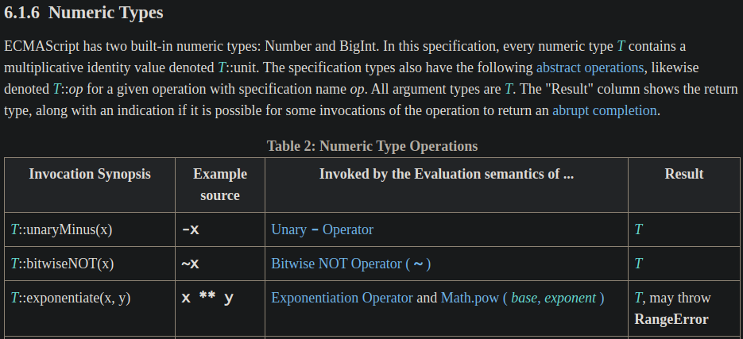
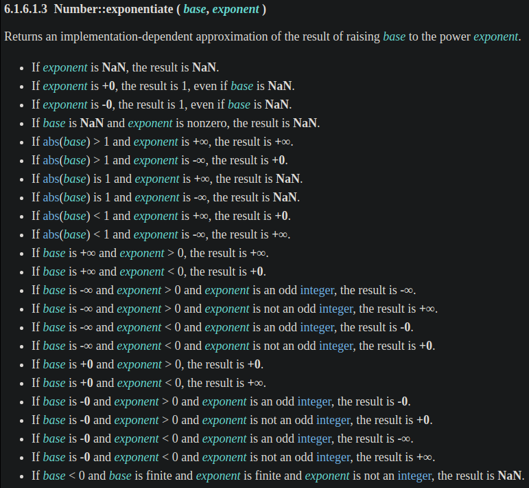
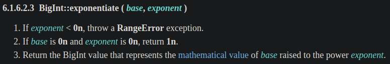
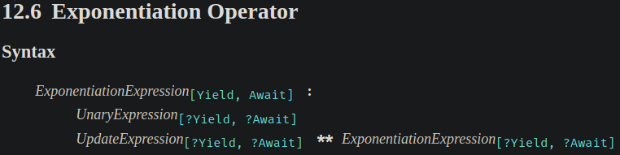
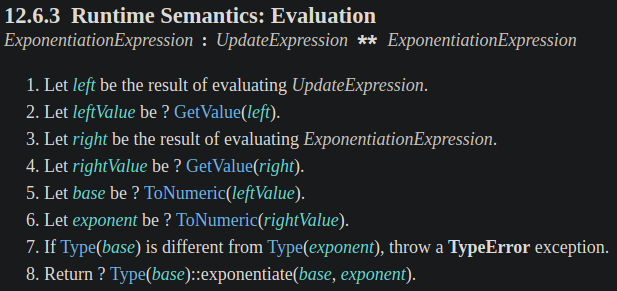
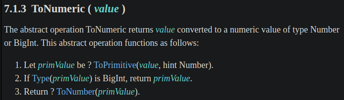
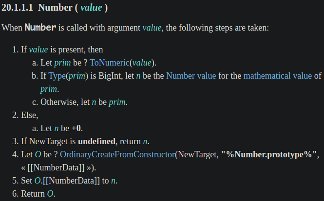
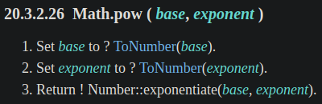

寫程式應該很常會用到指數運算，過去我們會用 `Math.pow()`，但在 ES2016 (ES7) 提供了 exponentiation operator (指數運算子) 的讓寫法更簡潔。那這兩個差在哪？讓我們從 ECMAScript spec 中一探究竟吧。

<!-- more -->

> 本文同步發表於 iT 邦幫忙：[JavaScript 之旅 (3)：Exponentiation Operator (指數運算子)](https://ithelp.ithome.com.tw/articles/10239196)
>
> 「JavaScript 之旅」系列文章發文於：
> - [iT 邦幫忙](https://ithelp.ithome.com.tw/users/20117586/ironman/3607)
> - [Titangene Blog](https://titangene.github.io/tags/it-鐵人賽/)

# 過去的 `Math.pow()`

過去要進行指數運算 (即計算 a 的 n 次方，表達式為 $a^n$，a 為底數，n 為指數，通常指數寫成上標，放在底數的右邊)，常用的是 `Math.pow()` (應該不會想手動寫多個 `*` 運算子 (multiplicative operators) 吧？)。例如：

平方：

```javascript
let x = 2;

console.log(Math.pow(x, 2));  // 4

// 等同於
console.log(x * x);           // 4
```

三次方：

```javascript
let x = 2;

console.log(Math.pow(x, 3));  // 8

// 等同於
console.log(x * x * x);       // 8
```

寫成函數可能像是這樣：

```javascript
let square = x => Math.pow(x, 2);
let cube = x => Math.pow(x, 3);

console.log(square(6));  // 36
console.log(cube(3));    // 27
```


# 現代的 Exponentiation Operator

在 ES2016 (ES7) 提供了 exponentiation operator (指數運算子)，用於指數運算。

exponentiation 運算子是一種 [infix notation (中綴表示法)](https://en.wikipedia.org/wiki/Infix_notation)，比用函數表示法還要更簡潔。

```javascript
let square = x => x ** 2;
let cube = x => x ** 3;
```

:::info
註：有些程式語言會用 `^` 運算子來進行指數計算，但 JavaScript 的 `^` 運算子是 [bitwise XOR 運算子(https://developer.mozilla.org/en-US/docs/Web/JavaScript/Reference/Operators/Bitwise_XOR)來進行位元運算，例如：

```javascript
let a = 5;          // 00000000000000000000000000000101
let b = 3;          // 00000000000000000000000000000011

console.log(a ^ b); // 00000000000000000000000000000110
```

:::

若與 `NaN` 計算，結果都會是 `NaN`：

```javascript
console.log(NaN ** 2);  // NaN
console.log(2 ** NaN);  // NaN
```

若與 `undefined` 計畫，結果也都會是 `NaN`：

```javascript
console.log(undefined ** 2);  // NaN
console.log(2 ** undefined);  // NaN
```

> 因為 exponentiation 運算子會將指數和底數值進行 [`ToNumeric()`](http://www.ecma-international.org/ecma-262/#sec-tonumeric) 強制轉型，很像使用 `Number()` 的行為，如果你嘗試用 `Number(undefined)` 會得到 `NaN`。
>
> 後面會提到 spec 是如何定義的。

若與 `null` 計算，`null` 會被 [`ToNumeric()`](http://www.ecma-international.org/ecma-262/#sec-tonumeric) 強制轉型成 `0`：

```javascript
console.log(null ** 2);  // 0
// 大約等同於 Number(null) ** 2，所以 0 ** 2 的計算結果為 0

console.log(2 ** null);  // 1
// 大約等同於 2 ** Number(null)，所以 2 ** 0 的計算結果為 1
```


## Associativity

exponentiation 運算子的 associativity 是右到左 (即 right-associative)，也就是說，下面兩個寫法是相同的：

```javascript
console.log(2 ** 3 ** 2);    // 512
console.log(2 ** (3 ** 2));  // 512

// 計算過程：
// 1. 2 ** 3 ** 2
// 2. 2 ** 9
// 3. 512
```

所以會與下面的計算結果不同，因為你讓他先計算括號的結果：

```javascript
console.log((2 ** 3) ** 2);  // 64

// 計算過程：
// 1. (2 ** 3) ** 2
// 2. 8 ** 2
// 3. 64
```

> 後面會說 spec 是如何定義的。

:::info
註：在程式語言中，[operator associativity](https://en.wikipedia.org/wiki/Operator_associativity) 是在沒有括號時，如何將有相同優先級的運算子進行分組，運算元要用哪種運算會取決於運算子的 associativity。

分為以下幾種：
- associative：可任意分組運算子
- left-associative：運算子從左側分組
- right-associative：運算子從右側分組
- non-associative：運算子不能 chained，通常是因為 output typ 和 input type 不相容

詳情可參閱 [Operator associativity - Wikipedia](https://en.wikipedia.org/wiki/Operator_associativity)。
:::

## Unary Operation 的用法

不過，exponentiation 運算子不能讓你在底數前面使用 unary operation (一元運算子，包括 `+`、`-`、`~`、`!`、`delete`、`void` 和 `typeof` )，否則會出現 `SyntaxError` 錯誤，所以以下都會是 `SyntaxError`。

```javascript
let a = 2;
let n = 3;

console.log(+a ** n);
console.log(-a ** n);
console.log(~a ** n);
console.log(!a ** n);
delete a ** n;
void a ** n;
typeof a ** n;

// SyntaxError: Unary operator used immediately before exponentiation expression. Parenthesis must be used to disambiguate operator precedence
```

例如：要把負數當作底數就不能像下面這樣直接寫負號：

```javascript
let a = 2;
let n = 3;

console.log(-2 ** 3);
console.log(-a ** n);
// SyntaxError: Unary operator used immediately before exponentiation expression. Parenthesis must be used to disambiguate operator precedence
```

> 上面是 Chrome 的錯誤訊息，已經提醒你要加上括號。

而是要加上括號才能計算：

```javascript
console.log((-2) ** 3);  // -8
```

另一個範例：想將指數計算結果變為負數，也需要用括號：

```javascript
console.log(-(2 ** 10));  // -1024
```


## Assignment Operator 的用法

exponentiation 運算子也有 assignment operator (賦值運算子)，語法是 `**=`。

例如：

```javascript
let x = 2;

x **= 3;
console.log(x);  // 8
```

等同於：

```javascript
let x = 2;

x = x ** 3;
console.log(x);  // 8
```


# Exponentiation Operator vs. `Math.pow()`

共通點：都可以計算幾次方

但有一些不同：exponentiation 運算子可以計算 `BigInt` 型別的值，但 `Math.pow()` 不行

```javascript
console.log(2n ** 3n);  // 8n

console.log(Math.pow(2n, 3n));  // TypeError: Cannot convert a BigInt value to a number
```


# Sepc 定義

## Exponentiation Operator 的 spec 定義

[exponentiation 運算子](http://www.ecma-international.org/ecma-262/#sec-numeric-types)是 ECMAScript 內建 Numeric 型別 (Number 和 BigInt 型別都是 Numeric 型別) 的 operation：



下面是 [`Number::exponentiate` operation](http://www.ecma-international.org/ecma-262/#sec-numeric-types-number-exponentiate) 的定義：



下面是 [`BigInt::exponentiate` operation](http://www.ecma-international.org/ecma-262/#sec-numeric-types-bigint-exponentiate) 的定義：



接著從 spec 定義的[語法](http://www.ecma-international.org/ecma-262/#sec-exp-operator)可以看出，exponentiation 運算子的 associativity 是右到左 (即 right-associative)：



下面是 spec 定義 [exponentiation 運算子的計算過程](http://www.ecma-international.org/ecma-262/#sec-exp-operator-runtime-semantics-evaluation)：



從步驟 5 和 6 可以看到，exponentiation 運算子會把底數和指數進行 `ToNumeric()` 的強制轉型。

若我故意讓底數和指數是 String 型別的值時，exponentiation 運算子就會自動幫我強制轉型成 Number 型別：

```javascript
console.log('2' ** '3');  // 8
```

下面是 [`ToNumeric()`](http://www.ecma-international.org/ecma-262/#sec-tonumeric) 的定義：



> 至於 `ToNumeric()` 在定義中提到的 [`ToPrimitive()`](http://www.ecma-international.org/ecma-262/#sec-toprimitive) 和 [`ToNumber()`](http://www.ecma-international.org/ecma-262/#sec-tonumber) 是 ECMAScript 強制轉型的定義了，這邊不會深入探討，有興趣的朋友可以看看，我有附上連結。

若以簡化的方式來說，我們常用的 [`Number()` constructor](http://www.ecma-international.org/ecma-262/#sec-number-constructor-number-value) 的其中一個步驟就會使用到 spec 中定義的 [`ToNumeric()`](http://www.ecma-international.org/ecma-262/#sec-tonumeric)：



:::info
註：不知道看到這邊會不會亂掉 XD，有些是 spec 中定義的，我們是無法透過寫程式直接使用的，例如：`ToNumeric()`、`ToPrimitive()`、`ToNumber()` 都是。

而 `Number()` 才是我們真的可以使用的 constructor。

所以不要搞混囉！
:::

## `Math.pow()` 的 spec 定義

接著來看 [`Math.pow()`](http://www.ecma-international.org/ecma-262/#sec-math.pow) 在 spec 的定義：



可以看到 `Math.pow()` 和 exponentiation 運算子對底數和指數值的處理不同：
- `Math.pow()` 是進行 [`ToNumber()`](http://www.ecma-international.org/ecma-262/#sec-tonumber) 的強制轉型
- exponentiation 運算子則是進行 [`ToNumeric()`](http://www.ecma-international.org/ecma-262/#sec-tonumeric) 的強制轉型


# 資料來源

- [tc39/proposal-exponentiation-operator](https://github.com/tc39/proposal-exponentiation-operator)
- [6.1.6.1.3 Number::exponentiate (base, exponent) | ECMAScript 2020 Language Specification](http://www.ecma-international.org/ecma-262/#sec-numeric-types-number-exponentiate)
- [Exponentiation (**) - JavaScript | MDN](https://developer.mozilla.org/en-US/docs/Web/JavaScript/Reference/Operators/Exponentiation)
- [Infix notation - Wikipedia](https://en.wikipedia.org/wiki/Infix_notation)
- [Operator associativity - Wikipedia](https://en.wikipedia.org/wiki/Operator_associativity)
