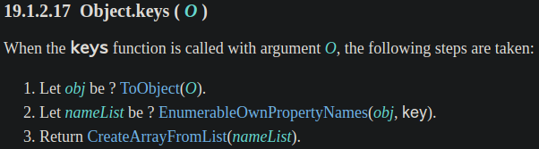
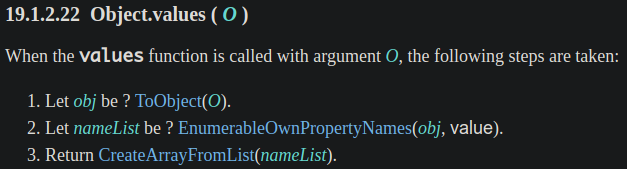
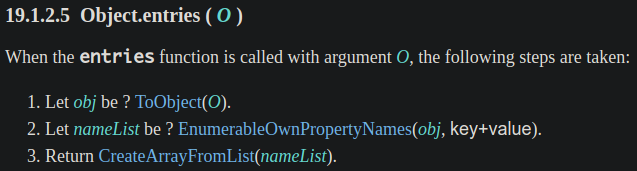
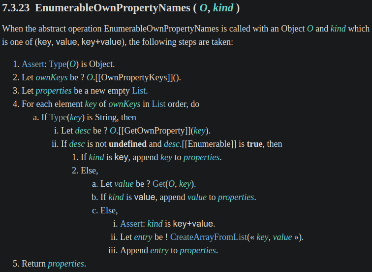
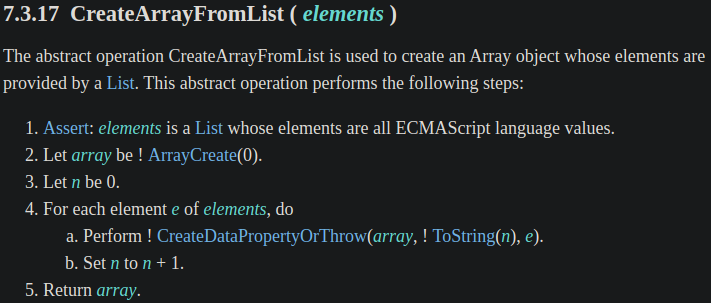

有時要將 JS 物件轉成其他資料結構，所以需要迭代物件中的所有 property，過去會用 `for-in` 陳述句，但只想列舉 own property，就必須用 `hasOwnProperty()` 才能解決。後來 ES5 新增的 `Object.keys()` 解決了非 own property 的問題，但還是要手動透過 property name 來存取 value，不方便！終於在 ES2017 (ES8) 新增了 `Object.values()` 和 `Object.entries()`，可以直接取得 property value 了！

本篇來介紹 `Object.values()`、`Object.keys()` 和 `Object.entries()`，以及在 ECMAScript spec 是如何定義的。

<!-- more -->

> 本文同步發表於 iT 邦幫忙：[JavaScript 之旅 (4)：`Object.values()` & `Object.entries()`](https://ithelp.ithome.com.tw/articles/10239942)
>
> 「JavaScript 之旅」系列文章發文於：
> - [iT 邦幫忙](https://ithelp.ithome.com.tw/users/20117586/ironman/3607)
> - [Titangene Blog](https://titangene.github.io/tags/it-鐵人賽/)


# 過去的 `for-in` statement

在過去只能用 `for-in` statement (陳述句) 來迭代物件中的每個 enumerable (可列舉的) property (但會忽略 key 為 `Symbol` 的 property)：

```javascript
let rectangle = {width: 16, height: 9};

for (const key in rectangle) {
  console.log(key, rectangle[key]);
}
// width 16
// height 9
```

而且 `for-in` 陳述句也會迭代到繼承的 enumerable property：

```javascript
let rectangle = {width: 16, height: 9};

let customRectangle = Object.create(rectangle);
customRectangle.color = 'blue';
customRectangle.name = 'myCustom';

for (const key in customRectangle) {
  console.log(key, customRectangle[key]);
}
// color blue
// name myCustom
// width 16
// height 9
```

若不想列舉繼承的 property (即只列舉 own property)，可用 `Object.prototype.hasOwnProperty()` 來判斷：

```javascript
for (const key in customRectangle) {
  if (customRectangle.hasOwnProperty(key)) {
    console.log(key, customRectangle[key]);
  }
}
// color blue
// name myCustom
```

> 去查 spec 才發現，原來 `for-in` 陳述句在 [ES1 (spec 的定義在 p.54)](https://www.ecma-international.org/publications/files/ECMA-ST-ARCH/ECMA-262,%201st%20edition,%20June%201997.pdf) 就有了。


# 過度期的 `Object.keys()`

> 若以只想取得物件中的所有 property key，那 `Object.keys()` 就很方便，但是，若想一次拿到 property key 和 property name，~~應該~~就可以說 `Object.keys()` 是過度期吧？因為以現代的角度來看，還有更方便的 `Object.entries()` (後面會介紹)。

後來在 ES5 新增了 `Object.keys()`，~~終於可以擺脫 `for-in` 陳述句了~~，終於可以讓 JS 物件 (間接) 使用 Array method 了！

`Object.keys()` 可直接取得所有 property name。看一個簡單的範例：

```javascript
let object = {a: 1, b: 2, c: 3};

console.log(Object.keys(object));  // ["a", "b", "c"]
```

因為 `Object.keys()` 回傳的是陣列，而 JS 的陣列是迭代物件，所以可以使用 `for-of` 陳述句來迭代：

```javascript
let object = {a: 1, b: 2, c: 3};

for (const key of Object.keys(object)) {
  console.log(key);
}
// a
// b
// c
```

當然也可以用 `Array.prototype.forEach()` 來迭代：

```javascript
let object = {a: 1, b: 2, c: 3};

Object.keys(object).forEach(key => {
  console.log(key);
});
// a
// b
// c
```

如果接續剛剛的範例物件，若不想列舉繼承的 property，可用 `Object.keys()`，它會幫你自動忽略 `Object.prototype.hasOwnProperty()` 為 `false` 的 property：

```javascript
let rectangle = {width: 16, height: 9};

let customRectangle = Object.create(rectangle);
customRectangle.color = 'blue';
customRectangle.name = 'myCustom';

Object.keys(customRectangle).forEach(key => {
  console.log(key, customRectangle[key]);
});
// color blue
// name myCustom
```

> 後面會說明為何 `Object.keys()` 不用我們手動處理 `Object.prototype.hasOwnProperty()`，spec 其實都有定義。

而且 `Object.keys()` 還可搭配多個 Array method 做很多事。以一個情境為例：列出排序過的 property，並以 `, ` 串接所有 property。

先利用 `Object.keys()` 取得所有 property name，然後透過 `Array.prototype.sort()` 排序 property name，再用 `Array.prototype.join()` 串接陣列中的元素：

```javascript
let letterCount = {b: 2, a: 5, c: 3};
let letters = Object.keys(letterCount)
  .sort()
  .join(', ');

console.log(letters);  // a, b, c
```

若想知道此物件有幾個 property，可用 `Object.keys()` 搭配 `Array.length` 取得：

```javascript
let object = {a: 1, b: 2, c: 3};

let propertyCount = Object.keys(object).length;
console.log(propertyCount);  // 3
```

# 現代的 `Object.values()` 和 `Object.entries()`

後來在 ES2017 (ES8) 新增了 `Object.values()` 和 `Object.entries()`，終於可以取得 property value 了！以前的 `for-in` 陳述句和 `Object.keys()` 都還要自己透過原物件的 property name 來存取 property value。

`Object.values()` 是直接取得所有 property value，並以陣列回傳。看一個簡單的範例：

```javascript
let object = {a: 1, b: 2, c: 3};

console.log(Object.values(object));  // [1, 2, 3]
```

而 `Object.entries()` 是直接取得所有 property 的 name 和 value，並以陣列回傳。看一個簡單的範例：

```javascript
let object = {a: 1, b: 2, c: 3};

console.log(Object.entries(object));
// [
//   ["a", 1],
//   ["b", 2],
//   ["c", 3]
// ]
```

`Object.values()` 和 `Object.entries()` 跟 `Object.keys()` 一樣，都不會迭代到繼承的 property：

```javascript
let rectangle = {width: 16, height: 9};

let customRectangle = Object.create(rectangle);
customRectangle.color = 'blue';
customRectangle.name = 'myCustom';

Object.entries(customRectangle).forEach(([key, value]) => {
  console.log(key, value);
});
// color blue
// name myCustom
```

> 後面會說明為何 `Object.values()` 和 `Object.entries()` 都不用我們手動處理 `Object.prototype.hasOwnProperty()`，spec 其實都有定義。

因為 `Object.values()` 和 `Object.entries()` 都是回傳陣列，而 JS 的陣列是迭代物件，所以可以使用 `for-of` 陳述句或 Array method 進行迭代：

```javascript
let object = {a: 1, b: 2, c: 3};

for (const [key, value] of Object.entries(object)) {
  console.log(key, value);
}
// a 1
// b 2
// c 3

Object.entries(object).forEach(([key, value]) => {
  console.log(key, value);
});
// a 1
// b 2
// c 3
```


## 物件轉陣列

`Object.values()` 和 `Object.entries()` 常會搭配 Array method 一起使用，因為 `Object.values()` 和 `Object.entries()` 的回傳值都是 Array。下面實際舉個例子：

假設原本的資料是一個物件，一個 property 代表一種水果，key 是水果名稱，value 是數量：

```javascript
let fruits = {
  apple: 2,
  banana: 3,
  orange: 1
};
```

如果想計算水果總數，可用 `Object.values()` 搭配 `Array.prototype.reduce()` 來處理：

```javascript
const fruitTotal = Object.values(fruits)
  .reduce((accumulator, fruitCount) => accumulator + fruitCount);

console.log(fruitTotal);  // 6
```

若希望後續處理資料比較方便，你可能會想更改資料結構，將一種水果變為一個物件，該物件有兩個 property，分別為 `name` 和 `count`，此時就可用 `Object.entries()` 來處理：

```javascript
let fruitBasket = Object.entries(fruits)
  .map(([fruitName, fruitCount]) => {
    return {name: fruitName, count: fruitCount}
  });

console.log(fruitBasket);
// [
//   {name: "apple", count: 2},
//   {name: "banana", count: 3},
//   {name: "orange", count: 1}
// ]
```

這個作法有一些好處：
- 使用 `Object.entries()` 的回傳值 (即陣列)，可搭配各種 Array method 來滿足你的需求 (變成你想要的樣子)
- 因為 `Object.entries()` 是產生新的陣列，不會影響到原物件，所以後續不管你用的 Array method 是否會修改該陣列，都不會影響到原物件的資料 (夠 pure)


## `Object` 物件轉 `Map` 物件

可用 `Object.entries()` 將物件轉成 `Map` 物件，將 `Object.entries()` 回傳的可迭代 entries 傳給 `new Map()` constructor 即可：

```javascript
let fruits = {
  apple: 2,
  banana: 3,
  orange: 1
};

let fruitMap = new Map(Object.entries(fruits));

console.log(fruitMap);
// Map(3) {"apple" => 2, "banana" => 3, "orange" => 1}

console.log(fruitMap.get('orange'));  // 1
```


# Sepc 定義

以下是 [`Object.keys()`](https://www.ecma-international.org/ecma-262/#sec-object.keys) 在 spec 中的定義：




以下是 [`Object.values()`](https://www.ecma-international.org/ecma-262/#sec-object.values) 在 spec 中的定義：




以下是 [`Object.entries()`](https://www.ecma-international.org/ecma-262/#sec-object.entries) 在 spec 中的定義：




`Object.values()`、`Object.keys()` 和 `Object.entries()` 都是在步驟 2 使用 `EnumerableOwnPropertyNames()`，而步驟 3 都是使用 `CreateArrayFromList()`。

我們先來看 [`EnumerableOwnPropertyNames()`](https://www.ecma-international.org/ecma-262/#sec-enumerableownpropertynames) 的定義：
- 步驟 4：迭代所有 own property，所以每次迭代的 `key` 就是 property name
- 步驟 4.a.i：取得某個 own property
- 步驟 4.a.ii：own property 不為 `undefined`，並且是可列舉的 (enumerable) 才會繼續下個步驟
- 步驟 4.a.ii.1：判斷 `kind` 為 key 時，會將該 `key` push 至 `properties` (即最後我們要取得的回傳值)
- 步驟 4.a.ii.2.a：取得為該 property name 的 property value
- 步驟 4.a.ii.2.b：判斷 `kind` 為 value 時，會將該 `value` push 至 `properties`
- 步驟 4.a.ii.2.c.ii：將 `key` 和 `value` 組合成 `entry` (即 `[key, value]` )
- 步驟 4.a.ii.2.c.iii：將 `entry` push 至 `properties`
- 最後回傳 `properties`

> 所以步驟 4 就是我們不用手動處理 `Object.prototype.hasOwnProperty()` 的關鍵！



回來看步驟 3 的 [`CreateArrayFromList()`](https://www.ecma-international.org/ecma-262/#sec-createarrayfromlist)，下面是它的定義：簡單來說就是建立陣列，將每個 property value 放入陣列中：




# polyfill

下面是 [MDN 提供的 `Object.entries()` 的 polyfill](https://developer.mozilla.org/en-US/docs/Web/JavaScript/Reference/Global_Objects/Object/entries)：

```javascript
if (!Object.entries) {
  Object.entries = function(obj) {
    var ownProps = Object.keys(obj),
        i = ownProps.length,
        resArray = new Array(i); // preallocate the Array
    while (i--)
      resArray[i] = [ownProps[i], obj[ownProps[i]]];

    return resArray;
  };
}
```

> 其他 polyfill：
> - `Object.keys()`
>   - [core-js](https://github.com/zloirock/core-js/blob/master/packages/core-js/internals/object-keys-internal.js)
>   - [es-shims](https://github.com/es-shims/object-keys/blob/main/implementation.js)
> - `Object.values()`
>   - [core-js](https://github.com/zloirock/core-js/blob/master/packages/core-js/modules/es.object.values.js)
>   - [es-shims](https://github.com/es-shims/Object.values/blob/master/implementation.js)
>   - [tc39](https://github.com/tc39/proposal-object-values-entries/blob/master/polyfill.js)
> - `Object.entries()`
>   - [core-js](https://github.com/zloirock/core-js/blob/master/packages/core-js/modules/es.object.entries.js)
>   - [es-shims](https://github.com/es-shims/Object.entries/blob/master/implementation.js)
>   - [tc39](https://github.com/tc39/proposal-object-values-entries/blob/master/polyfill.js)


# 資料來源

- [tc39/proposal-object-values-entries](https://github.com/tc39/proposal-object-values-entries)
- [19.1.2.17 Object.keys(O) | ECMAScript 2020 Language Specification](https://www.ecma-international.org/ecma-262/#sec-object.keys)
- [19.1.2.22 Object.values(O) | ECMAScript 2020 Language Specification](https://www.ecma-international.org/ecma-262/#sec-object.values)
- [19.1.2.5 Object.entries(O) | ECMAScript 2020 Language Specification](https://www.ecma-international.org/ecma-262/#sec-object.entries)
- [7. Object.entries() and Object.values() | Exploring ES2016 and ES2017](https://exploringjs.com/es2016-es2017/ch_object-entries-object-values.html)
- [Object.keys() - JavaScript | MDN](https://developer.mozilla.org/en-US/docs/Web/JavaScript/Reference/Global_Objects/Object/keys)
- [Object.values() - JavaScript | MDN](https://developer.mozilla.org/en-US/docs/Web/JavaScript/Reference/Global_Objects/Object/values)
- [Object.entries() - JavaScript | MDN](https://developer.mozilla.org/en-US/docs/Web/JavaScript/Reference/Global_Objects/Object/entries)