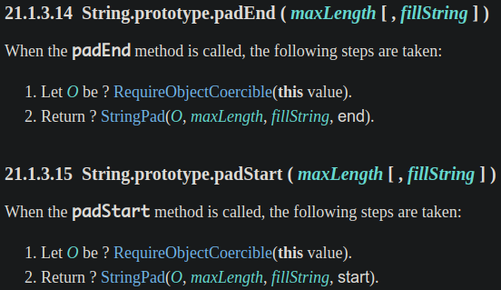
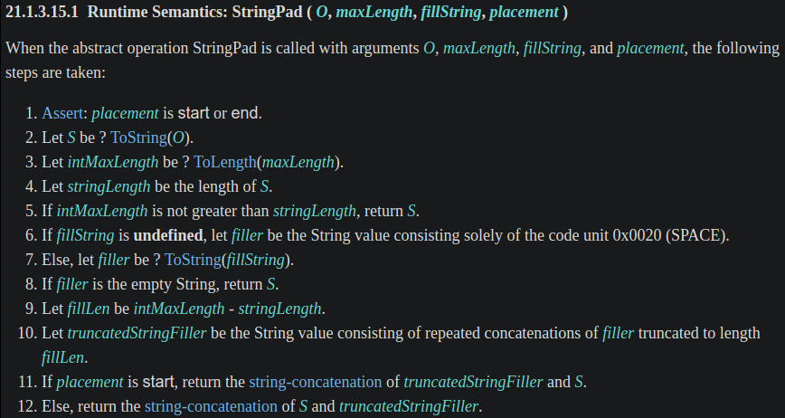

在字串的前綴或後綴補字元，是字串處理常見的需求，過去要自行處理，終於在 ES2017 (ES8) 新增了 `String.prototype.padStart()` 和 `String.prototype.padEnd()`，解決常見的需求！本篇來介紹它們，以及在 ECMAScript spec 是如何定義的，並附上 polyfill。

<!-- more -->

> 本文同步發表於 iT 邦幫忙：[JavaScript 之旅 (5)：String method - padStart & padEnd](https://ithelp.ithome.com.tw/articles/10240599)
>
> 「JavaScript 之旅」系列文章發文於：
> - [iT 邦幫忙](https://ithelp.ithome.com.tw/users/20117586/ironman/3607)
> - [Titangene Blog](https://titangene.github.io/tags/it-鐵人賽/)

# 前言

pad strings 是一個很常見的需求，例如：
- 檔名編號的前綴，例如：`final-001.md`、`final-066.md`
- 流水號的前綴，例如：`000021`、`000456`
- 日期、時間，例如：`2020-09-20`、`09:05`
- 讓 console 的輸出可以對齊：`Error 001: xxx`
- 固定位數的二進位數字或十六進位數字，例如：`0010`、`0x00FF`

那過去和現代是如何處理這個需求？讓我們繼續看下去...

# 過去的補字元

也許你會自己寫個 `padStart()` 來處理補字元這種字串處理：

```javascript
function padStart(string, targetLength, padString = ' ') {
  return (Array(targetLength).join(padString) + string)
    .slice(-targetLength)
}

console.log(padStart('18', 4, '0'));  // 0018
```

或

```javascript
function padStart(string, targetLength, padString) {
  return padString.repeat(Math.max(0, targetLength - string.length)) + string;
}

console.log(padStart('18', 4, '0'));  // 0018
```

或者從 Stack Overflow 找到不錯的解法參考一下~~直接複製貼上~~？上面的範例都是我從 [Stack Overflow](https://stackoverflow.com/questions/2686855/is-there-a-javascript-function-that-can-pad-a-string-to-get-to-a-determined-leng) 參考的 XD。

# 現代的 `padStart` 和 `padEnd`

在 ES2017 (ES8) 新增了 `String.prototype.padStart()` 和 `String.prototype.padEnd()`，終於不用自己處理常見的字串處理需求了！

語法：
- 第一個參數都是 `maxLength`
- 第二個參數都是 `fillString`

```javascript
string.padStart(maxLength [, fillString])
string.padEnd(maxLength [, fillString])
```

這些 String 方法都會重複 `fillString` 這個字串多次，直到字串的長度到 `maxLength` 為止。

`String.prototype.padStart()` 是將重複的 `fillString` 字串加在原字串的前面，而 `String.prototype.padEnd()` 是加在原字串的後面。看一些簡單的範例：

```javascript
console.log('18'.padStart(4, '0'));  // "0018"
console.log('18'.padEnd(4, '0'));    // "1800"

console.log('x'.padStart(4, 'ab'));  // "abax"
console.log('x'.padEnd(4, 'ab'));    // "xaba"
```

若不使用第二個參數 (即 `fillString` )，預設會是 `" "` (U+0020)，也就是 space：

```javascript
console.log('18'.padStart(4));  // "  18"
console.log('18'.padEnd(4));    // "18  "
```

若第二個參數為 `''` (空字串)，會回傳原字串：

```javascript
console.log('18'.padStart(4, ''));  // "18"
console.log('18'.padEnd(4, ''));    // "18"
```

若原字串的 length >= 第一個參數的值 (即 `maxLength` )，則會回傳原字串：

```javascript
console.log('1234'.padStart(2, '0'));  // "1234"
console.log('1234'.padEnd(2, '0'));    // "1234"

console.log('1234'.padStart(4, '0'));  // "1234"
console.log('1234'.padEnd(4, '0'));    // "1234"
```

若想在 Number 型別的值前面補 0，需要先將 Number 型別強制轉型成 String 型別：

```javascript
let n = 18;

console.log(String(n).padStart(4, '0'));  // "0018"
```

否則會出現 `TypeError` 的錯誤 (因為 Number 沒有 `padStart` 和 `padEnd` 這些 method)：

```javascript
let n = 18;

console.log(n.padStart(4, '0'));
// TypeError: n.padStart is not a function
```

# Sepc 定義

以下是 [`String.prototype.padStart()`](https://www.ecma-international.org/ecma-262/#sec-string.prototype.padstart) 和 [`String.prototype.padEnd()`](https://www.ecma-international.org/ecma-262/#sec-string.prototype.padend) 在 spec 中的定義：可以看到兩者的差異不大，但步驟 2 `StringPad()` 的最後一個傳入參數不一樣



傳入 `start` 和 `end` 能幹嘛？我們接續看步驟 2 [`StringPad()`](https://www.ecma-international.org/ecma-262/#sec-stringpad) 的定義：在步驟 11 和步驟 12 就是將 `fillString` concat 在原字串的前面或後面的關鍵 (看後面的 polyfill 會更好理解)



# polyfill

下面是從 [TC39 的 `String.prototype.padStart()` 和 `String.prototype.padEnd()` 提案提供的 polyfill](https://github.com/tc39/proposal-string-pad-start-end/blob/master/polyfill.js) 稍做修改的 (看過剛剛的 spec 定義後，應該知道兩者只差一個步驟不同，原本的 polyfill 是將 spec 中的 `StringPad()` 都在兩者上分別實作，因邏輯可重用，我就將它抽成額外的 function 了)：

```javascript
const RequireObjectCoercible = O => {
  if (O === null || typeof O === 'undefined') {
    throw new TypeError('"this" value must not be null or undefined');
  }
  return O;
};
const MAX_SAFE_INTEGER = Number.MAX_SAFE_INTEGER || Math.pow(2, 53) - 1;
const ToLength = argument => {
  const len = Number(argument);
  if (Number.isNaN(len) || len <= 0) {
    return 0;
  }
  if (len > MAX_SAFE_INTEGER) {
    return MAX_SAFE_INTEGER;
  }
  return len;
};

const StringPad = (O, maxLength, fillString, placement) => {
  const S = String(O);
  const intMaxLength = ToLength(maxLength);
  const stringLength = ToLength(S.length);
  if (intMaxLength <= stringLength) {
    return S;
  }
  let filler = typeof fillString === 'undefined' ? ' ' : String(fillString);
  if (filler === '') {
    return S;
  }
  const fillLen = intMaxLength - stringLength;
  while (filler.length < fillLen) {
    const fLen = filler.length;
    const remainingCodeUnits = fillLen - fLen;
    if (fLen > remainingCodeUnits) {
      filler += filler.slice(0, remainingCodeUnits);
    } else {
      filler += filler;
    }
  }
  const truncatedStringFiller = filler.slice(0, fillLen);
  if (placement === 'start') {
    return truncatedStringFiller + S;
  } else {
    return S + truncatedStringFiller;
  }
}

if (!String.prototype.padStart) {
  String.prototype.padStart = function padStart(maxLength, fillString = ' ') {
    const O = RequireObjectCoercible(this);
    return StringPad(O, maxLength, fillString, 'start');
  };
}

if (!String.prototype.padEnd) {
  String.prototype.padEnd = function padEnd(maxLength, fillString = ' ') {
    const O = RequireObjectCoercible(this);
    return StringPad(O, maxLength, fillString, 'end');
  };
}
```

> 其他 polyfill：
> - `String.prototype.padStart()`
>   - [core-js](https://github.com/zloirock/core-js/blob/master/packages/core-js/modules/es.string.pad-start.js)
>   - [es-shims](https://github.com/es-shims/String.prototype.padStart/blob/main/implementation.js)
>   - [behnammodi](https://github.com/behnammodi/polyfill/blob/master/string.polyfill.js#L281)
> - `String.prototype.padEnd()`
>   - [core-js](https://github.com/zloirock/core-js/blob/master/packages/core-js/modules/es.string.pad-end.js)
>   - [es-shims](https://github.com/es-shims/String.prototype.padEnd/blob/main/implementation.js)
>   - [behnammodi](https://github.com/behnammodi/polyfill/blob/master/string.polyfill.js#L258)


# 資料來源

- [tc39/proposal-string-pad-start-end](https://github.com/tc39/proposal-string-pad-start-end)
- [21.1.3.15 String.prototype.padStart(maxLength [, fillString]) | ECMAScript 2020 Language Specification](https://www.ecma-international.org/ecma-262/#sec-string.prototype.padstart)
- [21.1.3.14 String.prototype.padEnd(maxLength [, fillString]) | ECMAScript 2020 Language Specification](https://www.ecma-international.org/ecma-262/#sec-string.prototype.padend)
- [8. New string methods: padStart and padEnd | Exploring ES2016 and ES2017](https://exploringjs.com/es2016-es2017/ch_string-padding.html)