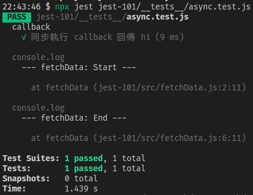
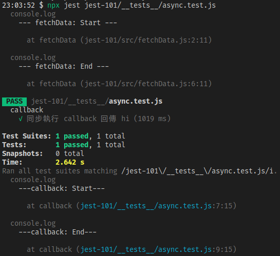
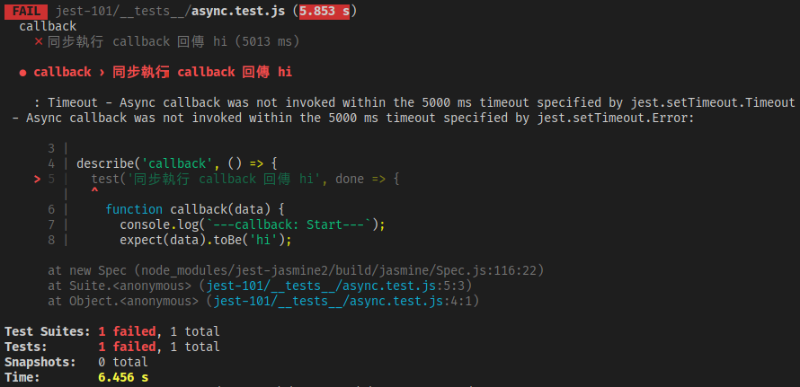

處理 JS 非同步的常見作法包括 callback、ES6 的 `Promise` 以及 ES7 的 `async` 和 `await`，而本篇會分別說明如何在 Jest 使用這些 JS 特性來測試非同步程式碼。

<!-- more -->

> 其他 Jest 相關文章可參閱 [Jest 系列文章](https://titangene.github.io/tags/jest/)。

## Callbacks

假設你要測下面這個函數，我使用 `setTimeout` 來模擬發 API 需要花一段時間，若 API 發送成功就會呼叫你傳入的 callback 函數，在呼叫 callback 時會傳入 `'hi'`，代表從 API 拿到的資料：

```javascript
// src/fetchData.js
function fetchData(callback) {
  console.log(`--- fetchData: Start ---`);
  setTimeout(() => {
    callback('hi');
  }, 1000);
  console.log(`--- fetchData: End ---`);
}

export default fetchData;
```

而我們要測試的就是呼叫 `fetchData()` 所傳入的 callback 有無正確的呼叫，並且傳入 callback 的資料是否為 `"hi"`。也許你會這樣寫測試：

```javascript
// __tests__/async.test.js
import fetchData from '../src/async';

test('同步執行 callback 回傳 hi', () => {
  function callback(data) {
    console.log(`---callback: Start---`);
    expect(data).toBe('hi');
    console.log(`---callback: End---`);
  }

  fetchData(callback);
});
```

執行測試後，測試通過了，但感覺怪怪的！為什麼測試內的 `callback()` 沒有執行到？



因為 Jest 測試只要跑到最後一行的 `fetchData(..)` 就會結束，裡面執行的非同步處理 (即模擬發 API 的 `setTimeout` ) 根本還沒處理完，Jest 測試就會在 callback 呼叫之前就結束了。

Jest 提供一種建議：使用 `test()` 時不要用 empty argument，而是用名為 `done` 的 argument。Jest 就會等到 `done` callback 被呼叫時才會結束測試。這樣就能確保測試是在你決定的地方結束 ( `done`，雙關)：

```javascript
// __tests__/async.test.js
import fetchData from '../src/async';

test('非同步執行 callback 回傳 hi', done => {
  function callback(data) {
    console.log(`---callback: Start---`);
    expect(data).toBe('hi');
    console.log(`---callback: End---`);
    done();
  }

  fetchData(callback);
});
```



若 `test()` 使用了 `done` argument，但沒有呼叫 `done()`，測試就會失敗 (帶有 timeout error)：



:::info
錯誤訊息是說這個測試沒有在 timeout 內 invoke 非同步的 callback。

至於 timeout 的時間預設為 5 秒，若要自訂 `test()` 的 timeout，可自行加上第三個 arg (單位為豪秒)。像下面是自訂 timeout 為 3 秒：

```javascript
test('test name', () => {
  // some test code...
}, 3000);
```

> 詳情可參閱 [Jest：Describe & Test case](https://titangene.github.io/article/jest-describe-test-case.html#test-name-fn-timeout) 的「`test(name, fn, timeout)`」段落。

:::

如果 `expect` 陳述句失敗，就會拋出錯誤，並且不會呼叫 `done()`。若想在測試輸出結果看到失敗的原因，就要用 `try` 區塊把 `expect` 包起來，並在 `catch` 區塊中接收錯誤。

```javascript
// __tests__/async.test.js
import fetchData from '../src/async';

test('非同步執行 callback 回傳 hi', done => {
  function callback(data) {
    try {
      console.log(`---callback: Start---`);
      expect(data).toBe('hi~~~');
      console.log(`---callback: End---`);
      done();
    } catch (error) {
      done(error);
    }
  }

  fetchData(callback);
});
```

## Promise

如果測試回傳一個 promise，Jest 會等待這個 promise 的 resolve。如果 promise 被 reject，測試會自動失敗。

一定要回傳 promise：如果省略了 `return` 陳述句，測試會在 `promiseFetchData` 回傳的 promise 被 resolve，並且 `then()` 有機會執行 callback 之前完成。

例如：下面範例的測試不會等到 promise 內的 `setTimeout()` 跑完就會立即完成測試：

```javascript
// src/fetchData.js
function promiseFetchData(option) {
  return new Promise((resolve, reject) => {
    console.log(`--- Promise: Start ---`);
    setTimeout(() => {
      if (option.flag === 'success') resolve('hi');
      if (option.flag === 'fail') reject('error');
    }, 3000);
    console.log(`--- Promise: End ---`);
  });
}
```

```javascript
// __tests__/async.test.js
import promiseFetchData from '../src/fetchData';

test('回傳的 promise resolve 資料為 hi', () => {
  return promiseFetchData({ flag: 'success' }).then(data => {
    console.log(`--- then: Start ---`);
    expect(data).toBe('hi');
    console.log(`--- then: End ---`);
  });
});
```

所以如果省略了 `return` 陳述句，下面範例的 `'hi XD'` 雖然跟 `data` 真正拿到的值不同，但測試還是會通過：

```javascript
// __tests__/async.test.js
import promiseFetchData from '../src/fetchData';

test('回傳的 promise resolve 資料為 hi', () => {
  promiseFetchData({ flag: 'success' }).then(data => {
    console.log(`--- then: Start ---`);
    expect(data).toBe('hi');
    console.log(`--- then: End ---`);
  });
});
```

若想讓 promise 被 reject，可用 `.catch` 方法。記得要加上 `expect.assertions` 來驗證是否呼叫一定數量的 assertions。否則一個 fulfilled promise 不會讓錯誤失敗：

```javascript
// __tests__/async.test.js
import promiseFetchData from '../src/fetchData';

test('promise reject 的錯誤訊息為 error', () => {
  expect.assertions(1);
  return promiseFetchData({ flag: 'fail' }).catch(e => {
    console.log(`--- catch: Start ---`);
    expect(e).toMatch('error');
    console.log(`--- catch: End ---`);
  });
});
```

## `.resolves` / `.rejects`

也可在 `expect` 陳述句中使用 `.resolves` matcher，Jest 會等待 promise 的 resolve。如果 promise 被 reject，測試會自動失敗。

```javascript
// __tests__/async.test.js
import promiseFetchData from '../src/fetchData';

test('使用 resolves matcher', () => {
  return expect(promiseFetchData({ flag: 'success' })).resolves.toBe('hi');
});
```

一定要回傳 assertion：如果省略了 `return` 陳述句，測試會在 `promiseFetchData` 回傳的 promise 被 resolve，並且 `then()` 有機會執行 callback 之前完成。

若想讓 promise 被 reject，可用 `.rejects` matcher。如果 promise 是 fulfilled，測試就會自動失敗：

```javascript
// __tests__/async.test.js
import promiseFetchData from '../src/fetchData';

test('使用 rejects matcher', () => {
  return expect(promiseFetchData({ flag: 'fail' })).rejects.toMatch('error');
});
```

## Async/Await

也可用 `async` 和 `await`。在傳給測試函數前加上 `async` 關鍵字：

```javascript
// __tests__/async.test.js
import promiseFetchData from '../src/fetchData';

test('使用 await resolves', async () => {
  const data = await promiseFetchData({ flag: 'success' });
  expect(data).toBe('hi');
});

test('使用 await rejects', async () => {
  expect.assertions(1);
  try {
    await promiseFetchData({ flag: 'fail' });
  } catch (e) {
    expect(e).toMatch('error');
  }
});
```

也可將 `async` 和 `await` 與 `.resolves` 和 `.rejects` matcher 結合使用：

```javascript
// __tests__/async.test.js
import promiseFetchData from '../src/fetchData';

test('使用 await 和 resolves matcher', async () => {
  await expect(promiseFetchData({ flag: 'success' })).resolves.toBe('hi');
});

test('使用 await 和 rejects matcher', async () => {
  await expect(promiseFetchData({ flag: 'fail' })).rejects.toMatch('error');
});
```

資料來源：[Testing Asynchronous Code · Jest](https://jestjs.io/docs/en/asynchronous)
